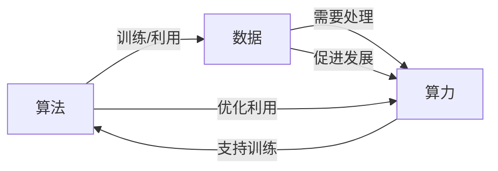
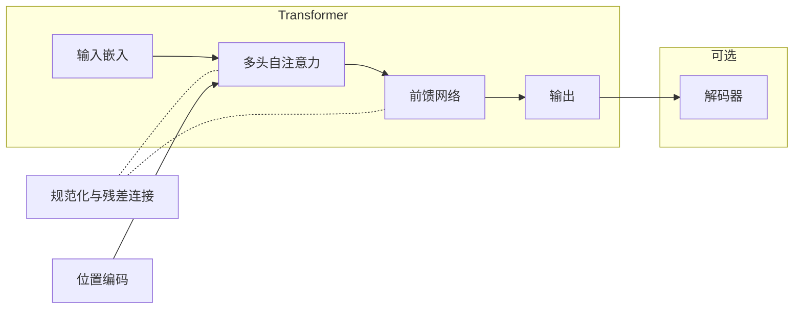
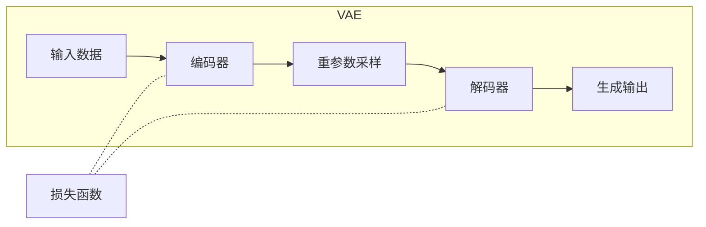
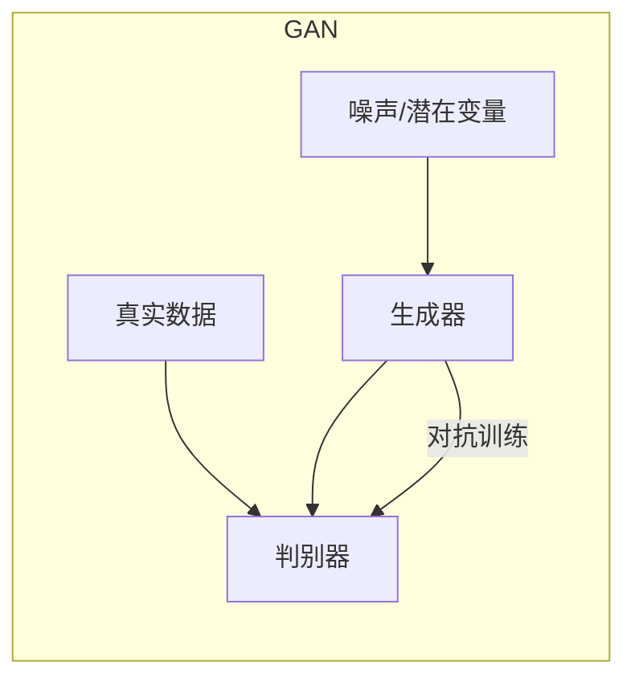
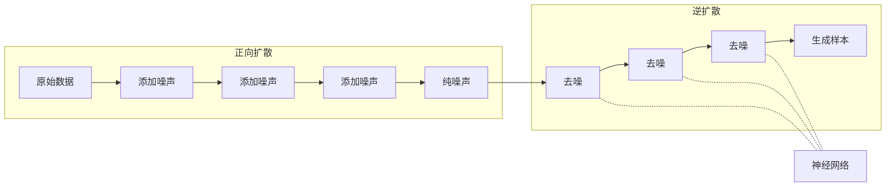

# AIGC从入门到实战：算法、算力、数据三驾马车的发力狂奔

## 1.背景介绍

### 1.1 什么是AIGC

AIGC(Artificial Intelligence Generated Content)，即人工智能生成内容，是指利用人工智能技术自动生成文本、图像、音视频等数字内容。随着人工智能技术的快速发展，AIGC已经渗透到各个领域,成为了一股不可忽视的新兴力量。

AIGC可以广泛应用于内容创作、营销广告、客户服务、教育培训等多个领域,极大提高了生产效率,降低了成本。同时,它也带来了一些挑战和潜在风险,如版权问题、内容质量把控等,需要相关利益方共同应对。

### 1.2 AIGC的发展历程

AIGC的发展可以追溯到20世纪90年代,当时的语言模型主要应用于机器翻译、文本摘要等任务。进入21世纪后,深度学习技术的兴起推动了AIGC的快速发展。2014年,谷歌的Word2Vec模型将词语表示为向量,奠定了现代NLP的基础。2017年,OpenAI提出了Transformer模型,显著提升了序列数据建模能力。2018年,BERT等预训练语言模型进一步推动了NLP技术的发展。

2021年,OpenAI发布GPT-3大型语言模型,在多项自然语言任务上表现出色,引发了全球范围内的关注。2022年,稳定扩散等生成式AI模型的出现,使AIGC在图像、音频、视频等多模态内容生成领域取得了突破。

### 1.3 AIGC的核心驱动力

AIGC的核心驱动力可以概括为"算法、算力、数据"三驾马车:

1. **算法**:高质量的算法模型是AIGC的核心,如Transformer、BERT、GPT、Stable Diffusion等,决定了内容生成的质量和能力。

2. **算力**:强大的算力是训练大型AI模型的前提,包括GPU、TPU等专用硬件加速器,以及云计算资源等。

3. **数据**:高质量、多样化的数据是训练AIGC模型的基础,包括文本、图像、视频等多模态数据。

只有这三驾马车并驱齐gallop,AIGC才能全面释放巨大潜能,成为真正的生产力。

## 2.核心概念与联系  

### 2.1 AIGC的核心概念

要全面理解AIGC,需要掌握以下几个核心概念:

1. **生成式AI模型**
   - 生成式AI模型旨在根据输入生成新的、符合语义和上下文的输出内容。
   - 常见的生成式AI模型包括GPT、DALL-E、Stable Diffusion等。

2. **预训练模型**
   - 预训练模型是在大规模通用数据集上预先训练的模型,具有一定的通用知识。
   - 常见的预训练模型包括BERT、GPT、T5等。

3. **微调(Fine-tuning)** 
   - 将预训练模型在特定任务数据集上进一步训练,以获得针对该任务的专用模型。
   - 微调可显著提高模型在特定任务上的性能。

4. **提示(Prompt)**
   - 提示是指输入给生成式AI模型的文本,用于引导模型生成所需的输出内容。
   - 优质的提示设计对于AIGC效果至关重要。

5. **多模态**
   - 多模态是指同时处理多种形式数据,如文本、图像、音频、视频等。
   - AIGC需要具备多模态能力,以生成多样化的内容。

### 2.2 算法、算力、数据的关系

算法、算力和数据三者相互影响、相辅相成:

1. **算法**依赖于**数据**进行训练,而优质的**算法**也可以更好地利用**数据**。
2. 训练大型**算法**模型需要强大的**算力**支持,而高效的**算法**也可以更好地利用**算力**资源。  
3. 获取和处理高质量**数据**需要充足的**算力**资源,而丰富的**数据**也可以促进**算力**硬件的发展。

三者构成一个良性循环,相互推动着AIGC技术的发展:

只有三者协同发展,AIGC才能发挥最大潜力。

## 3.核心算法原理具体操作步骤

### 3.1 Transformer模型

Transformer是AIGC中常用的序列数据建模算法,具有自注意力机制,可以高效捕获远程依赖关系。它广泛应用于机器翻译、文本生成、图像理解等任务。

Transformer模型的核心步骤包括:

1. **输入嵌入**:将输入序列(如文本)映射为向量表示。
2. **多头自注意力**:计算输入序列中每个元素与其他元素的关联程度。
3. **位置编码**:注入位置信息,让模型能够捕获序列顺序。
4. **前馈网络**:对注意力输出进行非线性变换。
5. **规范化与残差连接**:加速训练,提高模型性能。
6. **解码器(可选)**:对输出序列进行生成(如机器翻译)。

Transformer的自注意力机制使其能够高效建模长期依赖关系,是AIGC中不可或缺的关键算法。

### 3.2 变分自编码器(VAE)

变分自编码器(VAE)是一种生成式模型,常用于图像、视频等连续数据的生成。VAE的核心思想是将输入数据映射到一个连续的潜在空间,然后从该空间中采样生成新的输出。

VAE的主要步骤包括:

1. **编码器**:将输入数据映射到潜在空间中的概率分布。
2. **重参数技巧**:从编码器输出的概率分布中采样潜在变量。
3. **解码器**:根据采样的潜在变量生成重构输出。
4. **损失函数**:包括重构损失和KL散度正则项。

VAE的关键在于使用变分推断来近似后验概率,从而能够高效地从连续潜在空间中采样生成新数据。

### 3.3 生成对抗网络(GAN)

生成对抗网络(GAN)是另一种常用的生成式模型,常应用于图像、视频等连续数据的生成。GAN由生成器和判别器两个对抗模型组成,通过对抗训练达到生成高质量样本的目的。

GAN的训练过程如下:

1. **生成器**:从噪声或潜在变量中生成假样本。
2. **判别器**:判断输入是真实样本还是生成器生成的假样本。
3. **对抗训练**:生成器努力生成能够欺骗判别器的假样本,判别器则努力区分真伪样本。
4. **收敛**:当判别器无法分辨真伪时,生成器即可生成逼真的样本。

GAN的优势在于不需要显式建模数据分布,而是通过对抗训练直接生成目标样本,但训练过程也较为不稳定。

### 3.4 扩散模型

扩散模型是近年来兴起的一种新型生成模型,主要用于高保真图像生成。它通过一个渐进的噪声添加过程将数据"扩散"为噪声,然后学习从噪声中"生成"原始数据的逆过程。

扩散模型的核心步骤包括:

1. **正向扩散**:将原始数据逐步添加噪声,直至完全扩散为噪声。
2. **学习逆过程**:训练一个神经网络,从纯噪声中逐步"去噪",生成原始数据。
3. **采样**:从纯噪声开始,重复地通过神经网络"去噪",最终生成目标样本。

扩散模型的优势在于可以生成极高质量和分辨率的图像,并且训练过程较为稳定。目前,扩散模型在AIGC图像生成领域占据主导地位。

上述是AIGC中几种核心算法的原理和操作步骤。这些算法各有特色,为AIGC在不同场景下生成高质量内容提供了有力支撑。

## 4.数学模型和公式详细讲解举例说明

### 4.1 Transformer中的注意力机制

Transformer模型的核心是自注意力(Self-Attention)机制,它能够捕获输入序列中任意两个元素之间的关联关系。自注意力的计算公式如下:

$$\begin{aligned}
\text{Attention}(Q, K, V) &= \text{softmax}\left(\frac{QK^T}{\sqrt{d_k}}\right)V \\
\text{head}_i &= \text{Attention}\left(QW_i^Q, KW_i^K, VW_i^V\right) \\
\text{MultiHead}(Q, K, V) &= \text{Concat}(\text{head}_1, \dots, \text{head}_h)W^O
\end{aligned}$$

其中:

- $Q$、$K$、$V$分别表示查询(Query)、键(Key)和值(Value)
- $d_k$是缩放因子,用于防止较深层的softmax函数饱和
- 多头注意力将注意力分成$h$个并行头,每个头学习不同的关注模式
- $W_i^Q$、$W_i^K$、$W_i^V$、$W^O$是可学习的线性投影矩阵

自注意力机制使Transformer能够直接捕获任意距离的依赖关系,避免了RNN中的长期依赖问题。

### 4.2 VAE的变分推断

变分自编码器(VAE)使用变分推断来近似后验分布$p(z|x)$,其目标是最大化边际对数似然:

$$
\begin{aligned}
\log p(x) &= \mathbb{E}_{q(z|x)}[\log p(x|z)] - D_\text{KL}(q(z|x) \| p(z)) \\
         &\ge \mathbb{E}_{q(z|x)}[\log p(x|z)] - D_\text{KL}(q(z|x) \| p(z))
\end{aligned}
$$

其中$q(z|x)$是近似后验分布,通常使用单个神经网络(编码器)来拟合$\mu(x)$和$\sigma(x)$,构建如下的对数高斯分布:

$$q(z|x) = \mathcal{N}(z|\mu(x), \sigma^2(x)I)$$

重参数技巧使得从$q(z|x)$中采样$z$可以被视为确定性操作,从而使用反向传播进行端到端训练。

VAE能够从连续的潜在空间中生成新数据,但受限于编码器的近似能力,生成质量往往不如GAN。

### 4.3 GAN的对抗损失函数

生成对抗网络(GAN)的目标是训练生成器$G$生成的数据分布$p_g