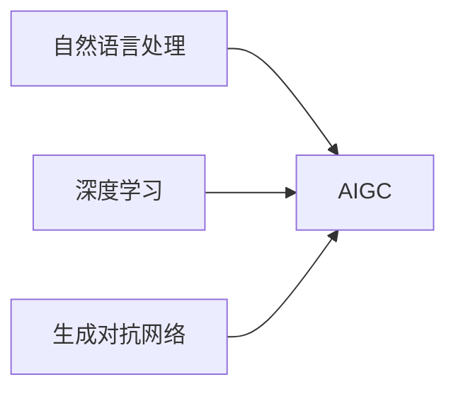

# AIGC从入门到实战：超强的“文科状元”

## 1. 背景介绍

### 1.1 AIGC的兴起与发展

近年来，人工智能技术飞速发展，其中AIGC（Artificial Intelligence Generated Content，人工智能生成内容）作为人工智能领域的新兴分支，正以惊人的速度改变着我们的生活方式和内容创作模式。AIGC利用人工智能技术，赋予机器创作内容的能力，涵盖了文本、图像、音频、视频等多种形式。从最初的简单文本生成到如今的复杂视频创作，AIGC正逐渐走向成熟，并展现出巨大的应用潜力。

### 1.2 AIGC的应用领域

AIGC的应用领域十分广泛，涵盖了新闻媒体、广告营销、娱乐产业、教育培训等多个领域。例如，在新闻媒体领域，AIGC可以用于自动生成新闻稿件、快速撰写体育赛事报道等；在广告营销领域，AIGC可以用于生成个性化广告文案、创作吸引眼球的广告视频等；在娱乐产业领域，AIGC可以用于生成游戏剧情、创作电影剧本等；在教育培训领域，AIGC可以用于生成教学课件、辅助学生进行写作练习等。

### 1.3 AIGC的优势

相比于传统的内容创作方式，AIGC具有以下优势：

* **高效性：**AIGC可以快速生成大量内容，极大地提高了内容创作效率。
* **个性化：**AIGC可以根据用户需求生成个性化内容，满足用户的多样化需求。
* **低成本：**AIGC可以降低内容创作成本，使得内容创作更加普惠。
* **创意性：**AIGC可以生成具有创意性的内容，为内容创作带来新的灵感。

## 2. 核心概念与联系

### 2.1 自然语言处理（NLP）

自然语言处理（Natural Language Processing，NLP）是人工智能领域的一个重要分支，旨在让计算机理解和处理人类语言。NLP是AIGC的基础，它为AIGC提供了理解和生成文本的能力。

### 2.2 深度学习（Deep Learning）

深度学习（Deep Learning）是机器学习领域的一个重要分支，它利用多层神经网络对数据进行学习，从而实现对数据的理解和预测。深度学习是AIGC的核心技术之一，它为AIGC提供了强大的学习能力。

### 2.3 生成对抗网络（GAN）

生成对抗网络（Generative Adversarial Networks，GAN）是一种深度学习模型，它由两个神经网络组成：生成器和判别器。生成器负责生成新的数据，判别器负责判断生成的数据是否真实。GAN是AIGC的重要技术之一，它可以用于生成逼真的图像、音频、视频等内容。

### 2.4 核心概念联系图



## 3. 核心算法原理具体操作步骤

### 3.1 文本生成

#### 3.1.1 基于规则的文本生成

早期文本生成方法主要基于规则，通过预先定义的语法规则和词汇库来生成文本。这种方法生成的文本质量较低，缺乏灵活性。

#### 3.1.2 基于统计的文本生成

随着统计机器学习的发展，基于统计的文本生成方法逐渐兴起。这种方法利用统计模型学习文本的概率分布，从而生成更加自然流畅的文本。

#### 3.1.3 基于深度学习的文本生成

近年来，基于深度学习的文本生成方法取得了重大突破。这种方法利用深度神经网络学习文本的语义信息，从而生成更加准确、流畅、富有创意的文本。

### 3.2 图像生成

#### 3.2.1 基于像素的图像生成

早期图像生成方法主要基于像素，通过操作像素点来生成图像。这种方法生成的图像质量较低，缺乏细节。

#### 3.2.2 基于纹理的图像生成

随着计算机图形学的发展，基于纹理的图像生成方法逐渐兴起。这种方法利用纹理信息来生成更加逼真的图像。

#### 3.2.3 基于深度学习的图像生成

近年来，基于深度学习的图像生成方法取得了重大突破。这种方法利用深度神经网络学习图像的特征表示，从而生成更加逼真、富有创意的图像。

### 3.3 音频生成

#### 3.3.1 基于波形的音频生成

早期音频生成方法主要基于波形，通过操作音频波形来生成音频。这种方法生成的音频质量较低，缺乏音色变化。

#### 3.3.2 基于频谱的音频生成

随着数字信号处理的发展，基于频谱的音频生成方法逐渐兴起。这种方法利用音频频谱信息来生成更加逼真的音频。

#### 3.3.3 基于深度学习的音频生成

近年来，基于深度学习的音频生成方法取得了重大突破。这种方法利用深度神经网络学习音频的特征表示，从而生成更加逼真、富有创意的音频。

### 3.4 视频生成

#### 3.4.1 基于帧的视频生成

早期视频生成方法主要基于帧，通过操作视频帧来生成视频。这种方法生成的视频质量较低，缺乏流畅性。

#### 3.4.2 基于场景的视频生成

随着计算机视觉的发展，基于场景的视频生成方法逐渐兴起。这种方法利用场景信息来生成更加逼真的视频。

#### 3.4.3 基于深度学习的视频生成

近年来，基于深度学习的视频生成方法取得了重大突破。这种方法利用深度神经网络学习视频的特征表示，从而生成更加逼真、富有创意的视频。

## 4. 数学模型和公式详细讲解举例说明

### 4.1 循环神经网络（RNN）

循环神经网络（Recurrent Neural Network，RNN）是一种专门用于处理序列数据的深度学习模型。RNN的特点是具有记忆功能，可以捕捉序列数据中的时间依赖关系。RNN在文本生成、机器翻译等领域有着广泛的应用。

#### 4.1.1 RNN模型结构

RNN模型的基本结构包括输入层、隐藏层和输出层。隐藏层的神经元之间存在循环连接，使得RNN可以记忆之前的输入信息。

#### 4.1.2 RNN模型公式

RNN模型的公式如下：

$$
\begin{aligned}
h_t &= f(W_{xh}x_t + W_{hh}h_{t-1} + b_h) \\
y_t &= g(W_{hy}h_t + b_y)
\end{aligned}
$$

其中：

* $x_t$ 表示t时刻的输入
* $h_t$ 表示t时刻的隐藏状态
* $y_t$ 表示t时刻的输出
* $W_{xh}$、$W_{hh}$、$W_{hy}$ 表示权重矩阵
* $b_h$、$b_y$ 表示偏置向量
* $f$、$g$ 表示激活函数

#### 4.1.3 RNN模型示例

例如，我们可以使用RNN模型来生成文本。假设我们要生成一句"Hello world"，我们可以将"Hello"作为初始输入，然后依次输入"e"、"l"、"l"、"o"、" "、"w"、"o"、"r"、"l"、"d"，RNN模型会根据之前的输入信息预测下一个字符，最终生成完整的句子。

### 4.2 长短期记忆网络（LSTM）

长短期记忆网络（Long Short-Term Memory，LSTM）是一种特殊的RNN模型，它可以解决RNN模型存在的梯度消失问题，从而更好地捕捉长距离依赖关系。LSTM在文本生成、机器翻译、语音识别等领域有着广泛的应用。

#### 4.2.1 LSTM模型结构

LSTM模型的基本结构包括输入门、遗忘门、输出门和记忆单元。输入门控制新信息的输入，遗忘门控制旧信息的遗忘，输出门控制信息的输出，记忆单元存储长期信息。

#### 4.2.2 LSTM模型公式

LSTM模型的公式较为复杂，这里不再赘述。

#### 4.2.3 LSTM模型示例

例如，我们可以使用LSTM模型来生成文本。假设我们要生成一句"The quick brown fox jumps over the lazy dog"，LSTM模型可以捕捉句子中"fox"和"dog"之间的长距离依赖关系，从而生成更加准确的句子。

## 5. 项目实践：代码实例和详细解释说明

### 5.1 文本生成项目

#### 5.1.1 项目目标

本项目旨在使用深度学习模型生成文本，例如诗歌、小说、新闻等。

#### 5.1.2 项目步骤

1. 数据准备：收集和整理文本数据，例如诗歌、小说、新闻等。
2. 数据预处理：对文本数据进行清洗、分词、编码等操作。
3. 模型构建：选择合适的深度学习模型，例如RNN、LSTM等。
4. 模型训练：使用准备好的数据训练模型。
5. 模型评估：评估模型的生成效果，例如困惑度、BLEU值等。
6. 文本生成：使用训练好的模型生成新的文本。

#### 5.1.3 代码实例

```python
import tensorflow as tf

# 定义模型参数
vocab_size = 10000
embedding_dim = 128
rnn_units = 1024

# 创建模型
model = tf.keras.Sequential([
    tf.keras.layers.Embedding(vocab_size, embedding_dim),
    tf.keras.layers.LSTM(rnn_units),
    tf.keras.layers.Dense(vocab_size, activation='softmax')
])

# 编译模型
model.compile(optimizer='adam', loss='sparse_categorical_crossentropy', metrics=['accuracy'])

# 训练模型
model.fit(x_train, y_train, epochs=10)

# 生成文本
start_string = "Once upon a time"
for i in range(100):
    # 将文本转换为数字编码
    input_eval = [char2idx[s] for s in start_string]
    input_eval = tf.expand_dims(input_eval, 0)

    # 预测下一个字符
    predictions = model(input_eval)
    predictions = tf.squeeze(predictions, 0)

    # 选择概率最高的字符
    predicted_id = tf.math.argmax(predictions[-1]).numpy()

    # 将字符添加到文本中
    start_string += idx2char[predicted_id]

# 打印生成的文本
print(start_string)
```

#### 5.1.4 代码解释

* `tf.keras.layers.Embedding`：将单词编码为向量表示。
* `tf.keras.layers.LSTM`：LSTM模型。
* `tf.keras.layers.Dense`：全连接层，用于输出预测结果。
* `model.compile`：编译模型，指定优化器、损失函数和评估指标。
* `model.fit`：训练模型。
* `model(input_eval)`：使用模型进行预测。
* `tf.math.argmax`：选择概率最高的字符。

### 5.2 图像生成项目

#### 5.2.1 项目目标

本项目旨在使用深度学习模型生成图像，例如人脸、风景、动物等。

#### 5.2.2 项目步骤

1. 数据准备：收集和整理图像数据，例如人脸、风景、动物等。
2. 数据预处理：对图像数据进行缩放、裁剪、归一化等操作。
3. 模型构建：选择合适的深度学习模型，例如GAN、VAE等。
4. 模型训练：使用准备好的数据训练模型。
5. 模型评估：评估模型的生成效果，例如Inception score、FID score等。
6. 图像生成：使用训练好的模型生成新的图像。

#### 5.2.3 代码实例

```python
import tensorflow as tf

# 定义模型参数
latent_dim = 100
image_size = 64

# 创建生成器
generator = tf.keras.Sequential([
    tf.keras.layers.Dense(8 * 8 * 256, use_bias=False, input_shape=(latent_dim,)),
    tf.keras.layers.BatchNormalization(),
    tf.keras.layers.LeakyReLU(),
    tf.keras.layers.Reshape((8, 8, 256)),
    tf.keras.layers.Conv2DTranspose(128, (5, 5), strides=(1, 1), padding='same', use_bias=False),
    tf.keras.layers.BatchNormalization(),
    tf.keras.layers.LeakyReLU(),
    tf.keras.layers.Conv2DTranspose(64, (5, 5), strides=(2, 2), padding='same', use_bias=False),
    tf.keras.layers.BatchNormalization(),
    tf.keras.layers.LeakyReLU(),
    tf.keras.layers.Conv2DTranspose(3, (5, 5), strides=(2, 2), padding='same', use_bias=False, activation='tanh')
])

# 创建判别器
discriminator = tf.keras.Sequential([
    tf.keras.layers.Conv2D(64, (5, 5), strides=(2, 2), padding='same', input_shape=(image_size, image_size, 3)),
    tf.keras.layers.LeakyReLU(),
    tf.keras.layers.Dropout(0.3),
    tf.keras.layers.Conv2D(128, (5, 5), strides=(2, 2), padding='same'),
    tf.keras.layers.LeakyReLU(),
    tf.keras.layers.Dropout(0.3),
    tf.keras.layers.Flatten(),
    tf.keras.layers.Dense(1)
])

# 创建GAN模型
gan = tf.keras.Model(inputs=generator.input, outputs=discriminator(generator.output))

# 编译模型
gan.compile(optimizer='adam', loss=tf.keras.losses.BinaryCrossentropy(from_logits=True), metrics=['accuracy'])

# 训练模型
gan.fit(x_train, y_train, epochs=10)

# 生成图像
noise = tf.random.normal([1, latent_dim])
generated_image = generator(noise, training=False)

# 显示生成的图像
plt.imshow(generated_image[0, :, :, :])
plt.show()
```

#### 5.2.4 代码解释

* `tf.keras.layers.Dense`：全连接层，用于生成初始特征图。
* `tf.keras.layers.Conv2DTranspose`：转置卷积层，用于放大特征图。
* `tf.keras.layers.BatchNormalization`：批量归一化层，用于加速训练。
* `tf.keras.layers.LeakyReLU`：LeakyReLU激活函数。
* `tf.keras.layers.Conv2D`：卷积层，用于提取特征。
* `tf.keras.layers.Dropout`：Dropout层，用于防止过拟合。
* `tf.keras.layers.Flatten`：将特征图展平为向量。
* `tf.keras.Model`：创建GAN模型。
* `tf.keras.losses.BinaryCrossentropy`：二元交叉熵损失函数。
* `tf.random.normal`：生成随机噪声。

## 6. 实际应用场景

### 6.1 新闻媒体

AIGC可以用于自动生成新闻稿件、快速撰写体育赛事报道等，提高新闻生产效率和质量。

### 6.2 广告营销

AIGC可以用于生成个性化广告文案、创作吸引眼球的广告视频等，提高广告效果和转化率。

### 6.3 娱乐产业

AIGC可以用于生成游戏剧情、创作电影剧本等，丰富娱乐内容和提升用户体验。

### 6.4 教育培训

AIGC可以用于生成教学课件、辅助学生进行写作练习等，提高教学效率和质量。

## 7. 工具和资源推荐

### 7.1 TensorFlow

TensorFlow是一个开源的机器学习平台，提供了丰富的深度学习模型和工具，可以用于AIGC开发。

### 7.2 PyTorch

PyTorch是一个开源的机器学习平台，提供了灵活的深度学习模型和工具，可以用于AIGC开发。

### 7.3 Hugging Face

Hugging Face是一个提供预训练模型和数据集的平台，可以用于AIGC开发。

## 8. 总结：未来发展趋势与挑战

### 8.1 未来发展趋势

* AIGC技术将继续发展，生成内容的质量和效率将不断提高。
* AIGC应用场景将更加广泛，涵盖更多领域和行业。
* AIGC将与其他技术融合，例如虚拟现实、增强现实等。

### 8.2 面临的挑战

* AIGC生成内容的版权问题。
* AIGC生成内容的伦理问题。
* AIGC技术的可解释性和可控性问题。

## 9. 附录：常见问题与解答

### 9.1 AIGC与人工创作的区别是什么？

AIGC是利用人工智能技术生成内容，而人工创作是由人类进行创作。AIGC可以提高内容创作效率，但人工创作更具创意性。

### 9.2 AIGC会取代人工创作吗？

AIGC不会完全取代人工创作，但会改变内容创作的方式，使得内容创作更加高效和个性化。

### 9.3 如何评估AIGC生成内容的质量？

可以使用困惑度、BLEU值、Inception score、FID score等指标来评估AIGC生成内容的质量。
