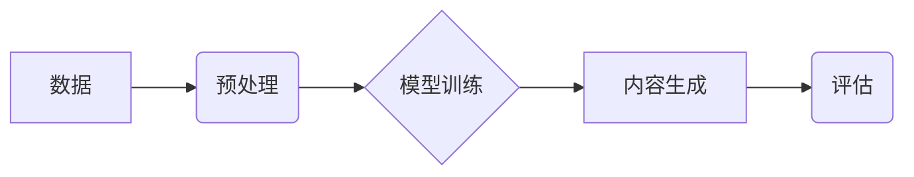

# AIGC从入门到实战：超强的“文科状元”

作者：禅与计算机程序设计艺术

## 1. 背景介绍

### 1.1 人工智能的新纪元：AIGC的崛起

近年来，人工智能 (AI) 领域经历了爆炸式的发展，其中一个引人注目的趋势是**人工智能内容生成 (AIGC)** 的兴起。AIGC是指利用人工智能技术自动生成各种形式的内容，包括文本、图像、音频、视频等。这种能力的出现，为内容创作领域带来了革命性的变化，也为我们打开了通往未来世界的大门。

### 1.2 AIGC：文科领域的新希望

AIGC在文科领域的应用尤其令人振奋。一直以来，文科领域被认为是需要高度创造力和人文素养的领域，而人工智能技术的介入似乎挑战了这一传统观念。然而，AIGC并非要取代人类的创造力，而是要成为人类的得力助手，帮助我们更高效、更便捷地创作出优秀的作品。

### 1.3 本文目的：AIGC入门到实战指南

本文旨在为读者提供一份AIGC从入门到实战的指南，帮助读者了解AIGC的基本概念、核心技术、应用场景以及未来发展趋势。我们将深入浅出地讲解AIGC的各个方面，并通过实际案例和代码演示，让读者能够快速上手，将AIGC应用到自己的工作和生活中。

## 2. 核心概念与联系

### 2.1 AIGC的核心概念

AIGC的核心概念可以概括为以下几点：

* **内容生成**: AIGC的核心目标是生成各种形式的内容，包括文本、图像、音频、视频等。
* **人工智能技术**: AIGC依赖于人工智能技术，例如自然语言处理 (NLP)、计算机视觉 (CV)、深度学习 (DL) 等。
* **自动化**: AIGC的目标是实现内容生成的自动化，减少人工干预，提高效率。
* **创造性**: 尽管AIGC依赖于技术，但其最终目标是生成具有创造性的内容，而不是简单的复制或模仿。

### 2.2 AIGC与其他相关领域的联系

AIGC与其他相关领域有着密切的联系，例如：

* **自然语言处理 (NLP)**: NLP是AIGC的基础技术之一，用于理解和生成自然语言文本。
* **计算机视觉 (CV)**: CV是AIGC的另一个基础技术，用于理解和生成图像和视频。
* **深度学习 (DL)**: DL是AIGC的核心技术，用于训练模型，实现内容生成。
* **内容创作**: AIGC是内容创作领域的新工具，可以辅助人类创作出更优质的内容。

### 2.3 AIGC的核心技术架构



AIGC的核心技术架构包括以下几个步骤：

1. **数据**: 收集和准备用于训练模型的数据。
2. **预处理**: 对数据进行清洗、转换和特征提取等操作。
3. **模型训练**: 使用深度学习等技术训练模型，学习数据的模式和规律。
4. **内容生成**: 使用训练好的模型生成新的内容。
5. **评估**: 对生成的内容进行评估，以确保其质量和创造性。


## 3. 核心算法原理具体操作步骤

### 3.1 文本生成算法

文本生成是AIGC最常见的应用场景之一。常见的文本生成算法包括：

* **循环神经网络 (RNN)**: RNN是一种专门用于处理序列数据的深度学习模型，可以用于生成文本、预测时间序列等。
* **长短期记忆网络 (LSTM)**: LSTM是RNN的一种变体，能够更好地处理长序列数据，在文本生成领域取得了很好的效果。
* **Transformer**: Transformer是一种新型的深度学习模型，在自然语言处理领域取得了突破性的进展，可以用于生成高质量的文本。

### 3.2 图像生成算法

图像生成是AIGC另一个重要的应用场景。常见的图像生成算法包括：

* **生成对抗网络 (GAN)**: GAN是一种深度学习模型，由两个神经网络组成：生成器和判别器。生成器负责生成图像，判别器负责判断生成的图像是否真实。
* **变分自编码器 (VAE)**: VAE是一种深度学习模型，可以将图像编码为低维向量，然后解码生成新的图像。
* **扩散模型**: 扩散模型是一种新型的深度学习模型，通过逐渐添加噪声然后去除噪声的方式生成图像，可以生成高质量的图像。

### 3.3 音频生成算法

音频生成是AIGC的一个新兴应用场景。常见的音频生成算法包括：

* **WaveNet**: WaveNet是一种深度学习模型，可以生成高质量的音频波形。
* **SampleRNN**: SampleRNN是一种深度学习模型，可以生成各种音频样本，例如鼓声、钢琴声等。
* **Jukebox**: Jukebox是一种深度学习模型，可以生成完整的歌曲，包括歌词和伴奏。

## 4. 数学模型和公式详细讲解举例说明

### 4.1 循环神经网络 (RNN)

RNN的数学模型可以表示为：

$$ h_t = f(Wx_t + Uh_{t-1} + b) $$

其中：

* $h_t$ 表示t时刻的隐藏状态
* $x_t$ 表示t时刻的输入
* $W$ 表示输入权重矩阵
* $U$ 表示隐藏状态权重矩阵
* $b$ 表示偏置向量
* $f$ 表示激活函数，例如sigmoid函数或tanh函数

### 4.2 生成对抗网络 (GAN)

GAN的数学模型可以表示为：

$$ \min_G \max_D V(D,G) = E_{x \sim p_{data}(x)}[\log D(x)] + E_{z \sim p_z(z)}[\log(1 - D(G(z)))] $$

其中：

* $G$ 表示生成器
* $D$ 表示判别器
* $x$ 表示真实数据
* $z$ 表示随机噪声
* $p_{data}(x)$ 表示真实数据分布
* $p_z(z)$ 表示随机噪声分布

### 4.3 扩散模型

扩散模型的数学模型可以表示为：

$$ x_t = \sqrt{\alpha_t} x_{t-1} + \sqrt{1 - \alpha_t} \epsilon_t $$

其中：

* $x_t$ 表示t时刻的图像
* $\alpha_t$ 表示t时刻的噪声系数
* $\epsilon_t$ 表示t时刻的随机噪声

## 5. 项目实践：代码实例和详细解释说明

### 5.1 使用RNN生成文本

```python
import tensorflow as tf

# 定义RNN模型
model = tf.keras.Sequential([
    tf.keras.layers.Embedding(input_dim=vocab_size, output_dim=embedding_dim),
    tf.keras.layers.LSTM(units=rnn_units),
    tf.keras.layers.Dense(units=vocab_size, activation='softmax')
])

# 编译模型
model.compile(optimizer='adam', loss='sparse_categorical_crossentropy', metrics=['accuracy'])

# 训练模型
model.fit(x_train, y_train, epochs=num_epochs)

# 生成文本
def generate_text(start_string):
  # 将起始字符串转换为数字编码
  input_eval = [char2idx[s] for s in start_string]
  input_eval = tf.expand_dims(input_eval, 0)

  # 生成文本
  text_generated = []
  for i in range(num_generate):
    # 预测下一个字符
    predictions = model(input_eval)
    predictions = tf.squeeze(predictions, 0)
    predicted_id = tf.random.categorical(predictions, num_samples=1)[-1,0].numpy()

    # 将预测的字符添加到生成的文本中
    text_generated.append(idx2char[predicted_id])

    # 更新输入
    input_eval = tf.expand_dims([predicted_id], 0)

  return start_string + ''.join(text_generated)

# 生成文本示例
generated_text = generate_text('Hello, world!')
print(generated_text)
```

### 5.2 使用GAN生成图像

```python
import tensorflow as tf

# 定义生成器
def make_generator_model():
  model = tf.keras.Sequential()
  model.add(tf.keras.layers.Dense(7*7*256, use_bias=False, input_shape