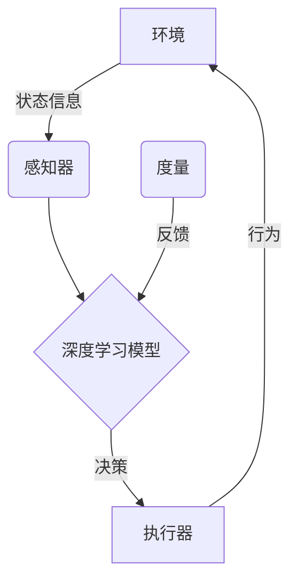

# AI人工智能深度学习算法：智能深度学习代理在档案管理中的应用

## 1.背景介绍

### 1.1 档案管理的重要性

在当今数字时代,信息的海量存储和高效管理成为各行业面临的一大挑战。作为企业和组织运营的关键支柱,档案管理系统负责保存和组织大量的文件、记录和数据,确保信息的安全性、可追溯性和可访问性。传统的手工档案管理方式已经无法满足现代化需求,亟需引入先进的技术来提高效率和准确性。

### 1.2 人工智能在档案管理中的作用  

人工智能(AI)技术凭借其强大的数据处理和模式识别能力,为档案管理带来了革命性的变革。深度学习作为人工智能的一个重要分支,通过构建多层神经网络模型,能够从海量数据中自动学习特征模式,并对新的数据进行智能分类和预测。将深度学习技术应用于档案管理,可以极大提升信息处理的自动化水平,实现智能分类、内容理解、关联挖掘等高级功能,大幅提高工作效率。

### 1.3 智能深度学习代理的概念

智能深度学习代理(Intelligent Deep Learning Agent)是一种集成了深度学习算法的智能系统,能够根据预定的目标,自主地观察环境、学习经验并作出行动。在档案管理领域,智能代理可以作为一个软件系统,持续学习和处理档案数据,完成智能分类归档、内容提取、关联挖掘等任务,为用户提供高效、智能化的档案服务。

## 2.核心概念与联系

### 2.1 深度学习基础

深度学习(Deep Learning)是机器学习的一个新兴热点领域,其灵感来源于人脑的神经网络结构。深度学习模型通过构建多层神经元网络,对原始输入数据进行多层次特征提取和转换,捕捉数据的高阶抽象特征,从而完成分类、预测等任务。

常用的深度学习模型包括:

- 卷积神经网络(CNN)
- 递归神经网络(RNN)
- 长短期记忆网络(LSTM)
- 生成对抗网络(GAN)

这些模型在计算机视觉、自然语言处理、语音识别等领域取得了卓越的成就。

### 2.2 智能代理理论

智能代理(Intelligent Agent)是人工智能领域的一个核心概念,指的是一种能够感知环境、学习知识并作出行动的智能系统。根据Russell和Norvig在《人工智能:一种现代方法》一书中的定义,智能代理由四个基本组成部分:

1. 感知器(Sensors):获取环境状态信息
2. 执行器(Actuators):根据决策执行相应动作
3. 程序(Program):定义代理如何映射感知到行为的规则
4. 度量(Performance Measure):评估代理行为的效果

基于这一理论框架,我们可以设计出具备特定功能的智能代理系统。

### 2.3 智能深度学习代理

将深度学习技术与智能代理理论相结合,我们就得到了智能深度学习代理(Intelligent Deep Learning Agent)的概念模型:

智能深度学习代理由以下几个核心部件组成:

- 感知器:获取档案数据等环境状态信息
- 深度学习模型:对输入数据进行特征学习和决策
- 执行器:执行分类归档、内容提取等具体操作
- 度量模块:评估代理行为的效果,并反馈给深度学习模型持续优化

通过不断地学习经验和反馈,智能深度学习代理可以逐步提高档案处理的准确性和效率,从而实现高度智能化的档案管理服务。

## 3.核心算法原理具体操作步骤  

### 3.1 文本分类算法

#### 3.1.1 文本表示
  
在应用深度学习模型之前,需要先将文本数据转换为机器可识别的数值向量表示。常用的文本表示方法有:

1. One-hot编码
2. TF-IDF加权
3. Word Embedding(如Word2Vec、GloVe等)

其中,Word Embedding能够将单词映射为低维实值向量,较好地捕捉词与词之间的语义关系,是目前最常用的文本表示方式。

#### 3.1.2 卷积神经网络文本分类

卷积神经网络(CNN)最初被广泛应用于计算机视觉领域,后来也被成功引入自然语言处理任务。CNN能够自动从文本中学习局部特征模式,对长范围依赖关系有较好的建模能力。

CNN文本分类的基本流程如下:

1. 输入层:将文本数据转化为词向量矩阵
2. 卷积层:使用多个不同尺寸的卷积核提取局部特征
3. 池化层:对卷积特征进行下采样,保留主要特征
4. 全连接层:将局部特征组合,输出分类概率

通过反向传播训练,CNN可以学习到对文本分类任务最优的卷积核参数和权重。

#### 3.1.3 循环神经网络文本分类

循环神经网络(RNN)是另一种广泛应用于自然语言处理的深度学习模型。与CNN不同,RNN能够很好地捕捉文本序列中的长期依赖关系,适合建模语句和段落级别的语义信息。

RNN文本分类的基本流程为:

1. 词嵌入层:将文本转化为词向量序列
2. RNN层:使用LSTM或GRU等循环单元,对词向量序列进行编码
3. 注意力层:计算不同词元的重要性权重
4. 输出层:将编码向量输入全连接层,输出分类结果

通过反向传播训练,RNN可以学习到对长序列文本分类最优的网络参数。

### 3.2 实体识别与关系抽取

#### 3.2.1 命名实体识别

命名实体识别(NER)是从非结构化文本中提取实体mention并标注其语义类型(如人名、地名、机构名等)的重要任务。常用的NER方法有基于规则的方法、统计机器学习方法和深度学习方法。

深度学习NER的基本流程为:

1. 字符级表示:使用字符级别的CNN或RNN对单词进行编码
2. 词级表示:将字符级编码与预训练词向量相结合,获取词级表示
3. 序列标注:使用LSTM/GRU或CRF对序列进行标注,输出每个词的实体类型

通过在大规模标注语料上训练,深度学习NER可以获得较高的识别精度。

#### 3.2.2 关系抽取

关系抽取旨在从文本中识别出实体之间的语义关系,是信息抽取的重要环节。常用的关系抽取模型有基于监督学习的统计模型和基于深度学习的神经网络模型。

基于深度学习的关系抽取模型通常包括以下组件:

1. 编码层:使用LSTM/GRU或CNN对文本进行编码
2. 注意力层:计算不同词元对实体和关系的重要性权重  
3. 特征融合:将词向量、位置向量等不同特征融合为综合特征表示
4. 解码层:基于综合特征,预测实体关系的语义类型

通过在大规模标注语料上训练,深度学习关系抽取模型可以较好地捕捉实体间的语义关联,为文本理解和知识图谱构建等任务提供支持。

### 3.3 主题模型与文本聚类

#### 3.3.1 主题模型

主题模型是一种无监督的文本挖掘技术,旨在从大规模文本集合中自动发现隐含的语义主题。常用的主题模型有概率潜在语义分析(PLSA)和潜在狄利克雷分布(LDA)模型。

深度学习主题模型的基本思路是:使用神经网络对文档进行主题编码,通过重构损失函数训练网络参数,使其学习到文档的主题分布和每个主题的词分布。

一种典型的深度学习主题模型包括以下组成部分:

1. 词嵌入层:将文档转化为词向量序列
2. 编码器(如LSTM):将词向量编码为文档主题向量
3. 生成器(如神经主题模型):根据主题向量生成文档词分布
4. 重构损失:最小化生成词分布与实际词分布的差异

通过端到端的训练,深度学习主题模型可以学习到更加鲁棒和解释性强的主题表示。

#### 3.3.2 文本聚类

文本聚类是将文本集合划分为若干簇的过程,每个簇内的文本具有较高的相似性。聚类可以作为文本挖掘的预处理步骤,也可以直接用于文档组织和浏览。

传统的文本聚类算法包括K-Means、层次聚类等,这些算法依赖于人工设计的文本相似度度量。深度学习则可以自动学习文本的语义表示,从而提高聚类的效果。

基于深度学习的文本聚类流程如下:

1. 使用LSTM/GRU或CNN对文本进行编码,获取文档向量表示
2. 对文档向量应用聚类算法(如K-Means++),获得初始簇划分
3. 使用辅助目标函数(如簇内紧凑程度最大化)对文档向量进行微调
4. 重新聚类,迭代上述过程直至收敛

通过端到端的训练,深度学习文本聚类模型可以同时优化文本表示和聚类质量,获得更加合理的文档划分。

## 4.数学模型和公式详细讲解举例说明

### 4.1 Word Embedding

Word Embedding是将单词映射为低维实值向量的技术,能够较好地捕捉词与词之间的语义关系。常用的Word Embedding模型有Word2Vec和GloVe。

#### 4.1.1 Word2Vec

Word2Vec由Google于2013年提出,包含两种模型:CBOW(Continuous Bag-of-Words)和Skip-gram。它们的目标是基于上下文预测目标词或基于目标词预测上下文。

**Skip-gram模型**

Skip-gram模型的目标是给定当前词 $w_t$,最大化上下文词 $w_{t-n}, \dots, w_{t-1}, w_{t+1}, \dots, w_{t+n}$ 的条件概率:

$$J = \frac{1}{T}\sum_{t=1}^{T}\sum_{-n \leq j \leq n, j \neq 0} \log P(w_{t+j}|w_t)$$

其中 $T$ 为语料库中词的总数, $n$ 为上下文窗口大小。 $P(w_{t+j}|w_t)$ 的计算采用了 Softmax 函数:

$$P(w_O|w_I) = \frac{e^{v_{w_O}^{\top}v_{w_I}}}{\sum_{w=1}^{W}e^{v_w^{\top}v_{w_I}}}$$

这里 $v_w$ 和 $v_{w_I}$ 分别为词 $w$ 和 $w_I$ 的向量表示,也是需要学习的参数。

由于词表往往很大,分母的计算代价高昂。因此Word2Vec采用了负采样(Negative Sampling)和层序Softmax等技术来进行优化和加速训练。

经过训练,相近的词(如"国王"和"王后")会获得相似的向量表示,能够很好地体现词与词之间的语义关系。

#### 4.1.2 GloVe

GloVe(Global Vectors)是斯坦福大学于2014年提出的一种基于词共现统计的Word Embedding模型。它的目标是让两个相关词的词向量的点积等于这两个词在语料库中的共现概率的对数值。

具体地,GloVe将词向量学习建模为以下最优化问题:

$$\min\limits_{v_w,\tilde{v}_w} \sum_{i,j=1}^{V} f(X_{ij})(w_i^{\top}\tilde{w}_j + b_i + \tilde{b}_j - \log X_{ij})^2$$

这里 $X$ 是词的共现矩阵, $X_{ij}$ 表示词 