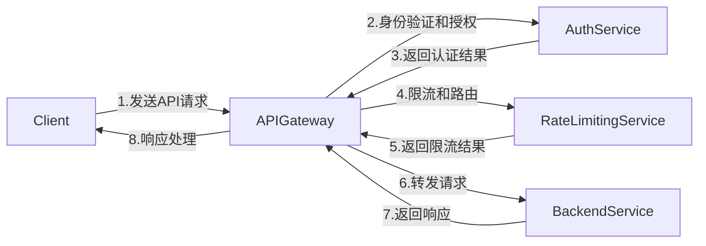

# AI系统API管理原理与代码实战案例讲解

## 1.背景介绍

### 1.1 AI系统的兴起与重要性

人工智能(AI)技术在近年来发展迅猛,已广泛应用于各行各业。随着AI系统的普及,对API的管理需求也与日俱增。API(Application Programming Interface)作为软件系统的接口,允许不同应用程序相互通信和交互数据,是实现系统集成和互操作性的关键。

有效的API管理对于确保AI系统的安全性、可扩展性和高效运行至关重要。良好的API设计有助于简化系统架构、提高开发效率,并为未来的功能扩展奠定基础。此外,API管理还涉及安全性、监控、流量控制等多个方面,需要采用系统化的方法进行规划和实施。

### 1.2 API管理的挑战

尽管API管理的重要性不言而喻,但在实施过程中仍面临诸多挑战:

- **复杂的系统集成**: AI系统通常需要与多个数据源、外部服务和遗留系统集成,导致API管理的复杂度增加。
- **安全性风险**: 不当的API设计和管理可能会带来安全隐患,如数据泄露、非授权访问等。
- **版本控制**: 随着系统的不断迭代和升级,API版本管理变得更加棘手。
- **性能和扩展性**: 需要确保API能够满足高并发访问和流量突增的需求,同时保持良好的响应时间。

因此,建立一套完善的API管理机制对于AI系统的长期健康发展至关重要。

## 2.核心概念与联系

### 2.1 API管理的核心概念

在深入探讨API管理原理之前,我们先来了解一些核心概念:

1. **API网关(API Gateway)**: 作为API请求的入口点,API网关负责请求路由、身份验证、限流、监控等功能。它是API管理的核心组件。

2. **API生命周期管理**: 包括API的设计、开发、测试、部署、监控和退役等全流程,需要有系统化的管理机制。

3. **API文档和契约**: 明确定义API的接口规范、输入输出参数、错误码等,确保API的一致性和可维护性。

4. **API安全性**: 涉及身份验证、授权、加密、审计等多个方面,以防止数据泄露和非授权访问。

5. **API分析和监控**: 通过收集和分析API的调用数据,了解系统的运行状况并及时发现异常。

6. **API开发者体验**: 提供友好的开发者门户、SDK、示例代码等,降低API集成的复杂度。

### 2.2 API管理与其他概念的关系

API管理与微服务架构、DevOps、安全性等多个领域密切相关:

- **微服务架构**: API是微服务架构中各个服务之间通信的接口,API管理有助于降低微服务的复杂度。

- **DevOps**: API管理贯穿了从开发到部署再到运维的全流程,是DevOps实践的重要一环。

- **安全性**: API安全性管理是整体安全战略的重要组成部分,需要与身份验证、授权等安全机制相结合。

- **监控和可观测性**: API调用数据是监控系统运行状况的重要数据源,API管理需要与监控系统紧密集成。

因此,API管理需要与企业的架构策略、开发实践、安全策略等多个层面相互协调,形成一个完整的解决方案。

## 3.核心算法原理具体操作步骤

### 3.1 API网关的工作原理

API网关作为API管理的核心组件,其工作原理值得深入探讨。下面我们以一个典型的API网关架构为例,介绍其具体的工作流程:



1. **客户端发送API请求**: 客户端向API网关发送API请求,通常使用HTTP协议。

2. **身份验证和授权**: API网关将请求转发给身份验证服务(如OAuth2服务器),对请求进行身份验证和授权。

3. **返回认证结果**: 身份验证服务返回认证结果,API网关根据结果决定是否继续处理请求。

4. **限流和路由**: API网关将请求发送给限流服务,对请求进行限流控制。同时,根据请求的URL和其他规则,确定将请求路由到哪个后端服务。

5. **返回限流结果**: 限流服务返回限流结果,API网关根据结果决定是否继续处理请求。

6. **转发请求**: 如果请求通过了身份验证、授权和限流,API网关将请求转发给相应的后端服务。

7. **返回响应**: 后端服务处理请求并返回响应数据。

8. **响应处理**: API网关对响应数据进行必要的处理(如日志记录、响应转换等),然后将响应返回给客户端。

在整个过程中,API网关起到了请求控制、安全保护和路由转发的作用,是API管理的核心组件。

### 3.2 API生命周期管理流程

API生命周期管理是一个端到端的过程,包括以下主要步骤:


1. **设计和规划**: 根据业务需求和系统架构,设计API的接口规范、数据模型、安全策略等。

2. **开发和测试**: 基于API设计,进行API的编码实现和单元测试,确保API的正确性和稳定性。

3. **部署到网关**: 将经过测试的API部署到API网关,配置相关的路由、安全策略和限流规则。

4. **发布和订阅**: 在API开发者门户发布API,允许开发者订阅和集成API。

5. **运行和监控**: 持续监控API的运行状况,收集调用数据和性能指标,确保API的高可用性。

6. **分析和优化**: 分析API的使用情况和性能数据,识别瓶颈并进行优化,提高API的效率和用户体验。

7. **生命周期管理**: 管理API的版本升级、兼容性和弃用策略,确保API的可维护性和向后兼容性。

8. **下线和归档**: 当API不再使用时,将其下线并归档,以便将来参考或重用。

API生命周期管理贯穿了API的整个生命周期,确保API能够高效、安全、可维护地运行。

## 4.数学模型和公式详细讲解举例说明

### 4.1 令牌桶算法

在API网关中,限流是一个非常重要的功能,用于控制API的请求流量,防止服务器过载。常用的限流算法之一是令牌桶算法(Token Bucket Algorithm)。

令牌桶算法的核心思想是,每个请求需要从令牌桶中获取一个令牌才能被处理。令牌桶会以固定的速率产生令牌,直到达到最大容量。如果令牌桶为空,则请求需要等待,直到有新的令牌产生。

令牌桶算法可以用以下公式表示:

$$
Tokens_{available} = \min(Tokens_{available} + \frac{CurrentTime - LastTime}{IntervalTime}, BucketSize)
$$

其中:

- $Tokens_{available}$ 表示当前可用的令牌数量
- $CurrentTime$ 表示当前时间
- $LastTime$ 表示上次计算可用令牌数量的时间
- $IntervalTime$ 表示产生一个令牌的时间间隔
- $BucketSize$ 表示令牌桶的最大容量

当一个请求到达时,算法会检查当前可用的令牌数量。如果有足够的令牌,则从令牌桶中移除一个令牌,并允许请求通过。否则,请求需要等待,直到有新的令牌产生。

令牌桶算法可以有效控制请求的平均流量,同时允许在短时间内存在一定程度的突发流量。它在API网关中被广泛应用,用于保护后端服务免受过载的影响。

### 4.2 指数加权移动平均数滤波

在API监控和分析中,我们经常需要对API的响应时间和错误率等指标进行平滑处理,以消除短期内的异常波动。指数加权移动平均数(Exponential Weighted Moving Average, EWMA)滤波器是一种常用的数据平滑算法。

EWMA滤波器的计算公式如下:

$$
S_t = \alpha Y_t + (1 - \alpha) S_{t-1}
$$

其中:

- $S_t$ 表示当前时间 $t$ 的平滑值
- $Y_t$ 表示当前时间 $t$ 的原始观测值
- $S_{t-1}$ 表示上一时间点的平滑值
- $\alpha$ 是一个介于 0 和 1 之间的平滑系数

EWMA滤波器赋予最新的观测值较高的权重,同时也考虑了历史数据,从而实现了对数据的平滑处理。平滑系数 $\alpha$ 的取值决定了平滑程度:

- 当 $\alpha$ 接近 1 时,平滑值更多地受最新观测值的影响,对突变敏感。
- 当 $\alpha$ 接近 0 时,平滑值更多地受历史数据的影响,平滑效果更明显。

在API监控中,我们可以将EWMA滤波器应用于响应时间、错误率等指标,以获得更加平滑的数据曲线,从而更容易识别趋势和异常情况。

## 4.项目实践:代码实例和详细解释说明

### 4.1 使用Spring Cloud Gateway构建API网关

Spring Cloud Gateway是一个基于Spring框架的API网关,提供了丰富的路由、过滤器和断路器功能。下面是一个使用Spring Cloud Gateway构建API网关的示例:

```java
// API网关配置类
@Configuration
public class ApiGatewayConfig {

    @Bean
    public RouteLocator customRouteLocator(RouteLocatorBuilder builder) {
        return builder.routes()
                .route("user-service", r -> r.path("/users/**")
                        .filters(f -> f.circuitBreaker(c -> c.setName("userCircuitBreaker")
                                .setFallbackUri("forward:/userServiceFallback")))
                        .uri("lb://user-service"))
                .route("order-service", r -> r.path("/orders/**")
                        .filters(f -> f.circuitBreaker(c -> c.setName("orderCircuitBreaker")
                                .setFallbackUri("forward:/orderServiceFallback")))
                        .uri("lb://order-service"))
                .build();
    }

    @Bean
    public CircuitBreakerFactory circuitBreakerFactory() {
        return new DefaultCircuitBreakerFactory();
    }

    // 用户服务降级处理器
    @RestController
    public class UserServiceFallback {
        @GetMapping("/userServiceFallback")
        public String userServiceFallback() {
            return "User service is currently unavailable. Please try again later.";
        }
    }

    // 订单服务降级处理器
    @RestController
    public class OrderServiceFallback {
        @GetMapping("/orderServiceFallback")
        public String orderServiceFallback() {
            return "Order service is currently unavailable. Please try again later.";
        }
    }
}
```

在上面的示例中,我们定义了两条路由规则:

1. `/users/**` 路径的请求将被路由到用户服务(user-service)。
2. `/orders/**` 路径的请求将被路由到订单服务(order-service)。

对于每条路由,我们都配置了一个断路器(Circuit Breaker),用于在下游服务出现故障时触发降级操作。当断路器打开时,请求将被路由到相应的降级处理器(`UserServiceFallback`或`OrderServiceFallback`)。

通过Spring Cloud Gateway,我们可以轻松地构建API网关,实现请求路由、断路器等功能,并提供降级机制以确保系统的高可用性。

### 4.2