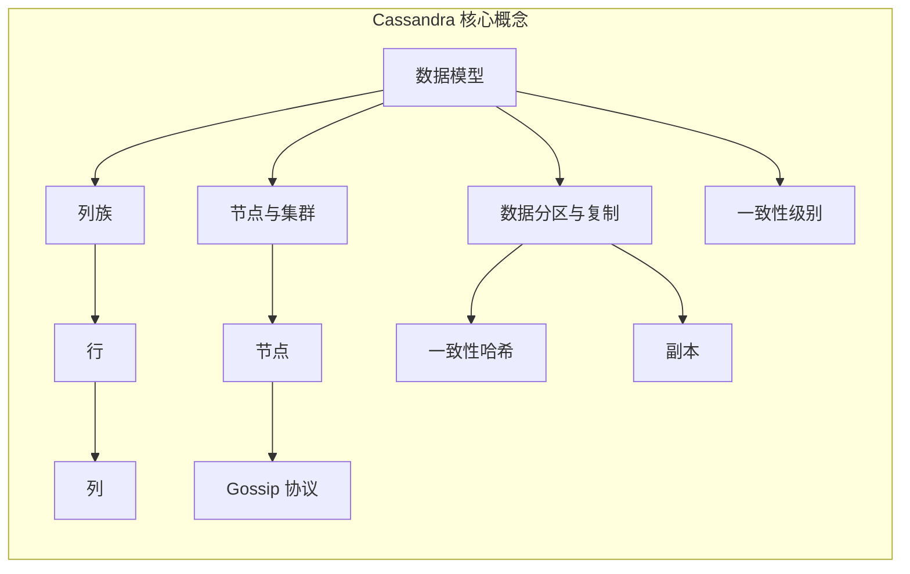
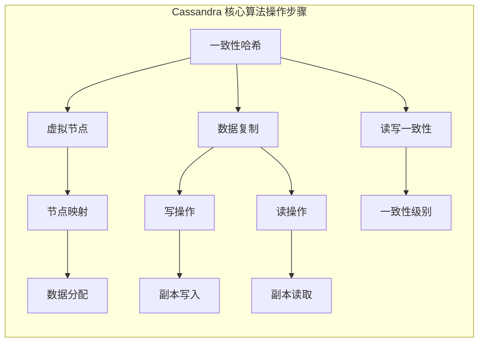

## 1. 背景介绍

### 1.1 大数据时代的存储挑战

随着互联网和移动设备的普及，全球数据量呈指数级增长。传统的关系型数据库在处理海量数据、高并发读写、跨地域分布式存储等方面面临着巨大的挑战。为了应对这些挑战，NoSQL数据库应运而生，其中Cassandra作为一款高性能、高可用、可扩展的分布式NoSQL数据库，近年来备受关注。

### 1.2 Cassandra的优势与特点

Cassandra 最初由 Facebook 开发，用于收件箱搜索，后来开源并成为 Apache 软件基金会的顶级项目。相比于其他 NoSQL 数据库，Cassandra 具有以下优势：

* **高可用性:** Cassandra 采用无中心架构，任何节点都可以处理读写请求，即使部分节点故障，也不会影响整个集群的正常运行。
* **可扩展性:** Cassandra 支持线性扩展，可以通过添加节点轻松扩展集群的容量，满足不断增长的数据存储需求。
* **高性能:** Cassandra 采用分布式哈希表和数据复制机制，能够高效地处理海量数据的读写操作。
* **容错性:** Cassandra 具有数据一致性和容错机制，能够保证数据在节点故障时不会丢失。

### 1.3 Cassandra的应用场景

Cassandra 广泛应用于各种需要高可用性、可扩展性和高性能的场景，例如：

* **社交媒体:** 存储用户资料、消息、帖子等信息。
* **电子商务:** 存储商品信息、订单信息、用户行为数据等。
* **物联网:** 存储传感器数据、设备状态等信息。
* **金融行业:** 存储交易记录、账户信息等敏感数据。


## 2. 核心概念与联系

### 2.1 数据模型

Cassandra 的数据模型基于列族（Column Family），类似于关系型数据库中的表。每个列族包含多个行（Row），每行包含多个列（Column）。Cassandra 的列族支持动态添加列，并且可以根据需要定义不同的数据类型。

### 2.2 节点与集群

Cassandra 采用无中心架构，由多个节点组成集群。每个节点都存储一部分数据，并通过 Gossip 协议互相通信，保持数据一致性。节点之间没有主从之分，任何节点都可以处理读写请求。

### 2.3 数据分区与复制

Cassandra 使用一致性哈希算法将数据分区到不同的节点上。每个数据分区都有多个副本，分布在不同的节点上，保证数据的高可用性。当某个节点发生故障时，其他节点上的副本可以继续提供服务。

### 2.4 一致性级别

Cassandra 支持多种一致性级别，用于控制数据读写的强一致性和可用性。常用的 consistency level 包括：

* **ANY:** 只要有一个副本响应即可。
* **ONE:** 至少有一个副本写入成功即可。
* **QUORUM:** 大多数副本写入成功即可。
* **ALL:** 所有副本都写入成功才算成功。

### 2.5 核心概念联系图




## 3. 核心算法原理具体操作步骤

### 3.1 一致性哈希算法

Cassandra 使用一致性哈希算法将数据分区到不同的节点上。一致性哈希算法的主要步骤如下：

1. 将哈希环分成若干个虚拟节点。
2. 将每个节点映射到哈希环上的一个或多个虚拟节点。
3. 根据数据的哈希值，将其分配到对应的虚拟节点上。

一致性哈希算法能够保证数据均匀分布到不同的节点上，并且在节点加入或离开集群时，只需要移动少量数据，避免大规模的数据迁移。

### 3.2 数据复制机制

Cassandra 使用数据复制机制保证数据的高可用性。每个数据分区都有多个副本，分布在不同的节点上。当某个节点发生故障时，其他节点上的副本可以继续提供服务。

数据复制机制主要依靠以下两个步骤：

1. **写操作:** 当客户端发起写操作时，Cassandra 会将数据写入到所有副本所在的节点上。
2. **读操作:** 当客户端发起读操作时，Cassandra 会从最近的副本所在的节点读取数据。

Cassandra 支持多种数据复制策略，例如：

* **SimpleStrategy:** 将数据副本均匀分布到集群中的所有节点上。
* **NetworkTopologyStrategy:** 根据网络拓扑结构，将数据副本分布到不同的数据中心和机架上。

### 3.3 读写一致性

Cassandra 支持多种一致性级别，用于控制数据读写的强一致性和可用性。常用的 consistency level 包括：

* **ANY:** 只要有一个副本响应即可。
* **ONE:** 至少有一个副本写入成功即可。
* **QUORUM:** 大多数副本写入成功即可。
* **ALL:** 所有副本都写入成功才算成功。

一致性级别越高，数据的一致性越强，但可用性越低。反之，一致性级别越低，数据的一致性越弱，但可用性越高。

### 3.4 核心算法操作步骤图




## 4. 数学模型和公式详细讲解举例说明

### 4.1 一致性哈希算法数学模型

一致性哈希算法可以使用以下数学模型表示：

```
hash(key) = hash_function(key) % N
```

其中：

* `key` 表示数据的键。
* `hash_function` 表示哈希函数。
* `N` 表示虚拟节点的数量。

### 4.2 数据复制策略数学模型

SimpleStrategy 数据复制策略可以使用以下数学模型表示：

```
replication_factor = number_of_replicas
```

NetworkTopologyStrategy 数据复制策略可以使用以下数学模型表示：

```
replication_factor = {
    'datacenter1': number_of_replicas_in_datacenter1,
    'datacenter2': number_of_replicas_in_datacenter2,
    ...
}
```

### 4.3 一致性级别数学模型

一致性级别可以使用以下数学模型表示：

```
consistency_level = {
    'read': read_consistency_level,
    'write': write_consistency_level
}
```

### 4.4 数学模型公式举例说明

假设有一个 Cassandra 集群包含 3 个节点，使用 SimpleStrategy 数据复制策略，复制因子为 2。一致性级别设置为 `{'read': 'QUORUM', 'write': 'QUORUM'}`。

1. 当客户端写入数据时，Cassandra 会将数据写入到 2 个副本所在的节点上。
2. 当客户端读取数据时，Cassandra 会从 2 个副本所在的节点读取数据，并返回大多数副本一致的结果。

## 5. 项目实践：代码实例和详细解释说明

### 5.1 安装 Cassandra

首先，需要安装 Cassandra 数据库。可以从 Apache Cassandra 官网下载最新版本的 Cassandra，并按照官方文档进行安装。

### 5.2 连接 Cassandra

安装完成后，可以使用 `cqlsh` 工具连接到 Cassandra 数据库。

```bash
cqlsh
```

### 5.3 创建 keyspace

在 Cassandra 中，keyspace 类似于关系型数据库中的数据库。可以使用以下 CQL 语句创建 keyspace：

```sql
CREATE KEYSPACE my_keyspace WITH replication = {'class': 'SimpleStrategy', 'replication_factor': 3};
```

### 5.4 创建表

在 keyspace 中，可以创建多个表。可以使用以下 CQL 语句创建表：

```sql
CREATE TABLE my_keyspace.users (
    id uuid PRIMARY KEY,
    name text,
    email text
);
```

### 5.5 插入数据

可以使用以下 CQL 语句插入数据：

```sql
INSERT INTO my_keyspace.users (id, name, email) VALUES (uuid(), 'John Doe', 'john.doe@example.com');
```

### 5.6 查询数据

可以使用以下 CQL 语句查询数据：

```sql
SELECT * FROM my_keyspace.users;
```

### 5.7 代码实例详细解释说明

```python
from cassandra.cluster import Cluster

# 连接 Cassandra 集群
cluster = Cluster(['127.0.0.1'])
session = cluster.connect()

# 设置 keyspace
session.set_keyspace('my_keyspace')

# 插入数据
session.execute("INSERT INTO users (id, name, email) VALUES (uuid(), 'John Doe', 'john.doe@example.com')")

# 查询数据
rows = session.execute("SELECT * FROM users")
for row in rows:
    print(row.id, row.name, row.email)

# 关闭连接
session.shutdown()
cluster.shutdown()
```

## 6. 实际应用场景

### 6.1 社交媒体

Cassandra 广泛应用于社交媒体平台，例如 Facebook、Twitter、Instagram 等。Cassandra 可以存储用户的个人资料、消息、帖子、关注关系等信息。

### 6.2 电子商务

Cassandra 也广泛应用于电子商务平台，例如 Amazon、eBay、阿里巴巴等。Cassandra 可以存储商品信息、订单信息、用户行为数据等。

### 6.3 物联网

Cassandra 还可以应用于物联网领域，例如智能家居、智能交通、工业自动化等。Cassandra 可以存储传感器数据、设备状态等信息。

### 6.4 金融行业

Cassandra 也被应用于金融行业，例如银行、证券公司、保险公司等。Cassandra 可以存储交易记录、账户信息等敏感数据。


## 7. 工具和资源推荐

### 7.1 Cassandra 官网

Cassandra 官网提供了丰富的文档、教程、工具和资源，可以帮助用户学习和使用 Cassandra。

### 7.2 DataStax

DataStax 是一家提供 Cassandra 商业支持的公司，也提供了一些 Cassandra 工具和资源。

### 7.3 Apache Cassandra 社区

Apache Cassandra 社区是一个活跃的社区，用户可以在社区中寻求帮助、分享经验、参与 Cassandra 的开发。

### 7.4 Cassandra书籍

市面上有很多关于 Cassandra 的书籍，可以帮助用户深入了解 Cassandra 的原理和应用。


## 8. 总结：未来发展趋势与挑战

### 8.1 未来发展趋势

Cassandra 作为一款成熟的分布式 NoSQL 数据库，未来将会继续发展，主要趋势包括：

* **云原生支持:** Cassandra 将会更好地支持云原生环境，例如 Kubernetes。
* **多模型支持:** Cassandra 将会支持更多的数据模型，例如图形数据库、文档数据库等。
* **机器学习集成:** Cassandra 将会集成机器学习功能，例如数据分析、预测等。

### 8.2 面临的挑战

Cassandra 也面临着一些挑战，例如：

* **运维复杂性:** Cassandra 的运维比较复杂，需要专业的运维人员。
* **安全性:** Cassandra 的安全性需要不断提升，以应对日益严峻的安全威胁。


## 9. 附录：常见问题与解答

### 9.1 Cassandra 和 MongoDB 的区别？

Cassandra 和 MongoDB 都是 NoSQL 数据库，但它们的设计理念和应用场景有所不同。Cassandra 更加注重高可用性和可扩展性，适用于需要处理海量数据的场景，而 MongoDB 更加注重灵活性和易用性，适用于需要快速开发和迭代的场景。

### 9.2 如何提高 Cassandra 的性能？

提高 Cassandra 性能的方法包括：

* **优化数据模型:** 选择合适的数据模型，避免数据冗余和热点问题。
* **调整配置参数:** 根据实际情况调整 Cassandra 的配置参数，例如内存大小、缓存大小等。
* **使用缓存:** 使用缓存可以减少对 Cassandra 的访问次数，提高查询效率。
* **使用压缩:** 使用压缩可以减少数据存储空间，提高读写效率。


### 9.3 如何保证 Cassandra 的安全性？

保证 Cassandra 安全性的方法包括：

* **启用身份验证:** 启用身份验证可以防止未经授权的访问。
* **加密数据:** 加密数据可以防止数据泄露。
* **定期备份:** 定期备份数据可以防止数据丢失。
* **安全审计:** 定期进行安全审计可以发现潜在的安全风险。
