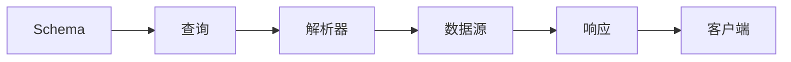

## 1. 背景介绍

### 1.1 AI系统的数据交互挑战

人工智能（AI）系统通常涉及大量数据的处理、分析和交互。为了满足日益增长的数据需求和复杂的业务逻辑，AI系统需要高效、灵活和可扩展的数据交互方案。传统的RESTful API设计模式在处理复杂数据查询、版本控制和数据聚合方面存在局限性，难以满足现代AI系统的需求。

### 1.2 GraphQL的优势

GraphQL是一种用于API的查询语言和运行时，它提供了一种更灵活、高效和类型安全的方式来获取和操作数据。GraphQL的优势包括：

- **声明式数据获取:**  客户端可以精确地请求所需的数据，避免过度获取或不足获取。
- **强类型系统:** GraphQL Schema定义了数据类型和关系，确保数据一致性和可靠性。
- **高效的数据聚合:**  GraphQL允许客户端在一个请求中获取多个资源的数据，减少网络请求次数。
- **版本控制:** GraphQL Schema的演进不会破坏现有客户端，方便API的迭代和更新。

### 1.3 GraphQL在AI系统中的应用

GraphQL的特性使其非常适合用于构建现代AI系统，例如：

- **机器学习模型训练:**  GraphQL可以高效地获取和整合用于训练机器学习模型的大规模数据集。
- **AI推理服务:**  GraphQL可以为AI推理服务提供灵活的查询接口，方便客户端获取推理结果和相关信息。
- **AI平台和工具:**  GraphQL可以用于构建AI平台和工具的API，提供统一的数据访问和操作方式。

## 2. 核心概念与联系

### 2.1 Schema定义

GraphQL Schema是GraphQL API的核心，它定义了API可用的数据类型、字段和操作。Schema使用GraphQL Schema Definition Language (SDL)编写，例如：

```graphql
type Query {
  getUser(id: ID!): User
}

type User {
  id: ID!
  name: String!
  email: String!
  posts: [Post!]!
}

type Post {
  id: ID!
  title: String!
  content: String!
  author: User!
}
```

### 2.2 查询与响应

客户端使用GraphQL查询语言向GraphQL服务器发送请求，例如：

```graphql
query {
  getUser(id: 1) {
    id
    name
    email
    posts {
      title
      content
    }
  }
}
```

GraphQL服务器根据Schema解析查询，获取数据并返回JSON格式的响应，例如：

```json
{
  "data": {
    "getUser": {
      "id": 1,
      "name": "John Doe",
      "email": "john.doe@example.com",
      "posts": [
        {
          "title": "GraphQL Introduction",
          "content": "GraphQL is a query language for your API..."
        },
        {
          "title": "AI Applications of GraphQL",
          "content": "GraphQL is well-suited for building AI systems..."
        }
      ]
    }
  }
}
```

### 2.3 解析器

解析器是GraphQL Schema中定义的字段的具体实现，负责从数据源获取数据并返回给客户端。解析器可以是简单的函数，也可以是复杂的业务逻辑。

### 2.4 核心概念关系图



## 3. 核心算法原理具体操作步骤

### 3.1 查询解析

GraphQL服务器接收到客户端的查询后，首先对查询进行语法分析和验证，确保查询符合GraphQL规范。

### 3.2 字段解析

GraphQL服务器根据Schema定义递归地解析查询中的每个字段，调用相应的解析器获取数据。

### 3.3 数据获取

解析器从数据源获取数据，例如数据库、缓存或外部API。

### 3.4 数据整合

GraphQL服务器将所有解析器返回的数据整合到一个响应对象中，并按照客户端查询的结构返回给客户端。

## 4. 数学模型和公式详细讲解举例说明

GraphQL本身不涉及特定的数学模型或公式。GraphQL的实现通常依赖于底层数据源的数学模型和算法。

## 5. 项目实践：代码实例和详细解释说明

### 5.1 搭建GraphQL服务器

```python
import graphene

class User(graphene.ObjectType):
    id = graphene.ID()
    name = graphene.String()
    email = graphene.String()

class Query(graphene.ObjectType):
    user = graphene.Field(User, id=graphene.ID(required=True))

    def resolve_user(self, info, id):
        # 获取用户信息的逻辑
        return User(id=id, name="John Doe", email="john.doe@example.com")

schema = graphene.Schema(query=Query)
```

### 5.2 发送GraphQL查询

```python
query = """
query {
  user(id: 1) {
    id
    name
    email
  }
}
"""

result = schema.execute(query)
print(result.data)
```

### 5.3 代码解释

- `graphene`库用于定义GraphQL Schema和解析器。
- `User`类定义了用户的数据类型。
- `Query`类定义了可用的查询操作。
- `resolve_user`方法是`user`字段的解析器，负责获取用户信息。
- `schema.execute`方法用于执行GraphQL查询。

## 6. 实际应用场景

### 6.1 AI模型训练平台

GraphQL可以用于构建AI模型训练平台的API，提供以下功能：

- 查询模型训练数据
- 提交模型训练任务
- 获取模型训练进度和结果

### 6.2 AI推理服务

GraphQL可以为AI推理服务提供灵活的查询接口，方便客户端获取推理结果和相关信息，例如：

- 输入数据
- 模型版本
- 推理结果
- 可信度

### 6.3 AI平台和工具

GraphQL可以用于构建AI平台和工具的API，提供统一的数据访问和操作方式，例如：

- 数据集管理
- 模型管理
- 服务监控

## 7. 总结：未来发展趋势与挑战

### 7.1 未来发展趋势

- **实时数据处理:** GraphQL可以与实时数据流技术（例如Kafka、WebSocket）集成，支持实时数据查询和订阅。
- **联邦GraphQL:**  联邦GraphQL允许将多个GraphQL Schema合并成一个统一的Schema，方便构建大型分布式系统。
- **GraphQL与AI技术的融合:**  GraphQL可以与AI技术（例如自然语言处理、知识图谱）结合，提供更智能的数据查询和分析能力。

### 7.2 挑战

- **性能优化:**  GraphQL查询的复杂性可能会导致性能问题，需要进行优化。
- **安全性:**  GraphQL API需要进行安全防护，防止恶意查询和攻击。
- **生态系统:**  GraphQL生态系统仍在发展中，需要更多工具和资源来支持GraphQL的应用。

## 8. 附录：常见问题与解答

### 8.1 GraphQL与RESTful API的区别是什么？

| 特性 | GraphQL | RESTful API |
|---|---|---|
| 数据获取 | 声明式 | 命令式 |
| 数据结构 | 强类型 | 弱类型 |
| 数据聚合 | 高效 | 低效 |
| 版本控制 | 内置 | 需要额外机制 |

### 8.2 GraphQL的优缺点是什么？

**优点:**

- 灵活性高
- 数据获取效率高
- 类型安全
- 版本控制方便

**缺点:**

- 学习曲线较陡峭
- 性能优化难度较大
- 安全性需要额外关注

### 8.3 如何学习GraphQL？

- 官方文档：https://graphql.org/learn/
- 教程和课程：https://www.howtographql.com/
- 社区论坛：https://spectrum.chat/graphql
