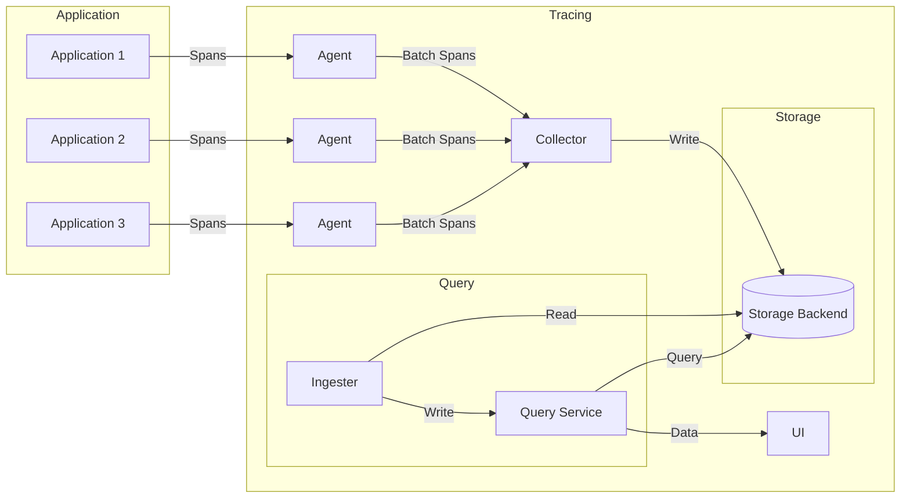

# AI系统Jaeger原理与代码实战案例讲解

## 1.背景介绍

### 1.1 什么是Jaeger

Jaeger是一个开源的、云原生的分布式跟踪系统,旨在监控和troubleshooting基于微服务架构的复杂分布式系统。它可以帮助开发人员深入了解整个分布式系统的运行情况,跟踪请求在不同微服务之间是如何流转的,以及在每个微服务内部是如何执行的。

### 1.2 分布式跟踪的重要性

随着微服务架构的广泛采用,单体应用程序被拆分为多个独立的微服务,每个微服务负责特定的业务功能。这些微服务通过网络相互通信,共同完成复杂的业务流程。然而,当出现性能问题或错误时,跨越多个微服务的请求流变得难以跟踪和调试。

分布式跟踪系统如Jaeger就是为了解决这个问题而设计的。它通过在每个请求中注入唯一的"跟踪ID",并在每个微服务中记录相关的执行信息,从而可以重构整个请求的执行路径,并提供全面的性能指标和日志数据,帮助开发人员快速定位和解决问题。

### 1.3 Jaeger的主要组件

Jaeger由以下几个核心组件组成:

- **Agent(代理)**: 部署为sidecar,接收instrumented应用程序的span数据,并将其批量发送到Collector。
- **Collector**: 接收Agent发送的span数据,并将其写入存储后端。
- **Query(查询)**: 查询存储后端中的跟踪数据,并通过UI呈现给用户。
- **Ingester**: 从存储后端读取跟踪数据,并将其写入到基于Kafka的消费者队列中,以供查询服务使用。
- **UI(用户界面)**: 基于Web的UI,用于可视化跟踪数据。

## 2.核心概念与联系

### 2.1 Trace(跟踪)

Trace代表了一个分布式事务或工作流,它由多个Span组成,用于表示分布式系统中一个完整的请求流程。每个Trace都有一个唯一的ID,称为TraceID。

### 2.2 Span(跨度)

Span表示Trace中的一个单元操作,例如一个RPC调用、数据库查询或外部HTTP请求。每个Span都有一个唯一的ID,以及一个操作名称、开始时间和持续时间。Span还可以包含一些其他元数据,如标签(Tags)、日志(Logs)和引用(References)。

### 2.3 标签(Tags)

标签是键值对的形式,用于添加Span的元数据信息,例如服务名称、HTTP方法、响应状态码等。标签可以帮助过滤和查询跟踪数据。

### 2.4 日志(Logs)

日志是一系列的事件,用于记录Span执行过程中的重要信息,例如错误信息、警告信息或调试信息。每个日志都有一个时间戳和一些字段。

### 2.5 引用(References)

引用用于建立Span之间的关系,例如父子关系(ChildOf)、跟随关系(FollowsFrom)等。通过引用,可以重构整个Trace的执行路径。

### 2.6 Jaeger客户端库

Jaeger提供了多种编程语言的客户端库,用于在应用程序中instrument代码,生成和发送Span数据。常见的客户端库包括Java、Go、Python、Node.js等。

### 2.7 OpenTracing API

Jaeger实现了OpenTracing API,这是一个供应用程序使用的厂商中立的API,用于添加分布式跟踪功能。OpenTracing API定义了一组通用的跟踪概念和编程接口,使得应用程序可以轻松地集成各种分布式跟踪系统。

### 2.8 整体架构

下图展示了Jaeger的整体架构:



在这个架构中:

1. 应用程序使用Jaeger客户端库instrument代码,生成Span数据。
2. Span数据被发送到本地Agent。
3. Agent将Span数据批量发送到Collector。
4. Collector将Span数据写入存储后端(如Elasticsearch、Cassandra或Kafka)。
5. Ingester从存储后端读取Span数据,并将其写入查询服务。
6. 查询服务从存储后端查询Span数据,并通过UI呈现给用户。

## 3.核心算法原理具体操作步骤

### 3.1 Span的生命周期

每个Span都有一个生命周期,从创建到完成。下面是Span生命周期的具体步骤:

1. **创建Span**

应用程序使用Jaeger客户端库创建一个新的Span,并设置其操作名称、开始时间和其他元数据(如标签)。如果是一个新的Trace,则还需要生成一个新的TraceID。

2. **建立引用关系**

如果新创建的Span与其他Span存在关系(如父子关系或跟随关系),则需要建立相应的引用关系。

3. **记录日志事件**

在Span的执行过程中,应用程序可以使用客户端库记录重要的日志事件,例如错误信息、警告信息或调试信息。

4. **设置标签**

应用程序可以在Span上设置键值对形式的标签,用于添加元数据信息。

5. **完成Span**

当Span的操作完成时,应用程序需要调用客户端库的finish()方法来结束该Span,并记录其持续时间。

6. **发送Span数据**

完成的Span数据将被发送到本地Agent,Agent会将这些数据批量发送到Collector。

整个过程可以通过以下伪代码来描述:

```
// 创建新的Span
span = tracer.StartSpan("operation_name")

// 设置标签
span.SetTag("key", "value")

// 记录日志事件
span.LogEvent("event_message")

// 执行业务逻辑
...

// 完成Span
span.Finish()
```

### 3.2 Span的采样策略

由于性能和存储成本的原因,通常不会记录所有的Span数据。Jaeger提供了多种采样策略,用于控制哪些Span应该被记录和存储。常见的采样策略包括:

1. **常量采样**

根据一个固定的概率值来决定是否采样。例如,概率值为0.1表示只有10%的Span会被采样。

2. **基于速率的采样**

根据每秒的采样速率来决定是否采样。例如,速率为5表示每秒最多采样5个Span。

3. **基于规则的采样**

根据一些预定义的规则来决定是否采样,例如根据服务名称、操作名称或标签值进行采样。

4. **自适应采样**

根据当前的系统负载和Span数据量动态调整采样策略,以保持一定的性能和存储成本。

采样策略可以在Jaeger的配置文件中设置,也可以在运行时动态更新。

### 3.3 数据传输和持久化

Jaeger使用了高效的数据传输和持久化机制,以确保跟踪数据的可靠性和可扩展性。具体流程如下:

1. **Agent到Collector的数据传输**

Agent将Span数据批量发送到Collector,以减少网络开销。数据传输采用了高效的gRPC协议,并支持TLS加密和认证。

2. **Collector到存储后端的数据持久化**

Collector将接收到的Span数据写入存储后端。Jaeger支持多种存储后端,包括Elasticsearch、Cassandra和Kafka。

   - **Elasticsearch**: Collector将Span数据直接写入Elasticsearch集群。Elasticsearch提供了分布式、可扩展和高性能的搜索和分析功能。
   - **Cassandra**: Collector将Span数据写入Cassandra集群。Cassandra是一种分布式、高可用的NoSQL数据库,适合存储大量的时序数据。
   - **Kafka**: Collector将Span数据写入Kafka集群。Kafka是一种分布式流处理平台,可以提供高吞吐量和低延迟的数据传输。

3. **查询服务的数据读取**

查询服务从存储后端读取Span数据,并将其缓存在内存中,以提供快速的查询和可视化。如果使用Kafka作为存储后端,则还需要一个Ingester组件从Kafka读取数据,并将其写入查询服务。

### 3.4 数据查询和可视化

Jaeger提供了一个基于Web的UI,用于查询和可视化跟踪数据。UI支持以下主要功能:

1. **查询跟踪**

用户可以根据TraceID、服务名称、操作名称、标签等条件查询跟踪数据。

2. **查看Trace详情**

查询结果将显示Trace的详细信息,包括所有Span的时间线、标签、日志和引用关系。

3. **查看性能指标**

UI可以展示Trace的性能指标,如总耗时、每个Span的耗时、服务级别的统计数据等。

4. **查看依赖关系**

UI可以渲染服务之间的依赖关系图,帮助用户了解整个分布式系统的架构和调用流程。

5. **搜索和过滤**

用户可以使用强大的搜索和过滤功能,快速定位感兴趣的跟踪数据。

6. **比较跟踪**

UI支持将多个Trace进行对比,以发现性能差异和异常情况。

### 3.5 Jaeger客户端库的工作原理

Jaeger提供了多种编程语言的客户端库,用于在应用程序中instrument代码,生成和发送Span数据。下面以Java客户端库为例,介绍其工作原理:

1. **初始化Tracer**

应用程序需要先初始化一个Tracer实例,并配置相关参数,如服务名称、采样策略、Agent地址等。

```java
Sender sender = new UdpSender(
    "localhost", // Agent地址
    6831, // Agent端口
    0 // Agent发送缓冲区大小
);

Sampler sampler = new ConstSampler(true); // 采样策略

Reporter reporter = new RemoteReporter(
    sender,
    1000, // 发送缓冲区大小
    10 // 发送刷新间隔(毫秒)
);

Tracer tracer = new com.uber.jaeger.Tracer.Builder(
    "service-name", // 服务名称
    reporter,
    sampler
).build();
```

2. **创建Span**

使用Tracer实例创建新的Span,并设置其操作名称、开始时间和其他元数据。

```java
Span span = tracer.buildSpan("operation-name").start();
```

3. **记录Span数据**

在Span的执行过程中,可以通过Span接口记录标签、日志和引用关系。

```java
span.setTag("tag-key", "tag-value");
span.log("log-message");
span.log(Collections.singletonMap("event", "event-value"));
```

4. **完成Span**

当Span的操作完成时,调用finish()方法结束该Span。

```java
span.finish();
```

5. **发送Span数据**

完成的Span数据将被Reporter组件发送到Agent。Reporter使用了批量发送和异步发送机制,以提高性能和可靠性。

```java
reporter.report(span);
```

6. **关闭Tracer**

应用程序关闭时,需要调用Tracer的close()方法,以确保所有pending的Span数据都被发送出去。

```java
tracer.close();
```

总的来说,Jaeger客户端库提供了简单而强大的API,使得在应用程序中添加分布式跟踪功能变得非常容易。

## 4.数学模型和公式详细讲解举例说明

在分布式跟踪系统中,常常需要使用一些数学模型和公式来描述和分析系统的行为。下面是一些常见的数学模型和公式:

### 4.1 指数分布模型

指