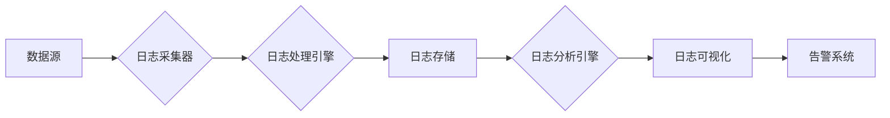

## 1. 背景介绍

### 1.1 AI 系统日志的重要性

在当今数字化时代，人工智能（AI）系统已成为各行各业不可或缺的一部分。从自动驾驶汽车到智能家居，从医疗诊断到金融预测，AI 系统正在改变我们的生活方式。随着 AI 系统复杂性的不断增加，确保其可靠性、可维护性和安全性变得至关重要。而日志管理作为 AI 系统运维的关键环节，在保障系统稳定运行、故障排查、性能优化等方面发挥着重要作用。

### 1.2 日志管理面临的挑战

传统的日志管理方法难以满足 AI 系统的需求。AI 系统通常具有以下特点：

- **数据量大且复杂**: AI 系统通常会产生大量的日志数据，包括训练数据、模型参数、预测结果等，这些数据通常是非结构化的，难以用传统方法进行分析。
- **实时性要求高**: AI 系统的性能和效率至关重要，因此需要实时监控日志数据，以便及时发现问题并采取措施。
- **分布式部署**: AI 系统通常部署在分布式环境中，日志数据分散在不同的节点上，难以集中管理和分析。

### 1.3 AI 系统日志管理的意义

有效的 AI 系统日志管理可以带来以下好处：

- **提高系统可靠性**: 通过实时监控日志数据，可以及时发现系统异常，并采取措施进行修复，从而提高系统的可靠性。
- **优化系统性能**: 通过分析日志数据，可以识别系统瓶颈，并进行优化，从而提高系统的性能和效率。
- **增强系统安全性**: 通过记录用户行为、系统事件等信息，可以及时发现安全漏洞，并采取措施进行防范，从而增强系统的安全性。

## 2. 核心概念与联系

### 2.1 日志数据类型

AI 系统的日志数据可以分为以下几类：

- **系统日志**: 记录系统运行状态、硬件信息、网络连接等信息。
- **应用程序日志**: 记录应用程序的运行状态、用户行为、业务流程等信息。
- **模型训练日志**: 记录模型训练过程中的参数、指标、损失函数等信息。
- **模型预测日志**: 记录模型预测结果、预测时间、置信度等信息。

### 2.2 日志管理系统架构

一个典型的 AI 系统日志管理系统架构如下：



- **数据源**: AI 系统的各个组件，例如应用程序、模型训练平台、模型预测服务等。
- **日志采集器**: 负责从数据源采集日志数据。
- **日志处理引擎**: 负责对日志数据进行清洗、过滤、格式化等操作。
- **日志存储**: 负责存储处理后的日志数据。
- **日志分析引擎**: 负责对日志数据进行分析，提取有价值的信息。
- **日志可视化**: 负责将分析结果以图表、仪表盘等形式展示出来。
- **告警系统**: 负责在发现异常情况时发出告警通知。

### 2.3 日志管理关键技术

- **日志采集**: 采用高效的日志采集工具，例如 Fluentd、Logstash 等，可以实时采集大量的日志数据。
- **日志解析**: 使用正则表达式、日志解析库等工具，可以将非结构化的日志数据解析成结构化数据，方便后续分析。
- **日志存储**: 选择合适的日志存储方案，例如 Elasticsearch、Splunk 等，可以高效地存储和检索大量的日志数据。
- **日志分析**: 使用机器学习、数据挖掘等技术，可以从日志数据中提取有价值的信息，例如异常检测、性能分析、安全审计等。

## 3. 核心算法原理具体操作步骤

### 3.1 日志异常检测算法

日志异常检测是指从日志数据中识别出异常事件的过程。常见的日志异常检测算法包括：

- **基于规则的异常检测**: 通过定义规则，识别出不符合规则的日志事件。
- **基于统计的异常检测**: 通过统计分析，识别出偏离正常模式的日志事件。
- **基于机器学习的异常检测**: 使用机器学习算法，例如聚类、分类等，识别出异常的日志事件。

### 3.2 日志性能分析算法

日志性能分析是指通过分析日志数据，识别系统瓶颈，并进行优化的过程。常见的日志性能分析算法包括：

- **响应时间分析**: 分析系统响应时间，识别出响应时间过长的请求。
- **吞吐量分析**: 分析系统吞吐量，识别出吞吐量过低的组件。
- **资源利用率分析**: 分析系统资源利用率，识别出资源利用率过高的组件。

### 3.3 日志安全审计算法

日志安全审计是指通过分析日志数据，识别出安全漏洞，并采取措施进行防范的过程。常见的日志安全审计算法包括：

- **用户行为分析**: 分析用户行为，识别出异常的用户行为，例如恶意攻击、数据泄露等。
- **系统事件分析**: 分析系统事件，识别出异常的系统事件，例如系统崩溃、服务中断等。

## 4. 数学模型和公式详细讲解举例说明

### 4.1 基于统计的异常检测算法

基于统计的异常检测算法通常使用统计指标来识别异常事件。例如，可以使用平均值和标准差来识别偏离正常模式的日志事件。

**公式**:

```
z-score = (x - μ) / σ
```

其中：

- x：日志事件的值
- μ：平均值
- σ：标准差

如果 z-score 超过预设的阈值，则认为该日志事件是异常的。

**例子**:

假设系统平均响应时间为 100 毫秒，标准差为 10 毫秒。如果某个请求的响应时间为 130 毫秒，则其 z-score 为：

```
z-score = (130 - 100) / 10 = 3
```

如果预设的阈值为 2，则该请求的响应时间被认为是异常的。

### 4.2 基于机器学习的异常检测算法

基于机器学习的异常检测算法通常使用机器学习算法来识别异常事件。例如，可以使用聚类算法将日志事件分成不同的簇，并将不属于任何簇的事件识别为异常事件。

**例子**:

假设我们有以下日志数据：

| 用户名 | 操作 | 时间 |
|---|---|---|
| user1 | 登录 | 2024-05-20 08:00:00 |
| user2 | 浏览商品 | 2024-05-20 08:10:00 |
| user1 | 购买商品 | 2024-05-20 08:20:00 |
| user3 | 登录 | 2024-05-20 08:30:00 |
| user2 | 退出 | 2024-05-20 08:40:00 |
| user3 | 浏览商品 | 2024-05-20 08:50:00 |
| user1 | 退出 | 2024-05-20 09:00:00 |

我们可以使用 K-means 聚类算法将这些日志事件分成不同的簇。假设我们将这些事件分成 2 个簇，则结果如下：

- 簇 1: {user1: 登录, user1: 购买商品, user1: 退出}
- 簇 2: {user2: 浏览商品, user2: 退出, user3: 登录, user3: 浏览商品}

如果有一个新的日志事件：

| 用户名 | 操作 | 时间 |
|---|---|---|
| user4 | 删除商品 | 2024-05-20 09:10:00 |

该事件不属于任何簇，因此被认为是异常事件。

## 5. 项目实践：代码实例和详细解释说明

### 5.1 Python 日志管理库

Python 中有许多优秀的日志管理库，例如 logging、loguru 等。

**logging 库示例**:

```python
import logging

# 创建 logger 对象
logger = logging.getLogger(__name__)

# 设置日志级别
logger.setLevel(logging.DEBUG)

# 创建 handler 对象
file_handler = logging.FileHandler('app.log')

# 创建 formatter 对象
formatter = logging.Formatter('%(asctime)s - %(name)s - %(levelname)s - %(message)s')

# 将 formatter 对象添加到 handler 对象
file_handler.setFormatter(formatter)

# 将 handler 对象添加到 logger 对象
logger.addHandler(file_handler)

# 记录日志信息
logger.debug('This is a debug message')
logger.info('This is an info message')
logger.warning('This is a warning message')
logger.error('This is an error message')
logger.critical('This is a critical message')
```

**loguru 库示例**:

```python
from loguru import logger

# 设置日志文件路径
logger.add('app.log', format='{time} {level} {message}')

# 记录日志信息
logger.debug('This is a debug message')
logger.info('This is an info message')
logger.warning('This is a warning message')
logger.error('This is an error message')
logger.critical('This is a critical message')
```

### 5.2 日志异常检测代码示例

```python
import pandas as pd
from sklearn.cluster import KMeans

# 读取日志数据
df = pd.read_csv('logs.csv')

# 选择特征
features = ['response_time', 'cpu_usage', 'memory_usage']

# 创建 KMeans 模型
kmeans = KMeans(n_clusters=2)

# 训练模型
kmeans.fit(df[features])

# 预测簇标签
labels = kmeans.predict(df[features])

# 识别异常事件
anomalies = df[labels == -1]

# 打印异常事件
print(anomalies)
```

## 6. 实际应用场景

### 6.1 自动驾驶系统

自动驾驶系统需要实时监控车辆状态、环境感知、决策规划等信息，并及时识别异常事件，例如传感器故障、路径规划错误等。日志管理可以帮助自动驾驶系统提高可靠性、安全性和效率。

### 6.2 智能家居系统

智能家居系统需要实时监控设备状态、用户行为等信息，并及时识别异常事件，例如设备故障、入侵检测等。日志管理可以帮助智能家居系统提高安全性、舒适性和便利性。

### 6.3 金融风控系统

金融风控系统需要实时监控交易数据、用户行为等信息，并及时识别异常事件，例如欺诈交易、洗钱行为等。日志管理可以帮助金融风控系统提高安全性、合规性和效率。

## 7. 总结：未来发展趋势与挑战

### 7.1 未来发展趋势

- **云原生日志管理**: 随着云计算的普及，云原生日志管理方案将成为主流，例如 AWS CloudWatch、Azure Monitor 等。
- **AI 驱动的日志管理**: AI 技术将被广泛应用于日志管理，例如异常检测、性能分析、安全审计等。
- **日志数据可视化**: 日志数据可视化工具将更加强大和易用，可以帮助用户更直观地理解日志数据。

### 7.2 面临的挑战

- **海量日志数据的处理**: AI 系统产生的日志数据量巨大，如何高效地处理这些数据是一个挑战。
- **日志数据安全**: 日志数据中包含敏感信息，如何保障日志数据安全是一个挑战。
- **日志管理成本**: 日志管理需要投入大量的资源，如何降低日志管理成本是一个挑战。

## 8. 附录：常见问题与解答

### 8.1 如何选择合适的日志管理工具？

选择合适的日志管理工具需要考虑以下因素：

- **功能**: 工具是否支持所需的日志采集、解析、存储、分析等功能？
- **性能**: 工具的性能是否满足需求？
- **成本**: 工具的成本是否可以接受？
- **易用性**: 工具是否易于使用和维护？

### 8.2 如何提高日志管理效率？

提高日志管理效率可以采取以下措施：

- **优化日志采集**: 采用高效的日志采集工具，并优化采集配置。
- **优化日志解析**: 使用正则表达式、日志解析库等工具，优化日志解析规则。
- **优化日志存储**: 选择合适的日志存储方案，并优化存储配置。
- **优化日志分析**: 使用机器学习、数据挖掘等技术，优化日志分析算法。

### 8.3 如何保障日志数据安全？

保障日志数据安全可以采取以下措施：

- **访问控制**: 限制对日志数据的访问权限。
- **数据加密**: 对敏感日志数据进行加密存储。
- **安全审计**: 定期对日志数据进行安全审计，识别安全漏洞。