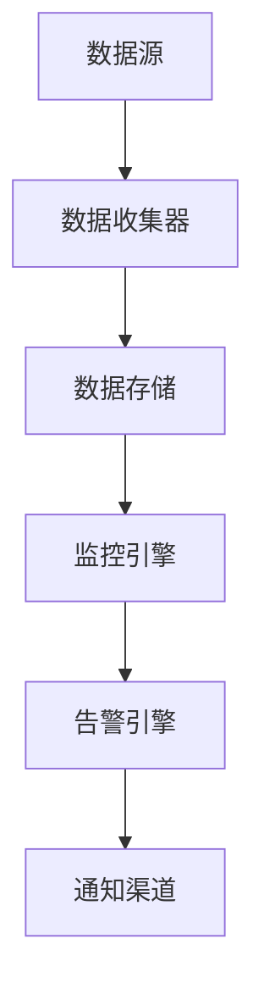

# AI系统监控告警原理与代码实战案例讲解

## 1.背景介绍

### 1.1 系统监控告警的重要性

在当今快节奏的数字时代,确保系统的高可用性和可靠性对于任何组织都至关重要。系统监控告警是一种有效的方式,可以及时发现并解决系统中的问题,从而最大限度地减少系统停机时间和数据丢失。无论是传统的企业应用程序还是现代的人工智能(AI)系统,都需要强大的监控告警功能来确保其稳定运行。

### 1.2 AI系统监控告警的特殊挑战

与传统系统相比,AI系统具有一些独特的特点,给监控告警带来了额外的挑战:

1. **复杂性** - AI模型通常包含数百万甚至数十亿个参数,这使得监控和诊断系统行为变得更加困难。

2. **不确定性** - AI系统的输出通常具有一定的不确定性,这可能会导致意外的行为或结果。

3. **数据驱动** - AI系统高度依赖于大量高质量的训练数据,任何数据质量问题都可能导致系统性能下降。

4. **黑箱特性** - 许多AI模型(如深度神经网络)是难以解释和理解的黑箱,这使得故障诊断和根本原因分析变得更加困难。

5. **动态演化** - AI系统通常需要持续训练以跟上新数据的发展,这可能会导致系统行为随时间发生变化。

### 1.3 监控告警的重要作用

有效的监控告警系统可以为AI系统提供以下关键优势:

1. **提高可靠性** - 通过及时发现和解决问题,可以最大限度地减少系统故障和停机时间。

2. **提高性能** - 监控系统可以帮助识别性能瓶颈,从而优化资源利用并提高系统响应能力。

3. **数据质量保证** -监控输入数据的质量并发出警报,有助于确保AI模型的准确性和一致性。  

4. **模型漂移检测** -随着时间的推移,AI模型的性能可能会下降。监控指标可以帮助及时发现这种情况。

5. **提高透明度** -通过监控和记录系统行为,可以提高AI系统的可解释性和可审计性。

6. **简化故障诊断** -高质量的监控数据可以为根本原因分析和故障诊断提供宝贵的洞察。

7. **支持合规性** -在许多行业中,监控是满足法规和治理要求的关键组成部分。

总的来说,监控告警对于确保AI系统的可靠性、透明度和合规性至关重要。在本文中,我们将探讨AI系统监控告警的核心概念、算法原理、实现技术以及实际应用场景。

## 2.核心概念与联系

在深入探讨AI系统监控告警的细节之前,让我们先了解一些核心概念及其相互关系。

### 2.1 监控(Monitoring)

监控是持续收集有关系统状态和性能的数据的过程。这些数据通常包括各种指标(Metrics)和事件(Events),可以通过各种技术(如日志、探测器、仪表等)来收集。有效的监控需要涵盖系统的各个层面,包括基础设施、应用程序、数据和AI模型本身。

典型的监控数据示例包括:

- **基础设施指标** - CPU利用率、内存使用情况、网络流量等
- **应用程序指标** - 请求率、延迟、错误率等
- **数据指标** - 数据量、数据分布、数据质量等
- **模型指标** - 准确率、损失函数、推理延迟等

### 2.2 告警(Alerting)

告警是基于监控数据根据预定义的规则或条件发出通知的过程。告警的目的是及时发现异常情况,并通知相关人员采取行动。有效的告警需要权衡通知的及时性和噪音水平,以避免过多的误报或遗漏重要事件。

常见的告警方式包括:

- 电子邮件通知
- 短信或即时消息通知
- 控制台/仪表板警报
- 票证系统集成

### 2.3 监控告警系统架构

典型的监控告警系统由以下几个核心组件组成:



1. **数据源** - 可能是应用程序日志、系统指标、数据库、AI模型等。
2. **数据收集器** - 从各种数据源收集监控数据,可以是代理程序或集中式收集器。
3. **数据存储** - 持久化存储监控数据,以供后续分析和查询,通常使用时序数据库。
4. **监控引擎** - 对监控数据进行处理、聚合和可视化,生成各种图表和仪表板。
5. **告警引擎** - 根据预定义的规则或模型评估监控数据,发出相应的告警通知。
6. **通知渠道** - 将告警通知传递给指定的接收者,如电子邮件、短信、webhooks等。

### 2.4 监控指标与维度

为了全面监控AI系统,我们需要收集各种指标(Metrics)。指标通常具有多个维度(Dimensions),以提供更细粒度的视角。

例如,对于一个机器学习模型服务,我们可以监控以下指标:

- 请求率(Requests/Second) - 维度:模型版本、实例ID
- 响应延迟(Latency) - 维度:模型版本、实例ID、请求大小
- 错误率(Error Rate) - 维度:错误类型、模型版本、实例ID
- 模型准确率(Accuracy) - 维度:模型版本、数据集
- 资源利用率(CPU/Memory/GPU) - 维度:实例ID

通过指标和维度的组合,我们可以深入了解系统的行为,并设置精细的告警规则。

## 3.核心算法原理具体操作步骤  

### 3.1 基于阈值的告警

最基本的告警算法是基于阈值的规则。我们定义一个或多个监控指标的阈值,当指标值超过阈值时,系统会触发告警。这种方法简单直观,但需要手动调整阈值以适应不同的场景和时间段。

示例:当CPU利用率超过90%持续5分钟时,触发主机过载告警。

$$
\text{Trigger Alert} = 
\begin{cases}
    \text{True,}& \text{if } \overline{CPU\_Utilization}_{5\min} > 90\% \\
    \text{False,}& \text{otherwise}
\end{cases}
$$

其中$\overline{CPU\_Utilization}_{5\min}$表示过去5分钟内CPU利用率的平均值。

### 3.2 基于模式的告警

除了静态阈值,我们还可以基于历史数据建立监控指标的正常模式,并将异常情况视为告警。这种方法可以自动适应系统的动态变化,但需要足够的历史数据来训练模式。

最常见的模式检测算法是基于统计学的异常值检测,例如基于高斯分布的简单模型:

$$
\begin{aligned}
\mu &= \mathbb{E}[X] \\
\sigma^2 &= \mathbb{V}[X] \\
\text{Score}(x) &= \frac{|x - \mu|}{\sigma}
\end{aligned}
$$

其中$\mu$和$\sigma^2$分别是监控指标$X$的均值和方差,计算自训练数据。如果$\text{Score}(x)$超过预定义的阈值(例如3个标准差),我们就触发异常告警。

更复杂的模式检测算法包括基于机器学习的异常检测、时间序列预测等。

### 3.3 复合告警

在实际应用中,我们通常需要结合多个监控指标和条件来触发告警,这种情况称为复合告警(Compound Alerts)。复合告警规则可以包含布尔运算(AND、OR、NOT)和时间窗口约束。

例如,我们可以定义以下复合告警规则:

当CPU利用率超过90%,且错误率超过5%,且持续时间超过10分钟时,触发严重服务降级告警。

$$
\text{Trigger Alert} = 
\begin{cases}
    \text{True,}& \text{if } \overline{CPU\_Utilization}_{10\min} > 90\% \\ 
    & \textbf{AND} \  \overline{Error\_Rate}_{10\min} > 5\% \\
    \text{False,}& \text{otherwise}
\end{cases}
$$

这种复合告警规则可以更准确地反映系统的实际状态,减少误报的可能性。

### 3.4 基于机器学习的告警

除了基于规则的告警,我们还可以使用机器学习技术自动学习何时应该触发告警。这种方法的优点是可以发现人工规则难以捕捉的复杂模式,但需要大量的历史数据进行训练。

常见的机器学习告警算法包括:

- **监控指标异常检测** - 使用隔离森林、一类支持向量机等算法检测指标值的异常情况。
- **时间序列异常检测** - 使用长短期记忆网络(LSTM)等模型预测未来指标值,并将实际值与预测值的差异视为异常。
- **日志异常检测** - 使用主题模型(如LDA)和Word2Vec等技术对日志消息进行异常检测。

这些算法通过自动从历史数据中学习正常模式,可以发现复杂的异常情况,但需要大量的标记数据用于训练。

### 3.5 自适应告警阈值

无论使用规则还是机器学习算法,静态的告警阈值往往难以应对系统动态变化的需求。一种解决方案是使用自适应阈值算法,根据系统的实时状态动态调整告警阈值。

常见的自适应阈值算法包括:

1. **指数加权移动平均(EWMA)** - 对监控指标值进行指数加权平均,新值的权重大于旧值。告警阈值根据EWMA值和预期范围动态调整。

   $$
   \begin{aligned}
   S_t &= \alpha Y_t + (1-\alpha)S_{t-1} \\
   \text{Upper Bound} &= \mu + k\sigma \\
   \text{Lower Bound} &= \mu - k\sigma
   \end{aligned}
   $$

   其中$S_t$是时间$t$的EWMA值,$\alpha$是平滑系数,$\mu$和$\sigma$是EWMA序列的均值和标准差,$k$是确定上下边界的系数。

2. **季节分解** - 将监控指标分解为趋势、周期和残差分量,并分别对它们设置自适应阈值。这种方法适用于具有明显季节性模式的指标。

3. **机器学习模型** - 使用LSTM等时间序列模型预测未来的指标值及其分布,并根据分布动态调整阈值。

通过自适应阈值,我们可以减少误报和遗漏报警的情况,提高告警系统的可靠性和精准性。

## 4.数学模型和公式详细讲解举例说明

在前一章节中,我们介绍了几种常见的告警算法原理和公式。现在,让我们通过具体的例子来进一步说明这些数学模型在实践中的应用。

### 4.1 基于阈值的告警示例

假设我们正在监控一个Web服务器,并希望在CPU利用率超过90%时触发告警。我们可以使用以下公式:

$$
\text{Trigger Alert} = 
\begin{cases}
    \text{True,}& \text{if } \overline{CPU\_Utilization}_{5\min} > 90\% \\
    \text{False,}& \text{otherwise}
\end{cases}
$$

其中$\overline{CPU\_Utilization}_{5\min}$表示过去5分钟内CPU利用率的平均值。

让我们用Python代码来实现这个简单的阈值告警逻辑:

```python
import statistics

# 模拟CPU利用率数据
cpu_utilization = [80, 85, 92, 88, 95, 91, 93, 87, 90, 94]

# 计算过去5分钟的平均值
window_size = 5
averages = [statistics.mean(cpu_utilization[i:i+window_size]) 
            for i in range(len(cpu_utilization)-window_size+1)]

# 检查是否超过阈值
threshold = 90