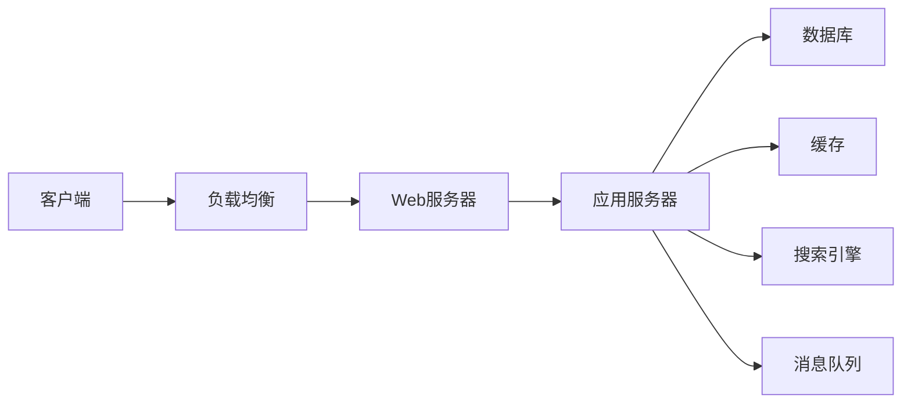

## 1. 背景介绍

### 1.1 电商行业的快速发展与挑战

近年来，随着移动互联网的普及和智能手机的广泛应用，电商行业迎来了爆发式的增长。消费者越来越习惯于通过手机App进行购物，App电商平台也如雨后春笋般涌现。然而，随着业务规模的扩大和用户需求的不断提高，App电商业务系统也面临着诸多挑战：

* **高并发用户访问：** 电商平台促销活动期间，用户访问量会激增，系统需要能够承受高并发访问压力。
* **海量数据处理：** 电商平台积累了大量的商品信息、用户信息、交易数据等，如何高效地存储、管理和分析这些数据成为一大难题。
* **系统复杂性：** 电商业务系统涉及多个子系统，例如商品管理、订单管理、支付系统、物流系统等，系统架构需要合理设计，才能保证各个子系统高效协同工作。
* **安全性要求：** 电商平台涉及用户的资金安全和隐私信息，系统需要具备完善的安全机制，防止数据泄露和恶意攻击。

### 1.2  App电商业务系统架构的重要性

为了应对上述挑战，构建一个高效、稳定、安全的App电商业务系统架构至关重要。一个良好的架构设计能够：

* 提升系统性能，提高用户体验
* 降低系统开发和维护成本
* 增强系统的可扩展性和可维护性
* 提高系统的安全性

## 2. 核心概念与联系

### 2.1  App电商业务系统架构概述

App电商业务系统架构是指系统的整体结构和各个组件之间的关系，它描述了系统如何组织和运作。一个典型的App电商业务系统架构通常包括以下核心组件：

* **客户端:** 用户与系统交互的界面，例如iOS App、Android App、微信小程序等。
* **负载均衡:** 将用户请求分发到多个服务器，提高系统的吞吐量和可用性。
* **Web服务器:** 处理用户请求，并将请求转发给相应的应用服务器。
* **应用服务器:** 处理业务逻辑，例如商品浏览、下单、支付等。
* **数据库:** 存储系统数据，例如商品信息、用户信息、订单信息等。
* **缓存:** 存储 frequently accessed 数据，提高系统响应速度。
* **搜索引擎:** 提供商品搜索功能。
* **消息队列:** 实现异步通信，提高系统效率。

### 2.2  核心组件之间的联系

各个组件之间通过网络进行通信，例如客户端通过HTTP协议向Web服务器发送请求，Web服务器通过RPC协议调用应用服务器的接口，应用服务器通过JDBC连接数据库。



## 3. 核心算法原理具体操作步骤

### 3.1  负载均衡算法

负载均衡算法用于将用户请求分发到多个服务器，常见的负载均衡算法包括：

* **轮询算法:** 将请求依次分配给各个服务器。
* **加权轮询算法:** 根据服务器的权重分配请求，权重高的服务器分配到的请求更多。
* **最少连接算法:** 将请求分配给当前连接数最少的服务器。
* **IP哈希算法:** 根据客户端IP地址的哈希值将请求分配到对应的服务器。

### 3.2  缓存策略

缓存策略用于决定哪些数据需要缓存，以及如何更新缓存，常见的缓存策略包括：

* **缓存穿透:** 查询的数据在数据库中不存在，导致每次请求都会穿透缓存，直接查询数据库。
* **缓存雪崩:** 大量缓存数据同时失效，导致请求直接查询数据库，压垮数据库。
* **缓存击穿:** 热点数据失效，导致大量请求同时查询数据库，压垮数据库。

### 3.3  数据库分库分表

当数据库数据量过大时，需要进行分库分表，将数据分散存储到多个数据库实例中，常见的数据库分库分表策略包括：

* **水平分表:** 将数据按照某个字段的值进行划分，例如按照用户ID进行分表。
* **垂直分表:** 将不同类型的数据存储到不同的表中，例如将用户信息和订单信息存储到不同的表中。

## 4. 数学模型和公式详细讲解举例说明

### 4.1  Little's Law

Little's Law 是排队论中的一个重要定律，它描述了系统中平均队列长度、平均到达率和平均服务时间之间的关系：

$$
L = \lambda W
$$

其中：

* L 表示平均队列长度
* λ 表示平均到达率
* W 表示平均服务时间

**举例说明:**

假设一个电商平台的平均每秒有 100 个用户访问，每个用户请求的平均处理时间为 0.1 秒，则根据 Little's Law 可以计算出系统中平均有 10 个用户请求在排队等待处理。

### 4.2  Amdahl's Law

Amdahl's Law 描述了通过并行计算能够提升系统性能的极限：

$$
S = \frac{1}{(1-P) + \frac{P}{N}}
$$

其中：

* S 表示加速比
* P 表示可并行化的部分占 전체 프로그램의 비율
* N 表示处理器核心数量

**举例说明:**

假设一个电商平台的商品搜索功能可以并行化处理，可并行化的部分占 전체 프로그램의 50%，使用 4 个处理器核心进行并行计算，则根据 Amdahl's Law 可以计算出加速比为 1.67，也就是说性能提升了 67%。

## 5. 项目实践：代码实例和详细解释说明

### 5.1  Spring Boot 构建 RESTful API

```java
@RestController
@RequestMapping("/api/products")
public class ProductController {

    @Autowired
    private ProductService productService;

    @GetMapping("/{id}")
    public Product getProductById(@PathVariable Long id) {
        return productService.getProductById(id);
    }

    @PostMapping
    public Product createProduct(@RequestBody Product product) {
        return productService.createProduct(product);
    }
}
```

### 5.2  Redis 缓存商品信息

```java
@Service
public class ProductServiceImpl implements ProductService {

    @Autowired
    private ProductRepository productRepository;

    @Autowired
    private RedisTemplate redisTemplate;

    @Override
    public Product getProductById(Long id) {
        // 先从缓存中获取商品信息
        Product product = (Product) redisTemplate.opsForValue().get("product:" + id);
        if (product != null) {
            return product;
        }

        // 如果缓存中不存在，则从数据库中查询
        product = productRepository.findById(id).orElse(null);

        // 将商品信息写入缓存
        if (product != null) {
            redisTemplate.opsForValue().set("product:" + id, product);
        }

        return product;
    }
}
```

## 6. 实际应用场景

### 6.1  大型电商平台

大型电商平台例如淘宝、京东、拼多多等，需要处理海量的用户请求和数据，因此需要构建高性能、高可用的业务系统架构。

### 6.2  中小电商平台

中小电商平台业务规模相对较小，可以采用轻量级的架构设计，例如使用云服务构建系统。

### 6.3  社交电商平台

社交电商平台例如小红书、抖音等，需要整合社交功能和电商功能，因此需要设计灵活的架构方案。

## 7. 总结：未来发展趋势与挑战

### 7.1  云原生架构

云原生架构是未来电商业务系统架构的发展趋势，它利用云计算的优势，例如弹性伸缩、按需付费等，构建更加灵活、高效的系统。

### 7.2  微服务架构

微服务架构将系统拆分成多个小型服务，每个服务独立开发、部署和维护，提高了系统的可扩展性和可维护性。

### 7.3  人工智能技术应用

人工智能技术可以应用于电商业务系统的各个环节，例如商品推荐、智能客服、风险控制等，提高系统的智能化水平。

## 8. 附录：常见问题与解答

### 8.1  如何选择合适的负载均衡算法？

选择负载均衡算法需要考虑以下因素：

* **服务器性能:** 不同服务器的性能差异较大，需要根据服务器性能选择合适的算法。
* **网络状况:** 网络延迟和带宽会影响负载均衡效果，需要根据网络状况选择合适的算法。
* **业务特点:** 不同业务对负载均衡的要求不同，例如实时性要求高的业务需要选择低延迟的算法。

### 8.2  如何解决缓存穿透问题？

解决缓存穿透问题的方法包括：

* **缓存空值:** 将查询不到的数据也缓存起来，设置较短的过期时间。
* **布隆过滤器:** 使用布隆过滤器判断数据是否存在，如果不存在则直接返回空。

### 8.3  如何进行数据库性能优化？

数据库性能优化的方法包括：

* **索引优化:** 创建合适的索引，提高查询效率。
* **SQL优化:** 编写高效的SQL语句，减少数据库访问次数。
* **数据库参数调优:** 调整数据库参数，例如缓存大小、连接池大小等，提高数据库性能。
