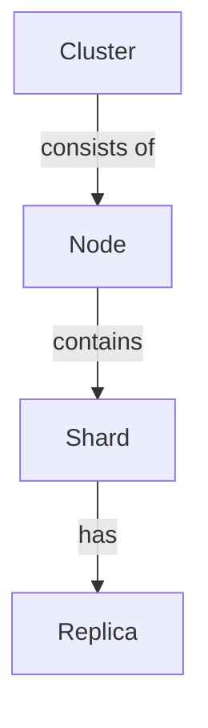

## 1.背景介绍
在现代大数据环境下，信息量的爆炸性增长使得数据存储和检索面临巨大的挑战。为了解决这个问题，ElasticSearch应运而生。它是一个基于Lucene的开源搜索服务器。ElasticSearch提供了一个分布式多用户能力的全文搜索引擎，基于RESTful web接口。ElasticSearch是用Java开发的，并作为Apache许可条款下的开放源码发布，能够实时搜索，稳定，可靠，快速，安装使用方便。

ElasticSearch的特点之一是其分布式特性，数据在集群间自动进行分片处理，还可以在这些分片之间进行复制以防止数据丢失。本文就将围绕ElasticSearch的Shard机制做详细的探讨和实例解析。

## 2.核心概念与联系
在深入探讨Shard机制之前，我们首先要理解几个核心概念。

### 2.1 分片（Shard）
在ElasticSearch中，索引数据可以分为多个分片，这些分片可以分布在集群的多个节点上，每个分片都是索引数据的一部分。通过分片，ElasticSearch可以水平扩展存储数据，提高并发读写的性能。

### 2.2 副本（Replica）
副本是分片的完整复制品，它可以保证在分片出现问题时，数据不会丢失。同时，副本还可以处理读取请求，提高读取性能。

### 2.3 节点（Node）
节点是ElasticSearch集群中的一个服务器，用于存储分片，处理数据的索引和搜索。

### 2.4 集群（Cluster）
集群是由多个节点组成的，节点间可以分布在不同的服务器或数据中心，集群负责协调节点间的工作和资源管理。

这些概念之间的关系图可以用Mermaid流程图来表示：



## 3.核心算法原理具体操作步骤
ElasticSearch的Shard机制包括两个核心操作：分片和复制。

### 3.1 分片
当一个索引创建时，可以指定它的分片数量。这个数目在索引创建后不能更改。分片后的数据可以分布在集群的所有节点上，当集群的节点数量变化时，ElasticSearch会自动对分片进行重新分布，保证数据的均衡存储。

### 3.2 复制
每个分片可以有零个或多个副本，副本可以在分片出现问题时提供数据的恢复。副本的数量可以在索引创建后随时更改。

## 4.数学模型和公式详细讲解举例说明
在ElasticSearch中，数据的分片和复制是一个涉及到负载均衡和数据可用性的重要问题。我们可以通过数学模型来理解这个问题。

假设我们的数据量为$D$，我们的集群有$N$个节点，每个索引的分片数量为$S$，每个分片的副本数量为$R$。那么，每个节点需要存储的数据量为：

$$
D_{node} = \frac{D \times (1 + R)}{S}
$$

这个公式说明，随着分片数量的增加，每个节点需要存储的数据量会减少，但同时，分片的复制会增加存储的数据量。因此，选择合适的分片数量和副本数量，对于实现负载均衡和数据可用性至关重要。

## 4.项目实践：代码实例和详细解释说明
让我们通过一个简单的例子来看一下如何在ElasticSearch中设置分片和副本。

首先，我们创建一个名为"my_index"的索引，并设置分片数量为3，副本数量为2。

```bash
PUT /my_index
{
  "settings" : {
    "number_of_shards" : 3,
    "number_of_replicas" : 2
  }
}
```

然后，我们可以通过下面的命令来查看索引的设置：

```bash
GET /my_index/_settings
```

输出的结果会显示索引的分片数量和副本数量：
```json
{
  "my_index" : {
    "settings" : {
      "index" : {
        "number_of_shards" : "3",
        "number_of_replicas" : "2"
      }
    }
  }
}
```

## 5.实际应用场景
ElasticSearch的Shard机制被广泛应用在各种需要处理大量数据的场景下，包括：

- 日志分析：通过分片，可以将大量的日志数据进行分布式存储和处理，提高日志分析的效率。
- 全文搜索：通过分片和副本，可以提高全文搜索的性能和可用性。
- 实时数据分析：通过分片，可以对实时产生的大量数据进行快速处理和分析。

## 6.工具和资源推荐
ElasticSearch提供了许多工具和资源来帮助我们理解和使用Shard机制，包括：

- ElasticSearch官方文档：详细介绍了ElasticSearch的所有特性和用法，是最权威的参考资源。
- ElasticSearch in Action：这本书详细介绍了ElasticSearch的用法和原理，包括Shard机制。
- ElasticSearch-head和ElasticSearch-kopf：这两个插件提供了ElasticSearch的图形界面，可以帮助我们更直观地理解和操作ElasticSearch。

## 7.总结：未来发展趋势与挑战
随着数据量的不断增长，数据的存储和检索将面临更大的挑战。ElasticSearch的Shard机制为解决这个问题提供了强大的工具，但同时也带来了新的挑战，包括如何选择合适的分片数量和副本数量，如何处理大量分片的管理和调度等问题。未来，我们期待有更多的研究和工具来帮助我们更好地利用ElasticSearch的Shard机制。

## 8.附录：常见问题与解答
1. **问：我可以在索引创建后改变分片数量吗？**
   
   答：不可以。分片数量在索引创建时设置，之后不能更改。

2. **问：我可以在索引创建后改变副本数量吗？**
   
   答：可以。副本数量可以在任何时候更改。

3. **问：更多的分片意味着更好的性能吗？**
   
   答：不一定。更多的分片可以提高数据的并发读写性能，但同时也会增加管理分片的开销。因此，选择合适的分片数量需要根据具体的应用场景来决定。
