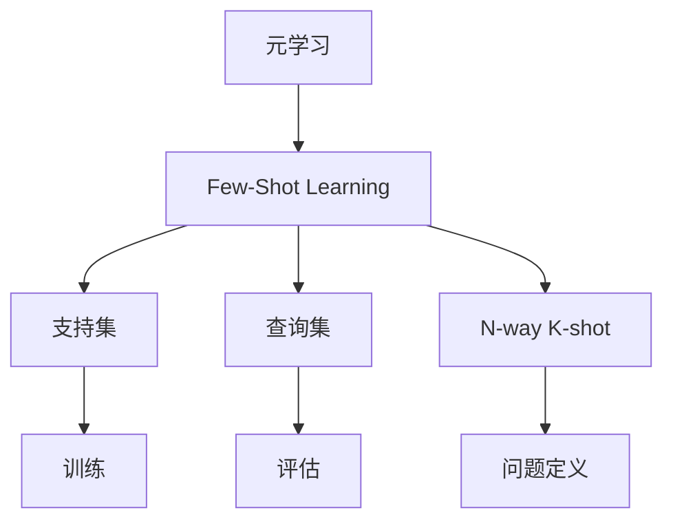

# Few-Shot Learning 原理与代码实例讲解

作者：禅与计算机程序设计艺术

## 1. 背景介绍
### 1.1 Few-Shot Learning的定义与挑战
Few-Shot Learning(少样本学习)是指在只有少量标记样本的情况下进行机器学习的一种方法。与传统的深度学习方法不同,Few-Shot Learning旨在通过很少的训练样本就能快速学习新的任务,这对于现实世界中许多应用场景具有重要意义。Few-Shot Learning面临的主要挑战包括:
- 如何在小样本条件下避免过拟合
- 如何高效地从少量样本中提取泛化能力强的特征表示  
- 如何设计合适的优化目标函数和学习策略

### 1.2 Few-Shot Learning的研究意义
Few-Shot Learning的研究对于推动人工智能在实际应用中的落地具有重要意义:

1. 降低人工标注成本:在许多领域获取大量标注数据非常昂贵,Few-Shot Learning可以大幅降低人工标注成本。

2. 提高模型的泛化和适应能力:通过学习如何从少量样本中快速学习,模型可以更好地适应新的任务和环境。

3. 赋能长尾应用:现实世界存在大量小样本的应用场景,Few-Shot Learning使得AI技术在这些领域成为可能。

### 1.3 Few-Shot Learning的发展历程
Few-Shot Learning方法大致经历了以下几个发展阶段:

1. 基于度量学习的方法:通过学习一个度量空间,使得相同类别的样本距离尽可能近,不同类别的样本距离尽可能远。代表工作如Matching Networks, Prototypical Networks等。

2. 基于元学习的方法:通过元学习让模型学会如何快速适应新任务,代表工作如MAML, Reptile等。 

3. 基于数据增强的方法:通过数据增强扩充小样本数据集,代表工作如MetaGAN, DAGAN等。

4. 基于外部记忆的方法:通过引入外部记忆模块来存储和检索小样本信息,代表工作如Meta Networks, SNAIL等。

## 2. 核心概念与联系
### 2.1 核心概念
- 支持集(Support Set):用于学习的少量标记样本集合。
- 查询集(Query Set):用于评估模型泛化性能的样本集合。
- N-way K-shot:一种Few-Shot Learning问题设置,每个任务有N个类别,每个类别有K个样本。
- 元学习(Meta Learning):又称为"学会学习",通过在一系列任务上的训练来学习快速适应新任务的能力。

### 2.2 核心概念之间的联系
下图展示了Few-Shot Learning的核心概念之间的关系:



元学习是实现Few-Shot Learning的重要手段,通过元学习,模型可以在支持集上快速学习,并在查询集上进行评估。N-way K-shot定义了Few-Shot Learning问题的形式。

## 3. 核心算法原理与步骤
### 3.1 Prototypical Networks
Prototypical Networks是一种基于度量学习的Few-Shot Learning算法,其核心思想是学习一个度量空间,使得每个类别的样本聚集在一个原型向量周围。

#### 算法步骤
1. 将支持集中每个类别的样本通过神经网络编码器映射到嵌入空间。
2. 对每个类别,计算其样本嵌入向量的均值作为原型向量。
3. 对于查询集中的每个样本,计算其与各个原型向量的距离,并根据距离进行分类。
4. 通过最小化查询集上的分类损失来训练神经网络编码器。

### 3.2 MAML
MAML (Model-Agnostic Meta-Learning)是一种基于优化的元学习算法,其目标是学习一个适合快速微调的模型初始化参数。

#### 算法步骤 
1. 随机初始化一个神经网络模型。
2. 在每个训练任务上:
   - 用支持集对模型进行几步梯度下降,得到任务特定的模型参数。
   - 用查询集计算任务损失,并通过二阶优化更新初始模型参数。
3. 重复步骤2直到收敛,学习到一个适合快速适应新任务的初始模型参数。
4. 在测试时,用支持集对初始模型进行几步梯度下降,得到适应后的任务特定模型。

## 4. 数学模型与公式详解
### 4.1 Prototypical Networks的数学模型
假设嵌入空间为$\mathcal{E}$,原型向量为$\mathbf{c}_k$,查询样本为$\mathbf{x}$,则样本$\mathbf{x}$属于类别$k$的概率为:

$$p(y=k|\mathbf{x})=\frac{\exp(-d(\mathbf{x},\mathbf{c}_k))}{\sum_{k'}\exp(-d(\mathbf{x},\mathbf{c}_{k'}))}$$

其中$d(\cdot,\cdot)$是嵌入空间$\mathcal{E}$上的距离度量,通常选择欧氏距离或余弦距离。

原型向量$\mathbf{c}_k$的计算公式为:

$$\mathbf{c}_k=\frac{1}{|S_k|}\sum_{(\mathbf{x}_i,y_i)\in S_k}f_{\phi}(\mathbf{x}_i)$$

其中$S_k$是类别$k$的支持集,$f_{\phi}$是参数为$\phi$的神经网络编码器。

### 4.2 MAML的数学模型
假设任务$\mathcal{T}_i$的支持集为$\mathcal{D}^{tr}_i$,查询集为$\mathcal{D}^{ts}_i$,损失函数为$\mathcal{L}$,模型参数为$\theta$,学习率为$\alpha$,则MAML的目标是最小化查询集上的损失:

$$\min_{\theta}\sum_{\mathcal{T}_i \sim p(\mathcal{T})} \mathcal{L}_{\mathcal{D}^{ts}_i}(f_{\theta_i'})$$

其中$\theta_i'$是经过支持集微调后的参数:

$$\theta_i'=\theta-\alpha \nabla_{\theta}\mathcal{L}_{\mathcal{D}^{tr}_i}(f_{\theta})$$

MAML通过二阶优化来更新初始参数$\theta$:

$$\theta \leftarrow \theta-\beta \nabla_{\theta}\sum_{\mathcal{T}_i \sim p(\mathcal{T})} \mathcal{L}_{\mathcal{D}^{ts}_i}(f_{\theta_i'})$$

其中$\beta$是元学习率。

## 5. 代码实例与详解
### 5.1 Prototypical Networks in PyTorch
下面是一个简单的Prototypical Networks的PyTorch实现:

```python
import torch
import torch.nn as nn
import torch.nn.functional as F

class Protonet(nn.Module):
    def __init__(self, encoder):
        super(Protonet, self).__init__()
        self.encoder = encoder
    
    def forward(self, support_x, support_y, query_x):
        # 编码支持集和查询集样本
        support_z = self.encoder(support_x)
        query_z = self.encoder(query_x)
        
        # 计算原型向量
        prototypes = torch.zeros(max(support_y)+1, support_z.shape[-1])
        for c in range(max(support_y)+1):
            prototypes[c] = support_z[support_y == c].mean(dim=0)
        
        # 计算查询样本与原型向量的距离
        dists = euclidean_dist(query_z, prototypes)
        
        # 计算查询样本的类别概率
        log_p_y = F.log_softmax(-dists, dim=1)
        return log_p_y
    
def euclidean_dist(x, y):
    n = x.size(0)
    m = y.size(0)
    d = x.size(1)
    x = x.unsqueeze(1).expand(n, m, d)
    y = y.unsqueeze(0).expand(n, m, d)
    return torch.pow(x - y, 2).sum(2)
```

### 5.2 代码解释
- `Protonet`类定义了Prototypical Networks模型,包含一个编码器`encoder`。
- `forward`方法接受支持集样本`support_x`、支持集标签`support_y`和查询集样本`query_x`,输出查询样本的类别概率。
- 首先用编码器对支持集和查询集进行特征提取,得到嵌入向量`support_z`和`query_z`。
- 然后对每个类别计算原型向量,即该类别样本嵌入向量的均值。
- 接着计算查询样本与各个原型向量的欧氏距离`dists`。
- 最后通过softmax函数将距离转化为类别概率。
- `euclidean_dist`函数用于计算两组向量之间的欧氏距离矩阵。

## 6. 实际应用场景
Few-Shot Learning在以下应用场景中具有广阔的应用前景:

1. 医学影像分析:医学影像数据标注成本高昂,Few-Shot Learning可以利用少量标记数据快速适应新的疾病诊断任务。

2. 人脸识别:Few-Shot Learning可以通过少量样本快速学习新的人脸身份,适用于小样本的人脸识别场景。

3. 机器人控制:通过Few-Shot Learning,机器人可以从少量演示中快速学习新的操作技能,实现灵活适应。 

4. 推荐系统:利用Few-Shot Learning可以根据用户的少量反馈快速适应用户兴趣,提供个性化推荐。

5. 语音识别:Few-Shot Learning可以利用少量标记数据快速适应新的语者和口音,提高语音识别的泛化能力。

## 7. 工具与资源推荐
- PyTorch官方Few-Shot Learning教程:https://pytorch.org/tutorials/intermediate/few_shot_learning_tutorial.html
- Torchmeta:PyTorch的Few-Shot Learning扩展库:https://github.com/tristandeleu/pytorch-meta 
- Keras官方Few-Shot Learning示例:https://keras.io/examples/vision/reptile/
- 论文列表:https://github.com/Duan-JM/awesome-papers-fewshot
- 数据集:mini-ImageNet, Omniglot, CUB-200等。

## 8. 总结与展望
### 8.1 总结
本文全面介绍了Few-Shot Learning的背景、核心概念、主要算法、数学模型、代码实现以及应用场景。Few-Shot Learning通过从少量样本中快速学习的能力,有望解决现实世界中小样本学习的难题,大大拓展机器学习的应用边界。

### 8.2 未来发展趋势与挑战
Few-Shot Learning未来的研究方向和挑战包括:

1. 进一步提高小样本下的泛化和鲁棒性。
2. 探索更高效的元学习范式如无梯度优化等。
3. 研究Few-Shot Learning与持续学习、迁移学习等范式的结合。
4. 扩展到更多任务如Few-Shot Detection, Few-Shot Segmentation等。
5. 探索更加通用和可解释的Few-Shot Learning框架。

总之,Few-Shot Learning作为一个新兴的研究领域,仍然存在许多开放性的问题有待进一步探索,相信未来会有更多令人兴奋的突破。

## 9. 附录:常见问题解答
### 9.1 Few-Shot Learning与传统监督学习有何区别?
传统监督学习需要大量标记数据进行训练,而Few-Shot Learning旨在从少量样本中快速学习,具有更强的小样本学习能力和泛化能力。

### 9.2 Few-Shot Learning与迁移学习有何区别?
迁移学习侧重于将知识从源域迁移到目标域,而Few-Shot Learning更加关注从少量样本中快速学习的能力,两者侧重点不同但可以结合。

### 9.3 MAML与Reptile等元学习算法有何区别?
MAML通过二阶优化学习初始化参数,而Reptile等算法通过一阶优化来更新初始化参数,后者通常更加简单和高效。

### 9.4 基于度量学习和基于优化的Few-Shot Learning方法各有何优缺点?
基于度量学习的方法关注表示学习,模型简单但特征表示能力有限;基于优化的方法关注快速适应能力,特征表示更加灵活但优化难度较大。

### 9.5 如何选择合适的Few-Shot Learning算法?
可以综合考虑