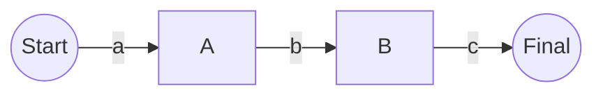

# Flink CEP原理与代码实例讲解

## 1. 背景介绍

### 1.1 复杂事件处理概述

在当今数据驱动的世界中,我们经常需要从大量的数据流中识别出有意义的事件模式或情况。这就是复杂事件处理(Complex Event Processing,CEP)的用武之地。CEP是一种分析实时数据流的技术,旨在识别出数据流中的有趣事件或事件模式,并对这些事件采取相应的行动。

CEP的应用场景非常广泛,例如:

- 金融服务业:检测欺诈行为、交易模式等
- 物联网(IoT):监控传感器数据以检测异常情况
- 网络安全:识别恶意入侵模式
- 运营智能:监控业务指标和关键绩效指标(KPI)
- 客户体验管理:分析用户行为以提供个性化服务

### 1.2 Apache Flink与CEP

[Apache Flink](https://flink.apache.org/)是一个开源的分布式流处理框架,可以高效地对无界数据流进行状态计算。Flink提供了一个名为FlinkCEP的库,用于在Flink作业中实现复杂事件处理。

FlinkCEP允许你定义模式,并将这些模式应用于数据流,以便识别出符合模式的事件序列。当检测到匹配的事件序列时,就会调用用户定义的函数对这些事件执行进一步处理。

在本文中,我们将深入探讨FlinkCEP的原理和使用方式,并通过实际代码示例来加深理解。

## 2. 核心概念与联系

在深入研究FlinkCEP的细节之前,让我们先了解一些核心概念。

### 2.1 事件(Event)

在CEP中,事件是指数据流中的一个数据记录或消息。事件通常包含一些元数据,例如时间戳、事件类型等。在Flink中,事件可以是任何数据类型,只要它们实现了序列化和反序列化的接口。

### 2.2 模式(Pattern)

模式是用于描述感兴趣的事件序列的规则集合。FlinkCEP提供了一种模式API,允许你使用各种模式运算符(如连续、严格连续等)来定义复杂的事件模式。

下面是一些常见的模式运算符:

- 严格连续(Strict Contiguity): `next`和`followedBy`
- 宽松连续(Relaxed Contiguity): `followedByAny`
- 非确定性宽松连续(Non-Deterministic Relaxing): `followedByAny`
- 时间约束: `within`

### 2.3 模式流(Pattern Stream)

模式流是一种特殊类型的数据流,其中的每个元素都是一个检测到的模式序列。当模式被应用于输入流时,FlinkCEP会生成一个模式流,其中包含所有匹配的事件序列。

### 2.4 PatternStream和DataStream的关系

PatternStream继承自DataStream,因此你可以在PatternStream上应用常规的DataStream转换操作(如map、flatMap等)。这使得我们可以对检测到的模式序列执行进一步的处理和分析。

```java
DataStream<Event> input = ...
PatternStream<Event> patternStream = CEP.pattern(input, pattern);
DataStream<Alert> alerts = patternStream
    .flatMap(new PatternFlatMapFunction<Event, Alert>() {...});
```

上面的代码示例展示了如何将输入DataStream转换为PatternStream,然后在PatternStream上应用flatMap操作来生成警报数据流。

## 3. 核心算法原理具体操作步骤 

现在让我们深入探讨FlinkCEP的核心算法原理和具体操作步骤。

### 3.1 NFA(非确定有限状态自动机)

FlinkCEP的模式匹配算法基于NFA(非确定有限状态自动机)。NFA是一种用于识别给定模式的计算模型。

在FlinkCEP中,NFA由以下几个组件组成:

- 状态(State):表示模式匹配的当前进度
- 转移函数(Transition Function):定义了在给定输入事件时,如何从一个状态转移到另一个状态
- 起始状态(Start State):初始状态
- 最终状态(Final State):表示模式已完全匹配的状态

当事件到达时,NFA会根据转移函数更新其当前状态。如果达到最终状态,则表示模式已被成功匹配。

### 3.2 状态迁移

让我们通过一个简单的示例来理解NFA在FlinkCEP中的工作原理。假设我们有以下模式:

```
pattern = start.next("a").next("b").next("c")
```

该模式匹配连续的事件序列"a b c"。下图展示了相应的NFA:



1. 初始状态为`S`
2. 当事件`a`到达时,NFA从`S`转移到`A`
3. 当事件`b`到达时,NFA从`A`转移到`B`
4. 当事件`c`到达时,NFA从`B`转移到`C`(最终状态)
5. 如果在任何状态下接收到不匹配的事件,NFA将保持在当前状态

需要注意的是,NFA可以同时存在于多个状态,这使得它能够处理模式的部分匹配情况。

### 3.3 内存管理

由于FlinkCEP需要维护大量的状态信息,因此内存管理是一个关键问题。Flink采用了以下几种策略来优化内存使用:

1. **状态共享**:相同的事件序列共享同一个NFA实例,从而节省内存
2. **垃圾回收**:定期清理那些永远不可能匹配的NFA实例
3. **状态有效期**:通过设置事件的有效期来限制NFA实例的生命周期

### 3.4 性能优化

为了提高FlinkCEP的性能,Flink采用了以下几种优化策略:

1. **并行处理**:利用Flink的分布式执行引擎,可以在多个节点上并行执行模式匹配
2. **增量计算**:只处理新到达的事件,避免重复计算
3. **代码生成**:为常见的模式生成高度优化的代码,以提高匹配效率

## 4. 数学模型和公式详细讲解举例说明

在介绍FlinkCEP的数学模型和公式之前,让我们先了解一些基本概念。

### 4.1 事件流

我们将事件流表示为一个有序的事件序列$E = \{e_1, e_2, \dots, e_n\}$,其中$e_i$表示第$i$个事件。每个事件$e_i$都有一个相关的时间戳$t_i$。

### 4.2 模式语法

FlinkCEP采用一种类似于正则表达式的语法来定义模式。一个模式$P$由以下元素构成:

- 单个事件类型,如`"a"`
- 模式序列运算符,如`next`、`followedBy`等
- 量词,如`?`(可选)、`*`(0次或多次)、`+`(1次或多次)
- 括号`()`用于分组

例如,模式`"a" \ "b"\ +\ "c"\ ?`匹配形式为`a b+ c?`的事件序列,其中`b`可以出现一次或多次,`c`是可选的。

### 4.3 模式匹配

给定一个事件流$E$和一个模式$P$,我们需要找到所有与$P$匹配的事件子序列。形式上,我们定义一个匹配函数$match(E, P)$,它返回一个匹配的事件子序列集合$M$:

$$
M = match(E, P) = \{(e_{i_1}, e_{i_2}, \dots, e_{i_k}) \in E^k \mid (e_{i_1}, e_{i_2}, \dots, e_{i_k}) \text{ matches } P\}
$$

其中$k$是匹配序列的长度,它取决于模式$P$的长度和量词。

FlinkCEP使用NFA(非确定有限状态自动机)来实现模式匹配算法。对于给定的模式$P$,NFA构造了一个状态转移图$G = (Q, \Sigma, \delta, q_0, F)$,其中:

- $Q$是状态集合
- $\Sigma$是事件类型集合(输入字母表)
- $\delta: Q \times \Sigma \rightarrow 2^Q$是转移函数
- $q_0 \in Q$是起始状态
- $F \subseteq Q$是最终状态集合

在匹配过程中,NFA从起始状态$q_0$开始,并根据输入事件序列$E$和转移函数$\delta$进行状态转移。如果NFA到达了最终状态$q_f \in F$,则表示找到了一个匹配序列。

### 4.4 时间约束

在许多情况下,我们需要在模式中加入时间约束,例如"事件A必须在10秒内紧跟着事件B"。FlinkCEP支持使用`within`子句来指定时间约束。

假设我们有一个模式$P$,其中包含一个时间约束$\tau$,即$P = Q\ within\ \tau$,其中$Q$是不包含时间约束的模式。我们定义一个时间约束匹配函数$match_\tau(E, P)$,它返回在时间窗口$\tau$内匹配的事件子序列集合:

$$
M_\tau = match_\tau(E, P) = \{(e_{i_1}, e_{i_2}, \dots, e_{i_k}) \in M \mid t_{i_k} - t_{i_1} \leq \tau\}
$$

其中$M = match(E, Q)$是不考虑时间约束的匹配结果集合。

在FlinkCEP的实现中,时间约束是通过维护一个"有效窗口"来实现的。对于每个部分匹配的NFA实例,FlinkCEP会记录最早事件的时间戳,并在时间窗口$\tau$过期时清理该实例。

## 4. 项目实践:代码实例和详细解释说明

在理解了FlinkCEP的原理之后,让我们通过代码示例来学习如何在Flink作业中使用CEP库。

### 4.1 定义模式

首先,我们需要定义感兴趣的事件模式。下面的代码展示了如何使用FlinkCEP的模式API来定义一个模式:

```java
import org.apache.flink.cep.PatternStream;
import org.apache.flink.cep.pattern.Pattern;
import org.apache.flink.cep.pattern.conditions.SimpleCondition;

import static org.apache.flink.cep.pattern.Pattern.*;

DataStream<Event> input = ...

Pattern<Event, ?> pattern = begin("start")
    .where(SimpleCondition.of(value -> value.getId() == 42))
    .next("middle")
    .where(SimpleCondition.of(value -> value.getPrice() > 10.0))
    .followedBy("end")
    .where(SimpleCondition.of(value -> value.getName().startsWith("foo")))
    .within(Time.seconds(10));
```

在上面的例子中,我们定义了一个模式,它匹配以下事件序列:

1. 第一个事件的ID为42
2. 接下来是一个价格大于10.0的事件
3. 最后是一个名称以"foo"开头的事件
4. 整个事件序列必须在10秒内发生

`begin`、`next`、`followedBy`和`within`是FlinkCEP提供的模式运算符。`where`子句用于指定事件必须满足的条件。

### 4.2 应用模式

定义好模式之后,我们需要将其应用于输入数据流,以生成一个PatternStream。

```java
PatternStream<Event> patternStream = CEP.pattern(input, pattern);
```

`CEP.pattern`方法将输入数据流`input`和模式`pattern`作为参数,并返回一个PatternStream。

### 4.3 处理匹配结果

现在,我们可以对PatternStream执行进一步的处理,例如提取匹配的事件序列,或者根据匹配结果执行自定义操作。

```java
DataStream<Alert> alerts = patternStream
    .flatSelect(
        (pattern, flatMapper) -> {
            flatMapper.flatMap(
                pattern.get("start").get(0),
                pattern.get("middle").get(0),
                pattern.get("end").get(0),
                (start, middle, end) -> Collections.singletonList(
                    new Alert(start, middle, end)
                )
            );
        }
    );
```

在上面的代码中,我们使用`flatSelect`方法来提取匹配的事件序列,并将它们转换为`Alert`对象。`flatMap`函数接收三个参数,分别对应模式中的"start"、"middle"和"end"事件。我们使用这些事件创建一个`Alert`对象,并