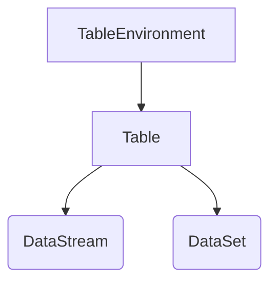

## 1. 背景介绍

### 1.1 大数据处理的演变与挑战

随着互联网和移动互联网的快速发展，全球数据量呈现爆炸式增长，大数据处理技术也随之不断演进。从早期的 Hadoop 生态系统到 Spark、Flink 等新一代分布式计算引擎，大数据处理能力不断提升，但同时也面临着新的挑战：

* **数据多样性:** 数据来源和格式日益多样化，包括结构化、半结构化和非结构化数据，需要更灵活的数据处理方式。
* **实时性需求:** 越来越多的应用场景需要实时或近实时的数据处理能力，例如实时数据分析、风险控制、欺诈检测等。
* **易用性与效率:** 大数据处理技术需要更加易用和高效，降低开发和维护成本，提高数据处理效率。

### 1.2 Flink Table API的诞生背景

为了应对上述挑战，Apache Flink 推出了 Table API 和 SQL，旨在提供一种统一的、声明式的 API，用于处理批处理和流式数据。Flink Table API 具有以下优势：

* **统一的API:**  可以使用相同的 API 处理批处理和流式数据，简化开发流程。
* **声明式编程:**  用户只需要声明想要执行的操作，而无需关心底层的执行细节，提高开发效率。
* **可扩展性:**  Flink Table API 支持自定义函数和聚合函数，可以方便地扩展功能。

## 2. 核心概念与联系

### 2.1 Table & TableEnvironment

* **Table:**  Table 是 Flink Table API 中的核心概念，表示一个逻辑视图，可以是批处理数据或流式数据。
* **TableEnvironment:**  TableEnvironment 是 Table API 的入口点，用于创建和执行 Table API 程序。

### 2.2 DataStream & DataSet

* **DataStream:**  Flink 中用于处理流式数据的 API。
* **DataSet:**  Flink 中用于处理批处理数据的 API。

### 2.3 关系与联系

下图展示了 Flink Table API 与 DataStream/DataSet 之间的关系：



### 2.4 Table API 操作

Flink Table API 提供了丰富的操作，包括：

* **关系代数操作:**  例如 select、filter、join、groupBy 等。
* **聚合操作:**  例如 sum、avg、count、max、min 等。
* **窗口操作:**  例如 tumbling window、sliding window、session window 等。
* **自定义函数:**  用户可以自定义标量函数和聚合函数，扩展 Table API 的功能。

## 3. 核心算法原理具体操作步骤

### 3.1 创建 TableEnvironment

首先，需要创建一个 TableEnvironment 对象，作为 Table API 的入口点：

```java
// 创建批处理 TableEnvironment
ExecutionEnvironment env = ExecutionEnvironment.getExecutionEnvironment();
BatchTableEnvironment tableEnv = BatchTableEnvironment.create(env);

// 创建流式 TableEnvironment
StreamExecutionEnvironment env = StreamExecutionEnvironment.getExecutionEnvironment();
StreamTableEnvironment tableEnv = StreamTableEnvironment.create(env);
```

### 3.2 创建 Table

可以通过多种方式创建 Table，例如：

* **从 DataStream/DataSet 创建:**

```java
// 从 DataStream 创建
DataStream<Order> orders = ...;
Table orderTable = tableEnv.fromDataStream(orders);

// 从 DataSet 创建
DataSet<Order> orders = ...;
Table orderTable = tableEnv.fromDataSet(orders);
```

* **从外部数据源创建:**

```java
// 从 CSV 文件创建
Table orderTable = tableEnv.connect(new FileSystem().path("/path/to/orders.csv"))
    .withFormat(new Csv())
    .withSchema(new Schema()
        .field("orderId", DataTypes.INT())
        .field("userId", DataTypes.INT())
        .field("amount", DataTypes.DOUBLE())
        .field("orderTime", DataTypes.TIMESTAMP()))
    .createTemporaryTable("Orders");
```

### 3.3 执行 Table API 操作

创建 Table 后，就可以使用 Table API 对其进行操作，例如：

* **选择字段:**

```java
Table resultTable = orderTable.select("orderId, userId, amount");
```

* **过滤数据:**

```java
Table resultTable = orderTable.filter("amount > 100");
```

* **分组聚合:**

```java
Table resultTable = orderTable
    .groupBy("userId")
    .select("userId, sum(amount) as totalAmount");
```

### 3.4 将 Table 转换为 DataStream/DataSet

完成 Table API 操作后，可以将 Table 转换回 DataStream/DataSet，以便进行后续处理：

```java
// 转换为 DataStream
DataStream<Tuple2<Integer, Double>> resultStream = tableEnv
    .toAppendStream(resultTable, Types.TUPLE(Types.INT(), Types.DOUBLE()));

// 转换为 DataSet
DataSet<Tuple2<Integer, Double>> resultDataSet = tableEnv
    .toDataSet(resultTable, Types.TUPLE(Types.INT(), Types.DOUBLE()));
```

## 4. 数学模型和公式详细讲解举例说明

### 4.1 窗口函数

窗口函数是 Flink Table API 中用于处理流式数据的核心机制，它允许将无限数据流划分为有限大小的窗口，并在每个窗口上执行计算。

#### 4.1.1 滚动窗口 (Tumbling Window)

滚动窗口将数据流划分为固定大小、不重叠的窗口。例如，一个 5 分钟的滚动窗口会将数据流划分为每 5 分钟一个的窗口：

```java
Table resultTable = orderTable
    .window(Tumble.over("5.minutes").on("orderTime").as("w"))
    .groupBy("w, userId")
    .select("userId, sum(amount) as totalAmount");
```

#### 4.1.2 滑动窗口 (Sliding Window)

滑动窗口与滚动窗口类似，但窗口之间可以重叠。例如，一个 5 分钟的滑动窗口，每 1 分钟滑动一次，会将数据流划分为每 5 分钟一个的窗口，但相邻窗口之间有 4 分钟的重叠：

```java
Table resultTable = orderTable
    .window(Slide.over("5.minutes").every("1.minutes").on("orderTime").as("w"))
    .groupBy("w, userId")
    .select("userId, sum(amount) as totalAmount");
```

#### 4.1.3 会话窗口 (Session Window)

会话窗口根据数据流中的 inactivity gap 将数据流划分为多个窗口。例如，一个 30 分钟的会话窗口会将数据流中 inactivity gap 超过 30 分钟的数据划分到不同的窗口中：

```java
Table resultTable = orderTable
    .window(Session.withGap("30.minutes").on("orderTime").as("w"))
    .groupBy("w, userId")
    .select("userId, sum(amount) as totalAmount");
```

### 4.2 聚合函数

聚合函数用于对数据进行汇总计算，例如 sum、avg、count、max、min 等。

#### 4.2.1 内置聚合函数

Flink Table API 提供了丰富的内置聚合函数，例如：

```java
// 计算总金额
Table resultTable = orderTable.select("sum(amount) as totalAmount");

// 计算平均金额
Table resultTable = orderTable.select("avg(amount) as avgAmount");

// 计算订单数量
Table resultTable = orderTable.select("count(*) as orderCount");

// 计算最大金额
Table resultTable = orderTable.select("max(amount) as maxAmount");

// 计算最小金额
Table resultTable = orderTable.select("min(amount) as minAmount");
```

#### 4.2.2 自定义聚合函数

用户可以自定义聚合函数，扩展 Table API 的功能。自定义聚合函数需要实现 `AggregateFunction` 接口，并实现 `createAccumulator`、`accumulate`、`getValue` 等方法。

## 5. 项目实践：代码实例和详细解释说明

### 5.1 案例背景

假设有一个电商平台，需要实时统计每个用户的订单总金额。

### 5.2 数据源

订单数据包含以下字段：

* `orderId`: 订单 ID
* `userId`: 用户 ID
* `amount`: 订单金额
* `orderTime`: 订单时间

### 5.3 代码实现

```java
import org.apache.flink.streaming.api.environment.StreamExecutionEnvironment;
import org.apache.flink.table.api.EnvironmentSettings;
import org.apache.flink.table.api.Schema;
import org.apache.flink.table.api.Table;
import org.apache.flink.table.api.bridge.java.StreamTableEnvironment;
import org.apache.flink.types.Row;

import static org.apache.flink.table.api.Expressions.$;

public class OrderTotalAmount {

    public static void main(String[] args) throws Exception {
        // 创建流式 TableEnvironment
        StreamExecutionEnvironment env = StreamExecutionEnvironment.getExecutionEnvironment();
        EnvironmentSettings settings = EnvironmentSettings.newInstance().useBlinkPlanner().inStreamingMode().build();
        StreamTableEnvironment tableEnv = StreamTableEnvironment.create(env, settings);

        // 定义订单数据的 Schema
        Schema orderSchema = Schema.newBuilder()
                .column("orderId", DataTypes.INT())
                .column("userId", DataTypes.INT())
                .column("amount", DataTypes.DOUBLE())
                .column("orderTime", DataTypes.TIMESTAMP(3))
                .watermark("orderTime", "orderTime - INTERVAL '5' SECOND")
                .build();

        // 创建订单数据流
        DataStream<Row> orderStream = env.fromElements(
                Row.of(1, 1, 100.0, Timestamp.valueOf("2023-05-19 10:00:00")),
                Row.of(2, 2, 200.0, Timestamp.valueOf("2023-05-19 10:01:00")),
                Row.of(3, 1, 50.0, Timestamp.valueOf("2023-05-19 10:02:00")),
                Row.of(4, 3, 300.0, Timestamp.valueOf("2023-05-19 10:03:00")),
                Row.of(5, 2, 150.0, Timestamp.valueOf("2023-05-19 10:04:00"))
        ).returns(orderSchema);

        // 将 DataStream 转换为 Table
        Table orderTable = tableEnv.fromDataStream(orderStream);

        // 使用滚动窗口统计每个用户的订单总金额
        Table resultTable = orderTable
                .window(Tumble.over("5.minutes").on($("orderTime")).as("w"))
                .groupBy($("w"), $("userId"))
                .select($("userId"), $("amount").sum().as("totalAmount"));

        // 将 Table 转换为 DataStream
        DataStream<Row> resultStream = tableEnv.toChangelogStream(resultTable);

        // 打印结果
        resultStream.print();

        // 执行程序
        env.execute("OrderTotalAmount");
    }
}
```

### 5.4 代码解释

* 首先，创建流式 TableEnvironment。
* 然后，定义订单数据的 Schema，包括字段名称、类型和水印策略。
* 接着，创建订单数据流，并将其转换为 Table。
* 使用滚动窗口统计每个用户的订单总金额，并将其转换为 DataStream。
* 最后，打印结果并执行程序。

## 6. 实际应用场景

### 6.1 实时数据分析

Flink Table API 可以用于实时数据分析，例如：

* 电商平台实时统计用户行为，例如点击、浏览、购买等。
* 金融行业实时监控交易风险，例如欺诈检测、反洗钱等。
* 物联网领域实时监控设备状态，例如温度、湿度、压力等。

### 6.2 数据仓库和 ETL

Flink Table API 可以用于构建数据仓库和 ETL 流程，例如：

* 将数据从多个数据源导入到数据仓库中。
* 对数据进行清洗、转换和加载。
* 构建数据分析报表和仪表盘。

### 6.3 机器学习

Flink Table API 可以用于机器学习，例如：

* 特征工程，例如特征提取、特征选择等。
* 模型训练，例如逻辑回归、支持向量机等。
* 模型预测，例如实时预测、批量预测等。

## 7. 工具和资源推荐

### 7.1 Apache Flink 官方文档

Apache Flink 官方文档提供了 Flink Table API 的详细介绍和使用指南，包括：

* 概念和 API
* 示例代码
* 最佳实践

### 7.2 Flink SQL Client

Flink SQL Client 是一个交互式命令行工具，可以用于执行 Flink SQL 查询。

### 7.3 Ververica Platform

Ververica Platform 是一个商业化的 Flink 发行版，提供了企业级功能，例如：

* 可视化监控
* 自动化运维
* 高可用性

## 8. 总结：未来发展趋势与挑战

### 8.1 未来发展趋势

* **更强大的功能:** Flink Table API 将不断发展，提供更强大的功能，例如更丰富的窗口函数、更灵活的聚合函数等。
* **更广泛的应用:** Flink Table API 将应用于更广泛的场景，例如机器学习、人工智能等。
* **更易用和高效:** Flink Table API 将更加易用和高效，降低开发和维护成本，提高数据处理效率。

### 8.2 面临的挑战

* **性能优化:** 随着数据量的不断增长，Flink Table API 需要不断优化性能，以满足实时性要求。
* **生态建设:** Flink Table API 需要构建更完善的生态系统，包括工具、库和社区支持。
* **与其他技术的集成:** Flink Table API 需要与其他技术进行集成，例如 Kafka、Hive、HBase 等，以构建完整的解决方案。

## 9. 附录：常见问题与解答

### 9.1 如何处理迟到数据？

Flink Table API 提供了水印机制来处理迟到数据。水印是一种时间戳，表示数据流中所有数据都已到达的时间点。当水印超过窗口结束时间时，窗口就会关闭，并触发计算。

### 9.2 如何处理数据倾斜？

数据倾斜是指数据分布不均匀，导致某些任务处理的数据量远大于其他任务。Flink Table API 提供了多种机制来处理数据倾斜，例如：

* 预聚合
* 局部聚合
* 数据重分布

### 9.3 如何进行性能调优？

Flink Table API 的性能调优可以从以下几个方面入手：

* 选择合适的窗口大小和滑动步长。
* 使用高效的聚合函数。
* 调整并行度。
* 优化数据源和数据输出。 
