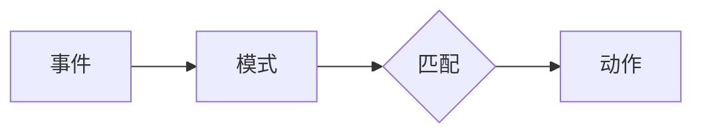

## 1. 背景介绍

### 1.1 大数据时代的挑战

随着互联网、物联网、移动互联网的快速发展，全球数据量呈爆炸式增长，我们正在进入一个前所未有的大数据时代。海量数据的出现为各行各业带来了巨大的机遇，同时也带来了前所未有的挑战。如何从海量数据中提取有价值的信息，并将其转化为商业价值，成为了企业面临的重要课题。

### 1.2 复杂事件处理的兴起

为了应对大数据带来的挑战，复杂事件处理 (CEP) 技术应运而生。CEP 是一种实时事件流处理技术，它能够从无序的事件流中识别出具有特定模式的事件组合，并触发相应的动作。与传统的批处理方式相比，CEP 具有实时性高、响应速度快、处理效率高等优势，能够帮助企业及时捕捉关键事件，并做出快速反应。

### 1.3 FlinkCEP：新一代复杂事件处理引擎

Apache Flink 是新一代的开源大数据处理引擎，它具有高吞吐、低延迟、高可靠性等特点，被广泛应用于实时数据处理、批处理、机器学习等领域。FlinkCEP 是 Flink 中的复杂事件处理库，它提供了丰富的 API 和强大的功能，能够帮助用户轻松构建高效的 CEP 应用。

## 2. 核心概念与联系

### 2.1 事件 (Event)

事件是 CEP 中最基本的概念，它代表了现实世界中发生的事情。例如，用户点击网页、传感器数据采集、股票交易等都可以被视为事件。每个事件都包含一些属性，例如时间戳、事件类型、事件值等。

### 2.2 模式 (Pattern)

模式是 CEP 中用于描述事件组合的规则，它定义了需要匹配的事件序列以及事件之间的关系。例如，我们可以定义一个模式来识别用户连续三次点击同一个按钮的事件序列。

### 2.3 匹配 (Match)

当事件流中的事件序列满足模式定义的规则时，就会产生一个匹配。例如，如果用户连续三次点击了同一个按钮，那么就会产生一个匹配。

### 2.4 动作 (Action)

动作是 CEP 中用于处理匹配结果的操作，它可以是发送警报、更新数据库、触发其他事件等。例如，我们可以定义一个动作，当用户连续三次点击同一个按钮时，发送一条警报信息。

### 2.5 核心概念联系图



## 3. 核心算法原理具体操作步骤

FlinkCEP 使用了一种基于 NFA (Nondeterministic Finite Automaton) 的算法来实现模式匹配。NFA 是一种状态机，它可以用来识别字符串中的模式。在 FlinkCEP 中，每个模式都被转换为一个 NFA，然后 FlinkCEP 引擎会使用 NFA 来匹配事件流中的事件序列。

### 3.1 模式转换为 NFA

FlinkCEP 使用一种递归下降的算法将模式转换为 NFA。该算法会将模式分解成一个个子模式，然后递归地将每个子模式转换为 NFA。最后，将所有子模式的 NFA 组合起来，就得到了整个模式的 NFA。

### 3.2 NFA 匹配事件流

FlinkCEP 引擎会使用 NFA 来匹配事件流中的事件序列。当一个事件到达时，FlinkCEP 引擎会将该事件输入到 NFA 中，然后 NFA 会根据当前状态和事件类型进行状态转移。如果 NFA 能够到达最终状态，则说明该事件序列匹配了模式。

### 3.3 具体操作步骤

1. 定义模式：使用 FlinkCEP API 定义需要匹配的事件序列以及事件之间的关系。
2. 转换为 NFA：FlinkCEP 引擎会将模式转换为 NFA。
3. 匹配事件流：FlinkCEP 引擎会使用 NFA 来匹配事件流中的事件序列。
4. 触发动作：当事件序列匹配了模式时，FlinkCEP 引擎会触发相应的动作。

## 4. 数学模型和公式详细讲解举例说明

### 4.1 NFA 状态转移函数

NFA 的状态转移函数定义了 NFA 在接收到一个事件后如何进行状态转移。状态转移函数通常表示为一个表格，表格的行代表 NFA 的当前状态，表格的列代表事件类型，表格的每个单元格代表 NFA 在接收到该事件后转移到的新状态。

### 4.2 举例说明

假设我们有一个模式，用于识别用户连续三次点击同一个按钮的事件序列。该模式可以表示为：

```
Pattern<Event, ?> pattern = Pattern.<Event>begin("start")
    .where(new SimpleCondition<Event>() {
        @Override
        public boolean filter(Event value) throws Exception {
            return value.getName().equals("click");
        }
    })
    .times(3)
    .within(Time.seconds(10));
```

该模式对应的 NFA 如下：

```mermaid
stateDiagram-v2
    [*] --> Start
    Start --> Click : click
    Click --> Click : click
    Click --> Match : click
    Match --> [*]
```

NFA 的状态转移函数如下：

| 当前状态 | 事件类型 | 新状态 |
|---|---|---|
| Start | click | Click |
| Click | click | Click |
| Click | click | Match |
| Match | any |  |

## 5. 项目实践：代码实例和详细解释说明

### 5.1 代码实例

```java
import org.apache.flink.cep.CEP;
import org.apache.flink.cep.PatternSelectFunction;
import org.apache.flink.cep.PatternStream;
import org.apache.flink.cep.pattern.Pattern;
import org.apache.flink.cep.pattern.conditions.SimpleCondition;
import org.apache.flink.streaming.api.datastream.DataStream;
import org.apache.flink.streaming.api.environment.StreamExecutionEnvironment;
import org.apache.flink.streaming.api.windowing.time.Time;

import java.util.List;
import java.util.Map;

public class FlinkCEPDemo {

    public static void main(String[] args) throws Exception {
        // 创建执行环境
        StreamExecutionEnvironment env = StreamExecutionEnvironment.getExecutionEnvironment();

        // 创建数据流
        DataStream<Event> input = env.fromElements(
                new Event("click", 1L),
                new Event("click", 2L),
                new Event("click", 3L),
                new Event("click", 4L),
                new Event("view", 5L)
        );

        // 定义模式
        Pattern<Event, ?> pattern = Pattern.<Event>begin("start")
                .where(new SimpleCondition<Event>() {
                    @Override
                    public boolean filter(Event value) throws Exception {
                        return value.getName().equals("click");
                    }
                })
                .times(3)
                .within(Time.seconds(10));

        // 应用模式
        PatternStream<Event> patternStream = CEP.pattern(input, pattern);

        // 选择匹配结果
        DataStream<String> result = patternStream.select(
                new PatternSelectFunction<Event, String>() {
                    @Override
                    public String select(Map<String, List<Event>> pattern) throws Exception {
                        List<Event> start = pattern.get("start");
                        return "用户连续三次点击了按钮：" + start.get(0).getTimestamp() + ", " + start.get(1).getTimestamp() + ", " + start.get(2).getTimestamp();
                    }
                }
        );

        // 打印结果
        result.print();

        // 执行程序
        env.execute("FlinkCEPDemo");
    }

    // 事件类
    public static class Event {
        private String name;
        private long timestamp;

        public Event() {
        }

        public Event(String name, long timestamp) {
            this.name = name;
            this.timestamp = timestamp;
        }

        public String getName() {
            return name;
        }

        public void setName(String name) {
            this.name = name;
        }

        public long getTimestamp() {
