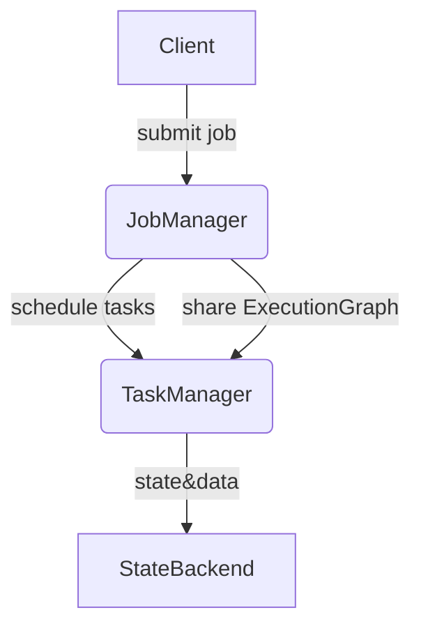
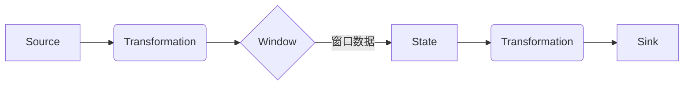
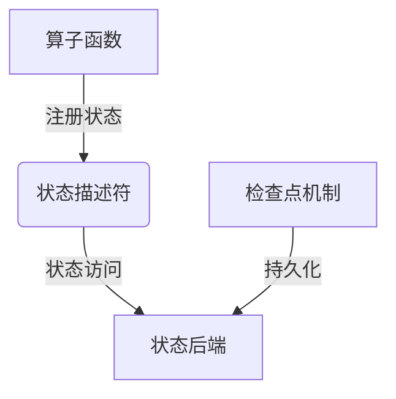

# Flink原理与代码实例讲解

## 1.背景介绍

### 1.1 大数据时代的到来

随着互联网、移动互联网、物联网和云计算的快速发展,数据呈现出爆炸式增长趋势。根据IDC(国际数据公司)的预测,到2025年,全球数据总量将达到175ZB(1ZB=1万亿TB)。传统的数据处理系统已经无法满足如此庞大数据量的存储和计算需求,亟需一种全新的大数据处理架构和技术。

### 1.2 大数据处理的演进

在大数据时代的背景下,大数据处理技术也经历了从批处理到流处理、λ架构的演进过程。

- **批处理**:最初的MapReduce是一种批处理系统,需要先将数据全部加载到磁盘,然后进行处理,存在较高的延迟。
- **流处理**:为了满足实时处理的需求,诞生了Storm、Spark Streaming等流处理系统,能够以低延迟的方式处理数据流。
- **λ架构**:结合批处理和流处理的优点,λ架构将数据分为三层:批处理层、速度层和服务层,可以有效应对大数据量和低延迟要求。

### 1.3 Flink的崛起

Apache Flink作为新一代大数据处理框架,正逐渐成为流处理领域的佼佼者。它不仅支持纯流处理,还支持批处理,可以无缝统一批流处理。Flink具有事件驱动型、基于流的世界观,以及有状态的流处理特性,使其能够高效地处理有状态的无界数据流。

## 2.核心概念与联系

### 2.1 Flink架构

Flink的架构主要由四个核心模块组成:

1. **ExecutionGraph(ExecutionGraph)**: 程序的逻辑执行计划,描述了整个流处理应用的拓扑结构。
2. **StateBackend(StateBackend)**: 管理作业的状态存储,支持内存级和磁盘级的状态存储。
3. **Scheduler(调度器)**: 根据ExecutionGraph计算资源需求,向ResourceManager申请资源,并将任务分发到对应的TaskManager上执行。
4. **Runtime(运行时)**: 包括TaskManagers和JobManagers,负责执行具体的数据处理任务。

这四个模块相互协作,构成了Flink的核心执行架构。



### 2.2 核心概念

Flink中包含了几个核心概念:

- **Stream**:代表无界的数据流,可以是来自消息队列、文件等各种数据源。
- **Transformation**:对数据流进行转换操作,如map、flatMap、filter等。
- **Sink**:数据流的输出,可以是文件、数据库或消息队列等。
- **Window**:对数据流按时间或计数进行切分,形成有界的数据集。
- **State**:保存计算过程中的状态,以便进行有状态的计算。
- **Time**:Flink支持事件时间和处理时间语义,可以处理有乱序的数据流。

这些概念相互关联,构建了Flink流式处理的基本模型。

## 3.核心算法原理具体操作步骤  

### 3.1 流处理模型

Flink采用了流式处理模型,将数据源源不断地输入到系统中,通过一系列Transformation进行处理,最终输出到Sink中。与批处理不同,流处理需要考虑数据的有界性、乱序性和延迟等问题。

Flink的流处理模型主要包括以下几个步骤:

1. **Source**: 从各种数据源(如Kafka、文件等)获取数据流。
2. **Transformation**:对数据流进行各种转换操作,如map、flatMap、filter等。
3. **Window**: 对无界数据流进行切分,形成有界的数据集。
4. **State**:使用State存储计算过程中的状态,以支持有状态的计算。
5. **Sink**:将处理后的数据流输出到各种目标端,如文件、数据库或消息队列等。



### 3.2 流处理算法

Flink提供了丰富的流处理算法,可以应对各种场景的需求。

1. **Window算法**:
   - Tumbling Window:无重叠的窗口
   - Sliding Window:有重叠的窗口
   - Session Window:基于活动间隔的窗口
2. **Join算法**:
   - Window Join:基于窗口的Join
   - Interval Join:基于时间间隔的Join
3. **聚合算法**:
   - ReduceFunction:增量聚合
   - AggregateFunction:全窗口聚合
4. **状态一致性算法**:
   - 状态一致性检查点机制
   - 端到端精确一次语义

这些算法能够高效地处理乱序数据、延迟数据、数据倾斜等问题,保证计算的正确性和高吞吐量。

### 3.3 有状态计算

Flink支持有状态的流处理,可以在计算过程中维护状态,并在需要时访问和更新状态。有状态计算的核心步骤如下:

1. **注册状态**:在算子函数中注册所需的状态。
2. **使用状态**:在算子函数中访问和更新状态。
3. **状态后端**:选择合适的状态后端,如内存或RocksDB等,用于存储状态数据。
4. **检查点机制**:通过检查点机制定期持久化状态数据,以实现故障恢复。



有状态计算使Flink能够支持复杂的业务逻辑,如会话窗口、连续计算等,并保证精确一次语义。

## 4.数学模型和公式详细讲解举例说明

### 4.1 Window模型

Flink中的Window模型用于将无界数据流切分为有界的数据集,以便进行批量计算。常用的Window类型包括:

1. **Tumbling Window**:无重叠的窗口,窗口之间没有数据重叠。

    $$
    \text{TumblingWindow}(size, offset) = \{e_i | t_i \in [n \times offset, n \times offset + size) \}
    $$

    其中,$e_i$表示事件,$t_i$表示事件时间戳,$n$为窗口编号,窗口大小为$size$,滑动步长为$offset$。

2. **Sliding Window**:有重叠的窗口,窗口之间存在数据重叠。

    $$
    \text{SlidingWindow}(size, slide) = \{e_i | t_i \in [n \times slide, n \times slide + size) \}
    $$

    其中,$slide$表示滑动步长。

3. **Session Window**:基于活动间隔的窗口,当数据流在一段时间内没有新数据到达时,就会触发计算。

    $$
    \text{SessionWindow}(gap) = \{e_i | t_i - t_{i-1} \leq gap \}
    $$

    其中,$gap$表示活动间隔阈值。

通过合理选择Window类型和参数,可以满足不同场景的需求。

### 4.2 Join模型

Flink支持在数据流上执行Join操作,常用的Join算法有:

1. **Window Join**:基于窗口的Join,将两个数据流在相同的窗口范围内进行Join。

    $$
    \begin{aligned}
    \text{WindowJoin}(stream1, stream2, \; &joinType, \; windowSize, \\
                     &windowOffset, \; keySelector)
    \end{aligned}
    $$

    其中,$joinType$表示Join类型(如内连接、外连接等),$windowSize$和$windowOffset$控制窗口大小和滑动步长,$keySelector$用于指定键。

2. **Interval Join**:基于时间间隔的Join,将两个数据流在指定的时间间隔内进行Join。

    $$
    \begin{aligned}
    \text{IntervalJoin}(stream1, stream2, \; &joinType, \; lowerBound, \\
                       &upperBound, \; keySelector)
    \end{aligned}
    $$

    其中,$lowerBound$和$upperBound$控制时间间隔的下界和上界。

通过Join操作,可以将不同数据源的数据进行关联和整合,支持更复杂的业务场景。

## 4.项目实践:代码实例和详细解释说明

本节将通过一个实际的项目案例,展示如何使用Flink进行流式数据处理。我们将构建一个电商用户行为分析系统,从Kafka消费用户行为事件流,并对用户行为进行统计和分析。

### 4.1 项目概述

电商用户行为分析系统的主要功能包括:

1. 从Kafka消费用户行为事件流。
2. 对用户行为进行实时统计,包括点击量、下单量、支付量等指标。
3. 实现会话窗口,分析用户的访问路径。
4. 将统计结果输出到MySQL数据库中,用于后续的数据分析和可视化。

### 4.2 数据模型

用户行为事件数据包括以下字段:

- `userId`: 用户ID
- `eventTime`: 事件时间戳
- `eventType`: 事件类型,包括`VIEW`(浏览)、`CART`(加入购物车)、`ORDER`(下单)、`PAY`(支付)
- `productId`: 商品ID
- `categoryId`: 商品类别ID

### 4.3 代码实现

#### 4.3.1 环境准备

```scala
// 创建流执行环境
val env = StreamExecutionEnvironment.getExecutionEnvironment

// 设置并行度
env.setParallelism(4)

// 开启检查点
env.enableCheckpointing(5000)

// 设置事件时间特性
env.setStreamTimeCharacteristic(TimeCharacteristic.EventTime)
```

#### 4.3.2 从Kafka消费数据

```scala
// 定义数据源
val kafkaSource = new FlinkKafkaConsumer[String](
  "user_behavior",
  new SimpleStringSchema(),
  props
)

// 从Kafka消费数据
val inputStream = env
  .addSource(kafkaSource)
  .map(JSONUtils.parseUserBehavior)
  .assignTimestampsAndWatermarks(
    WatermarkStrategy
      .forBoundedOutOfOrderness[(String, Long, String, String, String)](Duration.ofSeconds(5))
      .withTimestampAssigner(new SerializableEventTimeExtractor)
  )
  .keyBy(_.userId)
```

我们使用`FlinkKafkaConsumer`从Kafka的`user_behavior`主题消费数据,并使用`JSONUtils.parseUserBehavior`方法解析JSON格式的数据。然后,我们为数据流指定事件时间戳和watermark策略,并按照`userId`进行keyBy操作。

#### 4.3.3 实时统计用户行为

```scala
// 统计各事件类型的计数
val countStream = inputStream
  .flatMap(event => event.eventType match {
    case "VIEW" => Seq(("view", 1L))
    case "CART" => Seq(("cart", 1L))
    case "ORDER" => Seq(("order", 1L))
    case "PAY" => Seq(("pay", 1L))
  })
  .keyBy(_._1)
  .window(TumblingEventTimeWindows.of(Time.seconds(10)))
  .sum(1)

// 将结果输出到MySQL
countStream
  .addSink(new MySQLSink("user_behavior_counts"))
```

我们使用`flatMap`操作将每个事件映射为一个(事件类型, 1L)的元组,然后按照事件类型进行`keyBy`操作。接着,我们使用`TumblingEventTimeWindows`对数据流进行窗口切分,窗口大小为10秒。最后,我们调用`sum`函数对每个窗口内的计数进行求和,并使用`MySQLSink`将结果输出到MySQL数据库中。

#### 4.3.4 会话窗口分析

```scala
// 定义会话窗口
val sessionWindow = EventTimeSessionWindows.withGap(Time.minutes(10))

// 统计会话中的页面浏览量
val viewCountPerSession = inputStream
  .filter(_.eventType == "VIEW")
  .map(event => (event.userId, event.productId))
  .window(sessionWindow)
  .aggregate(new ViewCountAggregator)

// 将结果输出到MySQL
viewCountPerSession
  .addSink(new MySQLSink("user_session_views"))
```

我们首先定义一个会话窗口,时间间隔为10分钟。然后,我们过滤出浏览事件,并将其映射