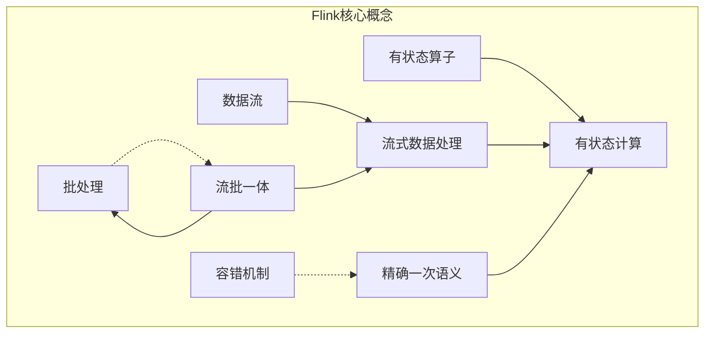

# Flink应用实战:电商用户行为分析

## 1.背景介绍

### 1.1 电商行业的重要性

在当今时代,电子商务已经成为一个不可忽视的巨大产业。随着互联网和移动设备的快速普及,消费者越来越倾向于通过在线渠道购买商品和服务。电商平台为用户提供了极大的便利,同时也给企业带来了巨大的商机。然而,在这个竞争激烈的领域中,企业必须深入了解用户行为模式,才能制定有效的营销策略,提高转化率并保持用户粘性。

### 1.2 用户行为数据的重要性

用户在电商平台上的每一次点击、浏览、加购、下单等行为都会产生大量的数据。这些海量的用户行为数据蕴含着宝贵的洞察力,可以帮助企业更好地了解用户偏好、发现潜在需求,并进行个性化营销。然而,传统的数据处理方式很难满足对这些实时数据的快速处理和分析需求。

### 1.3 Flink在用户行为分析中的作用

Apache Flink是一个开源的分布式大数据处理引擎,专门为有状态计算而设计。它能够对无界数据流进行低延迟、高吞吐、精确一次的实时计算。Flink具有强大的流式处理能力,非常适合处理电商平台上的实时用户行为数据。通过Flink,我们可以构建实时的用户行为分析系统,洞察用户行为模式,为个性化营销、实时推荐等应用提供支持。

## 2.核心概念与联系

在探讨Flink应用实战之前,我们需要先了解一些核心概念及其之间的联系。

### 2.1 流式数据处理

流式数据处理(Stream Processing)是一种处理无界、持续到达的数据流的范式。与传统的批处理不同,流式处理系统需要在数据到达时即时处理,并且能够在有限的时间和空间内完成计算。流式数据处理非常适合处理实时数据,如用户行为数据、传感器数据、日志数据等。

### 2.2 有状态计算

有状态计算(Stateful Computation)是指在数据处理过程中,需要维护和访问某些状态信息。这些状态可能来自于先前处理过的数据,或者是计算过程中的中间结果。有状态计算能够支持更加复杂的数据处理逻辑,如窗口操作、连接操作等。Flink提供了多种有状态算子,如窗口函数、连接函数等,使得开发人员可以更加方便地进行有状态计算。

### 2.3 流批一体

流批一体(Streams & Batches Unified)是Flink的核心理念之一。它将批处理视为流处理的一个特例,即将有界的数据集看作是一个无界的数据流。这种统一的视角使得Flink可以使用相同的API和运行时来处理实时数据流和有界数据集,从而简化了开发和部署过程。

### 2.4 容错机制

Flink采用了基于Chandy-Lamport算法的分布式快照机制来实现容错。这种机制可以在出现故障时恢复任务的状态,从而保证了精确一次(Exactly-Once)的语义。Flink还支持端到端精确一次的状态一致性,确保在发生故障时也不会丢失或重复计算任何记录。

### 2.5 Mermaid流程图

下面的Mermaid流程图展示了Flink的核心概念及其之间的关系:



## 3.核心算法原理具体操作步骤

在了解了Flink的核心概念之后,我们来探讨一下Flink的核心算法原理和具体操作步骤。

### 3.1 流式数据模型

Flink将流式数据建模为无限的数据序列,每个数据元素都关联了一个事件时间戳。这种模型允许Flink对乱序到达的数据进行重新排序,并执行基于时间窗口的操作。

事件时间戳可以从数据源中获取,也可以通过指定时间戳分配器(Timestamp Assigner)来分配。Flink提供了多种时间戳抽取和生成策略,如升序事件时间、BoundedOutOfOrdernessTimestampExtractor等。

### 3.2 数据分区和分布式执行

为了实现并行计算,Flink会将流式数据划分为多个逻辑分区(Logical Partition)。每个分区的数据会被发送到不同的任务实例(Task Instance)进行处理。分区策略决定了数据如何在任务实例之间进行分布式执行。

Flink支持多种分区策略,如重分区(Rebalance)、广播(Broadcast)、哈希分区(Hash Partitioning)、范围分区(Range Partitioning)等。选择合适的分区策略对于充分利用集群资源、实现良好的负载均衡非常重要。

### 3.3 有状态算子

Flink提供了多种有状态算子,用于支持复杂的数据处理逻辑。这些算子包括:

- **Window Functions**:用于对数据流进行窗口操作,如滚动窗口(Tumbling Window)、滑动窗口(Sliding Window)、会话窗口(Session Window)等。
- **Join Functions**:用于连接两个或多个数据流,包括内连接(Inner Join)、外连接(Outer Join)、窗口连接(Window Join)等。
- **Process Functions**:提供了访问事件时间和状态的能力,可以实现更加复杂的业务逻辑。

这些有状态算子都可以与Flink的容错机制很好地集成,保证精确一次的语义。

### 3.4 具体操作步骤

下面是使用Flink进行流式数据处理的典型步骤:

1. **获取执行环境(Execution Environment)**:根据需求创建流执行环境(StreamExecutionEnvironment)或批处理执行环境(ExecutionEnvironment)。
2. **设置数据源(Source)**:通过`addSource`方法指定数据源,如Kafka、文件等。
3. **数据转换(Transformations)**:使用Flink提供的各种转换算子(如map、flatMap、filter等)对数据进行转换和处理。
4. **设置数据sink(Sink)**:通过`addSink`方法指定计算结果的输出位置,如Kafka、文件系统等。
5. **执行作业(Execute Job)**:调用`execute`方法提交并执行Flink作业。

下面是一个简单的单词计数示例:

```java
StreamExecutionEnvironment env = StreamExecutionEnvironment.getExecutionEnvironment();
DataStream<String> text = env.addSource(new SocketTextStreamFunction(...));
DataStream<Tuple2<String, Integer>> wordCounts = text
    .flatMap(new FlatMapFunction<String, Tuple2<String, Integer>>() {...})
    .keyBy(0)
    .timeWindow(Time.seconds(5))
    .sum(1);
wordCounts.addSink(new RichSinkFunction<Tuple2<String, Integer>>() {...});
env.execute("Word Count Example");
```

## 4.数学模型和公式详细讲解举例说明

在进行用户行为分析时,我们通常需要使用一些数学模型和公式来量化用户行为,从而更好地理解和预测用户行为模式。下面我们将介绍几个常用的数学模型和公式。

### 4.1 马尔可夫模型

马尔可夫模型(Markov Model)是一种常用的随机过程模型,它描述了一个系统在当前状态下,未来状态仅取决于当前状态,与过去状态无关。在用户行为分析中,我们可以将用户的行为序列建模为一个马尔可夫过程,从而分析用户的转移概率和稳态分布。

设$S=\{s_1,s_2,...,s_n\}$为用户可能的状态集合,$P=\{p_{ij}\}$为状态转移概率矩阵,其中$p_{ij}=P(X_{t+1}=s_j|X_t=s_i)$表示从状态$s_i$转移到状态$s_j$的概率。则马尔可夫模型可以表示为:

$$
P(X_{t+1}=s_j|X_t=s_i,X_{t-1}=s_{i_1},...,X_0=s_{i_t})=P(X_{t+1}=s_j|X_t=s_i)=p_{ij}
$$

通过计算稳态分布$\pi=(\pi_1,\pi_2,...,\pi_n)$,我们可以得到用户在各个状态下的概率,从而预测用户的行为趋势。

### 4.2 生存分析模型

生存分析模型(Survival Analysis Model)通常用于研究某个事件发生所需的时间长度。在用户行为分析中,我们可以将用户留存作为研究对象,分析影响用户留存时间的因素。

设$T$为用户留存时间的随机变量,其概率密度函数为$f(t)$,则其生存函数$S(t)$定义为:

$$
S(t)=P(T>t)=\int_t^{\infty}f(x)dx
$$

生存函数$S(t)$表示用户至少留存时间$t$的概率。我们还可以定义风险函数(Hazard Function)$h(t)$,表示在时间$t$发生离开事件的条件风险率:

$$
h(t)=\lim_{\Delta t\rightarrow 0}\frac{P(t\leq T<t+\Delta t|T\geq t)}{\Delta t}=\frac{f(t)}{S(t)}
$$

通过分析生存函数和风险函数,我们可以了解影响用户留存的关键因素,从而制定相应的营销策略。

### 4.3 协同过滤算法

协同过滤算法(Collaborative Filtering)是一种常用的推荐算法,它通过分析用户之间的相似性和物品之间的相似性来预测用户对物品的偏好程度。在电商领域,我们可以利用协同过滤算法为用户推荐感兴趣的商品。

假设有$m$个用户和$n$个物品,我们可以构建一个$m\times n$的评分矩阵$R$,其中$r_{ij}$表示用户$i$对物品$j$的评分。基于评分矩阵,我们可以计算用户相似度矩阵$W^U$和物品相似度矩阵$W^I$。

对于给定的用户$u$和物品$i$,我们可以使用基于用户的协同过滤算法预测$u$对$i$的评分$\hat{r}_{ui}$:

$$
\hat{r}_{ui}=\overline{r_u}+\frac{\sum\limits_{v\in N(u,i)}w_{uv}(r_{vi}-\overline{r_v})}{\sum\limits_{v\in N(u,i)}w_{uv}}
$$

其中$\overline{r_u}$和$\overline{r_v}$分别表示用户$u$和$v$的平均评分,$N(u,i)$表示对物品$i$有评分的用户集合,$w_{uv}$表示用户$u$和$v$之间的相似度。

通过对$\hat{r}_{ui}$排序,我们可以为用户$u$推荐最感兴趣的物品。

以上只是一些常用的数学模型和公式,在实际应用中,我们还可以根据具体需求选择合适的模型和算法。

## 4.项目实践:代码实例和详细解释说明

为了更好地理解Flink在用户行为分析中的应用,我们将通过一个实际项目案例来演示如何使用Flink处理电商平台的用户行为数据。

### 4.1 项目概述

在本项目中,我们将构建一个实时的用户行为分析系统,对电商平台上的用户行为数据(如浏览、加购、下单等)进行处理和分析。我们将使用Flink作为核心的流式处理引擎,并与Kafka、Redis等其他组件进行集成。

最终,我们将实现以下功能:

1. 实时统计用户行为指标,如页面浏览量(PV)、用户访问量(UV)等。
2. 分析用户行为路径,了解用户的典型浏览和购买模式。
3. 基于用户的浏览和购买历史,进行实时商品推荐。
4. 监控异常用户行为,如频繁加购但很少下单等。

### 4.2