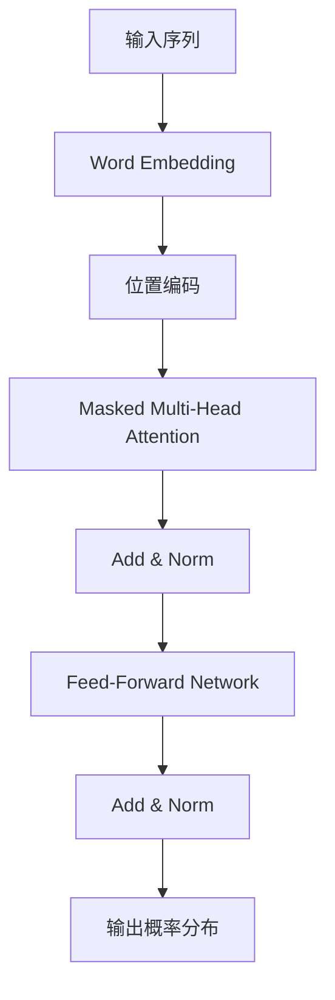

# GPT原理与代码实例讲解

## 1. 背景介绍

### 1.1 人工智能的发展历程

人工智能的概念可以追溯到20世纪50年代,当时一群富有远见的科学家和数学家提出了"赋予机器智能"的想法。随着计算机技术的飞速发展,人工智能也逐渐从一个遥不可及的梦想,发展成为一个蓬勃发展的学科和产业。

在过去几十年中,人工智能经历了几次重大突破,例如专家系统、机器学习、深度学习等。其中,深度学习的兴起标志着人工智能进入了一个新的里程碑式时代。

### 1.2 自然语言处理(NLP)的重要性

作为人工智能的一个重要分支,自然语言处理(NLP)致力于让计算机能够理解和生成人类语言。由于语言是人类交流和表达思想的主要工具,因此NLP在许多领域都有广泛的应用,如机器翻译、问答系统、信息检索、文本摘要等。

随着大数据和计算能力的不断提高,NLP技术也取得了长足的进步。其中,Transformer模型和预训练语言模型的出现,为NLP领域带来了革命性的变革。

### 1.3 GPT的重要意义

GPT(Generative Pre-trained Transformer)是一种基于Transformer的预训练语言模型,由OpenAI于2018年提出。它能够通过在大规模语料库上进行预训练,学习到丰富的语言知识,并可以应用于多种下游任务,如机器翻译、问答、文本生成等。

GPT的出现不仅推动了NLP技术的发展,也为人工智能系统赋予了更强大的语言理解和生成能力。它被认为是通向通用人工智能(AGI)的一个重要里程碑,因此备受关注和研究。

## 2. 核心概念与联系

### 2.1 Transformer模型

Transformer是一种全新的基于注意力机制的序列到序列(Seq2Seq)模型,它完全摒弃了传统的循环神经网络(RNN)和卷积神经网络(CNN)结构,使用多头自注意力机制来捕捉输入序列中任意两个位置之间的长程依赖关系。

Transformer的核心组件包括编码器(Encoder)和解码器(Decoder)。编码器将输入序列映射为一系列连续的向量表示,解码器则基于这些向量表示生成输出序列。两者之间通过注意力机制建立联系。

### 2.2 自注意力机制(Self-Attention)

自注意力机制是Transformer模型的核心,它能够同时关注输入序列中的所有位置,并捕捉它们之间的相关性。具体来说,对于每个位置,自注意力机制会计算其与所有其他位置的注意力分数,然后将这些分数与对应位置的值相加,得到该位置的表示向量。

相比传统的RNN和CNN,自注意力机制避免了梯度消失和梯度爆炸的问题,能够更好地建模长期依赖关系。此外,它还具有并行计算的优势,可以显著提高模型的训练和推理速度。

### 2.3 预训练语言模型(Pre-trained Language Model)

预训练语言模型的思想是:在大规模语料库上预先训练一个通用的语言模型,学习到丰富的语言知识和上下文信息;然后将这个预训练模型迁移到特定的下游任务上,通过少量的微调即可获得良好的性能。

这种预训练+微调的范式极大地减少了从头开始训练模型所需的数据和计算资源,同时也提高了模型的泛化能力。目前,预训练语言模型已经成为NLP领域的主流技术。

### 2.4 GPT:生成式预训练Transformer

GPT是将Transformer模型和预训练语言模型相结合的创新尝试。它在大规模语料库上预训练了一个基于Transformer解码器的自回归(Auto-Regressive)语言模型,能够生成连贯、流畅的人类语言。

与其他预训练模型不同,GPT采用了全新的训练目标:给定前文,预测下一个词的概率分布。这种生成式预训练方式使得GPT具备了强大的文本生成能力,可以应用于各种生成任务,如机器翻译、文本摘要、对话系统等。

GPT的出现为NLP领域带来了巨大的影响,也为后来的BERT、GPT-2、GPT-3等模型奠定了基础。

## 3. 核心算法原理具体操作步骤

在介绍GPT的核心算法原理之前,我们先来简要回顾一下Transformer模型的基本结构。

### 3.1 Transformer模型回顾

Transformer模型由编码器(Encoder)和解码器(Decoder)两个主要部分组成。

#### 3.1.1 编码器(Encoder)

编码器的主要作用是将输入序列映射为一系列连续的向量表示。它由多个相同的层组成,每一层包括两个子层:

1. **多头自注意力子层(Multi-Head Attention)**:通过自注意力机制捕捉输入序列中任意两个位置之间的依赖关系。
2. **全连接前馈网络子层(Feed-Forward Network)**:对每个位置的向量表示进行非线性变换,以增强表示能力。

这两个子层之间还包括残差连接(Residual Connection)和层归一化(Layer Normalization),以帮助模型训练。

#### 3.1.2 解码器(Decoder)

解码器的作用是基于编码器的输出,生成目标序列。它的结构与编码器类似,也由多个相同的层组成,每一层包括三个子层:

1. **掩蔽多头自注意力子层(Masked Multi-Head Attention)**:通过掩码机制,确保每个位置的表示只依赖于该位置之前的输入。
2. **编码器-解码器注意力子层(Encoder-Decoder Attention)**:将解码器的表示与编码器的输出建立联系,捕捉输入和输出之间的依赖关系。
3. **全连接前馈网络子层(Feed-Forward Network)**:对每个位置的向量表示进行非线性变换。

同样,这些子层之间也包括残差连接和层归一化。

### 3.2 GPT的训练目标

GPT采用了全新的训练目标:给定前文,预测下一个词的概率分布。具体来说,对于一个长度为n的序列 $\{x_1, x_2, ..., x_n\}$,GPT的目标是最大化下式的对数似然:

$$\log P(x_1, x_2, ..., x_n) = \sum_{t=1}^n \log P(x_t | x_1, ..., x_{t-1})$$

这种自回归(Auto-Regressive)的语言模型能够很好地捕捉语言的顺序性和上下文信息,从而生成流畅、连贯的文本。

### 3.3 GPT的模型结构

GPT的模型结构基于Transformer的解码器,如下图所示:

具体来说,GPT的模型结构包括以下几个关键步骤:

1. **Word Embedding**:将输入序列的每个词映射为一个连续的向量表示。
2. **位置编码(Positional Encoding)**:由于Transformer没有捕捉序列顺序的机制,因此需要添加位置编码来区分不同位置的词向量。
3. **Masked Multi-Head Attention**:与Transformer解码器中的掩蔽多头注意力机制相同,确保每个位置的表示只依赖于该位置之前的输入。
4. **Add & Norm**:残差连接和层归一化,有助于模型训练。
5. **Feed-Forward Network**:全连接前馈网络,对每个位置的向量表示进行非线性变换。
6. **Linear + Softmax**:最后一层是一个线性层加Softmax,输出每个位置下一个词的概率分布。

在训练过程中,GPT根据上述模型结构,最大化给定前文预测下一个词的对数似然。经过在大规模语料库上的预训练,GPT能够学习到丰富的语言知识,并具备强大的文本生成能力。

### 3.4 GPT的生成过程

在推理阶段,GPT可以通过贪婪搜索或束搜索等方法,根据已生成的文本,预测下一个最可能的词,从而逐步生成完整的文本序列。

具体来说,生成过程如下:

1. 给定一个起始文本(可以为空)。
2. 将起始文本输入到GPT模型,计算出每个位置下一个词的概率分布。
3. 根据特定的搜索策略(如贪婪搜索或束搜索),从概率分布中选择最可能的词作为下一个生成的词。
4. 将新生成的词附加到已有文本后面,重复步骤2和3,直到达到预设的长度或生成结束标记。

通过以上过程,GPT可以生成流畅、连贯、与给定文本相关的新文本。值得注意的是,GPT的生成质量在很大程度上取决于预训练语料的质量和多样性,以及搜索策略的选择。

## 4. 数学模型和公式详细讲解举例说明

在上一节中,我们介绍了GPT的核心算法原理。现在,让我们深入探讨一下GPT中使用的数学模型和公式。

### 4.1 自注意力机制(Self-Attention)

自注意力机制是Transformer及GPT模型的核心,它能够捕捉输入序列中任意两个位置之间的依赖关系。具体来说,对于一个长度为n的输入序列 $X = (x_1, x_2, ..., x_n)$,自注意力机制的计算过程如下:

1. 将输入序列 $X$ 通过三个线性变换,分别得到查询向量(Query)、键向量(Key)和值向量(Value):

$$\begin{aligned}
Q &= XW^Q\\
K &= XW^K\\
V &= XW^V
\end{aligned}$$

其中 $W^Q$、$W^K$ 和 $W^V$ 分别是可训练的权重矩阵。

2. 计算查询向量和键向量之间的点积,得到注意力分数矩阵(Attention Scores):

$$\text{Attention Scores} = \frac{QK^T}{\sqrt{d_k}}$$

其中 $d_k$ 是键向量的维度,用于缩放点积值,避免过大或过小的值导致梯度消失或梯度爆炸。

3. 对注意力分数矩阵进行Softmax操作,得到注意力权重矩阵(Attention Weights):

$$\text{Attention Weights} = \text{Softmax}(\text{Attention Scores})$$

4. 将注意力权重矩阵与值向量相乘,得到自注意力的输出:

$$\text{Self-Attention Output} = \text{Attention Weights} \cdot V$$

通过以上步骤,自注意力机制能够根据查询向量和键向量之间的相关性,动态地为每个位置分配注意力权重,从而捕捉输入序列中任意两个位置之间的依赖关系。

### 4.2 多头自注意力机制(Multi-Head Attention)

在实际应用中,通常使用多头自注意力机制(Multi-Head Attention)来增强模型的表示能力。多头自注意力机制将自注意力机制并行运行多次,每次使用不同的线性变换,然后将多个注意力输出进行拼接。具体计算过程如下:

1. 将输入序列 $X$ 通过多组线性变换,分别得到多组查询向量、键向量和值向量:

$$\begin{aligned}
Q_i &= XW_i^Q,\quad K_i = XW_i^K,\quad V_i = XW_i^V\\
&\text{其中 }i = 1, 2, ..., h
\end{aligned}$$

其中 $h$ 是注意力头的数量,每个注意力头都有独立的权重矩阵 $W_i^Q$、$W_i^K$ 和 $W_i^V$。

2. 对每个注意力头,分别计算自注意力输出:

$$\text{Head}_i = \text{Attention}(Q_i, K_i, V_i)$$

3. 将所有注意力头的输出拼接起来,并通过一个线性变换得到多头自注意力的最终输出: