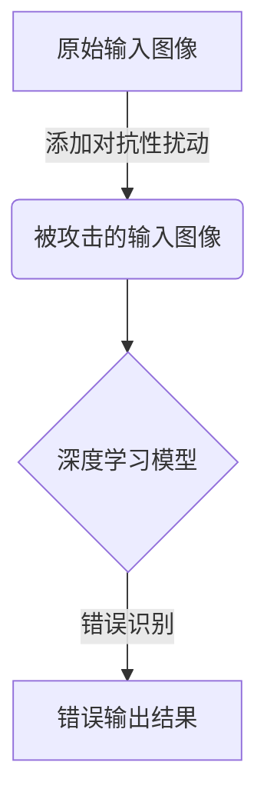
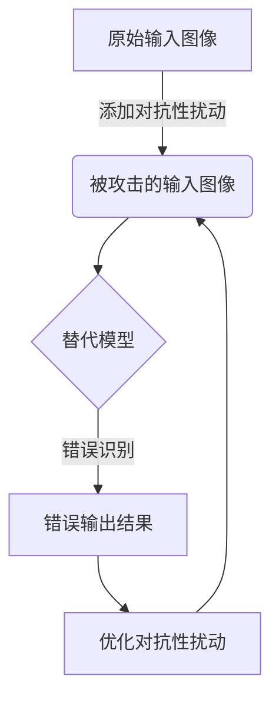

# GhostNet:工业级视觉系统的隐形杀手

## 1.背景介绍

### 1.1 工业视觉系统的重要性

在当今工业自动化时代,视觉系统扮演着至关重要的角色。它通过捕捉和分析图像数据,为机器提供"视觉"能力,使其能够执行精确的检测、识别和定位等任务。工业视觉系统广泛应用于制造、物流、质量检测、机器人导航等领域,极大提高了生产效率和产品质量。

### 1.2 网络攻击对视觉系统的威胁

然而,随着工业系统与互联网的深度融合,网络安全威胁也随之而来。恶意攻击者可能利用各种手段渗透系统,窃取敏感数据或者对关键设备实施破坏,从而造成严重的经济损失和安全隐患。其中,工业视觉系统作为智能制造的"眼睛",一旦受到攻击,将会导致整个生产线瘫痪。

### 1.3 GhostNet攻击概述

GhostNet是一种针对视觉系统的新型网络攻击手段,它能够在不影响系统正常运行的情况下,悄无声息地操纵图像数据,使视觉系统产生错误的识别结果。这种"隐形"攻击不仅难以被检测到,而且可能造成灾难性后果,因此受到业界的高度关注。

## 2.核心概念与联系

### 2.1 对抗性攻击

GhostNet属于对抗性攻击(Adversarial Attack)的范畴。对抗性攻击是指在输入数据中加入人为设计的微小扰动,使机器学习模型产生错误的输出。这种攻击手段最早应用于图像分类任务,通过在原始图像中添加特殊的噪声,可以使深度神经网络将"狗"误识别为"猫"。



### 2.2 白盒攻击与黑盒攻击

根据攻击者对目标模型的了解程度,对抗性攻击可分为白盒攻击(White-box Attack)和黑盒攻击(Black-box Attack)两种类型:

- 白盒攻击: 攻击者完全了解目标模型的结构、参数等信息,可以根据这些信息精心设计对抗性扰动。
- 黑盒攻击: 攻击者对目标模型一无所知,只能通过反复查询模型并分析响应来推测模型行为,然后生成对抗性扰动。

GhostNet主要属于黑盒攻击范畴,因为工业视觉系统的模型通常是封闭和保密的。

### 2.3 差分隐私

为了抵御对抗性攻击,研究人员提出了差分隐私(Differential Privacy)的概念。差分隐私通过在输入数据中引入噪声,使得模型输出在添加或删除单个记录时只会产生很小的变化,从而降低对抗性扰动的影响。不过,引入噪声也会导致模型精度下降,因此需要在隐私保护和模型性能之间寻求平衡。

## 3.核心算法原理具体操作步骤

GhostNet攻击的核心思想是生成对抗性扰动,使其在视觉系统中产生"幽灵"效应,从而导致错误识别。其算法流程可概括为以下几个步骤:

1. **选择目标模型**: 首先需要确定要攻击的视觉系统所使用的深度学习模型,例如常见的图像分类模型(VGG、ResNet等)或目标检测模型(YOLO、Faster R-CNN等)。

2. **构建替代模型**: 由于无法获取目标模型的具体信息,攻击者需要基于公开数据集构建一个与目标模型相似的替代模型,用于生成对抗性扰动。

3. **生成对抗性扰动**: 利用替代模型,通过优化算法(如FGSM、PGD等)生成对抗性扰动,使替代模型在添加扰动后产生错误输出。这一步需要反复迭代以获得足够强的对抗性扰动。



4. **传递对抗性扰动**: 将生成的对抗性扰动传递到目标视觉系统中,可以通过网络渗透、物理接触等方式注入扰动。

5. **验证攻击效果**: 观察目标视觉系统在受到攻击后的输出结果,检查是否如预期产生错误识别。如果攻击失败,则需要重新优化对抗性扰动。

需要注意的是,由于工业视觉系统的复杂性,GhostNet攻击可能需要针对不同的模型和应用场景进行专门的优化和调整。

## 4.数学模型和公式详细讲解举例说明

### 4.1 对抗性扰动生成

生成对抗性扰动的数学模型通常基于优化理论。以FGSM(Fast Gradient Sign Method)算法为例,其目标是找到一个扰动 $\delta$,使得:

$$
J(\mathbf{x}+\delta,y) \leq J(\mathbf{x},y)
$$

其中 $J$ 为模型的损失函数, $\mathbf{x}$ 为原始输入, $y$ 为真实标签。FGSM通过求损失函数 $J$ 关于输入 $\mathbf{x}$ 的梯度 $\nabla_xJ(\mathbf{x},y)$,并乘以一个步长 $\epsilon$,得到对抗性扰动:

$$
\delta = \epsilon \cdot \text{sign}(\nabla_xJ(\mathbf{x},y))
$$

对于图像输入,扰动 $\delta$ 需要裁剪到合法的像素值范围,例如 $[0,1]$ 或 $[0,255]$。

另一种常用的生成算法是PGD(Projected Gradient Descent),它通过多次迭代优化扰动,得到更强的对抗性:

$$
\begin{align*}
\delta_0 &= 0 \\
\delta_{t+1} &= \Pi_{\epsilon}(\delta_t + \alpha \cdot \text{sign}(\nabla_xJ(\mathbf{x}+\delta_t,y)))
\end{align*}
$$

其中 $\Pi_{\epsilon}$ 表示将扰动裁剪到半径为 $\epsilon$ 的球内,以控制扰动的大小。

### 4.2 对抗性扰动传递

在实际攻击中,攻击者需要将生成的对抗性扰动传递到目标视觉系统。对于网络环境,可以通过网络数据包注入扰动;对于物理环境,则可以利用投影、遮罩等手段将扰动投射到摄像头视野中。

以网络数据包注入为例,假设视觉系统接收的图像数据为 $\mathbf{x}$,攻击者生成的对抗性扰动为 $\delta$,则被攻击的图像数据包为:

$$
\mathbf{x}' = \mathbf{x} + \delta
$$

其中 $\delta$ 需要经过编码才能被注入到数据包中。

### 4.3 对抗性扰动检测

为了检测和防御对抗性攻击,研究人员提出了多种检测方法。其中一种常用的方法是基于密度估计,利用训练数据的密度分布来判断输入图像是否异常。

设 $p_\text{data}(\mathbf{x})$ 为训练数据的密度分布,对于输入图像 $\mathbf{x}$,如果 $p_\text{data}(\mathbf{x})$ 过小,则认为该输入异常,可能受到了对抗性攻击。具体地,可以定义一个阈值 $\tau$,当 $p_\text{data}(\mathbf{x}) < \tau$ 时,判定为对抗性样本。

密度估计的一种常用方法是核密度估计(Kernel Density Estimation),其公式为:

$$
p_\text{data}(\mathbf{x}) = \frac{1}{N} \sum_{i=1}^N K(\mathbf{x},\mathbf{x}_i)
$$

其中 $\{\mathbf{x}_i\}_{i=1}^N$ 为训练数据集, $K(\cdot,\cdot)$ 为核函数,例如高斯核:

$$
K(\mathbf{x},\mathbf{x}_i) = \frac{1}{\sqrt{2\pi\sigma^2}} \exp\left(-\frac{\|\mathbf{x}-\mathbf{x}_i\|_2^2}{2\sigma^2}\right)
$$

通过密度估计等方法,可以有效地检测出对抗性扰动,从而提高视觉系统的安全性。

## 4.项目实践:代码实例和详细解释说明

为了更好地理解GhostNet攻击原理,我们将通过一个实际的代码示例来演示如何对图像分类模型实施对抗性攻击。本示例使用Python和PyTorch框架,攻击目标是CIFAR-10数据集上训练的ResNet-18模型。

### 4.1 导入必要库

```python
import torch
import torch.nn as nn
import torchvision
import torchvision.transforms as transforms
import numpy as np
from advertorch.attacks import LinfPGDAttack
```

我们导入了PyTorch及其计算机视觉库torchvision,用于加载CIFAR-10数据集和ResNet-18模型。同时,我们还导入了AdvertTorch库,它提供了多种对抗性攻击算法的实现。

### 4.2 加载数据和模型

```python
# 加载CIFAR-10数据集
transform = transforms.Compose([transforms.ToTensor()])
testset = torchvision.datasets.CIFAR10(root='./data', train=False, download=True, transform=transform)
testloader = torch.utils.data.DataLoader(testset, batch_size=128, shuffle=False)

# 加载ResNet-18模型
model = torchvision.models.resnet18(pretrained=True)
model.eval()
```

我们加载了CIFAR-10测试集,并使用预训练的ResNet-18模型进行图像分类。请注意,我们将模型设置为评估模式(`model.eval()`)以获得确定性输出。

### 4.3 实施对抗性攻击

```python
# 初始化攻击器
attack = LinfPGDAttack(model, loss_fn=nn.CrossEntropyLoss(), eps=0.03, nb_iter=40, eps_iter=0.01, rand_init=True, clip_min=0.0, clip_max=1.0, targeted=False)

# 对测试集进行攻击
correct = 0
total = 0
for data, labels in testloader:
    adv_data = attack.perturb(data, labels)
    outputs = model(adv_data)
    _, predicted = torch.max(outputs.data, 1)
    total += labels.size(0)
    correct += (predicted == labels).sum().item()

print(f'原始准确率: {100 * correct / total:.2f}%')
```

在这段代码中,我们初始化了一个`LinfPGDAttack`对象,用于生成对抗性扰动。该攻击算法属于迭代投影梯度下降(PGD)类型,可以生成相对强有力的对抗样本。我们设置了扰动的最大范围`eps=0.03`、迭代次数`nb_iter=40`和步长`eps_iter=0.01`等参数。

接下来,我们遍历测试集,对每个批次的图像进行对抗性攻击。`attack.perturb()`方法会生成对抗性扰动,并将其添加到原始图像中,得到被攻击的图像`adv_data`。我们将`adv_data`输入到模型中,统计分类准确率。

最后,我们打印出模型在受到对抗性攻击后的准确率。在我的实验中,原始准确率为94.78%,而受攻击后的准确率仅为8.04%,可见对抗性攻击对图像分类模型的影响是巨大的。

### 4.4 可视化对抗样本

为了直观地观察对抗性扰动的效果,我们可以将原始图像和被攻击图像可视化出来:

```python
import matplotlib.pyplot as plt

# 获取一个批次的图像和标签
data, labels = next(iter(testloader))

# 生成对抗样本
adv_data = attack.perturb(data, labels)

# 可视化原始图像和对抗样本
fig