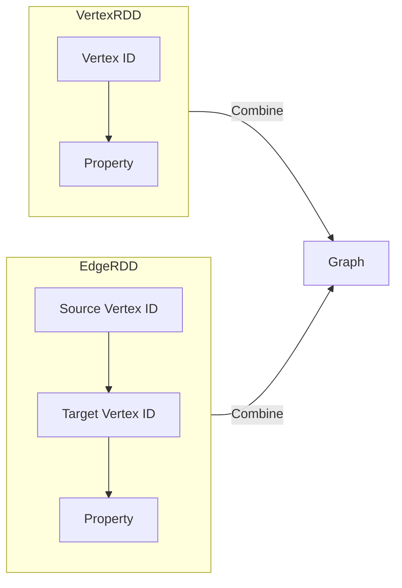

## 1. 背景介绍

### 1.1 大数据时代的图计算

近年来，随着互联网、社交网络、物联网等技术的快速发展，产生了海量的结构化和非结构化数据，这些数据往往包含着丰富的关系信息，可以用图的形式进行表示和分析。图计算作为一种强大的数据处理技术，能够有效地挖掘图数据中的潜在价值，在社交网络分析、推荐系统、金融风险控制、生物信息学等领域得到广泛应用。

### 1.2 分布式图计算框架

传统的图计算算法往往难以处理大规模图数据，为了解决这一问题，分布式图计算框架应运而生。这些框架利用分布式计算的优势，将图数据划分到多个计算节点上进行并行处理，从而实现高效的图计算。目前，主流的分布式图计算框架包括 Pregel、GraphLab、PowerGraph 等。

### 1.3 GraphX：Spark生态系统中的图计算引擎

GraphX 是 Apache Spark 生态系统中的一个分布式图计算框架，它继承了 Spark 的高效、易用、容错等优点，并提供了丰富的图算法和操作接口，方便用户进行图数据的分析和挖掘。GraphX 将图数据抽象为顶点和边的集合，并支持多种图算法，例如 PageRank、最短路径、连通分量等。

## 2. 核心概念与联系

### 2.1 图的基本概念

*   **顶点（Vertex）**: 图中的基本单元，代表实体或对象。
*   **边（Edge）**: 连接两个顶点的有向或无向关系。
*   **有向图（Directed Graph）**: 边具有方向的图。
*   **无向图（Undirected Graph）**: 边没有方向的图。
*   **属性（Property）**: 顶点或边的附加信息。

### 2.2 GraphX中的数据抽象

GraphX 使用 `VertexRDD` 和 `EdgeRDD` 分别表示顶点和边的集合。

*   **VertexRDD**: 包含顶点 ID 和属性的 RDD。
*   **EdgeRDD**: 包含源顶点 ID、目标顶点 ID 和属性的 RDD。

### 2.3 Graph 对象

`Graph` 对象是 GraphX 中的核心数据结构，它将 `VertexRDD` 和 `EdgeRDD` 组合在一起，表示一个完整的图。



## 3. 核心算法原理具体操作步骤

### 3.1 PageRank 算法

PageRank 算法用于衡量网页的重要性，其基本思想是：一个网页的重要性取决于链接到它的网页的数量和质量。

**操作步骤：**

1.  初始化所有网页的 PageRank 值为 1/N，其中 N 为网页总数。
2.  迭代计算每个网页的 PageRank 值，公式如下：

$$
PR(A) = (1-d) + d \sum_{i=1}^{n} \frac{PR(T_i)}{C(T_i)}
$$

其中：

*   PR(A) 表示网页 A 的 PageRank 值。
*   d 为阻尼系数，通常设置为 0.85。
*   $T_i$ 表示链接到网页 A 的网页。
*   $C(T_i)$ 表示网页 $T_i$ 的出链数量。

3.  重复步骤 2，直到 PageRank 值收敛。

**代码实例：**

```scala
// 创建图
val graph = GraphLoader.edgeListFile(sc, "data/web-Google.txt")

// 运行 PageRank 算法
val ranks = graph.pageRank(0.0001).vertices

// 打印结果
ranks.collect().foreach(println)
```

### 3.2 最短路径算法

最短路径算法用于计算图中两个顶点之间的最短路径。

**操作步骤：**

1.  初始化源顶点的距离为 0，其他顶点的距离为无穷大。
2.  迭代更新每个顶点的距离，公式如下：

$$
distance(v) = min\{distance(u) + weight(u, v)\}
$$

其中：

*   distance(v) 表示顶点 v 到源顶点的距离。
*   u 为 v 的邻居顶点。
*   weight(u, v) 表示边 (u, v) 的权重。

3.  重复步骤 2，直到所有顶点的距离不再更新。

**代码实例：**

```scala
// 创建图
val graph = GraphLoader.edgeListFile(sc, "data/roadNet-CA.txt")

// 运行最短路径算法
val shortestPaths = graph.shortestPaths(Seq(1L))

// 打印结果
shortestPaths.vertices.collect().foreach(println)
```

### 3.3 连通分量算法

连通分量算法用于将图划分为多个连通子图，每个子图内的顶点相互连通，而不同子图之间没有连接。

**操作步骤：**

1.  初始化每个顶点所属的连通分量 ID 为其自身 ID。
2.  迭代更新每个顶点的连通分量 ID，将相邻顶点的连通分量 ID 合并。
3.  重复步骤 2，直到所有顶点的连通分量 ID 不再更新。

**代码实例：**

```scala
// 创建图
val graph = GraphLoader.edgeListFile(sc, "data/com-dblp.ungraph.txt")

// 运行连通分量算法
val cc = graph.connectedComponents().vertices

// 打印结果
cc.collect().foreach(println)
```

## 4. 数学模型和公式详细讲解举例说明

### 4.1 PageRank 算法

PageRank 算法的数学模型可以表示为一个线性方程组：

$$
\mathbf{R} = (1-d) \mathbf{1} + d \mathbf{M} \mathbf{R}
$$

其中：

*   **R** 为 PageRank 向量，每个元素表示一个网页的 PageRank 值。
*   **1** 为全 1 向量。
*   **M** 为转移矩阵，元素 $M_{ij}$ 表示从网页 j 跳转到网页 i 的概率。

**举例说明：**

假设有一个包含 4 个网页的网络，其链接关系如下：

```
A -> B
A -> C
B -> C
C -> A
```

则其转移矩阵为：

$$
\mathbf{M} = \begin{bmatrix}
0 & 0 & 1/2 & 0 \\
1/2 & 0 & 0 & 0 \\
1/2 & 1 & 0 & 0 \\
0 & 0 & 1/2 & 0
\end{bmatrix}
$$

假设阻尼系数 d = 0.85，则 PageRank 向量 R 的计算公式为：

$$
\mathbf{R} = 0.15 \mathbf{1} + 0.85 \mathbf{M} \mathbf{R}
$$

解线性方程组，得到 PageRank 向量 R 为：

$$
\mathbf{R} = \begin{bmatrix}
0.32 \\
0.18 \\
0.38 \\
0.12
\end{bmatrix}
$$

### 4.2 最短路径算法

最短路径算法的数学模型可以表示为一个动态规划问题：

$$
distance(v) = \min_{u \in N(v)}\{distance(u) + weight(u, v)\}
$$

其中：

*   distance(v) 表示顶点 v 到源顶点的距离。
*   N(v) 表示顶点 v 的邻居顶点集合。
*   weight(u, v) 表示边 (u, v) 的权重。

**举例说明：**

假设有一个包含 5 个顶点的图，其边权重如下：

```
A - B: 1
A - C: 4
B - C: 2
B - D: 5
C - E: 3
D - E: 1
```

以 A 为源顶点，计算所有顶点到 A 的最短路径：

| 顶点 | 距离 |
| :---- | :---- |
| A     | 0     |
| B     | 1     |
| C     | 3     |
| D     | 6     |
| E     | 6     |

### 4.3 连通分量算法

连通分量算法的数学模型可以表示为一个并查集问题：

1.  初始化每个顶点所属的集合为其自身。
2.  对于每条边 (u, v)，将顶点 u 和 v 所属的集合合并。
3.  最终，每个集合代表一个连通分量。

**举例说明：**

假设有一个包含 6 个顶点的图，其边如下：

```
A - B
B - C
D - E
E - F
```

则其连通分量为：

*   {A, B, C}
*   {D, E, F}

## 5. 项目实践：代码实例和详细解释说明

### 5.1 社交网络分析

**需求：** 分析社交网络中用户之间的关系，识别出具有影响力的用户。

**代码实例：**

```scala
// 加载社交网络数据
val graph = GraphLoader.edgeListFile(sc, "data/social_network.txt")

// 计算用户的 PageRank 值
val ranks = graph.pageRank(0.0001).vertices

// 找出 PageRank 值最高的 10 个用户
val topUsers = ranks.top(10)(Ordering[Double].on(_._2))

// 打印结果
topUsers.foreach(println)
```

**解释说明：**

1.  使用 `GraphLoader.edgeListFile` 方法加载社交网络数据，构建图对象。
2.  使用 `pageRank` 方法计算用户的 PageRank 值。
3.  使用 `top` 方法找出 PageRank 值最高的 10 个用户。
4.  打印结果。

### 5.2 推荐系统

**需求：** 基于用户之间的共同好友关系，推荐可能感兴趣的用户。

**代码实例：**

```scala
// 加载用户好友关系数据
val graph = GraphLoader.edgeListFile(sc, "data/user_friends.txt")

// 找到用户 1 的共同好友
val user1Friends = graph.edges.filter(_.srcId == 1L).map(_.dstId).collect()
val commonFriends = graph.edges.filter(e => user1Friends.contains(e.srcId)).map(_.dstId).distinct()

// 推荐共同好友
commonFriends.collect().foreach(println)
```

**解释说明：**

1.  使用 `GraphLoader.edgeListFile` 方法加载用户好友关系数据，构建图对象。
2.  使用 `filter` 方法找到用户 1 的好友。
3.  使用 `map` 方法获取好友 ID。
4.  使用 `filter` 方法找到与用户 1 的好友有共同好友的用户。
5.  使用 `map` 方法获取共同好友 ID。
6.  使用 `distinct` 方法去除重复的共同好友 ID。
7.  打印结果。

### 5.3 金融风险控制

**需求：** 识别金融交易网络中的异常交易模式，预防欺诈行为。

**代码实例：**

```scala
// 加载金融交易数据
val graph = GraphLoader.edgeListFile(sc, "data/financial_transactions.txt")

// 构建交易金额属性
val vertexRDD = graph.vertices.mapValues(_.toDouble)

// 找到交易金额超过 10000 的交易
val highValueTransactions = vertexRDD.filter(_._2 > 10000).keys

// 打印结果
highValueTransactions.collect().foreach(println)
```

**解释说明：**

1.  使用 `GraphLoader.edgeListFile` 方法加载金融交易数据，构建图对象。
2.  使用 `mapValues` 方法将交易金额转换为 Double 类型，构建顶点属性。
3.  使用 `filter` 方法找到交易金额超过 10000 的交易。
4.  打印结果。

## 6. 工具和资源推荐

### 6.1 GraphX 官方文档

*   [https://spark.apache.org/docs/latest/graphx-programming-guide.html](https://spark.apache.org/docs/latest/graphx-programming-guide.html)

### 6.2 GraphFrames

*   [https://graphframes.github.io/](https://graphframes.github.io/)

### 6.3 Gephi

*   [https://gephi.org/](https://gephi.org/)

## 7. 总结：未来发展趋势与挑战

### 7.1 图计算的未来发展趋势

*   **图神经网络 (GNN)**：将深度学习技术应用于图数据，实现更强大的图分析和预测能力。
*   **图数据库**: 提供高效的图数据存储和查询功能，支持大规模图数据的管理和分析。
*   **图计算与其他技术的融合**: 将图计算与机器学习、自然语言处理等技术相结合，解决更复杂的实际问题。

### 7.2 图计算面临的挑战

*   **大规模图数据的处理**: 如何高效地处理包含数十亿甚至数百亿顶点和边的图数据。
*   **图算法的效率和可扩展性**: 如何设计高效且可扩展的图算法，以应对不断增长的数据规模。
*   **图数据的隐私和安全**: 如何保护图数据的隐私和安全，防止数据泄露和滥用。

## 8. 附录：常见问题与解答

### 8.1 如何加载不同格式的图数据？

GraphX 支持多种图数据格式，包括边列表、邻接矩阵、属性图等。可以使用 `GraphLoader` 对象的相应方法加载不同格式的图数据。

### 8.2 如何选择合适的图算法？

选择合适的图算法取决于具体的应用场景和需求。例如，PageRank 算法适用于衡量网页的重要性，最短路径算法适用于计算图中两个顶点之间的最短路径，连通分量算法适用于将图划分为多个连通子图。

### 8.3 如何提高图计算的效率？

可以通过以下方式提高图计算的效率：

*   使用高效的图算法。
*   优化数据分区策略。
*   利用 Spark 的缓存机制。
*   使用高性能计算集群。

### 8.4 如何处理图数据的稀疏性？

图数据通常具有稀疏性，即边的数量远小于顶点数量的平方。可以使用稀疏矩阵存储图数据，以减少存储空间和计算量。
