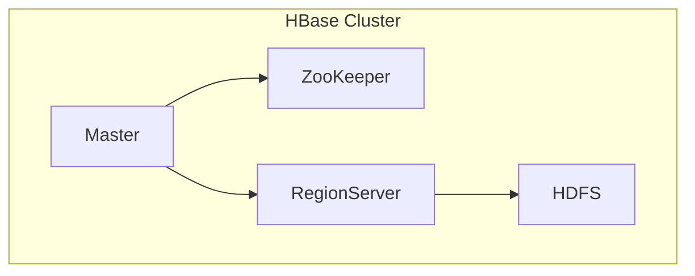

## 1. 背景介绍

### 1.1 HBase 简介

HBase是一个分布式、可扩展、高可靠性的NoSQL数据库，它构建在Hadoop分布式文件系统（HDFS）之上，旨在提供对大型数据集的低延迟随机访问。HBase 的设计灵感来自于 Google 的 Bigtable，它采用了类似的数据模型和架构。

HBase 非常适合存储稀疏数据，这意味着数据集中只有少数列包含值。这种特性使得 HBase 成为存储日志、时间序列数据、社交媒体数据等各种应用的理想选择。

### 1.2 Master 角色

在 HBase 集群中，Master 服务器扮演着至关重要的角色。它负责管理和监控整个集群的运行状态，包括：

* **表管理:** 创建、删除、修改表结构。
* **Region 管理:** 分配 Region 到 RegionServer，监控 RegionServer 的负载和健康状态，执行 Region 的分割和合并。
* **ZooKeeper 交互:** 与 ZooKeeper 进行通信，获取集群状态信息，维护集群元数据。

### 1.3 源码分析的意义

深入理解 HBase Master 的工作原理对于以下方面至关重要：

* **性能优化:** 了解 Master 的内部机制可以帮助我们优化集群性能，例如调整 Region 分配策略、优化 RegionServer 的负载均衡等。
* **故障排除:** 当集群出现问题时，深入了解 Master 的源码可以帮助我们快速定位问题根源，并采取相应的措施进行修复。
* **二次开发:** 如果需要对 HBase 进行二次开发，那么深入理解 Master 的源码是必不可少的。


## 2. 核心概念与联系

### 2.1 ZooKeeper

ZooKeeper 是一个分布式协调服务，用于维护配置信息、命名、提供分布式同步和提供组服务。在 HBase 中，ZooKeeper 用于：

* **Master 选举:** 确保只有一个 Master 节点处于活动状态。
* **RegionServer 注册:** RegionServer 通过 ZooKeeper 向 Master 注册，以便 Master 可以监控它们的健康状态。
* **元数据存储:** 存储 HBase 集群的元数据，例如表结构、Region 分配信息等。

### 2.2 Region

Region 是 HBase 表的水平分区，每个 Region 存储表的一部分数据。Region 由多个 Store 组成，每个 Store 对应一个列族。

### 2.3 RegionServer

RegionServer 负责管理和提供 Region 的读写服务。每个 RegionServer 可以管理多个 Region。

### 2.4 Master 与其他组件的关系

下图展示了 Master 与其他组件之间的关系：



## 3. 核心算法原理具体操作步骤

### 3.1 Master 启动过程

1. **初始化 ZooKeeper 连接:** Master 首先会初始化与 ZooKeeper 的连接，并创建一个 Master 节点。
2. **选举 Master:** 如果当前没有活动的 Master 节点，则 Master 会参与选举，尝试成为活动的 Master。
3. **获取集群状态:** 一旦 Master 被选举成功，它会从 ZooKeeper 中获取集群状态信息，例如 RegionServer 列表、表结构等。
4. **启动服务:** Master 启动各种服务，例如 Region 分配服务、负载均衡服务等。

### 3.2 Region 分配

当一个新的 Region 被创建或者一个 RegionServer 失效时，Master 需要将 Region 分配到可用的 RegionServer 上。Master 使用以下算法进行 Region 分配：

1. **负载均衡:** Master 尝试将 Region 均匀地分配到各个 RegionServer 上，以避免负载集中。
2. **数据本地化:** Master 优先将 Region 分配到存储 Region 数据的 RegionServer 上，以减少数据传输成本。

### 3.3 Region 分割与合并

当一个 Region 的大小超过预设的阈值时，Master 会将其分割成多个子 Region。相反，当多个 Region 的大小低于预设的阈值时，Master 会将其合并成一个更大的 Region。

### 3.4 Master 故障处理

当 Master 节点失效时，ZooKeeper 会通知其他 Master 节点参与选举，选出一个新的 Master 节点。新的 Master 节点会接管失效 Master 节点的职责，继续管理 HBase 集群。


## 4. 数学模型和公式详细讲解举例说明

HBase Master 的工作原理涉及到很多算法和数据结构，例如一致性哈希、负载均衡算法等。由于篇幅限制，这里不再详细展开。


## 5. 项目实践：代码实例和详细解释说明

以下代码展示了如何使用 HBase Java API 创建一个 HBase 表：

```java
Configuration config = HBaseConfiguration.create();
Connection connection = ConnectionFactory.createConnection(config);
Admin admin = connection.getAdmin();

// 创建表描述符
HTableDescriptor tableDescriptor = new HTableDescriptor(TableName.valueOf("test_table"));

// 添加列族
tableDescriptor.addFamily(new HColumnDescriptor("cf"));

// 创建表
admin.createTable(tableDescriptor);

// 关闭连接
admin.close();
connection.close();
```

## 6. 实际应用场景

HBase 广泛应用于各种场景，例如：

* **日志存储:** 存储应用程序日志、系统日志等。
* **时间序列数据:** 存储传感器数据、股票价格等时间序列数据。
* **社交媒体数据:** 存储用户帖子、评论、关注关系等社交媒体数据。
* **推荐系统:** 存储用户行为数据，用于构建推荐系统。


## 7. 工具和资源推荐

以下是一些学习 HBase 的有用工具和资源：

* **Apache HBase 官方网站:** https://hbase.apache.org/
* **HBase: The Definitive Guide:** 一本 comprehensive 的 HBase 书籍。
* **HBase Javadoc:** HBase Java API 的官方文档。


## 8. 总结：未来发展趋势与挑战

HBase 是一个成熟的 NoSQL 数据库，它在未来将会继续发展，以满足不断增长的数据存储需求。以下是一些 HBase 未来发展趋势和挑战：

* **云原生支持:** HBase 将会更好地支持云原生环境，例如 Kubernetes。
* **更高的性能:** HBase 将会继续提升性能，以支持更大规模的数据集和更低的延迟。
* **更强大的安全特性:** HBase 将会增强安全特性，以保护敏感数据。


## 9. 附录：常见问题与解答

### 9.1 如何解决 RegionServer 负载不均衡问题？

可以通过调整 Region 分配策略、优化 RegionServer 的硬件配置等方法解决 RegionServer 负载不均衡问题。

### 9.2 如何监控 HBase 集群的健康状态？

可以使用 HBase UI、JMX、Ganglia 等工具监控 HBase 集群的健康状态。

### 9.3 如何进行 HBase 性能调优？

可以通过调整 HBase 配置参数、优化数据模型、使用缓存等方法进行 HBase 性能调优.
