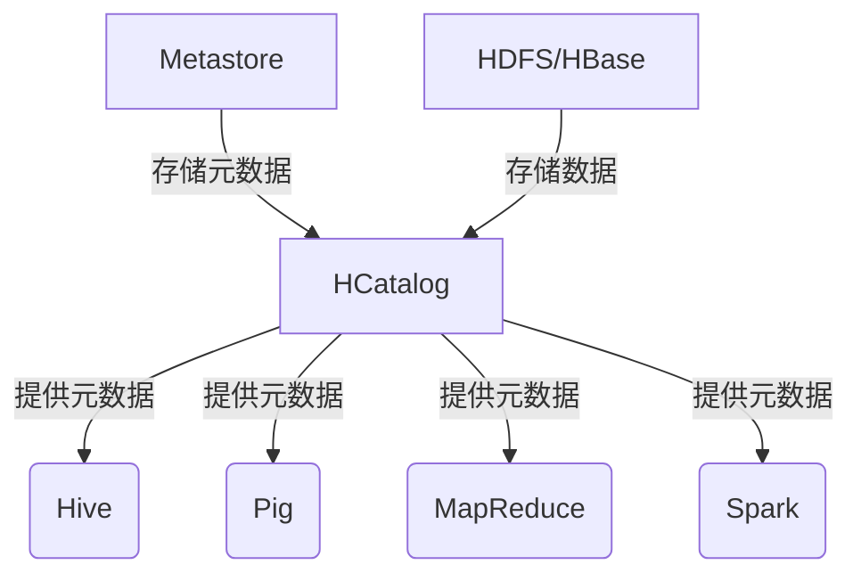
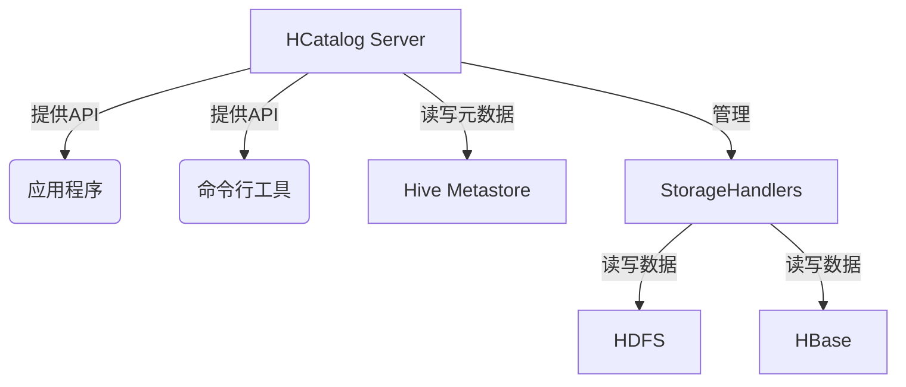

# HCatalog数据治理：元数据质量与一致性

## 1.背景介绍

### 1.1 数据治理的重要性

在当今的数字时代，数据被视为企业的关键资产。随着数据量的快速增长和数据类型的多样化,有效地管理和利用数据对于组织的成功至关重要。数据治理是一种确保数据可靠性、一致性和可用性的方法,它涉及数据的整个生命周期,从数据的创建、存储到使用和销毁。

良好的数据治理实践可以带来诸多好处,包括:

- 提高数据质量和一致性
- 增强数据安全性和隐私保护
- 促进数据共享和协作
- 支持更好的决策和业务洞察力
- 降低合规性风险和成本

### 1.2 Hadoop生态系统中的数据治理挑战

在Hadoop生态系统中,数据通常来自多个异构数据源,存储在不同的数据存储系统中,如HDFS、HBase、Hive等。这种分布式和异构的环境带来了数据治理的挑战:

- 元数据管理: 缺乏统一的元数据管理机制,导致元数据分散、冗余和不一致。
- 数据线程: 复杂的数据处理流程和管道增加了数据一致性和可追溯性的难度。
- 数据访问控制: 确保只有授权用户和应用程序可以访问相关数据。
- 数据生命周期管理: 跟踪和管理数据从创建到归档或删除的整个生命周期。

为了应对这些挑战,Apache Hive社区推出了HCatalog,作为一种元数据管理和数据治理解决方案。

## 2.核心概念与联系

### 2.1 Apache HCatalog概述

Apache HCatalog是Hadoop生态系统中的一个元数据服务,旨在提供统一的元数据管理层。它允许不同的数据处理工具(如Pig、MapReduce、Hive等)共享和访问相同的元数据,从而提高了数据的可发现性、可访问性和可重用性。

HCatalog的主要特性包括:

- 元数据存储库: 提供一个集中式的元数据存储库,用于存储表、分区和数据文件的元数据。
- 表抽象层: 定义了一种统一的表抽象,使不同的数据处理工具可以共享和访问相同的表定义。
- 数据位置透明性: 抽象出数据存储细节,使应用程序无需关注数据的物理位置。
- 安全性: 支持基于角色的访问控制(RBAC)和数据屏蔽,保护敏感数据。

### 2.2 HCatalog与其他Hadoop组件的关系

HCatalog与Hadoop生态系统中的其他组件紧密集成,如下图所示:



- **Hive**: HCatalog为Hive提供元数据服务,使Hive可以访问和管理表、分区和数据文件的元数据。
- **Pig**: Pig可以使用HCatalog来读取和写入数据,而不必关注数据的物理存储位置。
- **MapReduce**: MapReduce作业可以通过HCatalog访问表和数据文件的元数据,简化了数据处理流程。
- **Spark**: Spark可以利用HCatalog来访问和管理Hive表的元数据。
- **Metastore**: HCatalog使用Hive Metastore作为元数据存储库。
- **HDFS/HBase**: HCatalog支持将数据存储在HDFS或HBase中。

通过与这些组件的集成,HCatalog为Hadoop生态系统提供了一致的元数据管理和数据治理解决方案。

## 3.核心算法原理具体操作步骤

### 3.1 HCatalog架构

HCatalog的核心架构由以下几个主要组件组成:

1. **HCatalog Server**: 提供RESTful API和基于Thrift的API,用于管理元数据和执行DDL操作。
2. **HCatalog客户端**: 提供Java API和命令行工具,供应用程序和用户与HCatalog Server进行交互。
3. **HCatalog存储处理程序(StorageHandlers)**: 定义了如何读写不同类型的数据存储系统(如HDFS、HBase等)。
4. **Hive Metastore**: 存储表、分区和数据文件的元数据。
5. **数据存储系统(HDFS、HBase等)**: 实际存储数据文件。

下图展示了HCatalog的整体架构:



### 3.2 HCatalog工作流程

1. **创建表**: 使用HCatalog客户端或API创建一个新表。HCatalog Server会将表的元数据信息存储在Hive Metastore中。

2. **数据加载**: 将数据文件加载到指定的数据存储系统(如HDFS或HBase)中。可以使用HCatalog提供的工具或API进行数据加载。

3. **查询数据**: 应用程序或用户可以通过HCatalog Server查询表的元数据和数据。HCatalog Server会与相应的StorageHandler交互,从底层数据存储系统读取数据。

4. **数据更新**: 应用程序或用户可以通过HCatalog Server对表进行更新操作,如插入、更新或删除数据。HCatalog Server会与相应的StorageHandler交互,并更新Hive Metastore中的元数据。

5. **元数据管理**: HCatalog提供了一系列命令和API,用于管理表、分区和数据文件的元数据,如创建、修改、删除等操作。

通过这种工作流程,HCatalog为Hadoop生态系统中的不同工具和应用程序提供了一致的元数据视图和数据访问接口,简化了数据管理和治理流程。

## 4.数学模型和公式详细讲解举例说明

在讨论HCatalog的数学模型和公式之前,我们需要先了解一些基本概念:

1. **元数据(Metadata)**: 描述数据的结构化信息,包括数据的名称、类型、大小、位置等。元数据可以帮助组织和管理数据。

2. **数据质量(Data Quality)**: 衡量数据满足预期用途的程度。常见的数据质量维度包括完整性、准确性、一致性、及时性和可解释性。

3. **一致性(Consistency)**: 指数据在不同来源或不同时间点之间保持一致,没有矛盾或冲突。

在HCatalog中,元数据质量和一致性是确保数据治理有效性的关键因素。我们可以使用一些数学模型和公式来量化和评估元数据质量。

### 4.1 元数据完整性模型

元数据完整性是指元数据记录是否包含所需的所有属性值。我们可以使用以下公式来计算元数据完整性分数:

$$
\text{Metadata Completeness Score} = \frac{\sum_{i=1}^{n}c_i}{n}
$$

其中:
- $n$ 是元数据记录中的属性数量
- $c_i$ 是第 $i$ 个属性的完整性分数,如果属性值存在且非空,则为 1,否则为 0

完整性分数的范围是 [0, 1],分数越高,元数据完整性越好。

### 4.2 元数据一致性模型

元数据一致性是指不同来源的元数据记录之间是否存在矛盾或冲突。我们可以使用以下公式来计算元数据一致性分数:

$$
\text{Metadata Consistency Score} = 1 - \frac{\sum_{i=1}^{m}w_i\cdot d_i}{\sum_{i=1}^{m}w_i}
$$

其中:
- $m$ 是不同元数据来源的数量
- $d_i$ 是第 $i$ 个来源的元数据与其他来源的差异程度,范围为 [0, 1]
- $w_i$ 是第 $i$ 个来源的权重,反映了该来源的重要性

一致性分数的范围也是 [0, 1],分数越高,元数据一致性越好。

以上模型和公式可以帮助我们量化和评估HCatalog中的元数据质量,从而指导元数据管理和优化策略。但是,实际应用中还需要考虑具体的业务需求和数据特征,可能需要对模型进行调整和扩展。

## 4.项目实践: 代码实例和详细解释说明

在本节中,我们将通过一个实际项目来演示如何使用HCatalog进行元数据管理和数据治理。我们将创建一个Hive表,并使用HCatalog对其进行元数据管理。

### 4.1 创建Hive表

首先,我们需要在Hive中创建一个表。这个表将存储一些虚构的用户数据,包括用户ID、姓名、电子邮件和注册日期。

```sql
CREATE TABLE users (
  user_id INT,
  name STRING,
  email STRING,
  registration_date DATE
)
PARTITIONED BY (country STRING)
ROW FORMAT DELIMITED
FIELDS TERMINATED BY ','
STORED AS TEXTFILE;
```

在上面的语句中,我们创建了一个名为 `users` 的表,包含四个列:用户ID、姓名、电子邮件和注册日期。此外,我们还指定了一个分区列 `country`,用于根据国家/地区对数据进行分区存储。

### 4.2 使用HCatalog管理元数据

接下来,我们将使用HCatalog来管理这个表的元数据。首先,我们需要启动HCatalog Server:

```bash
$ hcat_server.sh start
```

然后,我们可以使用HCatalog命令行工具 `hcat` 来查看和操作表的元数据。

1. 列出所有表:

```
$ hcat -e "show tables;"
users
```

2. 查看表的详细元数据:

```
$ hcat -e "describe extended users;"
+-------------+------------+----------+
|   col_name  | col_type   | comment  |
+-------------+------------+----------+
| user_id     | int        |          |
| name        | string     |          |
| email       | string     |          |
| registration_date | date       |          |
|             |            |          |
+-------------+------------+----------+
Partition Information:
+-------------+------------+----------+
|   col_name  | col_type   | comment  |
+-------------+------------+----------+
| country     | string     |          |
+-------------+------------+----------+

# Detailed Table Information
Database:           default
Owner:              root
CreateTime:         Sun Jun 04 15:46:29 UTC 2023
LastAccessTime:     UNKNOWN
Retention:          0
Location:           hdfs://localhost:9000/user/hive/warehouse/users
Table Type:         MANAGED_TABLE
Table Parameters:
...
```

在上面的输出中,我们可以看到表的结构、分区信息以及其他元数据,如表的位置、创建时间等。

3. 添加分区:

我们可以使用HCatalog向表中添加新的分区,而无需手动创建数据文件。

```
$ hcat -e "alter table users add partition (country='US') location '/user/data/users/US';"
$ hcat -e "alter table users add partition (country='CN') location '/user/data/users/CN';"
```

上面的语句将为 `users` 表添加两个新分区,分别对应美国(US)和中国(CN)。我们还指定了每个分区的数据位置。

4. 删除分区:

如果需要,我们也可以删除表中的分区。

```
$ hcat -e "alter table users drop partition (country='CN');"
```

这条语句将从 `users` 表中删除中国(CN)分区。

通过上面的示例,我们可以看到HCatalog提供了强大的元数据管理功能,可以方便地创建、查看、修改和删除表和分区的元数据。这对于确保元数据的质量和一致性至关重要。

## 5.实际应用场景

HCatalog在Hadoop生态系统中有着广泛的应用场景,特别是在数据治理和元数据管理方面。以下是一些典型的应用场景:

### 5.1 数据湖管理

在构建数据湖时,HCatalog可以用于管理来自多个异构数据源的元数据,并提供统一的数据访问接口。这有助于提高数据