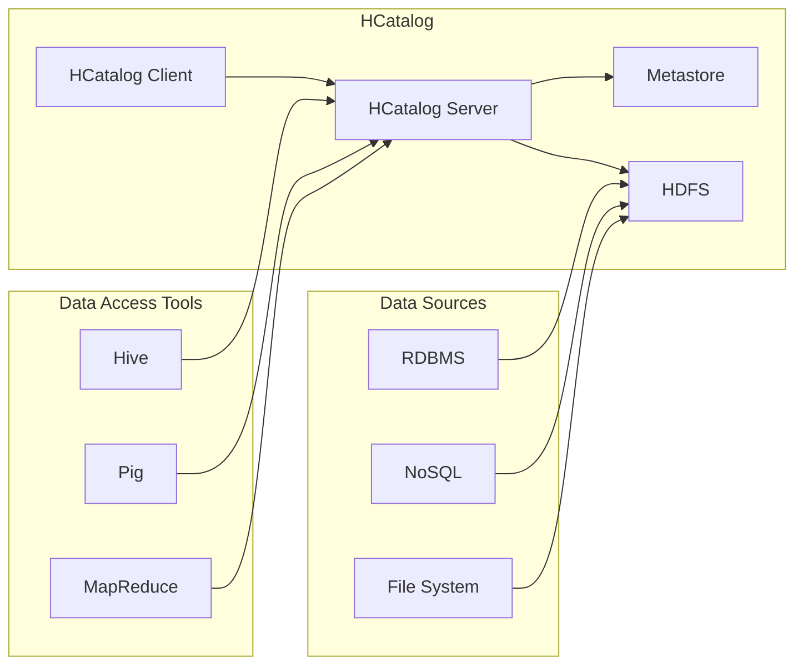

## 1. 背景介绍

### 1.1 大数据时代的数据融合挑战

随着互联网、物联网、云计算等技术的快速发展，全球数据量呈爆炸式增长，大数据时代已经到来。海量数据的出现为各行各业带来了前所未有的机遇，但也带来了巨大的挑战，其中之一就是数据融合与集成问题。

传统的数据集成方法难以应对大数据场景下的复杂需求，主要体现在以下几个方面：

* **数据规模庞大：**  大数据场景下，数据量通常以PB甚至EB级别计，传统的数据集成工具难以处理如此规模的数据。
* **数据类型多样化：**  大数据不仅包含结构化数据，还包括半结构化和非结构化数据，如文本、图像、音频、视频等，对数据集成工具提出了更高的要求。
* **数据来源分散：**  大数据通常来自多个不同的数据源，如关系型数据库、NoSQL数据库、文件系统、消息队列等，需要将这些数据整合到一起进行分析和利用。
* **实时性要求高：**  许多大数据应用场景需要实时或近实时地处理数据，对数据集成工具的性能提出了更高的要求。

### 1.2 HCatalog 应运而生

为了解决大数据时代的数据融合与集成难题，Apache HCatalog应运而生。HCatalog是基于Hadoop生态系统构建的数据管理工具，它提供了一种统一的方式来访问和管理存储在Hadoop分布式文件系统（HDFS）中的数据， regardless of the data format or schema.

HCatalog的主要功能包括：

* **数据抽象：**  HCatalog提供了一种统一的数据抽象层，将不同数据源的数据抽象为表和分区，方便用户进行查询和分析。
* **数据发现：**  HCatalog提供了一个元数据存储库，用于存储数据表的元数据信息，如表名、字段名、数据类型、存储位置等，方便用户快速发现和理解数据。
* **数据访问：**  HCatalog支持多种数据访问方式，包括HiveQL、Pig Latin、MapReduce等，方便用户使用不同的工具进行数据分析。

### 1.3 HCatalog 的优势

HCatalog相比传统数据集成工具，具有以下优势：

* **可扩展性强：**  HCatalog基于Hadoop生态系统构建，可以处理PB级别的数据，并支持横向扩展，可以轻松应对数据量的增长。
* **灵活性高：**  HCatalog支持多种数据格式，包括结构化、半结构化和非结构化数据，可以方便地集成来自不同数据源的数据。
* **易用性好：**  HCatalog提供了一套简单易用的API和命令行工具，方便用户进行数据管理和分析。
* **成本低廉：**  HCatalog是开源软件，可以免费使用，并且可以运行在廉价的硬件平台上，可以有效降低数据集成成本。

## 2. 核心概念与联系

### 2.1 数据模型

HCatalog使用关系型数据库中的表和分区概念来组织和管理数据。

* **表：**  表是HCatalog中的基本数据单元，它代表一个逻辑数据集，由多个列组成，每个列都有自己的数据类型。
* **分区：**  分区是表的子集，用于将表的数据划分成更小的块，方便用户进行数据管理和查询。

### 2.2 元数据存储

HCatalog将数据表的元数据信息存储在一个集中式的元数据存储库中，该存储库可以是关系型数据库或其他类型的存储系统。元数据信息包括：

* 表名
* 字段名
* 数据类型
* 存储位置
* 分区信息

### 2.3 数据访问

HCatalog支持多种数据访问方式，包括：

* **HiveQL：**  HiveQL是Hive的数据查询语言，用户可以使用HiveQL查询HCatalog中的数据。
* **Pig Latin：**  Pig Latin是Pig的数据处理语言，用户可以使用Pig Latin处理HCatalog中的数据。
* **MapReduce：**  MapReduce是Hadoop的分布式计算框架，用户可以使用MapReduce程序读取和处理HCatalog中的数据。

### 2.4 架构图



## 3. 核心算法原理具体操作步骤

### 3.1 创建数据库和表

可以使用HiveQL或HCatalog命令行工具创建数据库和表。

**使用HiveQL创建数据库和表：**

```sql
CREATE DATABASE my_database;

CREATE TABLE my_table (
  id INT,
  name STRING,
  age INT
)
PARTITIONED BY (year INT, month INT);
```

**使用HCatalog命令行工具创建数据库和表：**

```
hcat -create -d my_database
hcat -create -t my_database.my_table -s 'id INT, name STRING, age INT' -p 'year:int,month:int'
```

### 3.2 添加数据

可以使用HiveQL、Pig Latin、MapReduce或HCatalog命令行工具将数据添加到HCatalog表中。

**使用HiveQL添加数据：**

```sql
LOAD DATA INPATH '/path/to/data' INTO TABLE my_table
PARTITION (year=2023, month=12);
```

**使用HCatalog命令行工具添加数据：**

```
hcat -load -d my_database -t my_table -p 'year=2023,month=12' -f '/path/to/data'
```

### 3.3 查询数据

可以使用HiveQL或HCatalog命令行工具查询HCatalog表中的数据。

**使用HiveQL查询数据：**

```sql
SELECT * FROM my_table
WHERE year=2023 AND month=12;
```

**使用HCatalog命令行工具查询数据：**

```
hcat -show -d my_database -t my_table -p 'year=2023,month=12'
```

## 4. 数学模型和公式详细讲解举例说明

HCatalog本身没有涉及特定的数学模型或公式。它主要关注数据管理和集成，利用Hadoop生态系统的分布式计算能力来处理大规模数据。

## 5. 项目实践：代码实例和详细解释说明

以下是一个使用HCatalog进行数据融合的简单示例：

**场景：** 将存储在关系型数据库中的用户信息和存储在HDFS上的用户行为数据进行融合，以便进行更全面的用户分析。

**步骤：**

1. **创建HCatalog数据库和表：**

```sql
CREATE DATABASE user_data;

CREATE TABLE user_info (
  user_id INT,
  name STRING,
  email STRING
);

CREATE TABLE user_behavior (
  user_id INT,
  timestamp TIMESTAMP,
  action STRING
)
PARTITIONED BY (date STRING);
```

2. **将关系型数据库中的用户信息导入HCatalog：**

```sql
-- 使用Sqoop将数据从关系型数据库导入HDFS
sqoop import \
  --connect jdbc:mysql://localhost:3306/my_database \
  --username my_user \
  --password my_password \
  --table user_info \
  --target-dir /user/hive/warehouse/user_data.db/user_info

-- 使用HiveQL将数据从HDFS加载到HCatalog表中
LOAD DATA INPATH '/user/hive/warehouse/user_data.db/user_info' INTO TABLE user_info;
```

3. **将HDFS上的用户行为数据导入HCatalog：**

```sql
-- 使用HiveQL将数据从HDFS加载到HCatalog表中
LOAD DATA INPATH '/path/to/user_behavior_data' INTO TABLE user_behavior
PARTITION (date='2023-12-18');
```

4. **使用HiveQL查询融合后的数据：**

```sql
SELECT ui.name, ub.action, ub.timestamp
FROM user_info ui
JOIN user_behavior ub ON ui.user_id = ub.user_id
WHERE ub.date = '2023-12-18';
```

## 6. 实际应用场景

HCatalog可以应用于各种大数据应用场景，包括：

* **数据仓库：**  HCatalog可以用于构建企业级数据仓库，将来自不同数据源的数据整合到一起进行分析和利用。
* **商业智能：**  HCatalog可以用于支持商业智能应用，提供统一的数据访问层，方便用户进行数据分析和报表生成。
* **机器学习：**  HCatalog可以用于准备机器学习所需的数据，将来自不同数据源的数据整合到一起进行特征工程和模型训练。

## 7. 总结：未来发展趋势与挑战

HCatalog作为Hadoop生态系统中的重要数据管理工具，未来将继续发展和完善，以应对不断变化的大数据应用需求。

**未来发展趋势：**

* **与其他数据管理工具集成：**  HCatalog将与其他数据管理工具（如Apache Atlas、Apache Ranger）进行更紧密的集成，提供更全面的数据治理和安全功能。
* **支持更多数据格式：**  HCatalog将支持更多的数据格式，包括 Avro、Parquet、ORC 等，以提高数据存储效率和查询性能。
* **提供更丰富的API：**  HCatalog将提供更丰富的API，方便用户进行数据管理和分析。

**挑战：**

* **性能优化：**  随着数据量的不断增长，HCatalog需要不断优化其性能，以满足大规模数据处理的需求。
* **安全性：**  HCatalog需要提供更强大的安全功能，以保护敏感数据免受未授权访问。
* **易用性：**  HCatalog需要不断改进其易用性，方便用户进行数据管理和分析。

## 8. 附录：常见问题与解答

**Q：HCatalog与Hive有什么区别？**

**A：** Hive是一个数据仓库系统，它提供了数据查询和分析功能。HCatalog是Hive的一个子项目，它提供了一种统一的方式来访问和管理存储在HDFS中的数据， regardless of the data format or schema.

**Q：HCatalog支持哪些数据格式？**

**A：** HCatalog支持多种数据格式，包括文本文件、CSV文件、JSON文件、ORC文件、Parquet文件等。

**Q：如何将数据添加到HCatalog表中？**

**A：** 可以使用HiveQL、Pig Latin、MapReduce或HCatalog命令行工具将数据添加到HCatalog表中。

**Q：如何查询HCatalog表中的数据？**

**A：** 可以使用HiveQL或HCatalog命令行工具查询HCatalog表中的数据。
