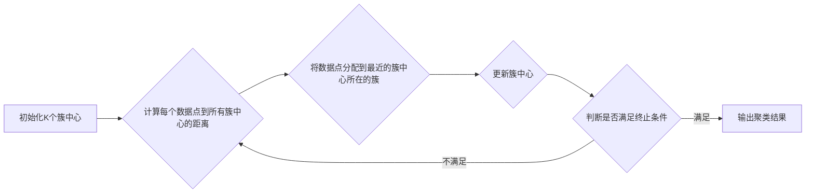

# K-Means聚类算法的几何解释与可视化展示

作者：禅与计算机程序设计艺术

## 1. 背景介绍

### 1.1 聚类分析概述

聚类分析是一种无监督学习方法，旨在将数据集中的对象分组到不同的簇中，使得同一簇内的对象彼此相似，而不同簇之间的对象则彼此不同。它广泛应用于各种领域，如市场营销、图像分割、生物信息学等。

### 1.2 K-Means算法的提出与发展

K-Means算法是一种经典的聚类算法，由Lloyd于1957年提出，并由MacQueen于1967年正式命名。其核心思想是将数据集划分为K个簇，并通过迭代优化过程找到每个簇的中心点，使得所有数据点到其所属簇中心点的距离之和最小化。

### 1.3 K-Means算法的优势与局限性

K-Means算法具有简单易懂、计算效率高等优点，但同时也存在一些局限性，例如对初始中心点敏感、容易陷入局部最优解等。

## 2. 核心概念与联系

### 2.1 数据点与特征空间

K-Means算法将每个对象表示为一个数据点，每个数据点由多个特征描述。所有数据点构成了特征空间。

### 2.2 簇与簇中心

簇是指数据集中具有相似特征的数据点集合。簇中心是指每个簇的中心点，它代表了该簇的平均特征。

### 2.3 距离度量

距离度量用于衡量数据点之间的相似性。常用的距离度量包括欧氏距离、曼哈顿距离等。

### 2.4 迭代优化过程

K-Means算法通过迭代优化过程找到最佳的簇划分和簇中心。每次迭代包括两个步骤：

* **分配数据点到最近的簇中心**：计算每个数据点到所有簇中心的距离，并将数据点分配到距离最近的簇中心所在的簇。
* **更新簇中心**：计算每个簇中所有数据点的平均值，并将该平均值作为新的簇中心。

## 3. 核心算法原理具体操作步骤

### 3.1 算法流程图



### 3.2 算法步骤详解

1. **初始化K个簇中心**：随机选择K个数据点作为初始簇中心。
2. **计算每个数据点到所有簇中心的距离**：使用选定的距离度量计算每个数据点到所有簇中心的距离。
3. **将数据点分配到最近的簇中心所在的簇**：将每个数据点分配到距离最近的簇中心所在的簇。
4. **更新簇中心**：计算每个簇中所有数据点的平均值，并将该平均值作为新的簇中心。
5. **判断是否满足终止条件**：如果簇中心不再变化或达到最大迭代次数，则终止迭代过程。
6. **输出聚类结果**：输出最终的簇划分和簇中心。

## 4. 数学模型和公式详细讲解举例说明

### 4.1 目标函数

K-Means算法的目标函数是**最小化所有数据点到其所属簇中心点的距离之和**，即：

$$
J = \sum_{i=1}^{K} \sum_{x \in C_i} ||x - \mu_i||^2
$$

其中，$K$表示簇的数量，$C_i$表示第$i$个簇，$x$表示数据点，$\mu_i$表示第$i$个簇的中心点。

### 4.2 举例说明

假设有一个二维数据集，包含5个数据点：

```
x1 = (1, 2)
x2 = (2, 1)
x3 = (3, 4)
x4 = (4, 3)
x5 = (5, 5)
```

我们希望将这些数据点聚类到2个簇中。

1. **初始化簇中心**：随机选择$x1$和$x3$作为初始簇中心：

```
μ1 = (1, 2)
μ2 = (3, 4)
```

2. **计算距离**：使用欧氏距离计算每个数据点到两个簇中心的距离：

```
||x1 - μ1|| = 0
||x1 - μ2|| = 2.83

||x2 - μ1|| = 1.41
||x2 - μ2|| = 2.24

||x3 - μ1|| = 2.83
||x3 - μ2|| = 0

||x4 - μ1|| = 3.61
||x4 - μ2|| = 1.41

||x5 - μ1|| = 4.24
||x5 - μ2|| = 2.83
```

3. **分配数据点**：将每个数据点分配到距离最近的簇中心所在的簇：

```
C1 = {x1, x2}
C2 = {x3, x4, x5}
```

4. **更新簇中心**：计算每个簇中所有数据点的平均值，并将该平均值作为新的簇中心：

```
μ1 = (1.5, 1.5)
μ2 = (4, 4)
```

5. **重复步骤2-4**，直到簇中心不再变化或达到最大迭代次数。

## 5. 项目实践：代码实例和详细解释说明

### 5.1 Python代码实现

```python
import numpy as np
import matplotlib.pyplot as plt

def kmeans(X, k, max_iters=100):
    """
    K-Means聚类算法实现

    参数：
        X：数据矩阵，每行代表一个数据点
        k：簇的数量
        max_iters：最大迭代次数

    返回值：
        centroids：簇中心矩阵
        labels：每个数据点所属的簇的标签
    """

    # 随机初始化簇中心
    n_samples = X.shape[0]
    indices = np.random.choice(n_samples, k, replace=False)
    centroids = X[indices]

    # 迭代优化
    for _ in range(max_iters):
        # 计算每个数据点到所有簇中心的距离
        distances = np.linalg.norm(X[:, np.newaxis] - centroids, axis=2)

        # 将数据点分配到最近的簇中心所在的簇
        labels = np.argmin(distances, axis=1)

        # 更新簇中心
        for i in range(k):
            centroids[i] = np.mean(X[labels == i], axis=0)

    return centroids, labels

# 生成示例数据
X = np.array([[1, 2], [2, 1], [3, 4], [4, 3], [5, 5]])

# 设置簇的数量
k = 2

# 运行K-Means算法
centroids, labels = kmeans(X, k)

# 打印聚类结果
print("簇中心：", centroids)
print("标签：", labels)

# 可视化聚类结果
plt.scatter(X[:, 0], X[:, 1], c=labels)
plt.scatter(centroids[:, 0], centroids[:, 1], marker='x', s=200, linewidths=3, color='r')
plt.title("K-Means聚类结果")
plt.show()
```

### 5.2 代码解释

* `kmeans()`函数实现了K-Means算法，输入参数包括数据矩阵`X`、簇的数量`k`和最大迭代次数`max_iters`。
* `np.random.choice()`函数用于随机选择`k`个数据点作为初始簇中心。
* `np.linalg.norm()`函数用于计算每个数据点到所有簇中心的欧氏距离。
* `np.argmin()`函数用于找到距离最小的簇中心的索引。
* `np.mean()`函数用于计算每个簇中所有数据点的平均值。
* `plt.scatter()`函数用于绘制散点图，`c`参数指定点的颜色，`marker`参数指定点的形状，`s`参数指定点的大小，`linewidths`参数指定点的线宽，`color`参数指定点的颜色。

## 6. 实际应用场景

### 6.1 市场营销

* **客户细分**: 根据客户的购买历史、偏好等特征将客户划分为不同的群体，以便进行精准营销。
* **产品推荐**: 根据用户的浏览历史、购买记录等特征将用户划分为不同的群体，以便推荐更符合用户需求的产品。

### 6.2 图像分割

* **图像聚类**: 将图像中的像素点根据颜色、纹理等特征划分为不同的区域，以便进行图像分析和理解。
* **目标识别**: 将图像中的目标物体根据形状、颜色等特征划分为不同的类别，以便进行目标识别和跟踪。

### 6.3 生物信息学

* **基因表达分析**: 将基因根据表达水平划分为不同的簇，以便研究基因的功能和调控机制。
* **蛋白质结构预测**: 将蛋白质的氨基酸序列根据结构特征划分为不同的簇，以便预测蛋白质的三维结构。

## 7. 工具和资源推荐

### 7.1 Scikit-learn

Scikit-learn是一个开源的机器学习库，提供了丰富的聚类算法实现，包括K-Means算法。

### 7.2 TensorFlow

TensorFlow是一个开源的深度学习框架，也提供了K-Means算法的实现。

### 7.3 Weka

Weka是一个开源的数据挖掘工具，提供了图形化界面和命令行接口，方便用户进行聚类分析。

## 8. 总结：未来发展趋势与挑战

### 8.1 未来发展趋势

* **大规模数据集**: 随着数据量的不断增加，需要开发更高效的K-Means算法来处理大规模数据集。
* **高维数据**: 现实世界中的数据通常具有很高的维度，需要开发能够处理高维数据的K-Means算法。
* **复杂数据**: 现实世界中的数据通常具有复杂的结构，需要开发能够处理复杂数据的K-Means算法。

### 8.2 挑战

* **初始中心点选择**: K-Means算法对初始中心点敏感，需要开发更 robust 的初始化方法。
* **局部最优解**: K-Means算法容易陷入局部最优解，需要开发更有效的优化算法来找到全局最优解。
* **簇数量选择**: K-Means算法需要预先确定簇的数量，需要开发自动确定最佳簇数量的方法。

## 9. 附录：常见问题与解答

### 9.1 如何选择合适的K值？

* **肘部法则**: 绘制不同K值对应的目标函数值曲线，选择曲线“肘部”对应的K值。
* **轮廓系数**: 计算每个数据点的轮廓系数，选择轮廓系数最高的K值。

### 9.2 如何避免局部最优解？

* **多次随机初始化**: 使用不同的随机种子多次运行K-Means算法，选择目标函数值最小的结果。
* **K-Means++**: 使用K-Means++算法初始化簇中心，可以有效避免局部最优解。

### 9.3 K-Means算法的优缺点？

**优点**:

* 简单易懂
* 计算效率高

**缺点**:

* 对初始中心点敏感
* 容易陷入局部最优解
* 需要预先确定簇的数量