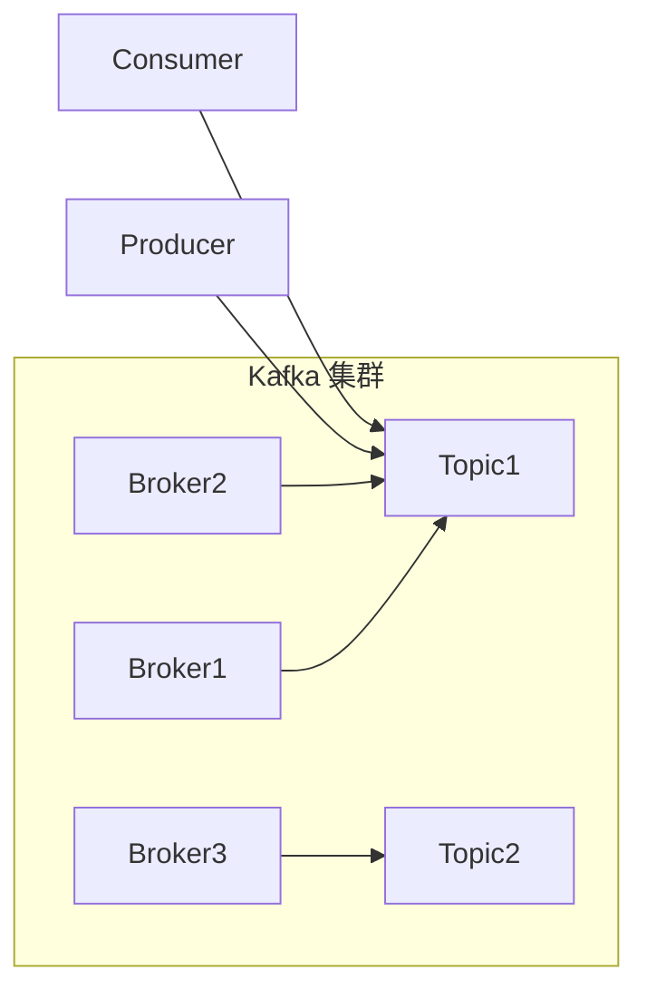

## 1. 背景介绍

### 1.1 消息队列概述

消息队列（Message Queue）是一种异步的通信协议，它允许发送者和接收者在不同的时间进行通信。发送者将消息发送到队列中，接收者从队列中读取消息。消息队列可以用于各种应用场景，例如：

* **异步处理：** 将耗时的任务放入队列中，以便立即返回响应，提高用户体验。
* **应用解耦：** 将不同的应用程序模块解耦，提高系统的可维护性和可扩展性。
* **流量削峰：** 缓冲突发流量，防止系统过载。

### 1.2 Kafka 简介

Kafka 是一个分布式的、高吞吐量、低延迟的发布-订阅消息系统。它最初由 LinkedIn 开发，并于 2011 年开源。Kafka 的主要特点包括：

* **高吞吐量：** Kafka 能够处理每秒数百万条消息。
* **低延迟：** Kafka 的消息传递延迟非常低，通常在毫秒级别。
* **持久化：** Kafka 将消息持久化到磁盘，保证消息的可靠性。
* **可扩展性：** Kafka 可以轻松地扩展到数百个节点，处理大量数据。
* **容错性：** Kafka 具有高容错性，即使部分节点故障，仍然可以继续工作。

## 2. 核心概念与联系

### 2.1 主题（Topic）

主题是 Kafka 中的消息类别。生产者将消息发布到特定的主题，消费者订阅特定的主题以接收消息。

### 2.2 分区（Partition）

每个主题被分成多个分区，每个分区是一个有序的、不可变的消息序列。分区可以分布在多个 Kafka broker 上，以实现负载均衡和容错。

### 2.3 生产者（Producer）

生产者负责将消息发布到 Kafka 主题。生产者可以指定消息的 key，用于将消息分配到特定的分区。

### 2.4 消费者（Consumer）

消费者负责从 Kafka 主题订阅和接收消息。消费者可以组成消费者组，共同消费主题中的消息。

### 2.5 Broker

Broker 是 Kafka 集群中的服务器，负责存储和管理消息。

### 2.6 关系图



## 3. 核心算法原理具体操作步骤

### 3.1 生产者发送消息流程

1. **序列化消息：** 生产者将消息序列化成字节数组。
2. **确定目标分区：** 根据消息的 key 和分区器算法，确定消息的目标分区。
3. **发送消息到 Broker：** 生产者将消息发送到目标分区的 leader 副本所在的 Broker。
4. **写入消息到分区：** Broker 将消息追加到分区日志的末尾。
5. **确认消息发送成功：** Broker 向生产者发送确认消息。

### 3.2 消费者接收消息流程

1. **加入消费者组：** 消费者加入一个消费者组，并指定要订阅的主题。
2. **分配分区：** 消费者组中的消费者共同分配主题的分区，每个消费者负责消费一部分分区。
3. **获取消息：** 消费者从分配的分区中获取消息。
4. **反序列化消息：** 消费者将消息反序列化成原始数据类型。
5. **提交偏移量：** 消费者定期提交已消费消息的偏移量，以便在发生故障时可以恢复消费进度。

## 4. 数学模型和公式详细讲解举例说明

### 4.1 分区分配算法

Kafka 提供了几种分区分配算法，用于将主题的分区分配给消费者组中的消费者。常见的算法包括：

* **Range 分配：** 将分区按范围分配给消费者。
* **RoundRobin 分配：** 将分区轮流分配给消费者。
* **Sticky 分配：** 尽量保持现有的分区分配，减少分区迁移。

### 4.2 消息确认机制

Kafka 提供了三种消息确认机制：

* **acks=0：** 生产者不等待 Broker 的确认消息，消息发送速度最快，但可靠性最低。
* **acks=1：** 生产者等待分区 leader 副本的确认消息，可靠性较高。
* **acks=all：** 生产者等待所有副本的确认消息，可靠性最高，但速度最慢。

## 5. 项目实践：代码实例和详细解释说明

### 5.1 生产者代码示例

```java
import org.apache.kafka.clients.producer.KafkaProducer;
import org.apache.kafka.clients.producer.ProducerConfig;
import org.apache.kafka.clients.producer.ProducerRecord;
import org.apache.kafka.common.serialization.StringSerializer;

import java.util.Properties;

public class KafkaProducerDemo {

    public static void main(String[] args) {
        // 设置 Kafka Producer 的配置
        Properties props = new Properties();
        props.put(ProducerConfig.BOOTSTRAP_SERVERS_CONFIG, "localhost:9092");
        props.put(ProducerConfig.KEY_SERIALIZER_CLASS_CONFIG, StringSerializer.class.getName());
        props.put(ProducerConfig.VALUE_SERIALIZER_CLASS_CONFIG, StringSerializer.class.getName());

        // 创建 Kafka Producer 实例
        KafkaProducer<String, String> producer = new KafkaProducer<>(props);

        // 发送消息
        for (int i = 0; i < 10; i++) {
            ProducerRecord<String, String> record = new ProducerRecord<>("my-topic", "key-" + i, "value-" + i);
            producer.send(record);
        }

        // 关闭 Producer
        producer.close();
    }
}
```

**代码解释：**

* 首先，设置 Kafka Producer 的配置，包括 Kafka broker 地址、key 和 value 的序列化器等。
* 然后，创建 Kafka Producer 实例。
* 接着，使用 `ProducerRecord` 类创建消息，并指定消息的 topic、key 和 value。
* 最后，使用 `producer.send()` 方法发送消息，并关闭 Producer。

### 5.2 消费者代码示例

```java
import org.apache.kafka.