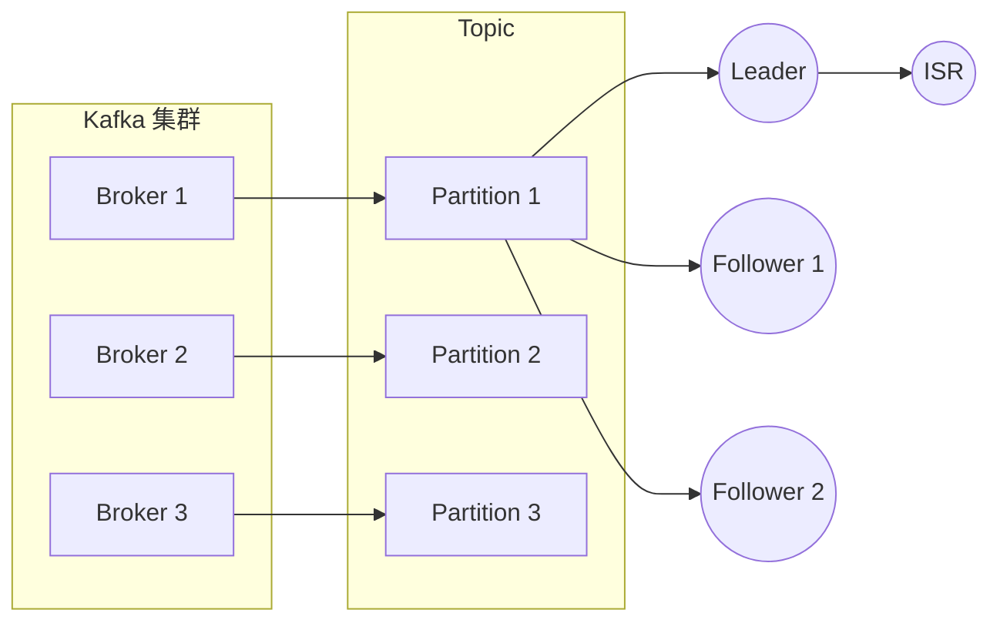

## 1. 背景介绍

### 1.1 分布式系统的挑战

在现代软件开发中，分布式系统已成为主流架构。分布式系统带来了更高的可用性、可扩展性和容错性，但也引入了新的挑战，其中数据一致性是最为关键的挑战之一。

### 1.2 Kafka 的角色

Apache Kafka 作为一款高吞吐量、低延迟的分布式消息队列系统，在处理海量数据和构建实时数据管道方面表现出色。为了确保数据的高可用性和持久性，Kafka 采用了数据复制机制。

### 1.3 Replication 的重要性

Kafka 的复制机制确保了即使部分节点发生故障，数据仍然可以被访问，从而保证了系统的可靠性和容错性。深入理解 Kafka 的复制原理对于构建健壮、可靠的分布式系统至关重要。

## 2. 核心概念与联系

### 2.1 Broker、Topic 和 Partition

- **Broker:** Kafka 集群由多个 Broker 组成，每个 Broker 负责存储一部分数据。
- **Topic:** Kafka 中的消息被组织成 Topic，每个 Topic 代表一个逻辑上的消息类别。
- **Partition:** 为了提高并发性和可扩展性，每个 Topic 被分成多个 Partition，每个 Partition 存储 Topic 的一部分消息。

### 2.2 Leader 和 Follower

每个 Partition 都有一个 Leader 和多个 Follower。Leader 负责处理所有写入请求，并将数据同步到 Follower。Follower 从 Leader 复制数据，并在 Leader 发生故障时接管 Leader 角色。

### 2.3 ISR（In-Sync Replicas）

ISR 是指与 Leader 保持同步的 Follower 集合。只有 ISR 中的 Follower 才能被选举为新的 Leader。

### 2.4 HW（High Watermark）

HW 是指所有 ISR 中 Follower 都已经复制到的消息偏移量。消费者只能消费 HW 之前的消息，以确保数据一致性。

### 2.5 概念联系图



## 3. 核心算法原理具体操作步骤

### 3.1 Leader 选举

当一个 Partition 的 Leader 发生故障时，Kafka 会从 ISR 中选举一个新的 Leader。选举过程基于 ZooKeeper，确保只有一个 Broker 被选举为 Leader。

### 3.2 数据同步

Leader 使用一种称为“pull-based”的机制将数据同步到 Follower。Follower 定期从 Leader 拉取新的消息，并将数据写入本地磁盘。

### 3.3 数据一致性保证

Kafka 通过以下机制保证数据一致性：

- **LEO (Log End Offset):** 每个 Replica 维护一个 LEO，表示其已写入的最后一条消息的偏移量。
- **HW:** 所有 ISR 中 Follower 都已经复制到的消息偏移量。
- **Leader Epoch:** 每个 Leader 都有一个唯一的 Epoch，用于标识 Leader 的任期。Follower 使用 Leader Epoch 来识别过期的 Leader 消息。

### 3.4 具体操作步骤

1. Producer 将消息发送到 Partition 的 Leader。
2. Leader 将消息写入本地日志，并更新 LEO。
3. Follower 从 Leader 拉取新的消息，并将数据写入本地日志。
4. Follower 更新 LEO，并向 Leader 发送确认消息。
5. Leader 收到所有 ISR 中 Follower 的确认消息后，更新 HW。
6. 消费者只能消费 HW 之前的消息。

## 4. 数学模型和公式详细讲解举例说明

### 4.1 数据复制模型

Kafka 的数据复制模型可以使用以下公式表示：

```
Replica_i(t) = Replica_leader(t - Δt_i)
```

其中：

- `Replica_i(t)` 表示 Follower i 在时间 t 的状态。
- `Replica_leader(t)` 表示 Leader 在时间 t 的状态。
- `Δt_i` 表示 Follower i 与 Leader 之间的复制延迟。

### 4.2 数据一致性模型

Kafka 的数据一致性模型可以使用以下公式表示：

```
HW = min(LEO_i) for all i in ISR
```

其中：

- `HW` 表示 High Watermark。
- `LEO_i` 表示 Follower i 的 Log End Offset。

### 4.3 举例说明

假设一个 Partition 有 3 个 Replica，分别是 Leader、Follower 1 和 Follower 2。

- Leader 的 LEO 为 100。
- Follower 1 的 LEO 为 90。
- Follower 2 的 LEO 为 95。

根据数据一致性模型，HW = min(100, 90, 95) = 90。这意味着消费者只能消费偏移量小于 90 的消息。

## 5. 项目实践：代码实例和详细解释说明

### 5.1 创建 Kafka Producer

```java
Properties props = new Properties();
props.put("bootstrap.servers", "localhost:9092");
props.put("key.serializer", "org.apache.kafka.common.serialization.StringSerializer");
props.put("value.serializer", "org.apache.kafka.common.serialization.StringSerializer");

KafkaProducer<String, String> producer = new KafkaProducer<>(props);
```

### 5.2 发送消息

```java
ProducerRecord<String, String> record = new ProducerRecord<>("my-topic", "key", "value");
producer.send(record);
```

### 5.3 创建 Kafka Consumer

```java
Properties props = new Properties();
props.put("bootstrap.servers", "localhost:9092");
props.put("group.id", "my-group");
props.put("key.deserializer", "org.apache.kafka.common.serialization.StringDeserializer");
props.put("value.deserializer", "org.apache.kafka.common.serialization.StringDeserializer");

KafkaConsumer<String, String> consumer = new KafkaConsumer<>(props);
```

### 5.4 订阅 Topic

```java
consumer.subscribe(Arrays.asList("my-topic"));
```

### 5.5 消费消息

```java
while (true) {
  ConsumerRecords<String, String> records = consumer.poll(Duration.ofMillis(100));
  for (ConsumerRecord<String, String> record : records) {
    System.out.printf("offset = %d, key = %s, value = %s\n", record.offset(), record.key(), record.value());
  }
}
```

## 6. 实际应用场景

### 6.1 日志收集

Kafka 可以用于收集来自各种来源的日志数据，并将其存储到一个集中式位置，以便进行分析和监控。

### 6.2 消息队列

Kafka 可以作为消息队列，用于在不同的系统之间传递消息。例如，可以使用 Kafka 将订单信息从电商平台传递到订单处理系统。

### 6.3 数据管道

Kafka 可以用于构建实时数据管道，用于处理流式数据。例如，可以使用 Kafka 将传感器数据实时传输到数据分析平台。

## 7. 总结：未来发展趋势与挑战

### 7.1 趋势

- **更高的吞吐量和更低的延迟:** Kafka 将继续提高其吞吐量和降低延迟，以满足不断增长的数据处理需求。
- **更强大的数据一致性保证:** Kafka 将继续改进其数据一致性保证，以支持更广泛的应用场景。
- **更灵活的部署选项:** Kafka 将支持更多的部署选项，例如云原生部署和边缘计算。

### 7.2 挑战

- **数据安全:** 随着数据量的增加，数据安全成为一个越来越重要的挑战。
- **运维复杂性:** Kafka 的运维比较复杂，需要专业的知识和技能。
- **成本:** Kafka 的成本相对较高，尤其是在大规模部署的情况下。

## 8. 附录：常见问题与解答

### 8.1 如何选择 Replication Factor？

Replication Factor 是指每个 Partition 的副本数量。选择 Replication Factor 需要考虑以下因素：

- 数据的重要性
- 可接受的故障容忍度
- 存储成本

### 8.2 如何监控 Kafka Replication？

可以使用 Kafka 提供的工具来监控 Replication，例如：

- Kafka Manager
- Burrow
- KafkaOffsetMonitor

### 8.3 如何处理 Replication 延迟？

Replication 延迟是指 Follower 与 Leader 之间的复制延迟。可以通过以下方法减少 Replication 延迟：

- 增加 Follower 数量
- 优化网络配置
- 调整 Kafka 参数