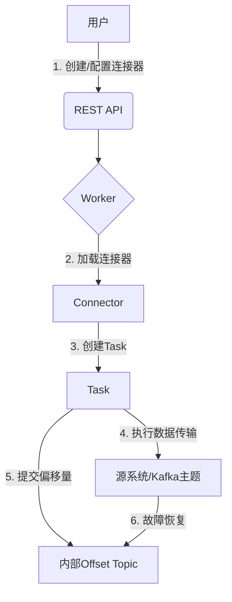

# KafkaConnect:连接Kafka与外部系统的桥梁

## 1.背景介绍

在当今数据驱动的世界中,数据是企业最宝贵的资产之一。随着企业规模的不断扩大,数据的种类和数量也在不断增加。传统的数据集成方式已经无法满足现代企业对数据实时传输和处理的需求。Apache Kafka作为一个分布式流处理平台,为企业提供了高吞吐量、低延迟的消息队列服务,可以实现大规模数据的实时流处理。

然而,Kafka本身并不能直接与各种异构数据源进行集成,因此需要一种可靠、高效的数据集成工具,将Kafka与外部系统连接起来。这就是KafkaConnect的用武之地。KafkaConnect作为Kafka生态系统中的一个关键组件,提供了一种可扩展和可靠的方式,用于将数据从各种数据源(如数据库、文件系统、Kafka集群等)导入到Kafka主题中,或者从Kafka主题中导出数据到其他系统。

### 1.1 KafkaConnect的优势

相比传统的数据集成方式,KafkaConnect具有以下优势:

- **可扩展性**:KafkaConnect支持插件式架构,开发者可以轻松扩展和定制新的连接器(Connector),以满足不同的数据集成需求。
- **容错性**:KafkaConnect具有自动恢复和重新平衡的能力,可以保证数据传输的可靠性和一致性。
- **并行性**:KafkaConnect可以在多个工作线程上并行运行多个连接器任务,提高数据传输的吞吐量。
- **集中管理**:KafkaConnect提供了REST API和Web UI,方便管理和监控连接器的运行状态。
- **云原生**:KafkaConnect可以轻松部署在Kubernetes等云原生环境中,实现弹性伸缩和高可用性。

### 1.2 KafkaConnect的工作原理

KafkaConnect由两个核心组件组成:Worker和Connector。

- **Worker**:Worker是KafkaConnect的主要进程,负责执行连接器任务、与Kafka集群交互、提供REST API等功能。
- **Connector**:Connector是KafkaConnect的插件,用于实现与特定数据源的集成。KafkaConnect提供了许多开箱即用的连接器,如JDBC、HDFS、Elasticsearch等,同时也支持开发者自定义连接器。

KafkaConnect的工作流程如下:

1. 用户通过REST API或Web UI创建和配置连接器。
2. Worker加载并启动连接器,根据配置信息创建连接器任务(Task)。
3. 连接器任务执行数据传输操作,将数据从源系统导入到Kafka主题中,或者从Kafka主题中导出到目标系统。
4. Worker周期性地提交偏移量(Offset)到Kafka主题中,用于跟踪数据传输的进度。
5. 如果发生故障,Worker可以从最后提交的偏移量处恢复数据传输,保证数据的一致性。

## 2.核心概念与联系

在深入探讨KafkaConnect的细节之前,让我们先了解一些核心概念:

### 2.1 Connector

Connector是KafkaConnect最核心的概念,它定义了与特定数据源或目标系统的集成逻辑。Connector由以下几个主要部分组成:

- **Connector Class**:实现连接器逻辑的Java类,必须实现`Connector`接口。
- **Connector Configuration**:连接器的配置属性,用于指定数据源/目标的连接信息、转换规则等。
- **Task Class**:实现连接器任务逻辑的Java类,必须实现`Task`接口。一个Connector可以包含多个Task,用于并行执行数据传输。

KafkaConnect提供了许多开箱即用的连接器,如JDBC Source Connector、HDFS Sink Connector等,同时也支持开发者自定义连接器。

### 2.2 Worker

Worker是KafkaConnect的主要进程,负责加载和运行连接器,并与Kafka集群交互。Worker由以下几个主要组件组成:

- **Worker进程**:执行连接器任务,提交偏移量等核心功能。
- **Herder**:负责协调连接器任务的执行和重平衡。
- **REST API**:提供RESTful接口,用于管理和监控连接器。

一个KafkaConnect集群可以包含多个Worker,用于提高并行度和高可用性。

### 2.3 Offset和Topic

Offset是KafkaConnect用于跟踪数据传输进度的关键概念。每个连接器任务都会在特定的Kafka主题中维护自己的偏移量,记录已经传输的数据位置。如果发生故障,KafkaConnect可以从最后提交的偏移量处恢复数据传输,保证数据的一致性。

KafkaConnect还使用了一些内部主题,用于存储连接器配置、偏移量、状态等元数据信息。

### 2.4 核心流程图

下图展示了KafkaConnect的核心工作流程:



1. 用户通过REST API创建和配置连接器。
2. Worker加载并启动连接器。
3. 连接器创建一个或多个Task。
4. Task执行数据传输操作,将数据从源系统导入到Kafka主题中,或者从Kafka主题中导出到目标系统。
5. Task周期性地提交偏移量到内部Offset Topic中。
6. 如果发生故障,KafkaConnect可以从最后提交的偏移量处恢复数据传输。

## 3.核心算法原理具体操作步骤

KafkaConnect的核心算法原理可以分为以下几个方面:

### 3.1 连接器生命周期管理

KafkaConnect采用了一种基于REST API的集中式管理方式,用户可以通过REST API创建、配置、启动和停止连接器。Worker进程负责加载和运行连接器,以及管理连接器的生命周期。

连接器生命周期管理的具体步骤如下:

1. **创建连接器**:用户通过POST请求向REST API发送连接器配置,Worker接收到请求后创建连接器实例。
2. **启动连接器**:Worker加载连接器实例,根据配置信息创建一个或多个Task。
3. **运行连接器**:Task执行数据传输操作,周期性地提交偏移量。
4. **重平衡连接器**:如果Worker实例数量发生变化,Herder会协调连接器任务的重平衡。
5. **停止连接器**:用户通过DELETE请求向REST API发送停止命令,Worker停止并卸载连接器实例。

### 3.2 并行数据传输

KafkaConnect支持在多个工作线程上并行运行多个连接器任务,提高数据传输的吞吐量。每个连接器可以配置任务数量,Worker会根据配置创建对应数量的Task实例。

并行数据传输的具体步骤如下:

1. **创建Task**:连接器根据配置信息创建多个Task实例。
2. **分配分区**:如果连接器是Source Connector,Worker会根据分区策略为每个Task分配Kafka主题分区。
3. **并行执行**:每个Task在独立的工作线程上执行数据传输操作。
4. **提交偏移量**:每个Task独立地周期性提交自己的偏移量。

### 3.3 故障恢复和重平衡

KafkaConnect采用了一种基于偏移量的故障恢复机制,可以保证数据传输的一致性和可靠性。如果发生故障或Worker实例数量发生变化,KafkaConnect可以从最后提交的偏移量处恢复数据传输,避免数据丢失或重复。

故障恢复和重平衡的具体步骤如下:

1. **提交偏移量**:Task周期性地将当前的偏移量提交到内部Offset Topic中。
2. **故障恢复**:如果Task发生故障,Worker会根据最后提交的偏移量创建新的Task实例,从该偏移量处恢复数据传输。
3. **重平衡触发**:如果Worker实例数量发生变化,Herder会触发重平衡流程。
4. **重新分配分区**:Herder根据新的Worker实例数量,重新为每个Task分配Kafka主题分区。
5. **恢复数据传输**:Task从最后提交的偏移量处恢复数据传输。

### 3.4 数据转换和路由

KafkaConnect支持在数据传输过程中进行数据转换和路由,满足不同的业务需求。这是通过在连接器配置中指定转换器(Transformer)和转换规则来实现的。

数据转换和路由的具体步骤如下:

1. **配置转换器**:在连接器配置中指定要使用的转换器及其配置。
2. **创建转换链**:连接器根据配置信息创建一个转换链(Transformation Chain)。
3. **执行转换**:Task在数据传输过程中,将数据传递给转换链进行转换。
4. **路由数据**:转换后的数据根据路由规则发送到目标Kafka主题或外部系统。

KafkaConnect提供了许多开箱即用的转换器,如ValueMapper、RegexRouter等,同时也支持开发者自定义转换器。

## 4.数学模型和公式详细讲解举例说明

在KafkaConnect中,并没有直接使用复杂的数学模型或公式。但是,在一些特定场景下,可能需要使用一些数学概念和公式来优化和调整KafkaConnect的性能和资源利用率。

### 4.1 分区分配策略

当KafkaConnect作为Source Connector时,需要将Kafka主题的分区分配给不同的Task。合理的分区分配策略可以提高并行度和均衡性,从而提高数据传输的吞吐量。

KafkaConnect提供了几种内置的分区分配策略,如RoundRobin、RangeAssignor等。这些策略基于一些简单的数学原理,如取模运算、范围划分等,来实现分区的均衡分配。

例如,RoundRobin策略会将分区按顺序均匀地分配给每个Task,可以用以下公式表示:

$$
task\_id = partition\_id \bmod num\_tasks
$$

其中,`task_id`是分区被分配到的Task编号,`partition_id`是分区编号,`num_tasks`是Task的总数量。

### 4.2 动态扩缩容

在KafkaConnect集群中,Worker实例的数量可能会根据实际需求动态调整。当Worker实例数量发生变化时,需要重新平衡分区分配,以确保负载均衡和高可用性。

重新平衡分区分配的过程可以看作是一个"装箱"问题,需要将原有的分区"重新装箱"到新的Worker实例中。这个问题可以使用一些经典的箱装载算法(Bin Packing Algorithm)来解决,如首次适配(First Fit)、最佳适配(Best Fit)等。

例如,首次适配算法的基本思路是:对于每个需要重新分配的分区,从第一个Worker实例开始,将其分配到第一个有足够空间的Worker实例中。可以用以下伪代码表示:

```
for each unassigned partition p:
    for each worker w:
        if w has enough capacity for p:
            assign p to w
            break
```

这种算法的时间复杂度为O(n*m),其中n是分区数量,m是Worker实例数量。

### 4.3 资源利用率优化

为了提高KafkaConnect的资源利用率,可以使用一些数学模型和优化算法来调整连接器任务的数量、内存分配等参数。

例如,可以将连接器任务的内存分配问题建模为一个0-1整数规划问题,目标是最大化资源利用率,同时满足每个任务的内存需求约束。可以使用经典的分支定界算法(Branch and Bound)或其他启发式算法来求解这个优化问题。

此外,还可以使用队列理论模型来分析和优化KafkaConnect的吞吐量和延迟,确保满足服务质量(QoS)要求。

## 4.项目实践:代码实例和详细解释说明

为了更好地理解KafkaConnect的工作原理和使用方式,让我们通过一个实际的代码示例来演示如何使用KafkaConnect将数据从MySQL数据库导入到Kafka主题中。

### 4.1 环境准备

首先,我们需要准备以下环境:

- Kafka