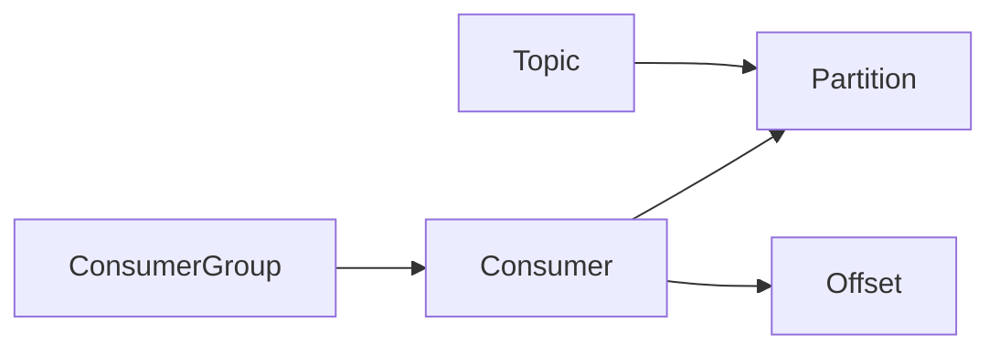

# KafkaGroup与其他消息队列系统的比较

作者：禅与计算机程序设计艺术

## 1. 背景介绍

### 1.1 消息队列概述

消息队列（Message Queue，MQ）是一种用于进程间异步通信的软件架构模式，其核心思想是将消息发送到一个队列中，接收者从队列中获取消息并进行处理。这种模式可以有效地解耦发送方和接收方，提高系统的可靠性、可扩展性和可维护性。

### 1.2 Kafka 简介

Apache Kafka是一个分布式流处理平台，其核心功能之一是提供高吞吐量、低延迟的消息队列服务。Kafka 的设计目标是处理大量的实时数据流，并支持数据的持久化和容错。

### 1.3 KafkaGroup 的概念

KafkaGroup 是 Kafka 中的一个重要概念，它允许多个消费者共同消费一个主题（Topic）的消息，并且每个消费者只负责消费一部分消息。这种机制可以有效地提高消息的消费效率，并保证消息的顺序性和一致性。

## 2. 核心概念与联系

### 2.1 主题（Topic）

主题是 Kafka 中消息的逻辑分类，类似于数据库中的表。生产者将消息发送到指定的主题，消费者从指定的主题订阅消息。

### 2.2 分区（Partition）

每个主题可以被分为多个分区，每个分区对应一个日志文件。分区可以分布在不同的 Kafka Broker 上，从而实现数据的冗余和负载均衡。

### 2.3 消费者组（Consumer Group）

消费者组是一组共同消费一个或多个主题的消费者。每个消费者组都有一个唯一的标识符（Group ID），并且每个消费者只属于一个消费者组。

### 2.4 消费者（Consumer）

消费者是订阅主题并消费消息的进程。每个消费者都属于一个消费者组，并且每个消费者只消费分配给它的分区的消息。

### 2.5 偏移量（Offset）

偏移量表示消费者在分区中消费消息的位置。每个消费者都会维护自己的偏移量，并定期提交偏移量到 Kafka Broker。

### 2.6 联系

主题、分区、消费者组、消费者和偏移量之间的关系可以用下图表示：



## 3. 核心算法原理具体操作步骤

### 3.1 消息发送

1. 生产者将消息发送到指定的主题。
2. Kafka Broker 根据消息的 Key 计算出消息应该发送到哪个分区。
3. Kafka Broker 将消息写入到指定分区的日志文件中。

### 3.2 消息消费

1. 消费者订阅指定的主题。
2. Kafka Broker 将主题的所有分区分配给消费者组中的消费者。
3. 消费者从分配给它的分区中读取消息。
4. 消费者处理消息并提交偏移量到 Kafka Broker。

### 3.3 消费者组协调

1. 消费者组中的消费者会定期向 Kafka Broker 发送心跳包。
2. 如果 Kafka Broker 在一段时间内没有收到某个消费者的心跳包，则认为该消费者已经失效。
3. Kafka Broker 会重新分配失效消费者负责的分区给其他消费者。

## 4. 数学模型和公式详细讲解举例说明

### 4.1 吞吐量

Kafka 的吞吐量是指每秒钟可以处理的消息数量。Kafka 的吞吐量受到多个因素的影响，包括：

* 消息的大小
* 分区数量
* 消费者数量
* 网络带宽

### 4.2 延迟

Kafka 的延迟是指消息从生产者发送到消费者接收所花费的时间。Kafka 的延迟受到多个因素的影响，包括：

* 消息的大小
* 网络带宽
* 消费者处理消息的速度

### 4.3 公式

Kafka 的吞吐量和延迟可以用以下公式表示：

```
吞吐量 = 消息数量 / 时间
延迟 = 消息接收时间 - 消息发送时间
```

### 4.4 举例说明

假设一个 Kafka 集群有 3 个 Broker，一个主题有 3 个分区，每个分区有 2 个副本。一个消费者组有 3 个消费者，每个消费者消费一个分区。

* 如果每个消息的大小为 1KB，网络带宽为 1Gbps，则 Kafka 的吞吐量大约为 100MB/s。
* 如果消费者处理消息的速度为 1ms/条，则 Kafka 的延迟大约为 1ms。

## 5. 项目实践：代码实例和详细解释说明

### 5.1 生产者代码示例

```java
Properties props = new Properties();
props.put("bootstrap.servers", "localhost:9092");
props.put("acks", "all");
props.put("retries", 0);
props.put("batch.size", 16384);
props.put("linger.ms", 1);
props.put("buffer.memory", 33554432);
props