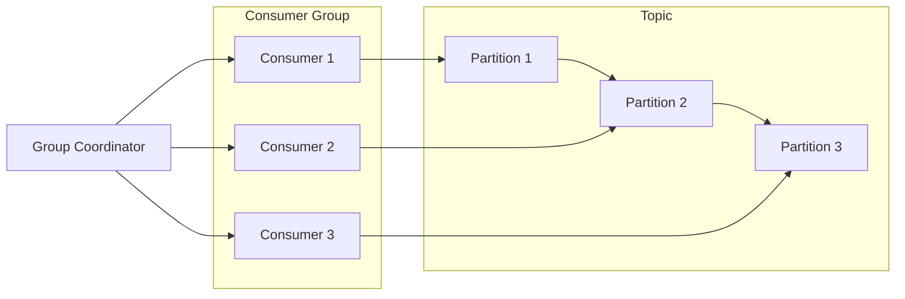

# KafkaGroup：数据分区与复制的实现

作者：禅与计算机程序设计艺术

## 1. 背景介绍

### 1.1 Kafka的魅力：高吞吐、低延迟、持久化

Kafka，作为Apache基金会下的一个开源分布式流处理平台，已经成为了构建实时数据管道和流应用程序的核心组件。它以高吞吐量、低延迟和持久化的特性，在海量数据处理领域独领风骚。

### 1.2 KafkaGroup：消费者协作的基石

KafkaGroup，顾名思义，是Kafka中消费者实例的逻辑分组。它提供了一个优雅的机制，使得多个消费者实例可以协同工作，共同消费并处理来自同一个Topic的数据。

### 1.3 本文目标：深入剖析KafkaGroup的奥秘

本文旨在深入探讨KafkaGroup的内部工作机制，揭示其如何实现数据分区与复制，从而确保数据的高效消费和容错性。

## 2. 核心概念与联系

### 2.1 Topic：消息的逻辑分类

Topic是Kafka中消息的逻辑分类，类似于数据库中的表。生产者将消息发布到特定的Topic，消费者订阅感兴趣的Topic以接收消息。

### 2.2 Partition：Topic的物理分片

为了提高并发性和可扩展性，Kafka将每个Topic划分为多个Partition。每个Partition都是一个有序的、不可变的消息序列，消息在Partition内部的偏移量是唯一的。

### 2.3 Consumer Group：消费者的逻辑分组

Consumer Group是Kafka中消费者实例的逻辑分组。同一个Consumer Group内的消费者实例协同工作，共同消费来自同一个Topic的消息。

### 2.4 Group Coordinator：协调者，管理组成员

每个Consumer Group都有一个Group Coordinator，负责管理组成员、分配Partition、处理成员变更等。

### 2.5 Consumer Rebalance：重新分配Partition

当Consumer Group的成员发生变化（例如新增或移除消费者实例），Group Coordinator会触发Consumer Rebalance，重新分配Partition给各个消费者实例。

## 3. 核心算法原理具体操作步骤

### 3.1 Partition分配算法：确保公平性

Kafka提供了多种Partition分配算法，例如：

- **Range分配策略:**  将Partition按范围分配给消费者实例，例如，如果一个Topic有10个Partition，3个消费者实例，则每个消费者实例分别分配3、3、4个Partition。
- **RoundRobin分配策略:**  将Partition轮流分配给消费者实例，例如，如果一个Topic有10个Partition，3个消费者实例，则Partition的分配顺序为：消费者1、消费者2、消费者3、消费者1、消费者2……
- **Sticky分配策略:**  尽量保持现有的Partition分配，仅在必要时进行调整，以减少Consumer Rebalance的频率。

### 3.2 Consumer Rebalance过程：协调与协作

Consumer Rebalance是一个多步骤的过程，涉及Group Coordinator和所有消费者实例的协调与协作：

1. **加入组:**  消费者实例启动时，会向Group Coordinator发送JoinGroup请求，加入指定的Consumer Group。
2. **选择Leader:**  Group Coordinator从所有消费者实例中选择一个Leader，负责收集成员信息和执行Partition分配算法。
3. **分配Partition:**  Leader执行Partition分配算法，生成Partition分配方案。
4. **同步方案:**  Leader将Partition分配方案同步给Group Coordinator。
5. **提交偏移量:**  消费者实例定期向Group Coordinator提交其消费的最新消息偏移量，以便在发生故障时能够从上次提交的偏移量继续消费。

## 4. 数学模型和公式详细讲解举例说明

### 4.1 Partition分配的数学模型

假设一个Topic有 *P* 个Partition，一个Consumer Group有 *C* 个消费者实例，则可以使用以下公式计算每个消费者实例分配的Partition数量：

```
每个消费者实例分配的Partition数量 = P / C
```

如果 *P* 不能被 *C* 整除，则会有部分消费者实例分配到比其他消费者实例更多的Partition。

### 4.2 举例说明

假设一个Topic有10个Partition，一个Consumer Group有3个消费者实例，则根据上述公式，每个消费者实例分配的Partition数量为：

```
每个消费者实例分配的Partition数量 = 10 / 3 = 3.33
```

由于 *P* 不能被 *C* 整除，因此会有一个消费者实例分配到4个Partition，其他两个消费者实例分别分配到3个Partition。

## 5. 项目实践：代码实例和详细解释说明

### 5.1 创建Kafka生产者

```java
import org.apache.kafka.clients.producer.KafkaProducer;
import org.apache.kafka.clients.producer.ProducerConfig;
import org.apache.kafka.clients.producer.ProducerRecord;
import org.apache.kafka.common.serialization.StringSerializer;

import java.util.Properties;

public class KafkaProducerExample {

    public static void main(String[] args) {
        // 设置Kafka producer的配置
        Properties props = new Properties();
        props.put(ProducerConfig.BOOTSTRAP_SERVERS_CONFIG, "localhost:9092");
        props.put(ProducerConfig.KEY_SERIALIZER_CLASS_CONFIG, StringSerializer.class.getName());
        props.put(ProducerConfig.VALUE_SERIALIZER_CLASS_CONFIG, StringSerializer.class.getName());

        // 创建Kafka producer实例
        KafkaProducer<String, String> producer = new KafkaProducer<>(props);

        // 发送消息到指定的Topic
        for (int i = 0; i < 10; i++) {
            ProducerRecord<String, String> record = new ProducerRecord<>("my-topic", "key-" + i, "value-" + i);
            producer.send(record);
        }

        // 关闭producer
        producer.close();
    }
}
```

### 5.2 创建Kafka消费者

```java
import org.apache.kafka.clients.consumer.ConsumerConfig;
import org.apache.kafka.clients.consumer.ConsumerRecord;
import org.apache.kafka.clients.consumer.ConsumerRecords;
import org.apache.kafka.clients.consumer.KafkaConsumer;
import org.apache.kafka.common.serialization.StringDeserializer;

import java.time.Duration;
import java.util.Arrays;
import java.util.Properties;

public class KafkaConsumerExample {

    public static void main(String[] args) {
        // 设置Kafka consumer的配置
        Properties props = new Properties();
        props.put(ConsumerConfig.BOOTSTRAP_SERVERS_CONFIG, "localhost:9092");
        props.put(ConsumerConfig.GROUP_ID_CONFIG, "my-group");
        props.put(ConsumerConfig.KEY_DESERIALIZER_CLASS_CONFIG, StringDeserializer.class.getName());
        props.put(ConsumerConfig.VALUE_DESERIALIZER_CLASS_CONFIG, StringDeserializer.class.getName());

        // 创建Kafka consumer实例
        KafkaConsumer<String, String> consumer = new KafkaConsumer<>(props);

        // 订阅指定的Topic
        consumer.subscribe(Arrays.asList("my-topic"));

        // 循环消费消息
        while (true) {
            ConsumerRecords<String, String> records = consumer.poll(Duration.ofMillis(100));
            for (ConsumerRecord<String, String> record : records) {
                System.out.printf("offset = %d, key = %s, value = %s\n", record.offset(), record.key(), record.value());
            }
        }
    }
}
```

## 6. 实际应用场景

### 6.1 流数据处理

KafkaGroup广泛应用于流数据处理场景，例如：

- **实时日志分析:**  收集应用程序日志，实时分析日志数据，识别异常并触发告警。
- **点击流分析:**  收集用户点击流数据，分析用户行为，优化产品体验。
- **传感器数据处理:**  收集传感器数据，实时监控设备状态，预测设备故障。

### 6.2 消息队列

KafkaGroup也可以作为消息队列使用，例如：

- **异步任务处理:**  将任务消息发送到Kafka Topic，消费者实例异步处理任务。
- **事件驱动架构:**  将事件消息发布到Kafka Topic，消费者实例订阅感兴趣的事件并做出响应。

## 7. 工具和资源推荐

### 7.1 Kafka Monitor

Kafka Monitor是一款开源的Kafka监控工具，可以实时监控Kafka集群的运行状态，包括Topic、Partition、Consumer Group等信息。

### 7.2 Kafka Manager

Kafka Manager是一款开源的Kafka管理工具，可以方便地管理Kafka集群，包括创建Topic、查看Consumer Group、修改配置等操作。

### 7.3 Confluent Platform

Confluent Platform是一款商业化的Kafka发行版，提供了丰富的功能，包括Kafka集群管理、数据流处理、监控和安全等。

## 8. 总结：未来发展趋势与挑战

### 8.1 趋势：云原生、流式SQL、机器学习

随着云计算和人工智能技术的快速发展，Kafka的未来发展趋势包括：

- **云原生支持:**  Kafka将更好地支持云原生环境，例如Kubernetes。
- **流式SQL:**  Kafka将提供更强大的流式SQL支持，方便用户使用SQL语句进行流数据处理。
- **机器学习集成:**  Kafka将与机器学习平台更好地集成，支持实时机器学习模型训练和推理。

### 8.2 挑战：性能优化、安全性和可观察性

Kafka也面临着一些挑战，例如：

- **性能优化:**  随着数据量的不断增长，Kafka需要不断优化性能，以满足高吞吐量和低延迟的需求。
- **安全性:**  Kafka需要提供更强大的安全机制，以保护敏感数据免受未授权访问。
- **可观察性:**  Kafka需要提供更完善的监控和日志记录功能，方便用户诊断问题和优化性能。

## 9. 附录：常见问题与解答

### 9.1 如何选择合适的Partition分配策略？

选择Partition分配策略需要考虑以下因素：

- **数据均匀性:**  如果数据在Partition之间分布均匀，则可以使用Range分配策略。
- **消费者实例数量:**  如果消费者实例数量较多，则可以使用RoundRobin分配策略。
- **Consumer Rebalance频率:**  如果希望减少Consumer Rebalance的频率，则可以使用Sticky分配策略。

### 9.2 如何避免Consumer Rebalance风暴？

Consumer Rebalance风暴是指Consumer Group频繁地进行Rebalance，导致性能下降。可以采取以下措施避免Consumer Rebalance风暴：

- **合理设置session.timeout.ms:**  session.timeout.ms参数控制消费者实例与Group Coordinator之间的心跳间隔，如果设置过小，会导致频繁的Rebalance。
- **避免频繁地添加或移除消费者实例:**  频繁地添加或移除消费者实例会导致Rebalance。
- **使用Sticky分配策略:**  Sticky分配策略可以尽量保持现有的Partition分配，减少Rebalance的频率。


## 10. KafkaGroup 数据分区与复制的实现：核心概念 Mermaid 流程图



**图例:**

- Topic:  消息的逻辑分类，包含多个 Partition。
- Partition:  Topic 的物理分片，消息在 Partition 内部有序存储。
- Consumer Group:  消费者的逻辑分组，共同消费来自同一个 Topic 的消息。
- Consumer:  消费者实例，属于某个 Consumer Group，负责消费特定 Partition 的消息。
- Group Coordinator:  协调者，负责管理 Consumer Group，分配 Partition，处理成员变更等。

**流程:**

1. 生产者将消息发布到 Topic 的某个 Partition。
2. Consumer Group 中的 Consumer 实例订阅 Topic，并向 Group Coordinator 注册。
3. Group Coordinator 根据分配策略将 Partition 分配给 Consumer 实例。
4. Consumer 实例消费分配到的 Partition 中的消息，并定期向 Group Coordinator 提交消费进度。
5. 当 Consumer Group 成员发生变化时，Group Coordinator 会触发 Rebalance，重新分配 Partition。

**总结:**

KafkaGroup 通过数据分区和复制机制，实现了高吞吐、低延迟的消息消费，并提供了容错性，确保消息的可靠性。
