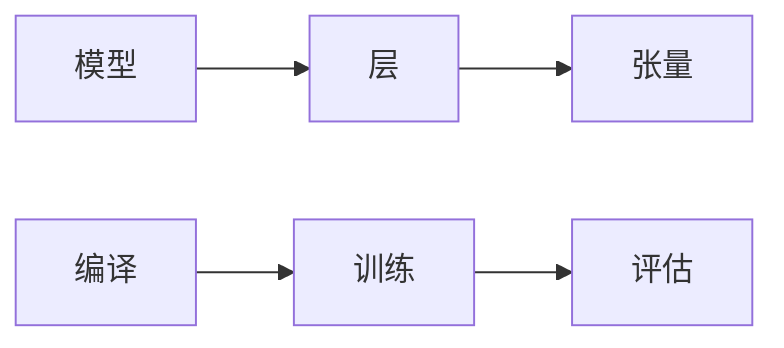

## 1. 背景介绍

### 1.1 深度学习的崛起与挑战

近年来，深度学习在计算机视觉、自然语言处理、语音识别等领域取得了突破性进展，其强大的能力源于其能够从海量数据中自动学习特征表示。然而，深度学习模型的训练过程通常较为复杂，需要大量的计算资源和专业知识。

### 1.2 Keras：用户友好型深度学习框架

为了降低深度学习的门槛，简化模型构建和训练过程，Keras应运而生。Keras是一个基于Python的高级神经网络API，它提供简洁、灵活、易于使用的接口，使得用户可以快速搭建和训练深度学习模型，而无需深入了解底层实现细节。

### 1.3 Keras的优势与特点

* **用户友好：** Keras的API设计简洁直观，易于学习和使用。
* **模块化：** Keras采用模块化设计，用户可以自由组合不同的网络层、优化器、损失函数等构建自定义模型。
* **可扩展：** Keras支持多种后端引擎，包括TensorFlow、Theano、CNTK等，方便用户根据实际需求选择合适的计算平台。
* **广泛应用：** Keras被广泛应用于学术研究和工业界，拥有活跃的社区支持。

## 2. 核心概念与联系

### 2.1 模型、层、张量

* **模型 (Model)：**  Keras中模型是神经网络的抽象表示，它是由多个网络层组成的计算图。模型定义了输入数据的形状、网络层的类型和连接方式、损失函数、优化器等信息。
* **层 (Layer)：** 层是模型的基本构建单元，它对输入数据进行特定的操作，并输出变换后的结果。常见的层包括卷积层、池化层、全连接层等。
* **张量 (Tensor)：** 张量是多维数组，它是Keras中数据传递的基本单位。

### 2.2 编译、训练、评估

* **编译 (Compile)：**  在训练模型之前，需要先编译模型，指定优化器、损失函数和评估指标。
* **训练 (Fit)：** 训练过程是指使用训练数据调整模型参数，使其能够更好地拟合数据。
* **评估 (Evaluate)：** 评估过程是指使用测试数据评估模型的性能，例如准确率、精确率、召回率等。

### 2.3 核心概念联系图



## 3. 核心算法原理具体操作步骤

### 3.1 模型构建

1. **选择模型类型：** Keras提供两种模型类型：序列模型 (Sequential) 和函数式API (Functional API)。序列模型适用于简单的线性网络结构，而函数式API适用于更复杂的网络结构，例如多分支网络、残差网络等。
2. **添加网络层：** 使用 `model.add()` 方法依次添加网络层，例如 `Dense`、`Conv2D`、`MaxPooling2D` 等。
3. **设置模型参数：**  可以通过层对象的构造函数设置层参数，例如神经元数量、激活函数、卷积核大小等。

### 3.2 模型编译

1. **选择优化器：**  优化器负责更新模型参数，常见的优化器包括SGD、Adam、RMSprop等。
2. **选择损失函数：** 损失函数用于衡量模型预测值与真实值之间的差异，常见的损失函数包括均方误差 (MSE)、交叉熵 (Cross-Entropy) 等。
3. **选择评估指标：** 评估指标用于评估模型性能，常见的评估指标包括准确率 (Accuracy)、精确率 (Precision)、召回率 (Recall) 等。

### 3.3 模型训练

1. **准备训练数据：**  将训练数据转换为Keras支持的格式，例如 NumPy 数组或 TensorFlow Dataset。
2. **调用 `model.fit()` 方法训练模型：**  `fit()` 方法接受训练数据、训练轮数、批次大小等参数。
3. **监控训练过程：**  可以使用 `history` 对象查看训练过程中的损失值、评估指标等信息。

### 3.4 模型评估

1. **准备测试数据：**  将测试数据转换为Keras支持的格式。
2. **调用 `model.evaluate()` 方法评估模型：**  `evaluate()` 方法接受测试数据，并返回损失值和评估指标。

## 4. 数学模型和公式详细讲解举例说明

### 4.1 全连接层

全连接层 (Dense Layer) 是最基本的网络层之一，它将输入数据的每个元素与权重矩阵相乘，然后加上偏置项，最后通过激活函数得到输出。

**公式：**

```
output = activation(dot(input, kernel) + bias)
```

* `input`：输入张量
* `kernel`：权重矩阵
* `bias`：偏置项
* `activation`：激活函数，例如 sigmoid、ReLU、tanh 等

**示例：**

```python
from keras.layers import Dense

# 创建一个包含10个神经元的全连接层
dense_layer = Dense(10, activation='relu')
```

### 4.2 卷积层

卷积层 (Convolutional Layer) 是一种专门用于处理图像数据的网络层，它使用卷积核对输入图像进行卷积操作，提取图像的局部特征。

**公式：**

```
output = activation(conv2d(input, kernel) + bias)
```

* `input`：输入图像
* `kernel`：卷积核
* `bias`：偏置项
* `activation`：激活函数
* `conv2d`：卷积操作

**示例：**

```python
from keras.layers import Conv2D

# 创建一个包含32个卷积核的卷积层，卷积核大小为 3x3
conv_layer = Conv2D(32, (3, 3), activation='relu')
```

### 4.3 池化层

池化层 (Pooling Layer) 用于降低特征图的维度，减少计算量，同时保留重要的特征信息。常见的池化操作包括最大池化 (Max Pooling) 和平均池化 (Average Pooling)。

**最大池化公式：**

```
output = max(input[i:i+pool_size, j:j+pool_size])
```

* `input`：输入特征图
* `pool_size`：池化窗口大小
* `i`, `j`：池化窗口的起始位置

**示例：**

```python
from keras.layers import MaxPooling2D

# 创建一个最大池化层，池化窗口大小为 2x2
maxpool_layer = MaxPooling2D((2, 2))
```

## 5. 项目实践：代码实例和详细解释说明

### 5.1 MNIST手写数字识别

MNIST数据集是一个经典的手写数字识别数据集，包含 60,000 张训练图片和 10,000 张测试图片，每张图片大小为 28x28 像素，代表 0-9 十个数字。

**代码实例：**

```python
from keras.datasets import mnist
from keras.models import Sequential
from keras.layers import Dense, Flatten
from keras.utils import np_utils

# 加载 MNIST 数据集
(X_train, y_train), (X_test, y_test) = mnist.load_data()

# 数据预处理
X_train = X_train.reshape(60000, 28, 28, 1).astype('float32') / 255
X_test = X_test.reshape(10000, 28, 28, 1).astype('float32') / 255
y_train = np_utils.to_categorical(y_train)
y_test = np_utils.to_categorical(y_test)

# 构建模型
model = Sequential()
model.add(Flatten(input_shape=(28, 28, 1)))
model.add(Dense(128, activation='relu'))
model.add(Dense(10, activation='softmax'))

# 编译模型
model.compile(loss='categorical_crossentropy', optimizer='adam', metrics=['accuracy'])

# 训练模型
model.fit(X_train, y_train, epochs=5, batch_size=32)

# 评估模型
loss, accuracy = model.evaluate(X_test, y_test)
print('Test loss:', loss)
print('Test accuracy:', accuracy)
```

**代码解释：**

1. **加载 MNIST 数据集：** 使用 `mnist.load_data()` 函数加载 MNIST 数据集。
2. **数据预处理：** 将图像数据转换为四维数组，并将像素值归一化到 0-1 之间。将标签数据转换为 one-hot 编码。
3. **构建模型：** 使用 `Sequential` 模型，依次添加 `Flatten` 层、`Dense` 层和 `Dense` 层。
4. **编译模型：** 使用 `categorical_crossentropy` 损失函数、`adam` 优化器和 `accuracy` 评估指标。
5. **训练模型：**  设置训练轮数为 5，批次大小为 32。
6. **评估模型：**  使用测试数据评估模型的损失值和准确率。

## 6. 实际应用场景

### 6.1 图像分类

Keras可以用于构建各种图像分类模型，例如：

* **物体识别：**  识别图像中的物体，例如人、车、动物等。
* **场景识别：**  识别图像中的场景，例如海滩、森林、城市等。
* **人脸识别：**  识别图像中的人脸，并进行身份验证。

### 6.2 自然语言处理

Keras可以用于构建各种自然语言处理模型，例如：

* **文本分类：**  将文本分类到不同的类别，例如情感分析、主题分类等。
* **机器翻译：**  将一种语言的文本翻译成另一种语言的文本。
* **问答系统：**  根据用户提出的问题，从文本中找到答案。

### 6.3 语音识别

Keras可以用于构建语音识别模型，例如：

* **语音转文本：**  将语音信号转换为文本。
* **语音命令识别：**  识别语音命令，例如“打开音乐”、“关闭灯光”等。

## 7. 工具和资源推荐

### 7.1 Keras官方文档

Keras官方文档提供了详细的API文档、教程和示例代码，是学习Keras的最佳资源。

### 7.2 TensorFlow官方网站

TensorFlow是Keras的后端引擎之一，TensorFlow官方网站提供了丰富的TensorFlow资源，包括教程、示例代码和模型库。

### 7.3 Kaggle

Kaggle是一个数据科学竞赛平台，提供了大量的深度学习数据集和代码示例，可以用于学习和实践Keras。

## 8. 总结：未来发展趋势与挑战

### 8.1 自动机器学习 (AutoML)

AutoML旨在自动化机器学习模型的构建和优化过程，减少人工干预，提高模型性能。Keras也提供了一些AutoML工具，例如 Keras Tuner。

### 8.2 模型压缩和加速

随着深度学习模型越来越复杂，模型压缩和加速技术变得越来越重要。Keras提供了一些模型压缩和加速工具，例如模型剪枝、量化等。

### 8.3 可解释性

深度学习模型的可解释性是一个重要的研究方向，Keras也提供了一些可解释性工具，例如 Grad-CAM。

## 9. 附录：常见问题与解答

### 9.1 如何选择合适的优化器？

优化器的选择取决于具体问题和数据集。常见的优化器包括：

* **SGD：**  随机梯度下降，简单易实现，但收敛速度较慢。
* **Adam：**  自适应矩估计，收敛速度较快，但内存占用较大。
* **RMSprop：**  均方根传播，收敛速度较快，内存占用较小。

### 9.2 如何防止过拟合？

过拟合是指模型在训练数据上表现良好，但在测试数据上表现较差。防止过拟合的方法包括：

* **数据增强：**  通过对训练数据进行随机变换，例如旋转、缩放、翻转等，增加数据量，提高模型泛化能力。
* **正则化：**  通过添加正则化项，例如 L1 正则化、L2 正则化，惩罚模型参数，防止模型过拟合。
* **Dropout：**  在训练过程中随机丢弃一些神经元，防止模型过度依赖某些特征。

### 9.3 如何评估模型性能？

评估模型性能的指标包括：

* **准确率 (Accuracy)：**  模型预测正确的样本数占总样本数的比例。
* **精确率 (Precision)：**  模型预测为正类的样本中，真正为正类的样本数占预测为正类的样本数的比例。
* **召回率 (Recall)：**  真正为正类的样本中，模型预测为正类的样本数占真正为正类的样本数的比例。
* **F1-score：**  精确率和召回率的调和平均值。