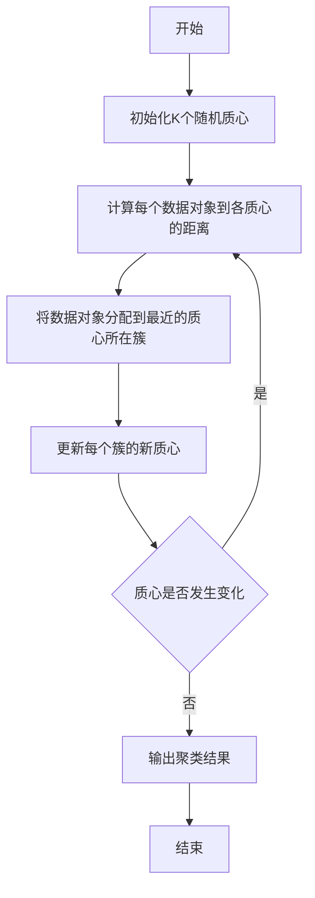

# K-means聚类：简单实用的聚类算法

## 1.背景介绍

### 1.1 什么是聚类

聚类(Clustering)是一种无监督学习技术,旨在将未标记的数据集中的数据样本划分为若干个不同的组(簇)。聚类算法通过计算数据样本之间的距离或相似度,将相似的数据样本分配到同一个簇中,使得同一簇内的数据样本尽可能相似,不同簇间的数据样本尽可能不相似。

聚类分析广泛应用于多个领域,如计算机科学、商业智能、生物信息学、图像模式识别等。它可以帮助发现数据的内在结构,为后续的数据分析和决策提供有价值的见解。

### 1.2 聚类的应用场景

聚类技术在现实世界中的应用非常广泛,例如:

- **客户细分**: 根据客户的购买习惯、兴趣爱好等特征进行聚类,为不同客户群体提供个性化服务和营销策略。
- **基因表达数据分析**: 通过聚类将基因表达数据划分为不同的模式,有助于发现功能相关的基因组。
- **网页聚类和文档分类**: 根据网页内容和结构特征对网页进行聚类,改善搜索引擎的检索结果排序。
- **图像分割**: 把图像上的像素点根据颜色、纹理等特征聚为不同的簇,从而完成图像分割。
- **异常检测**: 将正常数据和异常数据分为不同的簇,识别出异常值。
- **推荐系统**: 根据用户的历史行为数据进行聚类,为不同用户群提供个性化推荐。

### 1.3 聚类算法的分类

主流的聚类算法可以分为以下几种类型:

- **划分聚类算法**: 如K-means、K-medoids等,通过划分将数据对象分配到互不相交的簇中。
- **层次聚类算法**: 如BIRCH、CURE等,通过不断合并或分裂簇构建聚类层次结构。 
- **密度聚类算法**: 如DBSCAN、OPTICS等,通过密集区域直接分离出不同的簇。
- **基于网格的算法**: 如STING、WaveCluster等,通过构建数据的网格近似结构进行聚类。
- **基于模型的算法**: 如高斯混合模型、神经网络等,通过优化模型对数据进行聚类。

其中,K-means是最简单、最常用的划分聚类算法之一。

## 2.核心概念与联系

### 2.1 K-means聚类算法概述

K-means聚类是一种迭代算法,旨在将n个数据对象分成k个聚类,每个数据对象属于离它最近的均值(质心)的那个簇。算法的目标是最小化所有数据对象与其所属簇均值之间的平方和。

K-means算法的核心思想如下:

1. 初始化k个随机质心(聚类中心)
2. 将每个数据对象分配到离它最近的质心所对应的簇
3. 重新计算每个簇的均值作为该簇的新质心
4. 重复步骤2和3,直到质心不再发生变化

该算法简单高效,可以快速收敛到局部最优解。但它也存在一些缺陷,如对噪声和异常值敏感、簇形状必须为球形、需要预先指定聚类数目k等。

### 2.2 K-means聚类算法关键要素

**距离度量**

K-means聚类算法需要计算数据对象与质心之间的距离,常用的距离度量包括:

- 欧几里得距离(Euclidean distance): $\sqrt{\sum_{i=1}^{n}(x_i-y_i)^2}$
- 曼哈顿距离(Manhattan distance): $\sum_{i=1}^{n}|x_i-y_i|$
- 明可夫斯基距离(Minkowski distance): $(\sum_{i=1}^{n}|x_i-y_i|^p)^{1/p}$

其中欧几里得距离是K-means算法中最常用的距离度量。

**质心初始化**

K-means聚类算法对初始质心的选择非常敏感,不同的初始质心可能会导致最终收敛到不同的局部最优解。常用的初始化方法包括:

- 随机选择k个数据对象作为初始质心
- K-means++初始化算法: 通过概率方式选择质心,避免选择相邻的质心
- 分治法: 将数据集分为较小的子集,分别进行聚类后合并结果

**簇内平方和目标函数**

K-means算法的目标是最小化所有数据对象与其簇质心之间的平方和,即:

$$J = \sum_{i=1}^{k}\sum_{x \in C_i}||x-\mu_i||^2$$

其中$C_i$是第i个簇,$\mu_i$是第i个簇的质心,||x-$\mu_i$||是数据对象x与质心$\mu_i$之间的距离。

通过不断迭代优化目标函数J,算法可以收敛到局部最小值。

### 2.3 K-means与其他聚类算法的联系

K-means算法属于划分聚类算法家族,与其他聚类算法有一些相似之处:

- 与K-medoids算法相似,都是通过迭代最小化数据对象与质心之间的距离来进行聚类。
- 与高斯混合模型(GMM)算法有一些联系,GMM可以看作K-means的概率模型版本。
- 与层次聚类算法不同,K-means一次只能生成一个固定层次的聚类结果。
- 与基于密度的DBSCAN算法不同,K-means聚类更适合发现球形的簇。

K-means算法简单高效,但也存在一些局限性,因此在实际应用中需要根据具体数据和需求选择合适的聚类算法。

## 3.核心算法原理具体操作步骤 

### 3.1 K-means聚类算法步骤

K-means聚类算法的具体步骤如下:

```
输入: 
    K: 聚类簇的数目
    数据集D = {x1, x2, ..., xn}，其中xi是一个d维向量
输出: 
    K个簇的质心位置和每个数据对象所属的簇

1) 随机选取K个点作为初始质心(聚类中心)
2) 重复
3)     根据当前的K个质心将数据集D划分为K个簇
         对于每个数据对象x，将它分配到离它最近的质心所对应的簇
4)     更新每个簇的质心为该簇所有数据对象的均值
5) 直到质心不再发生变化
6) 返回K个簇的质心位置和每个数据对象所属的簇
```

该算法通过迭代优化目标函数,最终将数据集划分为K个簇,每个数据对象属于离其最近的簇。

### 3.2 算法流程图



上图描述了K-means聚类算法的基本流程。首先初始化K个随机质心,然后重复以下步骤直到质心不再变化:

1. 计算每个数据对象到各个质心的距离
2. 将数据对象分配到距离最近的质心所在簇 
3. 更新每个簇的新质心为该簇所有数据对象的均值

最终输出K个簇的质心位置和每个数据对象所属的簇。

### 3.3 算法复杂度分析

假设数据集D包含n个d维数据对象,聚类簇的数目为k,算法执行T次迭代。

- 计算每个数据对象到k个质心的距离需要$O(nkd)$时间
- 将n个数据对象分配到最近的簇需要$O(nk)$时间 
- 更新k个簇的质心需要$O(nd)$时间

因此,每次迭代的时间复杂度为$O(nkd)$。

假设算法在T次迭代后收敛,那么K-means算法的总时间复杂度为$O(Tnkd)$。一般情况下,T远小于n,因此时间复杂度接近于$O(nkd)$。

空间复杂度为$O(nd+kd)$,需要存储n个d维数据对象和k个d维质心向量。

可见,K-means算法的时间复杂度和空间复杂度都是线性的,适合处理大规模数据集。

## 4.数学模型和公式详细讲解举例说明

### 4.1 K-means算法的数学模型

K-means算法的目标是最小化所有数据对象与其所属簇质心之间的平方和,即最小化目标函数:

$$J = \sum_{i=1}^{k}\sum_{x \in C_i}||x-\mu_i||^2$$

其中:

- $k$是簇的数目
- $C_i$是第$i$个簇,包含了分配到该簇的所有数据对象
- $\mu_i$是第$i$个簇的质心(均值向量)
- $||x-\mu_i||$是数据对象$x$与质心$\mu_i$之间的距离(通常使用欧几里得距离)

为了最小化目标函数$J$,K-means算法通过迭代两个步骤:

1. **分配步骤**:对于每个数据对象$x$,将它分配到离它最近的质心$\mu_j$所对应的簇$C_j$:

$$C_j^{(t)} = \{x: ||x-\mu_j^{(t-1)}|| \leq ||x-\mu_i^{(t-1)}|| \forall i \neq j\}$$

2. **更新步骤**:对于每个簇$C_i^{(t)}$,计算新的质心$\mu_i^{(t)}$作为该簇所有数据对象的均值:

$$\mu_i^{(t)} = \frac{1}{|C_i^{(t)}|}\sum_{x \in C_i^{(t)}}x$$

重复上述两个步骤,直到质心向量不再发生显著变化或达到最大迭代次数。

通过这种交替优化的方式,算法最终会收敛到一个局部最优解,使目标函数$J$的值最小化。

### 4.2 K-means算法举例说明

假设我们有一个包含6个二维数据点的数据集,需要将它们聚类为2个簇。

```python
# 初始数据集
X = [[1, 2], [1.5, 1.8], [5, 8], [8, 8], [1, 0.6], [9, 11]]
```

1. **初始化两个随机质心**

假设初始化的两个质心为$\mu_1 = (2, 3), \mu_2 = (8, 9)$。

2. **分配步骤**

计算每个数据点到两个质心的距离,将它们分配到最近的质心所在簇:

- $C_1 = \{(1, 2), (1.5, 1.8), (1, 0.6)\}$
- $C_2 = \{(5, 8), (8, 8), (9, 11)\}$

3. **更新步骤**

计算每个簇的新质心:

- $\mu_1^{(1)} = \frac{1}{3}(1+1.5+1, 2+1.8+0.6) = (1.17, 1.47)$
- $\mu_2^{(1)} = \frac{1}{3}(5+8+9, 8+8+11) = (7.33, 9)$

4. **重复分配和更新步骤**

重复上述步骤,直到质心不再发生变化。假设在第3次迭代后算法收敛,最终的聚类结果为:

- $C_1 = \{(1, 2), (1.5, 1.8), (1, 0.6)\}$, 质心$\mu_1 = (1.17, 1.47)$
- $C_2 = \{(5, 8), (8, 8), (9, 11)\}$, 质心$\mu_2 = (7.33, 9)$

可视化结果如下所示:

```python
import matplotlib.pyplot as plt
%matplotlib inline

plt.scatter([x[0] for x in X if x in C1], [x[1] for x in X if x in C1], c='r')
plt.scatter([x[0] for x in X if x in