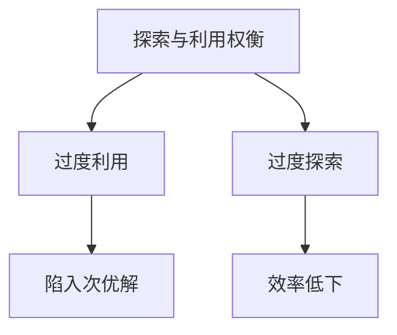
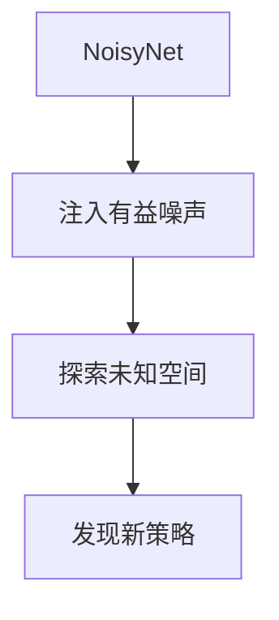

# NoisyDQN：探索未知，提升泛化能力

## 1.背景介绍

### 1.1 强化学习的挑战

强化学习是机器学习的一个重要分支,旨在让智能体通过与环境的交互来学习如何做出最优决策。然而,在复杂环境中,探索和利用之间的权衡是一个巨大的挑战。如果智能体只关注利用已知的最优策略,它可能会陷入次优的局部最优解;但如果过度探索,又可能效率低下。此外,当环境发生变化时,智能体需要具备良好的泛化能力来适应新的情况。

### 1.2 深度强化学习的兴起 

近年来,结合深度神经网络的深度强化学习取得了令人瞩目的成就,例如AlphaGo战胜人类顶尖棋手、OpenAI的机器人展现出超乎寻常的操控能力等。深度神经网络能够从原始输入数据中自动提取有用的特征表示,显著提高了智能体的决策能力。然而,深度强化学习也面临着一些新的挑战,例如如何平衡探索与利用、提高泛化能力等。

### 1.3 NoisyNet的提出

为了应对上述挑战,DeepMind提出了NoisyNet,一种通过注入有益的噪声来改善深度强化学习探索能力的新型神经网络结构。NoisyNet在每次前向传播时,会为每个神经元注入不相关的噪声,使得同一输入在不同时刻会产生略有不同的输出,从而促进探索。NoisyDQN就是将NoisyNet应用于经典的DQN(Deep Q-Network)算法中的一种实现。

## 2.核心概念与联系  

### 2.1 Q-Learning和DQN

Q-Learning是强化学习中一种基于价值的无模型算法,通过估计状态-行为对的长期回报Q值来学习最优策略。DQN则是将Q函数用深度神经网络来逼近,显著提高了处理高维原始输入数据的能力。

$$
Q(s_t, a_t) = r_t + \gamma \max_{a'}Q(s_{t+1}, a')
$$

上式是Q-Learning的核心更新规则,其中$Q(s_t, a_t)$表示在状态$s_t$执行行为$a_t$的Q值,$r_t$是立即回报,$\gamma$是折现因子。DQN使用了经验重复、目标网络等技巧来提高训练稳定性。

### 2.2 探索与利用的权衡

强化学习中一个核心问题是探索与利用的权衡。过度利用已知的最优策略会导致无法发现更优的解;过度探索又可能效率低下。传统的探索方式如$\epsilon$-greedy会随机选择次优行为,缺乏针对性。



### 2.3 NoisyNet促进有益探索

NoisyNet通过为每个神经元注入不相关的噪声,使得同一输入在不同时刻会产生略有不同的输出,从而促进探索未知的状态-行为空间。这种注入噪声的方式比简单的$\epsilon$-greedy更有针对性,可以集中探索有价值的区域。



### 2.4 提高泛化能力

除了改善探索能力,NoisyNet还有助于提高神经网络的泛化能力。由于每次前向传播时都会注入不同的噪声,网络在学习过程中等效于看到了更多不同的训练样本,从而获得了更好的泛化性能。当环境发生变化时,NoisyDQN也能更快适应新情况。

## 3.核心算法原理具体操作步骤

NoisyNet的核心思想是为每个神经元的权重和偏置引入可学习的噪声。具体来说,对于神经网络中的仿射变换层:

$$
y = wx + b
$$

其中$w$是权重向量,$x$是输入,$b$是偏置。NoisyNet将$w$和$b$分别参数化为确定项和噪声项之和:

$$
\begin{aligned}
w &= \mu_w + \Sigma_w \odot \epsilon_w\\  
b &= \mu_b + \Sigma_b \odot \epsilon_b
\end{aligned}
$$

其中$\mu$是可学习的确定项,$\Sigma$是可学习的噪声标量,$\epsilon$是从正态分布或者其他噪声分布采样得到的噪声向量,符号$\odot$表示元素乘积。

通过这种参数化方式,NoisyNet在每次前向传播时都会为每个神经元注入不相关的噪声,使得同一输入会产生略有不同的输出,从而促进探索。与简单的$\epsilon$-greedy不同,NoisyNet会集中探索有价值的区域,效率更高。

NoisyDQN算法的具体步骤如下:

1. 初始化NoisyNet,包括确定项$\mu$和噪声标量$\Sigma$的参数
2. 对于每个时间步:
    1) 从环境获取当前状态$s_t$
    2) 通过NoisyNet计算所有行为的Q值$Q(s_t, a; \theta)$,其中$\theta$是网络参数
    3) 根据$\epsilon$-greedy策略选择行为$a_t$
    4) 执行行为$a_t$,获得回报$r_t$和新状态$s_{t+1}$
    5) 存储转换$(s_t, a_t, r_t, s_{t+1})$到经验回放池
    6) 从经验回放池采样批量转换
    7) 计算目标Q值$y_j = r_j + \gamma \max_{a'} Q(s_{j+1}, a'; \theta^-)$,其中$\theta^-$是目标网络参数
    8) 优化损失函数$L = \mathbb{E}_{(s,a,r,s')\sim D}[(y_j - Q(s_j, a_j; \theta))^2]$,更新$\theta$和$\theta^-$
3. 直到达到终止条件

需要注意的是,在计算Q值时,NoisyNet会重新采样噪声$\epsilon$,从而在每次前向传播时注入不同的噪声。

## 4.数学模型和公式详细讲解举例说明

### 4.1 噪声向量的生成

NoisyNet使用独立的高斯噪声来模拟权重和偏置的不确定性。对于一个形状为$[m, n]$的参数矩阵,我们需要生成一个噪声矩阵$\epsilon$,其中每个元素都是独立的高斯噪声:

$$
\epsilon_{ij} \sim \mathcal{N}(0, \sigma^2), \quad i=1,\dots,m, \quad j=1,\dots,n
$$

其中$\sigma$是一个可学习的噪声标量,用于控制噪声的强度。在实际应用中,我们可以对$\sigma$加上约束,例如$\sigma=\max(0, \tilde{\sigma})$,确保其为非负值。

为了提高计算效率,NoisyNet会对权重噪声矩阵$\epsilon_w$进行因子分解,即$\epsilon_w = \mu \odot \sigma$,其中$\mu$是从标准正态分布采样得到的噪声矩阵,而$\sigma$则是一个可学习的噪声向量。通过这种分解,我们只需要为每一行或每一列采样一个噪声标量,而不是为每个元素单独采样,从而大大减少了噪声采样的计算开销。

### 4.2 注入噪声的仿射变换层

在NoisyNet中,仿射变换层的计算公式为:

$$
y = (\mu_w + \sigma_w \odot \epsilon_w)x + (\mu_b + \sigma_b \odot \epsilon_b)
$$

其中$\mu_w$和$\mu_b$分别是权重和偏置的确定项,$\sigma_w$和$\sigma_b$是可学习的噪声标量,$\epsilon_w$和$\epsilon_b$是从标准正态分布采样得到的噪声矩阵和向量。

通过这种参数化方式,NoisyNet在每次前向传播时都会为每个神经元注入不相关的噪声,使得同一输入会产生略有不同的输出,从而促进探索。与简单的$\epsilon$-greedy不同,NoisyNet会集中探索有价值的区域,效率更高。

例如,对于一个简单的全连接层:

$$
y = Wx + b
$$

其中$W$是权重矩阵,$x$是输入向量,$b$是偏置向量。我们可以将其重写为NoisyNet形式:

$$
\begin{aligned}
W &= \mu_W + \sigma_W \odot \epsilon_W\\
b &= \mu_b + \sigma_b \odot \epsilon_b\\
y &= (\mu_W + \sigma_W \odot \epsilon_W)x + (\mu_b + \sigma_b \odot \epsilon_b)
\end{aligned}
$$

在实际实现中,我们可以利用现代深度学习框架(如PyTorch或TensorFlow)提供的广播机制,高效地实现NoisyNet层。

### 4.3 噪声正则化

虽然NoisyNet能够提高探索能力和泛化性能,但过大的噪声强度也可能导致不稳定的训练过程。为了解决这个问题,NoisyNet采用了噪声正则化(Noise Regularization)技术,即在损失函数中加入一项噪声正则项:

$$
L = L_0 + \lambda \sum_i \sigma_i^2
$$

其中$L_0$是原始损失函数(如均方误差),$\sigma_i$是每个噪声标量,$\lambda$是一个正则化系数,用于控制噪声强度。通过这种方式,NoisyNet可以在探索和利用之间达到更好的平衡。

### 4.4 噪声注入的效果分析

我们可以通过一个简单的例子来直观地理解噪声注入对神经网络输出的影响。假设我们有一个单层全连接网络,输入为二维向量$x$,权重矩阵为$W$,偏置为$b$,输出为标量$y$:

$$
y = Wx + b
$$

如果不加噪声,对于同一输入$x$,网络的输出$y$是固定的。但如果我们对权重矩阵$W$和偏置$b$分别加入不相关的高斯噪声$\epsilon_W$和$\epsilon_b$:

$$
\begin{aligned}
W' &= W + \epsilon_W\\
b' &= b + \epsilon_b\\
y' &= W'x + b'
\end{aligned}
$$

那么对于同一输入$x$,网络的输出$y'$会有所不同,具体取决于噪声的强度。通过适当控制噪声强度,我们可以在探索和利用之间达到平衡,从而提高网络的性能。

## 5.项目实践:代码实例和详细解释说明

为了更好地理解NoisyNet的原理和实现,我们将通过一个实际的代码示例来演示如何在PyTorch中构建NoisyDQN。这个示例是基于OpenAI Gym的经典控制环境CartPole-v1,任务是通过水平移动力矩来使倒立摆保持直立状态。

### 5.1 导入必要的库

```python
import torch
import torch.nn as nn
import torch.nn.functional as F
import numpy as np
from collections import deque
import gym
```

### 5.2 实现NoisyLinear层

首先,我们定义NoisyLinear层,它是NoisyNet的核心组件。

```python
class NoisyLinear(nn.Module):
    def __init__(self, in_features, out_features, std_init=0.5):
        super(NoisyLinear, self).__init__()
        
        self.in_features = in_features
        self.out_features = out_features
        self.std_init = std_init
        
        self.weight_mu = nn.Parameter(torch.Tensor(out_features, in_features))
        self.weight_sigma = nn.Parameter(torch.Tensor(out_features, in_features))
        self.register_buffer('weight_epsilon', torch.Tensor(out_features, in_features))
        
        self.bias_mu = nn.Parameter(torch.Tensor(out_features))
        self.bias_sigma = nn.Parameter(torch.Tensor(out_features))
        self.register_buffer('bias_epsilon', torch.Tensor(out_features))
        
        self.reset_parameters()
        self.reset_noise()
        
    def forward(self, x):
        if self.training:
            weight = self.weight_mu + self.weight_sigma.mul(self.weight_epsilon)
            bias = self.bias_mu + self.bias_sigma.mul(self.bias_epsilon)
        else: