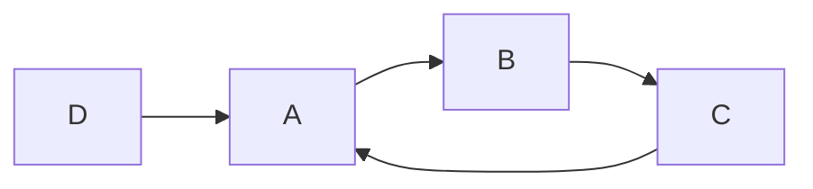

## 1. 背景介绍

### 1.1. 互联网信息爆炸的挑战

随着互联网的快速发展，网络上的信息量呈爆炸式增长。如何在海量信息中找到真正有价值的内容，成为了用户和搜索引擎共同面临的巨大挑战。传统的基于关键词匹配的搜索引擎，往往无法准确理解用户搜索意图，导致搜索结果质量不高。

### 1.2. PageRank 的诞生

为了解决上述问题，Google 的创始人 Larry Page 和 Sergey Brin 在 1998 年提出了 PageRank 算法。PageRank 算法的核心思想是：**网页的重要性由链接到该网页的其他网页的重要性来决定**。一个网页被链接的次数越多，且链接它的网页越重要，则该网页的重要性就越高。

### 1.3. PageRank 的意义

PageRank 算法的提出，标志着搜索引擎技术从单纯的关键词匹配，向基于网页质量和权威性的排序转变。PageRank 算法不仅极大地提升了搜索结果的质量，也为互联网信息生态的良性发展奠定了基础。

## 2. 核心概念与联系

### 2.1. 网页排名

PageRank 算法将互联网视为一个巨大的有向图，网页是图中的节点，网页之间的链接是图中的边。每个网页都有一个 PageRank 值，表示该网页的重要性。PageRank 值的计算基于以下两个核心概念：

#### 2.1.1. 入链数量

一个网页的入链数量，指的是有多少其他网页链接到该网页。入链数量越多，说明该网页被其他网页认可的程度越高，其重要性也就越高。

#### 2.1.2. 入链网页的质量

一个网页的入链网页的质量，指的是链接到该网页的其他网页的 PageRank 值。入链网页的 PageRank 值越高，说明链接到该网页的其他网页越重要，该网页的重要性也就越高。

### 2.2. 随机游走模型

PageRank 算法采用随机游走模型来计算网页的 PageRank 值。随机游走模型假设一个用户在互联网上随机浏览网页，用户在每个网页上停留一段时间后，会随机点击该网页上的一个链接，跳转到另一个网页。用户不断重复这个过程，最终会形成一个稳定的网页访问概率分布。这个概率分布就是网页的 PageRank 值。

### 2.3. 阻尼系数

在随机游走模型中，用户有可能陷入一个网页循环，无法跳出。为了避免这种情况，PageRank 算法引入了阻尼系数（damping factor）。阻尼系数表示用户在每个网页上随机点击链接的概率。通常情况下，阻尼系数设置为 0.85，表示用户有 85% 的概率会点击当前网页上的链接，有 15% 的概率会随机跳转到其他网页。

## 3. 核心算法原理具体操作步骤

PageRank 算法的具体操作步骤如下：

1. **构建网页链接图：** 将互联网上的所有网页作为节点，网页之间的链接作为边，构建一个有向图。
2. **初始化 PageRank 值：** 为每个网页设置一个初始 PageRank 值，通常设置为 1/N，其中 N 是网页总数。
3. **迭代计算 PageRank 值：** 根据随机游走模型，不断迭代计算每个网页的 PageRank 值，直到 PageRank 值收敛。
4. **排序输出：** 根据 PageRank 值对网页进行排序，输出排名结果。

### 3.1. 迭代计算 PageRank 值

在每次迭代中，每个网页的 PageRank 值的计算公式如下：

$$
PR(A) = (1-d) + d \sum_{i=1}^{n} \frac{PR(T_i)}{C(T_i)}
$$

其中：

* PR(A) 表示网页 A 的 PageRank 值。
* d 表示阻尼系数，通常设置为 0.85。
* T1, T2, ..., Tn 表示链接到网页 A 的所有网页。
* PR(Ti) 表示网页 Ti 的 PageRank 值。
* C(Ti) 表示网页 Ti 的出链数量，即网页 Ti 链接到的网页数量。

### 3.2. PageRank 值收敛

PageRank 算法的迭代计算过程，最终会收敛到一个稳定的 PageRank 值分布。判断 PageRank 值是否收敛，可以使用以下两种方法：

* **设定迭代次数：** 预先设定一个迭代次数，例如 100 次，当迭代次数达到设定值时，停止迭代。
* **设定收敛阈值：** 设定一个收敛阈值，例如 0.001，当所有网页的 PageRank 值的变化量都小于收敛阈值时，停止迭代。

## 4. 数学模型和公式详细讲解举例说明

### 4.1. 矩阵表示

PageRank 算法可以使用矩阵运算来表示。假设有 N 个网页，构建一个 N x N 的矩阵 M，矩阵元素 Mij 表示网页 j 链接到网页 i 的情况：

* 如果网页 j 链接到网页 i，则 Mij = 1/C(j)，其中 C(j) 表示网页 j 的出链数量。
* 如果网页 j 没有链接到网页 i，则 Mij = 0。

构建一个 N x 1 的向量 v，表示所有网页的 PageRank 值。初始情况下，v 的所有元素都设置为 1/N。

PageRank 算法的迭代计算过程，可以表示为以下矩阵运算：

$$
v' = (1-d)e + dMv
$$

其中：

* v' 表示新的 PageRank 值向量。
* e 表示一个 N x 1 的向量，所有元素都为 1。

### 4.2. 举例说明

假设有 4 个网页 A、B、C、D，网页之间的链接关系如下图所示：



根据上述链接关系，可以构建矩阵 M 和向量 v：

$$
M = \begin{bmatrix}
0 & 1 & 1/2 & 1 \\
1/2 & 0 & 0 & 0 \\
0 & 1/2 & 0 & 0 \\
0 & 0 & 1/2 & 0
\end{bmatrix}
$$

$$
v = \begin{bmatrix}
1/4 \\
1/4 \\
1/4 \\
1/4
\end{bmatrix}
$$

假设阻尼系数 d = 0.85，则第一次迭代计算后的 PageRank 值向量为：

```
v' = (1-d)e + dMv = 0.15 * [1 1 1 1]' + 0.85 * M * v = [0.475 0.2875 0.1625 0.075]'
```

第二次迭代计算后的 PageRank 值向量为：

```
v'' = (1-d)e + dMv' = [0.38125 0.30625 0.20625 0.10625]'
```

不断迭代计算，最终 PageRank 值会收敛到一个稳定的值，例如：

```
v = [0.38 0.31 0.21 0.10]'
```

## 5. 项目实践：代码实例和详细解释说明

### 5.1. Python 代码实例

```python
import numpy as np

def pagerank(M, d=0.85, epsilon=1e-8):
    """
    计算网页的 PageRank 值。

    参数：
        M：网页链接矩阵。
        d：阻尼系数。
        epsilon：收敛阈值。

    返回值：
        PageRank 值向量。
    """

    N = M.shape[0] # 网页数量
    v = np.ones(N) / N # 初始化 PageRank 值向量

    while True:
        v_old = v.copy()
        v = (1-d) * np.ones(N) + d * M.dot(v) # 迭代计算 PageRank 值
        if np.linalg.norm(v - v_old) < epsilon: # 判断是否收敛
            break

    return v

# 示例用法
M = np.array([[0, 1, 1/2, 1],
              [1/2, 0, 0, 0],
              [0, 1/2, 0, 0],
              [0, 0, 1/2, 0]]) # 网页链接矩阵
pr = pagerank(M) # 计算 PageRank 值
print(pr) # 输出 PageRank 值向量
```

### 5.2. 代码解释

* `pagerank()` 函数接收网页链接矩阵 `M`、阻尼系数 `d` 和收敛阈值 `epsilon` 作为参数，返回 PageRank 值向量。
* 函数首先获取网页数量 `N`，并初始化 PageRank 值向量 `v` 为 1/N。
* 然后，函数进入一个循环，不断迭代计算 PageRank 值，直到满足收敛条件。
* 在每次迭代中，函数使用公式 `(1-d) * np.ones(N) + d * M.dot(v)` 计算新的 PageRank 值向量 `v`。
* 函数使用 `np.linalg.norm(v - v_old) < epsilon` 判断 PageRank 值是否收敛。如果所有网页的 PageRank 值的变化量都小于收敛阈值 `epsilon`，则认为 PageRank 值已经收敛，跳出循环。
* 最后，函数返回 PageRank 值向量 `v`。

## 6. 实际应用场景

PageRank 算法在互联网领域有着广泛的应用，例如：

* **搜索引擎：** Google、百度等搜索引擎使用 PageRank 算法对网页进行排序，提升搜索结果质量。
* **社交网络：** Facebook、Twitter 等社交网络使用 PageRank 算法来识别重要用户，推荐好友关系。
* **推荐系统：** Amazon、Netflix 等推荐系统使用 PageRank 算法来推荐商品、电影等。
* **垃圾邮件过滤：** PageRank 算法可以用来识别垃圾邮件发送者，提升垃圾邮件过滤效果。
* **学术研究：** PageRank 算法被广泛应用于网页重要性分析、网络结构分析等学术研究领域。

## 7. 工具和资源推荐

* **NetworkX：** Python 库，用于创建、操作和研究复杂网络的结构、动态和功能。
* **igraph：** C 库，用于创建、操作和分析大型复杂网络。
* **Gephi：** 开源软件，用于可视化和分析大型网络。

## 8. 总结：未来发展趋势与挑战

### 8.1. 个性化 PageRank

传统的 PageRank 算法计算的是全局 PageRank 值，没有考虑用户的个性化需求。未来，个性化 PageRank 将成为一个重要的发展方向，根据用户的兴趣、历史行为等信息，计算个性化的 PageRank 值，提升搜索结果和推荐结果的精准度。

### 8.2. 反作弊

PageRank 算法容易受到人为操纵，例如链接农场、隐藏链接等作弊手段。未来，需要开发更加有效的反作弊算法，提升 PageRank 算法的鲁棒性。

### 8.3. 大规模计算

随着互联网信息的不断增长，PageRank 算法的计算规模越来越大。未来，需要研究更高效的 PageRank 算法，提升计算效率，满足大规模计算需求。

## 9. 附录：常见问题与解答

### 9.1. PageRank 值的意义是什么？

PageRank 值表示网页的重要性，值越高，网页越重要。

### 9.2. 阻尼系数的作用是什么？

阻尼系数用于避免随机游走模型陷入网页循环，通常设置为 0.85。

### 9.3. 如何判断 PageRank 值是否收敛？

可以通过设定迭代次数或收敛阈值来判断 PageRank 值是否收敛。

### 9.4. PageRank 算法有哪些应用场景？

PageRank 算法应用于搜索引擎、社交网络、推荐系统、垃圾邮件过滤、学术研究等领域。
