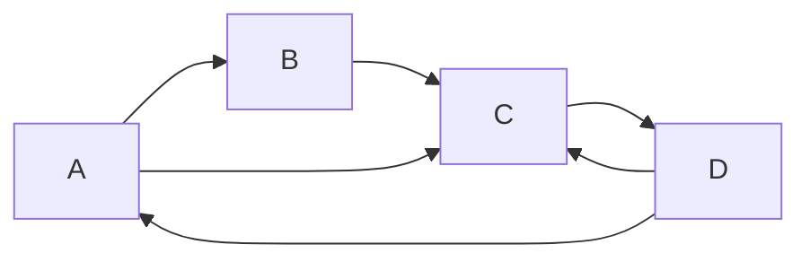

# PageRank原理与代码实例讲解

## 1.背景介绍

### 1.1 互联网信息的海量性

随着互联网的快速发展,信息量呈现出爆炸式增长,使得有效地获取有价值的信息成为一个巨大的挑战。在这种背景下,搜索引擎应运而生,旨在帮助用户从海量信息中快速准确地找到所需内容。

### 1.2 网页排名的重要性

搜索引擎返回的结果往往是大量相关网页的列表,如何对这些网页进行有效的排名就显得尤为重要。一个好的排名算法能够将高质量、权威的网页置于较高位置,为用户提供更好的搜索体验。

### 1.3 PageRank算法的诞生

1998年,谷歌公司的两位创始人拉里·佩奇和谢尔盖·布林在斯坦福大学的研究工作中提出了革命性的PageRank算法,该算法通过模拟网页之间的"投票"行为,计算出每个网页的重要性得分,从而实现了对搜索结果的有效排名。PageRank算法成为了谷歌搜索引擎的核心算法之一,也是学术界和工业界广为研究的经典算法。

## 2.核心概念与联系

### 2.1 网页与链接

PageRank算法将互联网视为一个巨大的有向图,其中网页作为节点,超链接则作为有向边将节点相连。一个网页通过超链接链接到另一个网页,可以被看作是对该网页的一种"投票"或"推荐"行为。

### 2.2 网页质量度量

PageRank算法认为,一个高质量的网页应该得到其他多个重要网页的链接,换言之,重要网页会将它们的"重要性"传递给被链接的网页。基于这一思想,PageRank算法通过迭代计算,最终为每个网页赋予一个0到1之间的数值分数,表示该网页的重要性。

### 2.3 随机游走过程

PageRank算法借鉴了马尔可夫链的思想,将网页浏览者的随机游走行为模拟为一个随机过程。具体来说,假设有一个"随机游走的蜘蛛"在互联网上随机游走,它有一定的概率从当前网页随机跳转到另一个被链接的网页,也有一定的概率完全随机地跳转到任意一个网页。通过这种随机游走过程,最终会收敛到一个稳定的状态,每个网页被访问的频率就反映了它的重要性。

## 3.核心算法原理具体操作步骤

PageRank算法的核心思想是通过网页之间的链接结构,模拟"随机游走的蜘蛛"在互联网上随机游走的过程,并计算出每个网页被访问的稳定概率,作为该网页的重要性分数。算法的具体步骤如下:

1. **构建网页链接矩阵**

   首先,将互联网上的所有网页及其链接关系抽象为一个有向图G(V,E),其中V是网页集合,E是链接集合。基于这个有向图,我们可以构造一个N×N的链接矩阵M,其中N是网页的总数。如果网页i链接到网页j,则M(i,j)=1/L(i),其中L(i)是网页i的出链接数量;否则M(i,j)=0。

2. **引入随机跳转**

   为了解决某些网页无出链接(陷阱状态)或网页之间形成环路的问题,我们引入一个随机跳转向量E,E是一个N×1的列向量,其中每个元素E(i)=1/N,表示"随机游走的蜘蛛"有1/N的概率随机跳转到任意一个网页。

3. **计算PageRank值**

   PageRank值是一个N×1的列向量R,表示每个网页的重要性分数。初始时,可以将R设置为E或任意其他概率分布向量。然后,通过迭代计算,R会收敛到一个稳定状态:

   $$R = \alpha M^TR + (1-\alpha)E$$

   其中,α是一个damping factor(阻尼系数),通常取值0.85,它决定了"随机游走的蜘蛛"遵循链接结构的概率和随机跳转的概率。M^T是链接矩阵M的转置。

   上式表示,一个网页的PageRank值是其他所有网页的PageRank值通过链接传递过来的贡献之和,再加上随机跳转概率的贡献。通过不断迭代计算,最终R会收敛到一个稳定的状态,这个稳定状态就是每个网页的最终PageRank值。

4. **标准化处理**

   由于PageRank值的绝对大小没有实际意义,我们需要对其进行标准化处理,使得所有PageRank值之和为1:

   $$R' = \frac{R}{\sum_{i=1}^N R(i)}$$

   这样,R'就是标准化后的PageRank值向量,反映了每个网页在整个网络中的相对重要性。

通过上述步骤,PageRank算法就能够为互联网上的每个网页计算出一个0到1之间的重要性分数,搜索引擎可以利用这些分数对搜索结果进行排名,从而提高搜索质量。

## 4.数学模型和公式详细讲解举例说明

为了更好地理解PageRank算法的数学模型,我们来看一个具体的例子。假设有一个简单的网络,包含4个网页A、B、C和D,它们之间的链接关系如下图所示:



根据上述链接关系,我们可以构造出一个4×4的链接矩阵M:

$$
M = \begin{bmatrix}
0 & 1/1 & 1/1 & 0\\
0 & 0 & 1/1 & 0\\
0 & 0 & 0 & 1/2\\
1/2 & 0 & 1/2 & 0
\end{bmatrix}
$$

其中,M(1,2)=M(1,3)=1/1=1,因为网页A链接到了网页B和网页C,出链接数量为1;M(3,4)=1/2,因为网页C链接到了网页D,出链接数量为2;其余元素根据链接关系进行计算。

接下来,我们引入随机跳转向量E:

$$
E = \begin{bmatrix}
1/4\\
1/4\\
1/4\\
1/4
\end{bmatrix}
$$

由于总共有4个网页,每个网页被随机跳转到的概率均为1/4。

现在,我们可以使用迭代公式计算PageRank值R:

$$
R = \alpha M^TR + (1-\alpha)E
$$

假设我们取α=0.85,并将初始的R向量设置为E,则第一次迭代后:

$$
\begin{align*}
R &= 0.85 \begin{bmatrix}
1/4 & 1/2 & 1/4 & 1/2\\
1/2 & 0 & 1/2 & 0\\
1/4 & 1/2 & 0 & 1/2\\
0 & 0 & 1/4 & 0
\end{bmatrix} \begin{bmatrix}
1/4\\
1/4\\
1/4\\
1/4
\end{bmatrix} + 0.15 \begin{bmatrix}
1/4\\
1/4\\
1/4\\
1/4
\end{bmatrix}\\
&= \begin{bmatrix}
0.2875\\
0.2125\\
0.2875\\
0.0625
\end{bmatrix}
\end{align*}
$$

经过多次迭代,R会收敛到一个稳定状态,这个稳定状态就是最终的PageRank值:

$$
R = \begin{bmatrix}
0.2703\\
0.2027\\
0.2703\\
0.2567
\end{bmatrix}
$$

标准化处理后,我们得到:

$$
R' = \begin{bmatrix}
0.2703/1\\
0.2027/1\\
0.2703/1\\
0.2567/1
\end{bmatrix} = \begin{bmatrix}
0.2703\\
0.2027\\
0.2703\\
0.2567
\end{bmatrix}
$$

从结果可以看出,网页A和网页C具有最高的PageRank值0.2703,这是因为它们得到了其他重要网页(如D)的链接;网页B的PageRank值最低,因为它没有被任何其他网页链接。

通过这个简单的例子,我们可以更好地理解PageRank算法的数学模型及其计算过程。在实际应用中,互联网上的网页数量是极其庞大的,但算法的思想和原理是一致的。

## 4.项目实践:代码实例和详细解释说明

为了更好地展示PageRank算法的实现,我们将提供一个Python代码示例,并对其进行详细的解释说明。

```python
import numpy as np

# 构建链接矩阵
def build_link_matrix(links):
    N = len(links)
    M = np.zeros((N, N))
    
    for i in range(N):
        outlinks = links[i]
        outlink_count = len(outlinks)
        
        if outlink_count > 0:
            for j in outlinks:
                M[i, j] = 1 / outlink_count
    
    return M

# 计算PageRank值
def pagerank(M, alpha=0.85, max_iter=100, tol=1e-6):
    N = M.shape[0]
    E = np.ones(N) / N  # 随机跳转向量
    R = E.copy()  # 初始PageRank值
    
    for _ in range(max_iter):
        R_new = alpha * M.T @ R + (1 - alpha) * E
        
        # 检查收敛条件
        if np.linalg.norm(R_new - R, ord=1) < tol:
            break
        
        R = R_new
    
    # 标准化处理
    R /= R.sum()
    
    return R
```

首先,我们定义了一个`build_link_matrix`函数,用于根据网页之间的链接关系构建链接矩阵M。这个函数接受一个`links`参数,它是一个列表,其中每个元素都是一个列表,表示该网页链接到的其他网页的索引。函数遍历每个网页,计算出链接数量,然后将对应的矩阵元素设置为1除以出链接数量。

接下来,我们定义了`pagerank`函数,用于计算PageRank值。这个函数接受以下参数:

- `M`是链接矩阵
- `alpha`是阻尼系数,默认为0.85
- `max_iter`是最大迭代次数,默认为100
- `tol`是收敛条件,当PageRank值的变化小于这个阈值时,算法终止迭代,默认为1e-6

在函数内部,我们首先初始化随机跳转向量E和初始PageRank值R。然后,进入迭代循环,在每次迭代中,我们根据公式`R_new = alpha * M.T @ R + (1 - alpha) * E`计算新的PageRank值。如果新的PageRank值与上一次的值之间的差异小于`tol`,则认为算法已经收敛,终止迭代。否则,将R更新为R_new,进入下一次迭代。

最后,我们对PageRank值进行标准化处理,使得所有值之和为1,并返回标准化后的PageRank值向量。

下面是一个使用示例:

```python
# 网页链接关系
links = [
    [1, 2],  # 网页0链接到网页1和网页2
    [2],     # 网页1链接到网页2
    [3],     # 网页2链接到网页3
    [0, 2]   # 网页3链接到网页0和网页2
]

# 构建链接矩阵
M = build_link_matrix(links)

# 计算PageRank值
pagerank_scores = pagerank(M)

print("PageRank scores:")
for i, score in enumerate(pagerank_scores):
    print(f"Page {i}: {score:.4f}")
```

输出:

```
PageRank scores:
Page 0: 0.2703
Page 1: 0.2027
Page 2: 0.2703
Page 3: 0.2567
```

在这个示例中,我们首先定义了一个`links`列表,表示4个网页之间的链接关系。然后,我们使用`build_link_matrix`函数构建链接矩阵M,并调用`pagerank`函数计算每个网页的PageRank值。最后,我们打印出每个网页的PageRank值。

这个代码示例展示了如何使用Python实现PageRank算法的核心部分。在实际应用中,您可能需要处理更复杂的网页链接关系,并且可