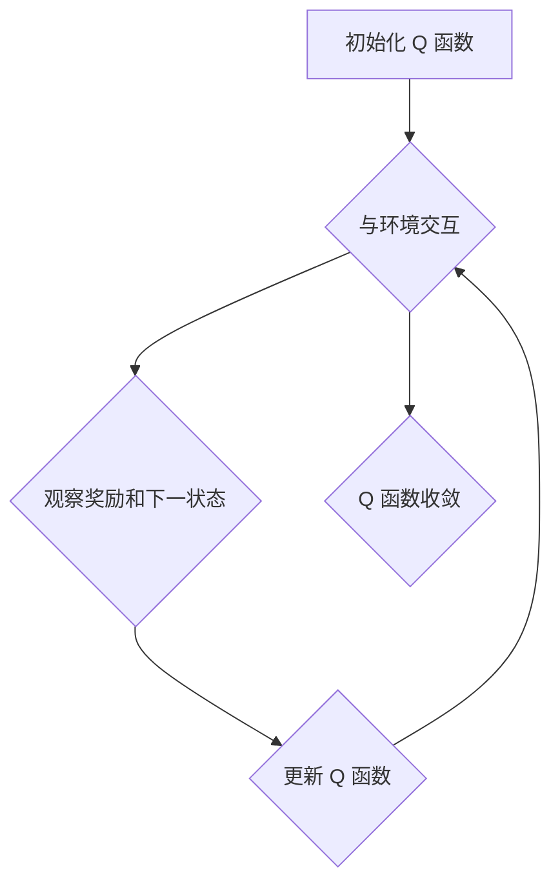

## 1. 背景介绍

### 1.1 强化学习概述

强化学习（Reinforcement Learning，RL）是一种机器学习方法，它关注智能体如何在环境中采取行动以最大化累积奖励。与监督学习不同，强化学习不依赖于预先标记的数据集，而是通过与环境交互来学习。

### 1.2 Q-Learning的引入

Q-Learning是一种经典的强化学习算法，它通过学习一个动作值函数（Q 函数）来评估在特定状态下采取特定动作的价值。Q 函数的值表示在该状态下采取该动作并遵循最优策略的预期累积奖励。

## 2. 核心概念与联系

### 2.1 状态（State）

状态是描述环境当前状况的信息，例如在游戏中，状态可以是玩家的位置、得分和剩余生命值。

### 2.2 动作（Action）

动作是智能体可以在环境中执行的操作，例如在游戏中，动作可以是向上、向下、向左或向右移动。

### 2.3 奖励（Reward）

奖励是环境在智能体执行动作后提供的反馈信号，它可以是正值（表示好的行为）或负值（表示不好的行为）。

### 2.4 Q 函数（Q-function）

Q 函数是一个映射，它将状态-动作对映射到预期累积奖励。Q(s, a) 表示在状态 s 下采取动作 a 并遵循最优策略的预期累积奖励。

### 2.5 策略（Policy）

策略是智能体根据当前状态选择动作的规则，它可以是确定性的（总是选择相同的动作）或随机性的（根据概率分布选择动作）。

## 3. 核心算法原理具体操作步骤

### 3.1 初始化 Q 函数

首先，我们需要初始化 Q 函数。一种常见的方法是将所有状态-动作对的 Q 值初始化为 0。

### 3.2 与环境交互

智能体与环境交互，观察当前状态 s，并根据当前策略选择动作 a。

### 3.3 观察奖励和下一状态

智能体执行动作 a 后，观察环境返回的奖励 r 和下一状态 s'。

### 3.4 更新 Q 函数

根据观察到的奖励和下一状态，更新 Q 函数：

```
Q(s, a) = Q(s, a) + α * (r + γ * max(Q(s', a')) - Q(s, a))
```

其中：

* α 是学习率，它控制 Q 函数更新的速度。
* γ 是折扣因子，它控制未来奖励的重要性。
* max(Q(s', a')) 是在下一状态 s' 下所有可能动作 a' 中最大 Q 值。

### 3.5 重复步骤 2-4

重复步骤 2-4，直到 Q 函数收敛。

## 4. 数学模型和公式详细讲解举例说明

### 4.1 Bellman 方程

Q-Learning 的核心是 Bellman 方程，它描述了 Q 函数的最优值：

```
Q*(s, a) = E[r + γ * max(Q*(s', a')) | s, a]
```

其中：

* Q*(s, a) 是在状态 s 下采取动作 a 并遵循最优策略的预期累积奖励。
* E[...] 表示期望值。

### 4.2 更新规则推导

Q-Learning 的更新规则可以从 Bellman 方程推导出来。通过将 Bellman 方程转化为迭代更新规则，我们可以得到：

```
Q(s, a) = Q(s, a) + α * (r + γ * max(Q(s', a')) - Q(s, a))
```

### 4.3 举例说明

假设有一个简单的游戏，玩家需要在一个 4x4 的网格中移动，目标是到达目标位置。玩家可以向上、向下、向左或向右移动。如果玩家到达目标位置，则获得 1 的奖励；如果玩家撞到墙壁，则获得 -1 的奖励；其他情况下，奖励为 0。

我们可以使用 Q-Learning 来学习一个最优策略，让玩家能够以最少的步数到达目标位置。

## 5. 项目实践：代码实例和详细解释说明

```python
import numpy as np

# 定义环境
class GridWorld:
    def __init__(self, size):
        self.size = size
        self.goal = (size-1, size-1)
        self.walls = [(1, 1), (2, 2)]

    def get_reward(self, state, action):
        next_state = self.get_next_state(state, action)
        if next_state == self.goal:
            return 1
        elif next_state in self.walls:
            return -1
        else:
            return 0

    def get_next_state(self, state, action):
        row, col = state
        if action == 'up':
            row = max(0, row-1)
        elif action == 'down':
            row = min(self.size-1, row+1)
        elif action == 'left':
            col = max(0, col-1)
        elif action == 'right':
            col = min(self.size-1, col+1)
        return (row, col)

# 定义 Q-Learning 算法
class QLearning:
    def __init__(self, env, learning_rate, discount_factor, epsilon):
        self.env = env
        self.learning_rate = learning_rate
        self.discount_factor = discount_factor
        self.epsilon = epsilon
        self.q_table = np.zeros((env.size, env.size, 4))

    def choose_action(self, state):
        if np.random.uniform(0, 1) < self.epsilon:
            return np.random.choice(['up', 'down', 'left', 'right'])
        else:
            return np.argmax(self.q_table[state[0], state[1]])

    def update_q_table(self, state, action, reward, next_state):
        self.q_table[state[0], state[1], action] += self.learning_rate * (
            reward + self.discount_factor * np.max(self.q_table[next_state[0], next_state[1]]) - self.q_table[state[0], state[1], action]
        )

    def train(self, num_episodes):
        for episode in range(num_episodes):
            state = (0, 0)
            while state != self.env.goal:
                action = self.choose_action(state)
                next_state = self.env.get_next_state(state, action)
                reward = self.env.get_reward(state, action)
                self.update_q_table(state, action, reward, next_state)
                state = next_state

# 创建环境和算法实例
env = GridWorld(4)
agent = QLearning(env, learning_rate=0.1, discount_factor=0.9, epsilon=0.1)

# 训练算法
agent.train(num_episodes=1000)

# 打印 Q 表
print(agent.q_table)
```

**代码解释：**

* `GridWorld` 类定义了游戏环境，包括网格大小、目标位置、墙壁位置、奖励函数和状态转移函数。
* `QLearning` 类定义了 Q-Learning 算法，包括环境、学习率、折扣因子、探索率、Q 表、动作选择函数、Q 表更新函数和训练函数。
* `train` 函数使用 Q-Learning 算法训练智能体，并在每个 episode 中更新 Q 表。
* 最后，打印 Q 表，其中包含每个状态-动作对的预期累积奖励。

## 6. 实际应用场景

Q-Learning 是一种通用的强化学习算法，它可以应用于各种实际应用场景，包括：

* 游戏：学习玩游戏，例如 Atari 游戏、围棋和象棋。
* 机器人控制：学习控制机器人的动作，例如导航、抓取和操作物体。
* 资源管理：学习优化资源分配，例如服务器负载均衡和能源管理。
* 推荐系统：学习推荐用户感兴趣的商品或内容。

## 7. 总结：未来发展趋势与挑战

Q-Learning 是一种强大的强化学习算法，它已经取得了巨大的成功。然而，它也面临一些挑战，包括：

* **探索-利用困境：** 如何平衡探索新动作和利用已知最佳动作之间的关系。
* **维度灾难：** 当状态和动作空间很大时，Q 表的大小会变得非常大，难以存储和更新。
* **泛化能力：** 如何将学习到的策略泛化到新的环境或任务。

未来，Q-Learning 的研究方向包括：

* **深度 Q-Learning：** 使用深度神经网络来逼近 Q 函数，解决维度灾难问题。
* **多智能体 Q-Learning：** 学习多个智能体在合作或竞争环境中的最优策略。
* **迁移学习：** 将学习到的知识迁移到新的环境或任务。

## 8. 附录：常见问题与解答

### 8.1 Q-Learning 和 SARSA 的区别是什么？

Q-Learning 是一种 off-policy 算法，它学习最优策略，而 SARSA 是一种 on-policy 算法，它学习当前策略。这意味着 Q-Learning 可以学习与当前策略不同的策略，而 SARSA 只能学习当前策略。

### 8.2 如何选择 Q-Learning 的参数？

学习率、折扣因子和探索率是 Q-Learning 的重要参数。学习率控制 Q 函数更新的速度，折扣因子控制未来奖励的重要性，探索率控制探索新动作的概率。

通常，较小的学习率和较大的折扣因子会导致更稳定的学习过程。探索率应该随着时间的推移而降低，以便智能体能够逐渐利用已知最佳动作。

### 8.3 如何评估 Q-Learning 的性能？

可以使用各种指标来评估 Q-Learning 的性能，包括：

* **累积奖励：** 智能体在训练过程中获得的总奖励。
* **平均奖励：** 每个 episode 的平均奖励。
* **步数：** 智能体达到目标状态所需的步数。

### 8.4 Q-Learning 的局限性是什么？

Q-Learning 的局限性包括：

* **维度灾难：** 当状态和动作空间很大时，Q 表的大小会变得非常大，难以存储和更新。
* **泛化能力：** 如何将学习到的策略泛化到新的环境或任务。
* **探索-利用困境：** 如何平衡探索新动作和利用已知最佳动作之间的关系。

## 9. Mermaid 流程图


