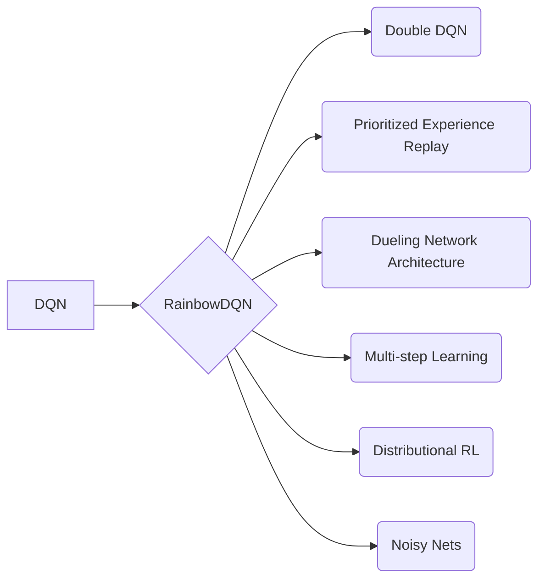

# RainbowDQN：集大成者的七彩光芒

作者：禅与计算机程序设计艺术

## 1. 背景介绍

### 1.1 深度强化学习的崛起

近年来，深度学习技术的飞速发展为人工智能领域带来了革命性的变化，其中一个重要的分支就是深度强化学习（Deep Reinforcement Learning, DRL）。DRL将深度学习的感知能力与强化学习的决策能力相结合，使得智能体能够直接从高维的感知输入中学习复杂的决策策略，并在各种挑战性任务中取得了突破性进展，例如 Atari 游戏、围棋、机器人控制等。

### 1.2 DQN及其变体

深度 Q 网络（Deep Q-Network, DQN）是 DRL 领域的一个里程碑式的工作，它首次成功地将深度学习应用于强化学习，并取得了超越人类水平的游戏控制效果。然而，DQN 也存在一些局限性，例如：

- 对过估计 Q 值的敏感性
- 探索-利用困境
- 训练效率低下

为了解决这些问题，研究者们提出了各种 DQN 的改进版本，例如 Double DQN、Prioritized Experience Replay、Dueling Network Architecture 等。这些改进方法各自针对 DQN 的某一方面缺陷进行优化，取得了一定的效果提升。

### 1.3 RainbowDQN 的诞生

RainbowDQN 是一种集大成者的 DQN 变体，它将上述几种改进方法整合到一起，并通过精细的调整和优化，实现了在 Atari 游戏上的最佳性能。RainbowDQN 的成功表明，将多种互补的改进方法结合起来，可以有效地提升 DRL 算法的性能和稳定性。

## 2. 核心概念与联系

### 2.1 DQN 核心概念回顾

在深入探讨 RainbowDQN 之前，让我们先回顾一下 DQN 的核心概念：

- **Q 值:**  Q 值表示在某个状态下采取某个动作的预期累积奖励。DQN 的目标是学习一个 Q 函数，它能够准确地预测不同状态-动作对的 Q 值。
- **经验回放:**  经验回放机制将智能体与环境交互的历史经验存储起来，并在训练过程中随机抽取样本进行学习，从而提高数据利用效率和算法稳定性。
- **目标网络:**  目标网络是 Q 网络的一个副本，用于计算目标 Q 值，以减少训练过程中的震荡和不稳定性。

### 2.2 RainbowDQN 整合的改进方法

RainbowDQN 整合了以下几种 DQN 的改进方法：

- **Double DQN:**  Double DQN 通过使用两个独立的 Q 网络来估计目标 Q 值，从而缓解了 DQN 对过估计 Q 值的敏感性。
- **Prioritized Experience Replay:**  Prioritized Experience Replay 根据样本的重要性对经验回放进行优先级排序，从而提高了学习效率。
- **Dueling Network Architecture:**  Dueling Network Architecture 将 Q 网络分成两个分支，分别估计状态值函数和优势函数，从而提高了学习效率和泛化能力。
- **Multi-step Learning:**  Multi-step Learning 通过考虑未来多个时间步的奖励来计算目标 Q 值，从而提高了学习效率和稳定性。
- **Distributional RL:**  Distributional RL 将 Q 值建模为一个分布，而不是一个单一的标量值，从而更准确地捕捉了环境的不确定性。
- **Noisy Nets:**  Noisy Nets 通过在网络参数中添加噪声来鼓励探索，从而提高了算法的探索能力。

### 2.3 核心概念联系图



## 3. 核心算法原理具体操作步骤

### 3.1 RainbowDQN 算法流程

RainbowDQN 的算法流程与 DQN 类似，主要包括以下步骤：

1. **初始化 Q 网络和目标网络。**
2. **循环迭代，进行多轮游戏：**
    - 在每个时间步，根据当前状态和 Q 网络选择一个动作。
    - 执行动作，获得奖励和下一个状态。
    - 将经验（状态、动作、奖励、下一个状态）存储到经验回放缓冲区。
    - 从经验回放缓冲区中随机抽取一批样本。
    - 使用目标网络计算目标 Q 值。
    - 使用 Double DQN 算法计算目标 Q 值。
    - 使用 Prioritized Experience Replay 算法对样本进行优先级排序。
    - 使用 Dueling Network Architecture 计算 Q 值。
    - 使用 Multi-step Learning 计算目标 Q 值。
    - 使用 Distributional RL 计算 Q 值分布。
    - 使用 Noisy Nets 鼓励探索。
    - 使用梯度下降更新 Q 网络参数。
    - 每隔一段时间，将 Q 网络参数复制到目标网络。

### 3.2 关键操作步骤详解

- **Double DQN:**  Double DQN 使用两个 Q 网络，一个用于选择动作，另一个用于评估动作。目标 Q 值的计算方式为：

```
Q_target(s, a) = r + γ * Q_eval(s', argmax_a' Q_target(s', a'))
```

其中，Q_eval 是用于评估动作的 Q 网络，Q_target 是目标网络。

- **Prioritized Experience Replay:**  Prioritized Experience Replay 根据样本的重要性对经验回放进行优先级排序。样本的优先级通常定义为 TD 误差的绝对值：

```
p_i = |δ_i|
```

其中，δ_i 是样本 i 的 TD 误差。

- **Dueling Network Architecture:**  Dueling Network Architecture 将 Q 网络分成两个分支，分别估计状态值函数 V(s) 和优势函数 A(s, a)：

```
Q(s, a) = V(s) + A(s, a)
```

- **Multi-step Learning:**  Multi-step Learning 通过考虑未来多个时间步的奖励来计算目标 Q 值：

```
Q_target(s_t, a_t) = r_t + γ * r_{t+1} + ... + γ^{n-1} * r_{t+n-1} + γ^n * Q(s_{t+n}, a_{t+n})
```

- **Distributional RL:**  Distributional RL 将 Q 值建模为一个分布，而不是一个单一的标量值。常用的分布模型包括：

    - **Categorical DQN:**  将 Q 值分布表示为一个离散的概率分布。
    - **Quantile Regression DQN:**  将 Q 值分布表示为一组分位数。

- **Noisy Nets:**  Noisy Nets 通过在网络参数中添加噪声来鼓励探索。噪声通常服从高斯分布或均匀分布。

## 4. 数学模型和公式详细讲解举例说明

### 4.1 Bellman 方程

DQN 算法的核心是 Bellman 方程，它描述了 Q 值之间的迭代关系：

```
Q^*(s, a) = E[r + γ * max_{a'} Q^*(s', a') | s, a]
```

其中，Q^*(s, a) 表示在状态 s 下采取动作 a 的最优 Q 值，r 表示立即奖励，γ 表示折扣因子，s' 表示下一个状态，a' 表示下一个动作。

DQN 算法的目标是学习一个 Q 函数，使得它能够逼近最优 Q 函数 Q^*(s, a)。

### 4.2 TD 误差

TD 误差是衡量 Q 函数预测值与目标值之间差距的指标：

```
δ = Q(s, a) - (r + γ * max_{a'} Q(s', a'))
```

DQN 算法使用 TD 误差来更新 Q 函数的参数。

### 4.3 损失函数

DQN 算法使用均方误差作为损失函数：

```
L = (1/N) * Σ_{i=1}^N (δ_i)^2
```

其中，N 表示样本数量，δ_i 表示样本 i 的 TD 误差。

### 4.4 举例说明

假设有一个简单的游戏，玩家可以向左或向右移动，目标是到达目标位置。

- 状态空间：{左，右，目标}
- 动作空间：{左，右}
- 奖励函数：
    - 到达目标位置：+1
    - 其他情况：0

使用 DQN 算法学习 Q 函数，初始 Q 函数值均为 0。

假设智能体在状态“左”下采取动作“右”，到达状态“目标”，获得奖励 +1。

TD 误差为：

```
δ = Q(左, 右) - (1 + 0 * max{Q(目标, 左), Q(目标, 右)}) = 0 - 1 = -1
```

更新 Q 函数：

```
Q(左, 右) = Q(左, 右) + α * δ = 0 + 0.1 * (-1) = -0.1
```

其中，α 表示学习率。

## 5. 项目实践：代码实例和详细解释说明

### 5.1 Atari 游戏环境配置

为了演示 RainbowDQN 算法，我们将使用 OpenAI Gym 提供的 Atari 游戏环境。首先，需要安装 OpenAI Gym 和 Atari ROMs：

```
pip install gym[atari]
```

然后，可以使用以下代码创建一个 Atari 游戏环境：

```python
import gym

env = gym.make('Breakout-v0')
```

### 5.2 RainbowDQN 代码实现

以下是一个 RainbowDQN 算法的 Python 代码实现：

```python
import torch
import torch.nn as nn
import torch.optim as optim
from collections import deque
import random
import numpy as np

class RainbowDQN(nn.Module):
    def __init__(self, input_shape, num_actions):
        super(RainbowDQN, self).__init__()

        self.conv1 = nn.Conv2d(input_shape[0], 32, kernel_size=8, stride=4)
        self.conv2 = nn.Conv2d(32, 64, kernel_size=4, stride=2)
        self.conv3 = nn.Conv2d(64, 64, kernel_size=3, stride=1)
        self.fc1 = nn.Linear(7 * 7 * 64, 512)
        self.fc2 = nn.Linear(512, num_actions)

    def forward(self, x):
        x = torch.relu(self.conv1(x))
        x = torch.relu(self.conv2(x))
        x = torch.relu(self.conv3(x))
        x = x.view(x.size(0), -1)
        x = torch.relu(self.fc1(x))
        x = self.fc2(x)
        return x

class ReplayBuffer:
    def __init__(self, capacity):
        self.buffer = deque(maxlen=capacity)

    def push(self, state, action, reward, next_state, done):
        self.buffer.append((state, action, reward, next_state, done))

    def sample(self, batch_size):
        transitions = random.sample(self.buffer, batch_size)
        state, action, reward, next_state, done = zip(*transitions)
        return np.array(state), action, reward, np.array(next_state), done

    def __len__(self):
        return len(self.buffer)

class Agent:
    def __init__(self, input_shape, num_actions):
        self.device = torch.device("cuda" if torch.cuda.is_available() else "cpu")
        self.q_net = RainbowDQN(input_shape, num_actions).to(self.device)
        self.target_net = RainbowDQN(input_shape, num_actions).to(self.device)
        self.target_net.load_state_dict(self.q_net.state_dict())
        self.target_net.eval()
        self.optimizer = optim.Adam(self.q_net.parameters())
        self.replay_buffer = ReplayBuffer(100000)
        self.gamma = 0.99
        self.epsilon = 1.0
        self.epsilon_min = 0.01
        self.epsilon_decay = 0.995
        self.batch_size = 32

    def select_action(self, state):
        if np.random.rand() < self.epsilon:
            return random.randrange(self.q_net.fc2.out_features)
        else:
            state = torch.tensor(state, dtype=torch.float32).unsqueeze(0).to(self.device)
            with torch.no_grad():
                return self.q_net(state).max(1)[1].item()

    def update_policy(self):
        if len(self.replay_buffer) < self.batch_size:
            return

        state, action, reward, next_state, done = self.replay_buffer.sample(self.batch_size)

        state = torch.tensor(state, dtype=torch.float32).to(self.device)
        next_state = torch.tensor(next_state, dtype=torch.float32).to(self.device)
        action = torch.tensor(action, dtype=torch.long).to(self.device)
        reward = torch.tensor(reward, dtype=torch.float32).to(self.device)
        done = torch.tensor(done, dtype=torch.bool).to(self.device)

        q_values = self.q_net(state).gather(1, action.unsqueeze(1)).squeeze(1)
        next_q_values = self.target_net(next_state).max(1)[0]
        target_q_values = reward + self.gamma * next_q_values * (~done)

        loss = nn.MSELoss()(q_values, target_q_values.detach())

        self.optimizer.zero_grad()
        loss.backward()
        self.optimizer.step()

        self.epsilon = max(self.epsilon_min, self.epsilon * self.epsilon_decay)

        # Update target network
        if self.epsilon == self.epsilon_min:
            self.target_net.load_state_dict(self.q_net.state_dict())

# Create environment
env = gym.make('Breakout-v0')

# Get input shape and number of actions
input_shape = env.observation_space.shape
num_actions = env.action_space.n

# Create agent
agent = Agent(input_shape, num_actions)

# Train agent
num_episodes = 1000
for episode in range(num_episodes):
    state = env.reset()
    done = False
    total_reward = 0
    while not done:
        action = agent.select_action(state)
        next_state, reward, done, _ = env.step(action)
        agent.replay_buffer.push(state, action, reward, next_state, done)
        agent.update_policy()
        state = next_state
        total_reward += reward

    print(f"Episode {episode + 1}, Total Reward: {total_reward}")

# Save trained model
torch.save(agent.q_net.state_dict(), 'rainbow_dqn_breakout.pth')
```

### 5.3 代码解释

- **RainbowDQN 类:**  定义了 RainbowDQN 网络结构，包括三个卷积层和两个全连接层。
- **ReplayBuffer 类:**  定义了经验回放缓冲区，用于存储智能体与环境交互的历史经验。
- **Agent 类:**  定义了 RainbowDQN 智能体，包括 Q 网络、目标网络、优化器、经验回放缓冲区等。
- **select_action 方法:**  根据当前状态和 Q 网络选择一个动作。
- **update_policy 方法:**  从经验回放缓冲区中随机抽取一批样本，并使用 RainbowDQN 算法更新 Q 网络参数。

## 6. 实际应用场景

RainbowDQN 算法在各种 DRL 任务中都取得了成功，例如：

- **游戏控制:**  Atari 游戏、围棋、星际争霸等。
- **机器人控制:**  机械臂控制、无人机导航等。
- **资源管理:**  网络带宽分配、服务器负载均衡等。
- **金融交易:**  股票交易、期货交易等。

## 7. 工具和资源推荐

- **OpenAI Gym:**  提供各种强化学习环境，包括 Atari 游戏、MuJoCo 物理引擎等。
- **Ray RLlib:**  一个可扩展的强化学习库，支持各种 DRL 算法，包括 RainbowDQN。
- **Dopamine:**  一个基于 TensorFlow 的 DRL 框架，提供各种 DQN 的改进版本，包括 RainbowDQN。

## 8. 总结：未来发展趋势与挑战

RainbowDQN 作为一种集大成者的 DQN 变体，在 Atari 游戏上取得了最佳性能。然而，DRL 领域仍然面临着许多挑战，例如：

- **样本效率:**  DRL 算法通常需要大量的训练数据才能达到良好的性能，如何提高样本效率是一个重要的研究方向。
- **泛化能力:**  DRL 算法在新的环境或任务中的泛化能力仍然有限，如何提高算法的泛化能力是一个重要的研究方向。
- **可解释性:**  DRL 算法的决策过程通常难以解释，如何提高算法的可解释性是一个重要的研究方向。

## 9. 附录：常见