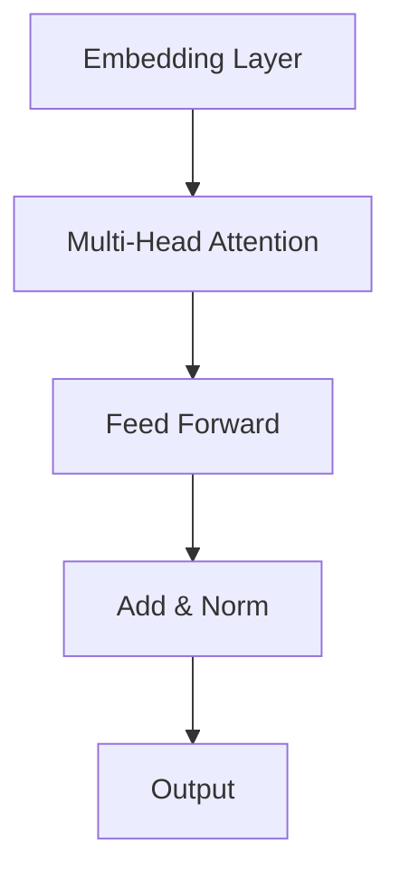
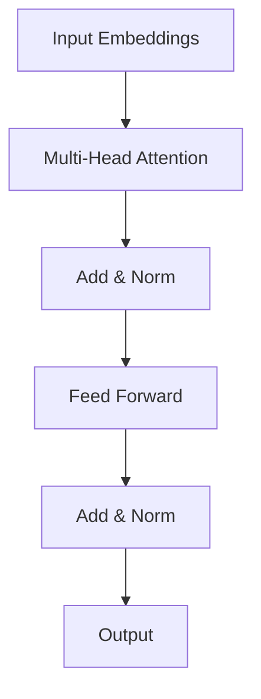

# RoBERTa的未来展望:更大规模、更多任务、更广泛应用

## 1.背景介绍

### 1.1 自然语言处理的重要性

在当今的数字时代,自然语言处理(Natural Language Processing, NLP)已经成为一个不可或缺的关键技术。它使计算机能够理解、解释和生成人类语言,极大地推动了人机交互的发展。无论是智能助手、机器翻译、信息检索,还是情感分析、文本分类等,NLP都扮演着至关重要的角色。

### 1.2 NLP发展历程

早期的NLP系统主要基于规则和统计方法,但存在一些明显的局限性。随着深度学习的兴起,NLP进入了一个全新的发展阶段。2018年,谷歌提出了BERT(Bidirectional Encoder Representations from Transformers)模型,这种基于Transformer的预训练语言模型极大地提高了NLP任务的性能,开启了NLP的新纪元。

### 1.3 RoBERTa模型概述

RoBERTa(Robustly Optimized BERT Approach)是Facebook AI研究院在2019年提出的BERT模型的改进版本。通过一些训练技巧的优化,RoBERTa在许多下游任务上取得了比BERT更出色的表现,成为了当前最先进的NLP模型之一。

## 2.核心概念与联系

### 2.1 Transformer架构

Transformer是一种全新的基于注意力机制(Attention Mechanism)的序列到序列(Seq2Seq)模型,它不依赖于循环神经网络(RNN)和卷积神经网络(CNN),而是完全基于注意力机制来捕获输入和输出之间的全局依赖关系。这种全新的架构极大地提高了并行计算能力,有效解决了长期依赖问题,成为了NLP领域的里程碑式创新。

### 2.2 BERT模型

BERT(Bidirectional Encoder Representations from Transformers)是一种基于Transformer的双向编码器模型,它通过预训练的方式学习上下文表示,然后将这些表示应用于各种下游NLP任务,取得了极好的效果。BERT的关键创新包括:

1. **Masked Language Model(掩码语言模型)**: 通过随机掩码部分输入token,并预测被掩码的token,从而捕获双向上下文信息。
2. **Next Sentence Prediction(下一句预测)**: 判断两个句子是否相邻,以进一步捕获句子间的关系。

BERT的出现开启了NLP的新纪元,但它也存在一些局限性,例如预训练数据和模型规模的限制。

### 2.3 RoBERTa模型

RoBERTa是在BERT的基础上进行改进和优化的模型,主要包括以下创新:

1. **更大规模的训练数据**: RoBERTa使用了更大规模的训练语料,包括书籍、网页和维基百科等,提高了模型的泛化能力。
2. **更长的训练时间**: RoBERTa进行了更长时间的训练,使模型更加收敛。
3. **动态掩码**: 与BERT固定掩码不同,RoBERTa每次都会随机掩码不同的token,增加了数据的多样性。
4. **Next Sentence Prediction去除**: 去除了BERT的下一句预测任务,只保留了Masked Language Model,简化了预训练目标。

这些改进使得RoBERTa在多个NLP基准测试中取得了比BERT更好的表现,成为了目前最先进的NLP模型之一。

## 3.核心算法原理具体操作步骤 

### 3.1 Transformer编码器

Transformer编码器是RoBERTa模型的核心部分,它由多个相同的编码器层堆叠而成。每个编码器层主要包括两个子层:Multi-Head Attention层和前馈神经网络层。

#### 3.1.1 Multi-Head Attention层

Multi-Head Attention层是Transformer的核心部分,它能够捕获输入序列中任意两个位置之间的依赖关系。具体来说,对于一个长度为n的输入序列,Attention层首先计算出一个$n \times n$的注意力分数矩阵,其中每个元素表示对应位置之间的注意力权重。然后,将输入序列的表示与注意力分数矩阵相乘,得到新的序列表示。

为了捕获不同位置之间的关系,Multi-Head Attention将注意力机制进行了多头并行运算,最终将多个注意力表示拼接在一起作为输出。具体计算过程如下:

$$
\begin{aligned}
MultiHead(Q, K, V) &= Concat(head_1, \dots, head_h)W^O\\
where\ head_i &= Attention(QW_i^Q, KW_i^K, VW_i^V)
\end{aligned}
$$

其中$Q$、$K$、$V$分别表示查询(Query)、键(Key)和值(Value)的输入表示。$W_i^Q$、$W_i^K$、$W_i^V$是可学习的投影矩阵,用于将输入映射到不同的表示空间。$Attention(\cdot)$是标准的注意力计算函数。

#### 3.1.2 前馈神经网络层

前馈神经网络层是一个简单的全连接前馈网络,它对每个位置的表示进行独立的位置ewise的非线性映射,以捕获位置之间的交互关系。具体计算过程如下:

$$
FFN(x) = \max(0, xW_1 + b_1)W_2 + b_2
$$

其中$W_1$、$W_2$、$b_1$、$b_2$是可学习的参数,激活函数采用ReLU。

#### 3.1.3 残差连接和层归一化

为了防止梯度消失和梯度爆炸问题,Transformer编码器层采用了残差连接和层归一化的方式。具体来说,Multi-Head Attention层和前馈神经网络层的输出会与输入进行残差连接,然后再进行层归一化操作。这种设计有助于加速模型的收敛并提高性能。

### 3.2 RoBERTa预训练

RoBERTa的预训练过程只保留了BERT的Masked Language Model(MLM)任务,去除了Next Sentence Prediction任务。MLM任务的目标是预测被掩码的token,通过这种方式学习上下文表示。

具体来说,在预训练阶段,RoBERTa会随机选择输入序列中的一些token,并用特殊的[MASK]标记将它们替换掉。然后,模型会根据上下文预测被掩码token的原始值。通过这种方式,RoBERTa可以学习到双向的上下文表示。

与BERT不同的是,RoBERTa采用了动态掩码的策略,即每次都会随机选择不同的token进行掩码,而不是固定的掩码模式。这种策略增加了训练数据的多样性,有助于提高模型的泛化能力。

RoBERTa的预训练语料包括书籍、网页和维基百科等多种来源的大规模文本数据,涵盖了丰富的领域知识。通过在这些海量数据上进行预训练,RoBERTa可以学习到通用的语言表示,为下游的各种NLP任务提供有力支持。

### 3.3 微调和迁移学习

预训练只是RoBERTa模型的第一阶段,为了应用于具体的NLP任务,还需要进行微调(Fine-tuning)或迁移学习(Transfer Learning)。

在微调阶段,RoBERTa的模型参数会在特定任务的训练数据上进行进一步的调整和优化,使得模型可以更好地适应该任务。通常情况下,只需要对RoBERTa的输出层进行修改,其余部分的参数则保持不变。

例如,在文本分类任务中,我们可以在RoBERTa的顶层添加一个分类器,并在标记的训练数据上进行端到端的微调。通过这种方式,RoBERTa可以学习到特定任务所需的知识,从而取得更好的性能表现。

迁移学习的思路与微调类似,但更加灵活。我们可以将RoBERTa作为特征提取器,利用它提取出的上下文表示作为其他模型的输入,并在此基础上训练新的任务模型。这种方式可以充分利用RoBERTa学习到的通用语言知识,并将其应用于更广泛的NLP任务中。

## 4.数学模型和公式详细讲解举例说明

### 4.1 注意力机制(Attention Mechanism)

注意力机制是Transformer的核心,它能够捕获输入序列中任意两个位置之间的依赖关系。对于一个长度为$n$的输入序列$X = (x_1, x_2, \dots, x_n)$,注意力机制首先计算出一个$n \times n$的注意力分数矩阵$A$,其中每个元素$a_{ij}$表示$x_i$对$x_j$的注意力权重。然后,将输入序列的表示$X$与注意力分数矩阵$A$相乘,得到新的序列表示$Y$。具体计算过程如下:

$$
A = \text{softmax}(QK^T/\sqrt{d_k})\\
Y = AV
$$

其中$Q$、$K$、$V$分别表示查询(Query)、键(Key)和值(Value)的输入表示,它们通过线性变换得到:

$$
Q = XW_Q,\ K = XW_K,\ V = XW_V
$$

$W_Q$、$W_K$、$W_V$是可学习的投影矩阵,用于将输入映射到不同的表示空间。$d_k$是缩放因子,用于防止内积过大导致的梯度饱和问题。

注意力机制的关键在于,它能够自适应地为每个位置分配不同的注意力权重,从而捕获输入序列中任意两个位置之间的依赖关系。这种灵活的建模方式使得Transformer可以有效地处理长期依赖问题,并且具有很强的并行计算能力。

### 4.2 Multi-Head Attention

为了进一步提高注意力机制的表示能力,Transformer采用了Multi-Head Attention的策略,即将注意力机制进行了多头并行运算。具体来说,对于每个注意力头$i$,我们计算一个独立的注意力表示$head_i$:

$$
head_i = \text{Attention}(QW_i^Q, KW_i^K, VW_i^V)
$$

其中$W_i^Q$、$W_i^K$、$W_i^V$是可学习的投影矩阵,用于将输入映射到不同的表示空间。然后,将所有注意力头的表示拼接在一起,并经过一个线性变换得到最终的Multi-Head Attention输出:

$$
\text{MultiHead}(Q, K, V) = \text{Concat}(head_1, \dots, head_h)W^O
$$

其中$W^O$是可学习的线性变换矩阵。

Multi-Head Attention的优点在于,它可以从不同的子空间捕获不同的依赖关系,从而提高了模型的表示能力。同时,由于每个注意力头的计算是完全独立的,Multi-Head Attention也具有很好的并行计算性能。

### 4.3 Masked Language Model

Masked Language Model(MLM)是RoBERTa预训练的核心任务,它的目标是预测被掩码的token,通过这种方式学习上下文表示。

具体来说,在预训练阶段,RoBERTa会随机选择输入序列中的一些token,并用特殊的[MASK]标记将它们替换掉。然后,模型需要根据上下文预测被掩码token的原始值。

设$X = (x_1, x_2, \dots, x_n)$为输入序列,其中$x_m$是被掩码的token。我们将$X$输入到RoBERTa模型中,得到对应的上下文表示$H = (h_1, h_2, \dots, h_n)$。然后,我们将$h_m$输入到一个分类器中,计算被掩码token属于词汇表中每个token的概率:

$$
P(x_m = w_k|X) = \text{softmax}(Wh_m + b)_k
$$

其中$W$和$b$是可学习的分类器参数,词汇表的大小为$V$。

在训练阶段,我们最大化被掩码token的对数似然,即最小化如下损失