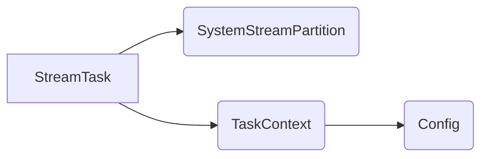

# Samza Task原理与代码实例讲解

作者：禅与计算机程序设计艺术

## 1. 背景介绍

### 1.1 大数据流处理的挑战
在当今大数据时代,海量的数据以流的形式不断产生,如何实时、高效地处理这些数据流,已成为大数据领域面临的重大挑战之一。传统的批处理模式难以满足实时性要求,而流处理则应运而生。

### 1.2 流处理框架概览
流处理框架如雨后春笋般涌现,其中Apache Storm、Spark Streaming、Flink等是业界知名的开源流处理项目。而Apache Samza作为LinkedIn开源的分布式流处理框架,以其简洁的API设计、高吞吐低延迟等特点,在实时计算领域占有一席之地。

### 1.3 Samza的优势
相比其他流处理框架,Samza的主要优势包括:

- 简单易用的API和编程模型
- 基于Kafka的可靠消息传递
- 支持有状态和无状态的流处理
- 灵活的部署方式,可与YARN、Mesos等资源调度系统集成
- 支持多语言开发,如Java、Scala等

## 2. 核心概念与联系

### 2.1 StreamTask
StreamTask是Samza应用的基本处理单元。开发者通过实现StreamTask接口,定义输入流的处理逻辑。每个StreamTask实例负责处理一个分区(Partition)的数据。

### 2.2 SystemStreamPartition
SystemStreamPartition(SSP)标识了数据源的一个分区。它由三部分组成:System(数据源类型)、Stream(流名称)和Partition(分区编号)。每个SSP都会分配给一个StreamTask进行处理。

### 2.3 TaskContext
TaskContext提供了StreamTask运行时的上下文信息,包括任务名称、配置、输出collector等。通过TaskContext,StreamTask可以读取任务配置,将处理结果输出到下游。

### 2.4 Config
Config是Samza应用的配置管理类,用于读取和管理各种配置参数,如任务并行度、输入输出系统、Checkpoint机制等。

### 2.5 核心概念关系图
下图展示了Samza核心概念之间的关系:



## 3. 核心算法原理与具体操作步骤

### 3.1 Samza应用编程模型

Samza采用类似MapReduce的编程模型,将流处理抽象为以下三个步骤:

1. 数据输入:从一个或多个输入流读取消息
2. 数据处理:对每条消息执行用户定义的处理逻辑
3. 数据输出:将处理结果写入一个或多个输出流

具体地,开发者通过实现StreamTask接口,定义消息处理逻辑:

```java
public interface StreamTask {
  void process(IncomingMessageEnvelope envelope,
               MessageCollector collector,
               TaskCoordinator coordinator) throws Exception;
}
```

其中,process方法的三个参数分别表示:

- envelope:输入消息的封装,包含消息内容、时间戳、SSP等元数据
- collector:用于发送处理结果到下游的输出器
- coordinator:用于与Samza框架交互的协调器,如管理任务状态、提交offset等

### 3.2 有状态流处理

除了基本的无状态处理,Samza还支持有状态流处理。通过在StreamTask中定义一个或多个状态存储(State Store),开发者可以在处理过程中维护和更新任务状态。

Samza提供了以下几种状态存储:

- KeyValueStore:Key-Value形式的状态存储
- WindowStore:支持窗口操作的状态存储
- SessionStore:支持会话窗口的状态存储

状态存储的使用示例如下:

```java
public class MyStreamTask implements StreamTask, InitableTask {
  private KeyValueStore<String, Integer> store;

  public void init(Config config, TaskContext context) {
    store = (KeyValueStore<String, Integer>) context.getStore("myStore");
  }

  public void process(IncomingMessageEnvelope envelope,
                      MessageCollector collector,
                      TaskCoordinator coordinator) {
    String key = (String) envelope.getKey();
    Integer value = store.get(key);
    if (value == null) {
      value = 0;
    }
    value++;
    store.put(key, value);
  }
}
```

在上例中,MyStreamTask使用了一个名为"myStore"的KeyValueStore来维护每个Key的计数。在处理每条消息时,它从Store中读取当前计数,加1后再写回Store。

### 3.3 任务调度与容错

Samza基于Kafka的消息传递和Checkpoint机制实现了exactly-once语义的流处理。具体来说:

1. 每个SSP的消息顺序消费,且仅消费一次。这是由Kafka的分区有序和Samza的offset管理保证的。

2. 每个StreamTask定期将状态存储的快照写入Checkpoint。当任务失败重启时,可从最近的Checkpoint恢复状态。

3. 所有的状态变更都是幂等的,即多次应用同一个状态变更,结果是一致的。这是由状态存储的实现保证的。

Samza将任务调度委托给YARN等外部资源管理系统。在启动时,Samza应用向YARN提交一个ApplicationMaster(AM),AM根据配置的并行度请求Container资源,并在Container中启动StreamTask实例。

当资源不足或Container失效时,YARN会自动重新调度并恢复StreamTask,整个过程对Samza应用是透明的。

## 4. 数学模型和公式详细讲解举例说明

### 4.1 滑动窗口计算

在流处理中,滑动窗口是一种常用的数据模型,用于在一个时间窗口内对数据进行聚合计算。设窗口长度为$L$,滑动步长为$S$,则第$i$个窗口的起止时间为:

$$
\begin{aligned}
startTime_i &= t_0 + i \times S \\
endTime_i &= startTime_i + L
\end{aligned}
$$

其中,$t_0$为第一个窗口的起始时间。

例如,对于一个长度为10分钟、滑动步长为5分钟的时间窗口,第一个窗口覆盖$[00:00, 00:10)$,第二个窗口覆盖$[00:05, 00:15)$,以此类推。

在Samza中,可以使用WindowStore来实现滑动窗口计算。以下是一个示例:

```java
public class WindowStreamTask implements StreamTask, InitableTask {
  private WindowStore<String, Integer> windowStore;

  public void init(Config config, TaskContext context) {
    windowStore = (WindowStore<String, Integer>) context.getStore("windowStore");
  }

  public void process(IncomingMessageEnvelope envelope,
                      MessageCollector collector,
                      TaskCoordinator coordinator) {
    String key = (String) envelope.getKey();
    Integer value = (Integer) envelope.getMessage();
    long timestamp = envelope.getEventTime();

    windowStore.put(key, value, timestamp);

    // 计算当前窗口的聚合结果
    long windowStart = timestamp - TimeUnit.MINUTES.toMillis(10);
    long windowEnd = timestamp;
    KeyValueIterator<Windowed<String>, Integer> iter = 
      windowStore.fetch(key, windowStart, windowEnd);

    int sum = 0;
    while (iter.hasNext()) {
      sum += iter.next().value;
    }
    iter.close();

    collector.send(new OutgoingMessageEnvelope(new SystemStream("kafka", "output"), 
      key, sum));
  }
}
```

在上例中,WindowStreamTask使用了一个10分钟长度的WindowStore来维护每个Key在窗口内的累加值。在处理每条消息时,它将消息的值写入WindowStore,并计算当前窗口内的聚合结果,最后输出到Kafka。

### 4.2 Bloom Filter

布隆过滤器(Bloom Filter)是一种概率数据结构,用于快速判断一个元素是否在集合中。它的特点是空间效率高,但存在一定的误判率。

布隆过滤器的原理是,使用$k$个哈希函数将元素映射到一个$m$位的位数组中。当插入元素时,将元素哈希后对应的$k$个位置置为1;当查询元素时,如果元素哈希后对应的$k$个位都为1,则认为元素存在,否则认为不存在。

假设哈希函数是均匀随机的,且位数组长度为$m$,插入元素数量为$n$,则布隆过滤器的误判率$P$近似为:

$$
P = (1 - e^{-kn/m})^k
$$

在实践中,可以根据期望的误判率和数据规模,选择合适的$m$和$k$值。

Samza提供了内置的BloomFilter API,可以方便地在状态存储中使用布隆过滤器。以下是一个示例:

```java
public class BloomFilterTask implements StreamTask, InitableTask {
  private KeyValueStore<String, BloomFilter<String>> stateStore;

  public void init(Config config, TaskContext context) {
    stateStore = (KeyValueStore<String, BloomFilter<String>>) 
      context.getStore("myStore");
  }

  public void process(IncomingMessageEnvelope envelope,
                      MessageCollector collector,
                      TaskCoordinator coordinator) {
    String userId = (String) envelope.getKey();
    String itemId = (String) envelope.getMessage();

    BloomFilter<String> userFilter = stateStore.get(userId);
    if (userFilter == null) {
      userFilter = BloomFilter.create(Funnels.stringFunnel(Charsets.UTF_8), 
        10000, 0.01);
    }

    if (!userFilter.mightContain(itemId)) {
      userFilter.put(itemId);
      stateStore.put(userId, userFilter);
      collector.send(new OutgoingMessageEnvelope(
        new SystemStream("kafka", "notification"), userId, itemId));
    }
  }
}
```

在上例中,BloomFilterTask为每个用户维护了一个布隆过滤器,用于记录用户已经看过的商品。当用户浏览一个新商品时,它检查布隆过滤器中是否存在该商品,如果不存在则加入布隆过滤器,并发送一条通知消息。

## 5. 项目实践：代码实例和详细解释说明

下面我们通过一个完整的代码实例,演示如何使用Samza进行流处理。该示例的需求是:实时统计每个用户的订单总金额。

### 5.1 输入输出定义

首先定义Samza应用的输入输出流:

```java
public class MyTaskApplication implements StreamApplication {
  @Override
  public void init(StreamGraph graph, Config config) {
    graph.setDefaultSerde(new JsonSerdeV2<>());

    MessageStream<Order> orderStream = graph.getInputStream("kafka", "order", 
      (key, value) -> value);

    OutputStream<UserAmount> amountStream = graph.getOutputStream("kafka", "amount");

    // ...
  }
}
```

其中,输入流"order"中包含JSON格式的订单数据,输出流"amount"中包含每个用户的订单总金额。

### 5.2 订单数据的POJO类

定义一个POJO类表示订单数据:

```java
public class Order {
  public String userId;
  public String itemId;
  public double amount;
  // 省略getter/setter
}
```

### 5.3 聚合计算

使用Samza的Table API进行按用户ID聚合:

```java
public class MyTaskApplication implements StreamApplication {
  @Override
  public void init(StreamGraph graph, Config config) {
    // ...

    Table<KV<String, Double>> userAmountTable = orderStream
      .map(order -> KV.of(order.userId, order.amount))
      .groupByKey()
      .reduce(Double::sum)
      .sendTo(amountStream);
  }
}
```

上述代码先将订单流转换为KV流,Key为用户ID,Value为订单金额。然后按Key进行分组,并使用reduce算子对每组的Value求和,最后将结果发送到输出流。

### 5.4 完整代码

结合以上各部分,完整的应用代码如下:

```java
public class MyTaskApplication implements StreamApplication {
  @Override
  public void init(StreamGraph graph, Config config) {
    graph.setDefaultSerde(new JsonSerdeV2<>());

    MessageStream<Order> orderStream = graph.getInputStream("kafka", "order", 
      (key, value) -> value);

    OutputStream<KV<String, Double>> amountStream = graph.getOutputStream("kafka", "amount",
      KVSerde.of(new StringSerde(), new DoubleSerde()));

    Table<KV<String, Double>> userAmountTable = orderStream
      .map(order -> KV.of(order.userId, order.amount))
      .groupByKey()
      .reduce(Double::sum)
      .sendTo(amountStream);
  }

  public static class Order {
    public String userId;
    public String itemId;
    public double amount;
  }

  public static void main(String[] args) {
    CommandLine cmdLine = new CommandLine();
    Config config = cmdLine.loadConfig(cmdLine.parser().parse(args));
    new MyTaskApplication().run(config);
  }
}
```

### 5.5 本地运行

使用以下命令在本地运行Samza应用:

```bash
mvn clean package
mkdir -p deploy/samza
tar -xvf