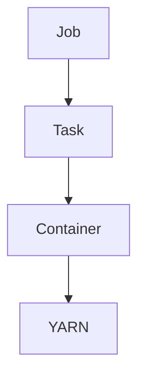

## 1. 背景介绍

### 1.1 大数据时代下的流处理需求
随着互联网和物联网的快速发展，数据量呈现爆炸式增长，传统的批处理方式已经无法满足实时性要求。流处理技术应运而生，它能够实时地处理连续不断的数据流，为用户提供低延迟、高吞吐的实时数据分析服务。

### 1.2 Samza：分布式流处理框架
Apache Samza 是一个开源的分布式流处理框架，由 LinkedIn 开发并开源。它基于 Kafka 消息队列系统，提供高吞吐、低延迟的流处理能力，并支持容错和水平扩展。

### 1.3 任务调度与资源管理的重要性
在 Samza 中，任务调度和资源管理是保证系统性能和稳定性的关键环节。合理的调度策略和资源分配方案能够最大限度地利用集群资源，提高任务执行效率，并保证系统的高可用性。

## 2. 核心概念与联系

### 2.1 作业 (Job)
Samza 中的作业是由多个任务组成的逻辑单元，用于完成特定的流处理任务。例如，一个作业可以包含多个读取 Kafka 消息、进行数据转换和写入数据库的任务。

### 2.2 任务 (Task)
任务是 Samza 中最小的执行单元，它负责处理一部分数据流。每个任务都运行在一个独立的容器中，并与其他任务并行执行。

### 2.3 容器 (Container)
容器是 Samza 中资源分配的基本单位，它是一个独立的进程，可以运行一个或多个任务。容器的资源配置（例如 CPU、内存、磁盘空间）由 YARN 集群管理。

### 2.4 YARN (Yet Another Resource Negotiator)
YARN 是 Hadoop 生态系统中的资源管理框架，它负责管理集群资源，并为 Samza 作业分配容器。

### 2.5 关系图



## 3. 核心算法原理具体操作步骤

### 3.1 任务分配算法
Samza 的任务分配算法旨在将任务均匀地分配到可用的容器中，以实现负载均衡和资源利用率最大化。常用的任务分配算法包括：

* **轮询算法 (Round Robin)**：将任务依次分配给不同的容器。
* **随机算法 (Random)**：随机选择一个容器分配任务。
* **最少连接算法 (Least Connection)**：选择当前连接任务数最少的容器分配任务。

### 3.2 资源分配策略
Samza 的资源分配策略决定了每个容器的资源配置，它需要考虑任务的资源需求、集群资源的可用性以及系统的整体性能目标。常用的资源分配策略包括：

* **静态资源分配 (Static Resource Allocation)**：为每个容器预先分配固定的资源。
* **动态资源分配 (Dynamic Resource Allocation)**：根据任务的实际资源需求动态调整容器的资源配置。

### 3.3 操作步骤
1. Samza 提交作业到 YARN 集群。
2. YARN 根据作业的资源需求和集群资源的可用性，分配容器给作业。
3. Samza 将任务分配到容器中。
4. 容器启动并执行任务。

## 4. 数学模型和公式详细讲解举例说明

### 4.1 任务分配模型
假设有 $m$ 个任务和 $n$ 个容器，任务分配矩阵 $A$ 定义为：

$$
A = \begin{bmatrix}
a_{11} & a_{12} & \dots & a_{1n} \\
a_{21} & a_{22} & \dots & a_{2n} \\
\vdots & \vdots & \ddots & \vdots \\
a_{m1} & a_{m2} & \dots & a_{mn}
\end{bmatrix}
$$

其中，$a_{ij}$ 表示任务 $i$ 是否分配给容器 $j$，取值为 0 或 1。

### 4.2 资源分配模型
假设每个容器的资源配置为 $r_j = (c_j, m_j, d_j)$，其中 $c_j$ 表示 CPU 核心数，$m_j$ 表示内存大小，$d_j$ 表示磁盘空间大小。

### 4.3 举例说明
假设有 4 个任务和 2 个容器，任务分配矩阵为：

$$
A = \begin{bmatrix}
1 & 0 \\
1 & 0 \\
0 & 1 \\
0 & 1
\end{bmatrix}
$$

容器的资源配置为：

$$
r_1 = (2, 8, 100) \\
r_2 = (4, 16, 200)
$$

## 5. 项目实践：代码实例和详细解释说明

### 5.1 Samza 作业配置
```yaml
# job.properties

# 作业名称
job.name=MyJob

# Kafka 输入主题
task.inputs=kafka.input.topic

# Kafka 输出主题
task.outputs=kafka.output.topic

# 任务类
task.class=com.example.MyTask

# 任务并行度
task.instances=4

# 容器资源配置
yarn.container.memory.mb=1024
yarn.container.vcores=1
```

### 5.2 Samza 任务代码示例
```java
// MyTask.java

public class MyTask implements StreamTask, InitableTask {

  @Override
  public void init(Config config, TaskContext context) throws Exception {
    // 初始化任务
  }

  @Override
  public void process(IncomingMessageEnvelope envelope, MessageCollector collector, TaskCoordinator coordinator) throws Exception {
    // 处理消息
    String message = (String) envelope.getMessage();
    // ...
    collector.send(new OutgoingMessageEnvelope(new SystemStream("kafka.output.topic"), message));
  }
}
```

## 6. 实际应用场景

### 6.1 实时数据分析
Samza 可以用于实时处理用户行为数据、传感器数据、金融交易数据等，为用户提供实时的数据分析服务。

### 6.2 事件驱动架构
Samza 可以作为事件驱动架构中的核心组件，用于处理事件流、触发业务逻辑和更新系统状态。

### 6.3 数据管道
Samza 可以用于构建数据管道，将数据从一个系统传输到另一个系统，并进行数据清洗、转换和聚合。

## 7. 工具和资源推荐

### 7.1 Apache Samza 官方网站
https://samza.apache.org/

### 7.2 Samza GitHub 仓库
https://github.com/apache/samza

### 7.3 Samza 用户邮件列表
https://samza.apache.org/community/

## 8. 总结：未来发展趋势与挑战

### 8.1 流处理技术的未来发展趋势
* **云原生流处理**: 流处理平台将更加紧密地集成到云计算环境中，提供更便捷的部署和管理体验。
* **人工智能与流处理**: 人工智能技术将被广泛应用于流处理领域，例如自动模型训练、异常检测和预测分析。
* **边缘计算与流处理**: 流处理技术将扩展到边缘计算场景，实现更低延迟和更高效的数据处理。

### 8.2 Samza 面临的挑战
* **提高资源利用率**: 随着数据量的不断增长，Samza 需要不断优化资源分配策略，以提高资源利用率。
* **支持更复杂的流处理场景**: Samza 需要支持更复杂的流处理场景，例如多阶段处理、状态管理和窗口计算。
* **与其他大数据技术集成**: Samza 需要与其他大数据技术（例如 Spark、Flink）更好地集成，以构建更强大的数据处理平台。

## 9. 附录：常见问题与解答

### 9.1 如何配置 Samza 作业的并行度？
可以通过 `task.instances` 属性配置 Samza 作业的并行度，该属性指定了任务的实例数量。

### 9.2 如何监控 Samza 作业的运行状态？
可以使用 YARN 的 Web UI 或 Samza 提供的监控工具监控作业的运行状态。

### 9.3 如何处理 Samza 作业的故障？
Samza 提供了容错机制，可以自动重启失败的容器和任务，以保证作业的正常运行。
