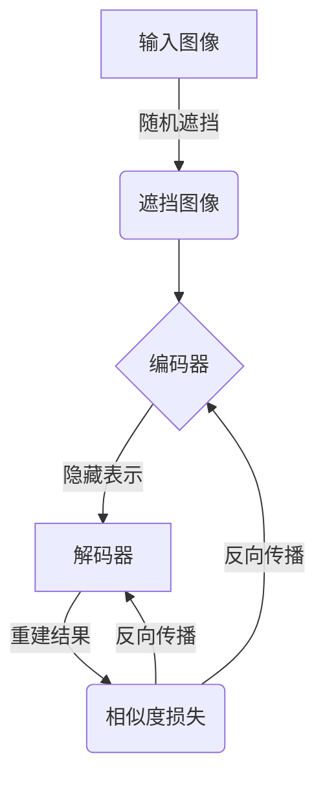

# SimMIM原理与代码实例讲解

## 1.背景介绍

### 1.1 什么是SimMIM？

SimMIM(Similarity-guided Masked Image Modeling)是一种新兴的视觉表示学习范式,旨在通过掩码图像建模来学习更加丰富和通用的视觉表示。与传统的图像分类或检测任务不同,SimMIM关注从大量未标记的图像数据中学习通用的视觉特征表示,而无需依赖大规模的人工标注数据。

### 1.2 为什么需要SimMIM?

在深度学习时代,视觉表示学习一直是计算机视觉领域的核心挑战之一。传统的监督学习方法需要大量人工标注的数据,这种数据获取过程既昂贵又耗时。而自监督学习(Self-Supervised Learning)则提供了一种通过利用数据本身的结构和统计特性进行学习的范式,从而避免了昂贵的人工标注过程。

SimMIM作为自监督视觉表示学习的一种新方法,通过掩码图像建模的方式,可以有效地从海量未标记图像数据中学习丰富和通用的视觉表示,为下游的各种视觉任务提供强大的特征支持。它的出现为计算机视觉领域带来了新的发展机遇和前景。

## 2.核心概念与联系

### 2.1 掩码图像建模(Masked Image Modeling)

掩码图像建模是SimMIM的核心思想,它借鉴了自然语言处理领域中的BERT等掩码语言模型的成功经验。在掩码图像建模中,我们会随机遮挡输入图像的一部分区域,然后让模型基于其余未遮挡的像素来重建被遮挡的区域。通过这种方式,模型被迫学习图像中的上下文信息和全局语义,从而获得更加丰富和通用的视觉表示能力。

### 2.2 相似度引导(Similarity Guidance)

SimMIM的另一个关键创新点在于引入了相似度引导机制。在传统的掩码图像建模中,模型通常只关注重建被遮挡区域的像素值,而忽视了相似性这一重要的视觉信号。SimMIM则通过引入相似度损失函数,鼓励模型不仅重建被遮挡区域的像素值,还要保证重建结果与原始图像在语义上的相似性。

这种相似度引导机制有两个主要优势:

1. 它可以帮助模型更好地捕捉图像的语义信息,而不仅仅是局部的像素模式。
2. 它为模型提供了更加直接和明确的监督信号,有助于加速训练过程并提高表示质量。

### 2.3 SimMIM与其他视觉表示学习方法的关系

SimMIM可以被视为自监督视觉表示学习领域的一个重要里程碑。它吸收了之前方法的优点,如掩码图像建模的思想来自BERT,同时也融入了自身的创新,如相似度引导机制。

与一些基于对比学习(Contrastive Learning)的方法相比,SimMIM不需要构造正负样本对,因此避免了数据增强和内存开销等问题。与一些基于生成模型(Generative Model)的方法相比,SimMIM则更加简单高效,无需复杂的生成过程。

总的来说,SimMIM提供了一种新颖而有前景的视觉表示学习范式,它将掩码建模和相似度引导有机结合,为计算机视觉领域带来了新的发展动力。

## 3.核心算法原理具体操作步骤 

### 3.1 SimMIM框架概述

SimMIM的整体框架可以概括为以下四个主要步骤:

1. **图像遮挡(Image Masking)**: 随机选择输入图像的一部分区域,并用特定的掩码值(如均值或噪声)替换这些区域的像素值。

2. **编码器(Encoder)**: 将遮挡后的图像输入到一个编码器网络(如Vision Transformer或卷积网络)中,获得图像的隐藏表示。

3. **解码器(Decoder)**: 将编码器的输出送入一个解码器网络,该解码器的目标是重建被遮挡的图像区域。

4. **相似度损失(Similarity Loss)**: 计算重建结果与原始图像之间的相似度损失,并将其与像素重建损失相结合,作为模型的最终训练目标。

在训练过程中,模型会不断优化这个端到端的重建过程,从而学习到能够捕捉图像全局语义和上下文信息的强大视觉表示。



### 3.2 图像遮挡策略

图像遮挡是SimMIM的关键步骤之一。常见的遮挡策略包括:

1. **随机遮挡(Random Masking)**: 随机选择图像中的一些区域进行遮挡,这些区域可以是任意形状和大小。

2. **结构化遮挡(Structured Masking)**: 遮挡一些具有特定结构的区域,如正方形块或条带状区域。这种策略可以鼓励模型捕捉更加全局的上下文信息。

3. **层次遮挡(Hierarchical Masking)**: 在不同的尺度上进行遮挡,如同时遮挡大区域和小区域,以捕捉不同级别的视觉特征。

遮挡比例(即被遮挡的像素占总像素的比例)通常在15%-75%之间,这个比例的选择需要在模型表现和训练效率之间进行权衡。

### 3.3 编码器和解码器网络

SimMIM的编码器和解码器网络可以采用不同的架构,如Vision Transformer(ViT)、卷积神经网络(CNN)或者两者的混合。

编码器网络的作用是将遮挡后的图像编码为一个隐藏的视觉表示,而解码器网络则需要基于这个隐藏表示来重建被遮挡的图像区域。

在ViT编码器中,图像首先被分割为一系列的patch(图像块),然后通过Transformer的自注意力机制捕捉patch之间的长程依赖关系。而在CNN编码器中,则依赖于卷积层和池化层来提取图像的局部和全局特征。

解码器网络通常采用与编码器对称的结构,如用Transformer解码器或者转置卷积层来进行像素级重建。

### 3.4 相似度损失函数

相似度损失函数是SimMIM的核心创新之一,它鼓励模型不仅重建被遮挡区域的像素值,还要保证重建结果与原始图像在语义上的相似性。

常见的相似度损失函数包括:

1. **余弦相似度损失(Cosine Similarity Loss)**: 计算重建结果与原始图像的特征向量之间的余弦相似度,并最小化它们之间的差距。

2. **感知相似度损失(Perceptual Similarity Loss)**: 利用预训练的神经网络(如VGG或Inception)提取图像的高层次特征表示,然后计算重建结果与原始图像在这些特征空间中的差异。

3. **对比损失(Contrastive Loss)**: 将重建结果与原始图像视为正样本对,而与其他图像构成负样本对,通过最大化正负样本对之间的相似度差距来优化模型。

相似度损失通常与像素重建损失(如均方误差损失)相结合,构成模型的最终损失函数。损失函数中两个部分的权重比例需要根据具体任务和数据进行调整。

## 4.数学模型和公式详细讲解举例说明

### 4.1 掩码图像建模的形式化描述

我们用 $\mathcal{X}$ 表示原始图像,用 $\mathcal{M}$ 表示掩码向量。掩码向量 $\mathcal{M}$ 中的每个元素 $m_i \in \{0, 1\}$ 表示对应像素是否被遮挡,其中 $m_i=0$ 表示该像素被遮挡。

遮挡后的图像可以表示为:

$$\tilde{\mathcal{X}} = \mathcal{X} \odot (1 - \mathcal{M}) + \mathcal{C} \odot \mathcal{M}$$

其中 $\odot$ 表示元素wise乘积, $\mathcal{C}$ 是一个常数掩码向量,用于填充被遮挡的像素(如均值或噪声)。

我们的目标是学习一个编码器 $f_\text{enc}$ 和解码器 $f_\text{dec}$,使得:

$$\hat{\mathcal{X}} = f_\text{dec}(f_\text{enc}(\tilde{\mathcal{X}}))$$

其中 $\hat{\mathcal{X}}$ 是重建的图像,与原始图像 $\mathcal{X}$ 尽可能相似。

### 4.2 相似度损失函数

SimMIM引入了相似度损失函数,鼓励重建结果不仅在像素级别上与原始图像相似,而且在语义级别上也要相似。

常见的相似度损失函数包括:

1. **余弦相似度损失**:

$$\mathcal{L}_\text{cos} = 1 - \frac{\phi(\mathcal{X})^\top \phi(\hat{\mathcal{X}})}{\|\phi(\mathcal{X})\| \|\phi(\hat{\mathcal{X}})\|}$$

其中 $\phi(\cdot)$ 是一个特征提取函数,如ResNet的特征层输出。

2. **感知相似度损失**:

$$\mathcal{L}_\text{per} = \sum_l \frac{1}{N_l} \|\phi_l(\mathcal{X}) - \phi_l(\hat{\mathcal{X}})\|_1$$

其中 $\phi_l(\cdot)$ 是第 $l$ 层特征图的输出,包含 $N_l$ 个特征映射。

3. **对比损失**:

$$\mathcal{L}_\text{con} = -\log \frac{\exp(\text{sim}(\mathcal{X}, \hat{\mathcal{X}}) / \tau)}{\sum_{x' \in \mathcal{X}^-} \exp(\text{sim}(\mathcal{X}, x') / \tau)}$$

其中 $\mathcal{X}^-$ 是负样本集合, $\text{sim}(\cdot, \cdot)$ 是相似度函数(如余弦相似度), $\tau$ 是温度超参数。

最终的损失函数是像素重建损失和相似度损失的加权和:

$$\mathcal{L} = \mathcal{L}_\text{rec} + \lambda \mathcal{L}_\text{sim}$$

其中 $\mathcal{L}_\text{rec}$ 是像素重建损失(如均方误差损失), $\mathcal{L}_\text{sim}$ 是上述相似度损失之一, $\lambda$ 是平衡两个损失的超参数。

通过优化这个损失函数,模型可以同时学习到重建像素值和捕捉语义信息的能力,从而获得更加丰富和通用的视觉表示。

## 4.项目实践:代码实例和详细解释说明

在这一部分,我们将提供一个基于PyTorch的SimMIM实现示例,并对关键代码进行详细解释。

### 4.1 数据预处理

```python
import torch
from torchvision import transforms

# 定义数据增强和转换
transform = transforms.Compose([
    transforms.RandomResizedCrop(224),
    transforms.RandomHorizontalFlip(),
    transforms.ToTensor(),
    transforms.Normalize((0.485, 0.456, 0.406), (0.229, 0.224, 0.225))
])

# 加载数据集
train_dataset = datasets.ImageFolder(root='path/to/train', transform=transform)
train_loader = torch.utils.data.DataLoader(train_dataset, batch_size=256, shuffle=True, num_workers=8)
```

在这段代码中,我们首先定义了一系列数据增强和转换操作,包括随机裁剪、水平翻转、转换为张量以及标准化。然后,我们加载了一个ImageFolder格式的数据集,并使用DataLoader将其封装为可迭代的批次数据。

### 4.2 SimMIM模型

```python
import torch.nn as nn

class SimMIM(nn.Module):
    def __init__(self, encoder, decoder, mask_ratio=0.75):
        super().__init__()
        self.encoder = encoder
        self.decoder = decoder
        self.mask_ratio = mask_ratio

    def forward(self, x):
        # 图像遮挡
        mask =