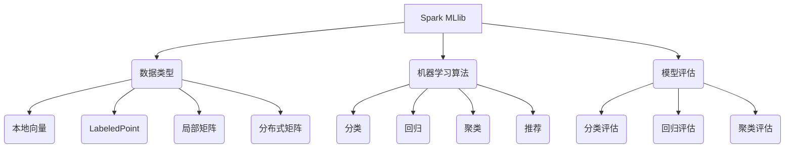

## 1. 背景介绍

### 1.1 大数据时代的机器学习挑战

随着互联网和物联网技术的飞速发展，全球数据量正以指数级速度增长。海量数据的出现为机器学习带来了前所未有的机遇，同时也带来了巨大的挑战。传统的单机机器学习算法难以有效处理如此庞大的数据集，分布式机器学习框架应运而生。

### 1.2 Spark MLlib：基于Spark的分布式机器学习库

Apache Spark是一个开源的分布式计算框架，以其高效的内存计算能力和强大的数据处理能力著称。Spark MLlib是Spark生态系统中的一个重要组成部分，它提供了一套丰富的机器学习算法库，用于处理大规模数据集。

### 1.3 Spark MLlib的优势

- **可扩展性**: Spark MLlib可以运行在大型集群上，处理TB甚至PB级别的数据。
- **高效性**: Spark MLlib利用内存计算和数据本地性原则，大幅提升了算法的运行效率。
- **易用性**: Spark MLlib提供简洁易用的API，方便用户快速构建机器学习模型。
- **丰富的算法**: Spark MLlib支持多种机器学习算法，包括分类、回归、聚类、推荐等。

## 2. 核心概念与联系

### 2.1 数据类型

Spark MLlib支持多种数据类型，包括：

- **本地向量**: 用于存储单个数据点的特征向量。
- **LabeledPoint**: 用于存储带有标签的数据点，标签表示数据点的类别或值。
- **局部矩阵**: 用于存储小型矩阵。
- **分布式矩阵**: 用于存储大型矩阵，分布在多个节点上。

### 2.2 机器学习算法

Spark MLlib提供丰富的机器学习算法，包括：

- **分类**: 逻辑回归、支持向量机、决策树等。
- **回归**: 线性回归、决策树回归等。
- **聚类**: K-means、高斯混合模型等。
- **推荐**: 交替最小二乘法 (ALS) 等。

### 2.3 模型评估

Spark MLlib提供多种模型评估指标，包括：

- **分类**: 准确率、召回率、F1值等。
- **回归**: 均方误差 (MSE)、均方根误差 (RMSE) 等。
- **聚类**: 轮廓系数等。

### 2.4  Spark MLlib 架构



## 3. 核心算法原理具体操作步骤

### 3.1 逻辑回归

#### 3.1.1 算法原理

逻辑回归是一种用于二分类问题的线性模型。它通过sigmoid函数将线性模型的输出映射到[0,1]区间，表示样本属于正类的概率。

#### 3.1.2 操作步骤

1. 加载数据集。
2. 将数据集转换为LabeledPoint格式。
3. 创建逻辑回归模型。
4. 训练模型。
5. 使用模型进行预测。
6. 评估模型性能。

### 3.2 K-means

#### 3.2.1 算法原理

K-means是一种常用的聚类算法，它将数据集划分为K个簇，每个簇由距离其中心点最近的数据点组成。

#### 3.2.2 操作步骤

1. 加载数据集。
2. 将数据集转换为Vector格式。
3. 创建K-means模型。
4. 训练模型。
5. 使用模型进行预测。
6. 评估模型性能。

## 4. 数学模型和公式详细讲解举例说明

### 4.1 逻辑回归

#### 4.1.1 Sigmoid函数

$$
sigmoid(z) = \frac{1}{1 + e^{-z}}
$$

其中，z为线性模型的输出。

#### 4.1.2 损失函数

逻辑回归的损失函数为交叉熵损失函数：

$$
J(\theta) = -\frac{1}{m} \sum_{i=1}^{m} [y^{(i)} log(h_\theta(x^{(i)})) + (1-y^{(i)}) log(1-h_\theta(x^{(i)}))]
$$

其中，m为样本数量，$y^{(i)}$为第i个样本的标签，$h_\theta(x^{(i)})$为模型对第i个样本的预测概率。

#### 4.1.3 梯度下降

逻辑回归使用梯度下降法来优化损失函数：

$$
\theta_j := \theta_j - \alpha \frac{\partial J(\theta)}{\partial \theta_j}
$$

其中，$\alpha$为学习率。

### 4.2 K-means

#### 4.2.1 距离度量

K-means使用欧氏距离来度量数据点之间的距离：

$$
d(x, y) = \sqrt{\sum_{i=1}^{n} (x_i - y_i)^2}
$$

其中，x和y为两个数据点，n为特征维度。

#### 4.2.2 簇中心更新

K-means迭代更新簇中心，直到收敛：

$$
\mu_k = \frac{1}{|C_k|} \sum_{x \in C_k} x
$$

其中，$\mu_k$为第k个簇的中心点，$C_k$为第k个簇的数据点集合。

## 5. 项目实践：代码实例和详细解释说明

### 5.1 逻辑回归

```python
from pyspark.ml.classification import LogisticRegression
from pyspark.ml.feature import VectorAssembler
from pyspark.sql import SparkSession

# 创建 SparkSession
spark = SparkSession.builder.appName("LogisticRegressionExample").getOrCreate()

# 加载数据集
data = spark.read.format("libsvm").load("data/mllib/sample_libsvm_data.txt")

# 创建特征向量
assembler = VectorAssembler(inputCols=["features"], outputCol="feature_vec")
data = assembler.transform(data)

# 创建逻辑回归模型
lr = LogisticRegression(featuresCol="feature_vec", labelCol="label")

# 训练模型
model = lr.fit(data)

# 使用模型进行预测
predictions = model.transform(data)

# 评估模型性能
from pyspark.ml.evaluation import BinaryClassificationEvaluator

evaluator = BinaryClassificationEvaluator(rawPredictionCol="rawPrediction", labelCol="label")
auc = evaluator.evaluate(predictions)
print("AUC: {}".format(auc))

# 停止 SparkSession
spark.stop()
```

#### 5.1.1 代码解释

- `LogisticRegression`：逻辑回归模型类。
- `VectorAssembler`：将多个特征列合并为一个特征向量列。
- `BinaryClassificationEvaluator`：二分类模型评估器。
- `auc`：ROC曲线下面积 (AUC) 评估指标。

### 5.2 K-means

```python
from pyspark.ml.clustering import KMeans
from pyspark.ml.feature import VectorAssembler
from pyspark.sql import SparkSession

# 创建 SparkSession
spark = SparkSession.builder.appName("KMeansExample").getOrCreate()

# 加载数据集
data = spark.read.format("libsvm").load("data/mllib/sample_kmeans_data.txt")

# 创建特征向量
assembler = VectorAssembler(inputCols=["features"], outputCol="feature_vec")
data = assembler.transform(data)

# 创建 K-means 模型
kmeans = KMeans(featuresCol="feature_vec", k=2)

# 训练模型
model = kmeans.fit(data)

# 使用模型进行预测
predictions = model.transform(data)

# 评估模型性能
from pyspark.ml.evaluation import ClusteringEvaluator

evaluator = ClusteringEvaluator()
silhouette = evaluator.evaluate(predictions)
print("Silhouette with squared euclidean distance = " + str(silhouette))

# 停止 SparkSession
spark.stop()
```

#### 5.2.1 代码解释

- `KMeans`：K-means模型类。
- `ClusteringEvaluator`：聚类模型评估器。
- `silhouette`：轮廓系数评估指标。

## 6. 实际应用场景

### 6.1 用户画像

利用 Spark MLlib 可以对用户进行画像分析，例如：

- **用户分类**: 根据用户的行为特征，将用户划分为不同的类别，例如高价值用户、潜在用户等。
- **用户兴趣预测**: 根据用户的历史行为，预测用户对不同商品或服务的兴趣程度。

### 6.2 风险控制

利用 Spark MLlib 可以进行风险控制，例如：

- **欺诈检测**: 通过分析用户的行为模式，识别潜在的欺诈行为。
- **信用评分**: 根据用户的信用历史，预测用户的信用风险。

### 6.3 推荐系统

利用 Spark MLlib 可以构建推荐系统，例如：

- **商品推荐**: 根据用户的历史购买记录，推荐用户可能感兴趣的商品。
- **内容推荐**: 根据用户的阅读历史，推荐用户可能感兴趣的文章或视频。

## 7. 工具和资源推荐

### 7.1 Apache Spark

[https://spark.apache.org/](https://spark.apache.org/)

Apache Spark 官方网站，提供 Spark 下载、文档和社区支持。

### 7.2 Spark MLlib 文档

[https://spark.apache.org/docs/latest/ml-guide.html](https://spark.apache.org/docs/latest/ml-guide.html)

Spark MLlib 官方文档，详细介绍了 Spark MLlib 的 API 和算法。

### 7.3 Spark MLlib 示例

[https://spark.apache.org/examples.html](https://spark.apache.org/examples.html)

Spark MLlib 官方示例，提供了各种机器学习算法的代码示例。

## 8. 总结：未来发展趋势与挑战

### 8.1 深度学习与 Spark MLlib 的结合

深度学习近年来取得了巨大成功，将其与 Spark MLlib 结合可以进一步提升机器学习的性能。

### 8.2 自动机器学习 (AutoML)

AutoML 可以自动选择最佳的机器学习算法和参数，简化机器学习的流程。

### 8.3 模型解释性

随着机器学习应用的普及，模型解释性越来越受到重视。需要开发新的方法来解释机器学习模型的决策过程。

## 9. 附录：常见问题与解答

### 9.1 如何选择合适的机器学习算法？

选择机器学习算法需要考虑多个因素，包括数据集大小、数据特征、业务目标等。

### 9.2 如何评估机器学习模型的性能？

可以使用多种评估指标来评估机器学习模型的性能，例如准确率、召回率、F1值等。

### 9.3 如何提高机器学习模型的性能？

可以通过特征工程、算法调参、模型融合等方法来提高机器学习模型的性能。 
