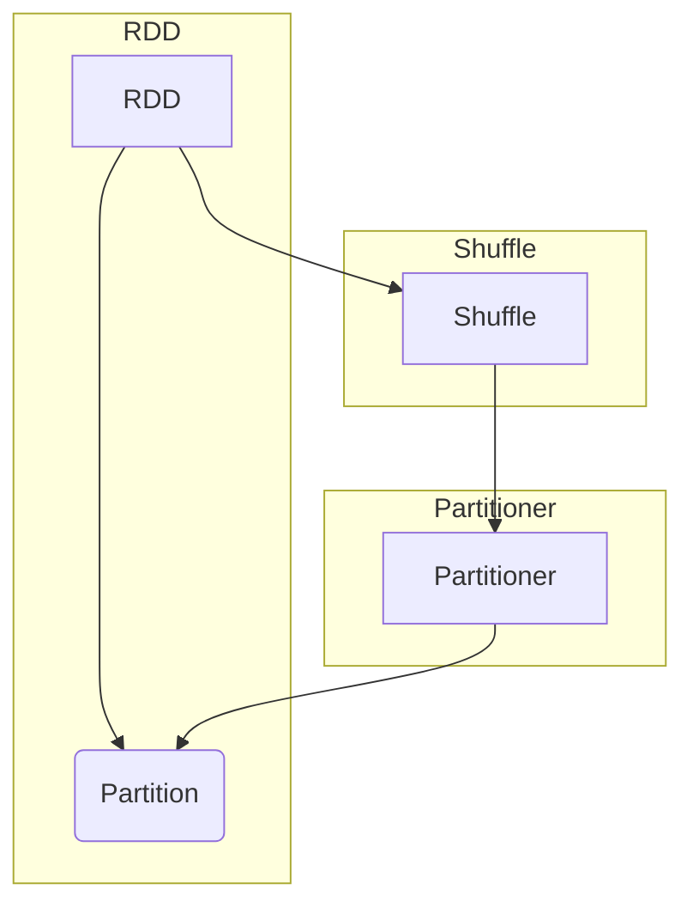

## 1. 背景介绍

### 1.1 大数据处理的挑战

随着互联网和物联网的快速发展，数据量呈爆炸式增长，传统的单机数据处理方式已经无法满足需求。为了应对海量数据的处理挑战，分布式计算框架应运而生，其中 Apache Spark 凭借其高效、易用、通用性强等特点，成为了大数据处理领域的主流框架之一。

### 1.2 Spark 分区的作用

在 Spark 中，数据以分布式的方式存储和处理，被划分成多个分区（Partition）。分区是 Spark 中最小的数据处理单元，每个分区可以被独立地处理，从而实现数据的并行处理。合理地进行数据分区可以有效地提高 Spark 应用程序的性能和效率。

### 1.3 Partitioner 的意义

Partitioner 是 Spark 中用于决定数据如何分区的重要组件。它负责将 RDD 中的每个元素映射到一个特定的分区，从而确保数据在集群中均匀分布，避免数据倾斜问题。选择合适的 Partitioner 可以显著提升 Spark 应用程序的性能。


## 2. 核心概念与联系

### 2.1 RDD

RDD（Resilient Distributed Dataset）是 Spark 中最基本的抽象，代表一个不可变的、可分区的数据集。RDD 可以存储在内存或磁盘中，并支持多种数据源，例如 HDFS、本地文件系统等。

### 2.2 Partition

Partition 是 RDD 中最小的数据处理单元，每个 Partition 可以被独立地处理。RDD 中的元素被分配到不同的 Partition 中，从而实现数据的并行处理。

### 2.3 Partitioner

Partitioner 负责将 RDD 中的每个元素映射到一个特定的 Partition。Partitioner 的作用是确保数据在集群中均匀分布，避免数据倾斜问题。

### 2.4 Shuffle

Shuffle 是 Spark 中用于在不同 stage 之间进行数据重新分配的操作。Shuffle 操作会将数据根据 Partitioner 重新分区，并将数据从一个 Executor 传输到另一个 Executor。

### 2.5 关系图



## 3. 核心算法原理具体操作步骤

### 3.1 HashPartitioner

HashPartitioner 是 Spark 中默认的 Partitioner，它使用元素的哈希值来确定其所属的 Partition。具体步骤如下：

1. 计算元素的哈希值。
2. 使用哈希值对分区数取模，得到分区索引。
3. 将元素分配到对应的分区中。

### 3.2 RangePartitioner

RangePartitioner 根据元素的值范围进行分区。它首先对数据进行排序，然后将数据划分成多个范围，每个范围对应一个 Partition。具体步骤如下：

1. 对数据进行排序。
2. 将数据划分成多个范围。
3. 将每个范围对应一个 Partition。

### 3.3 自定义 Partitioner

用户可以自定义 Partitioner 来实现特定的分区策略。自定义 Partitioner 需要继承 `org.apache.spark.Partitioner` 类，并实现 `getPartition` 方法。`getPartition` 方法接收一个元素作为输入，返回该元素所属的 Partition 索引。


## 4. 数学模型和公式详细讲解举例说明

### 4.1 HashPartitioner 公式

```
partitionIndex = hash(key) % numPartitions
```

其中：

* `partitionIndex`：分区索引
* `hash(key)`：元素的哈希值
* `numPartitions`：分区数

**举例说明**

假设有 10 个元素，分区数为 3。使用 HashPartitioner 对数据进行分区，结果如下：

| 元素 | 哈希值 | 分区索引 |
|---|---|---|
| 1 | 1 | 1 |
| 2 | 2 | 2 |
| 3 | 3 | 0 |
| 4 | 4 | 1 |
| 5 | 5 | 2 |
| 6 | 6 | 0 |
| 7 | 7 | 1 |
| 8 | 8 | 2 |
| 9 | 9 | 0 |
| 10 | 10 | 1 |

### 4.2 RangePartitioner 公式

RangePartitioner 的分区方式取决于数据的排序方式和分区数。假设数据按照升序排序，分区数为 3，则 RangePartitioner 会将数据划分成三个范围：

* 范围 1：最小值到第一个三分位数
* 范围 2：第一个三分位数到第二个三分位数
* 范围 3：第二个三分位数到最大值

每个范围对应一个 Partition。

**举例说明**

假设有 10 个元素，数据按照升序排序，分区数为 3。使用 RangePartitioner 对数据进行分区，结果如下：

| 元素 | 分区索引 |
|---|---|
| 1 | 0 |
| 2 | 0 |
| 3 | 0 |
| 4 | 1 |
| 5 | 1 |
| 6 | 1 |
| 7 | 2 |
| 8 | 2 |
| 9 | 2 |
| 10 | 2 |


## 5. 项目实践：代码实例和详细解释说明

### 5.1 HashPartitioner 示例

```python
from pyspark import SparkContext, SparkConf

# 创建 SparkConf 和 SparkContext
conf = SparkConf().setAppName("HashPartitionerExample")
sc = SparkContext(conf=conf)

# 创建一个 RDD
data = [1, 2, 3, 4, 5, 6, 7, 8, 9, 10]
rdd = sc.parallelize(data, 3)

# 使用 HashPartitioner 对 RDD 进行分区
rdd = rdd.partitionBy(3)

# 打印每个分区的内容
for i in range(rdd.getNumPartitions()):
    print("Partition {}: {}".format(i, rdd.glom().collect()[i]))

# 停止 SparkContext
sc.stop()
```

**代码解释**

* `sc.parallelize(data, 3)`：创建一个包含 10 个元素的 RDD，并将其分成 3 个分区。
* `rdd.partitionBy(3)`：使用 HashPartitioner 对 RDD 进行分区，分区数为 3。
* `rdd.glom().collect()`：将每个分区的内容收集到一个列表中。
* `for i in range(rdd.getNumPartitions())`：遍历所有分区，打印每个分区的内容。

### 5.2 RangePartitioner 示例

```python
from pyspark import SparkContext, SparkConf

# 创建 SparkConf 和 SparkContext
conf = SparkConf().setAppName("RangePartitionerExample")
sc = SparkContext(conf=conf)

# 创建一个 RDD
data = [1, 2, 3, 4, 5, 6, 7, 8, 9, 10]
rdd = sc.parallelize(data, 3)

# 使用 RangePartitioner 对 RDD 进行分区
rdd = rdd.partitionBy(3, partitionFunc=lambda k: int(k / 3))

# 打印每个分区的内容
for i in range(rdd.getNumPartitions()):
    print("Partition {}: {}".format(i, rdd.glom().collect()[i]))

# 停止 SparkContext
sc.stop()
```

**代码解释**

* `rdd.partitionBy(3, partitionFunc=lambda k: int(k / 3))`：使用 RangePartitioner 对 RDD 进行分区，分区数为 3。`partitionFunc` 参数指定了一个函数，用于将元素映射到分区索引。该函数将元素除以 3 并取整，从而将数据划分成三个范围。


## 6. 实际应用场景

### 6.1 数据倾斜问题

数据倾斜是指数据集中某些键对应的值数量远远大于其他键，导致某些分区的数据量过大，而其他分区的数据量过小。数据倾斜会导致 Spark 应用程序性能下降，甚至导致应用程序崩溃。

使用合适的 Partitioner 可以有效地解决数据倾斜问题。例如，使用 RangePartitioner 可以将数据均匀地划分成多个范围，避免数据集中在少数几个分区中。

### 6.2 提高数据局部性

数据局部性是指数据存储位置与数据处理位置的接近程度。数据局部性越高，数据传输成本越低，Spark 应用程序的性能就越好。

使用合适的 Partitioner 可以提高数据局部性。例如，如果数据存储在 HDFS 中，可以使用 HDFS 的默认分区方式作为 Partitioner，从而将数据存储位置与数据处理位置保持一致。

### 6.3 优化 Shuffle 操作

Shuffle 操作是 Spark 中最昂贵的操作之一，因为它涉及大量的数据传输。选择合适的 Partitioner 可以减少 Shuffle 操作的数据传输量，从而提高 Spark 应用程序的性能。

例如，如果数据已经按照某个键排序，可以使用 RangePartitioner 来避免 Shuffle 操作。因为 RangePartitioner 会根据键的范围进行分区，而数据已经按照键排序，所以不需要进行 Shuffle 操作。


## 7. 工具和资源推荐

### 7.1 Spark 官方文档

Spark 官方文档提供了关于 Partitioner 的详细介绍，包括不同 Partitioner 的原理、使用方法和示例代码。

### 7.2 Spark 源代码

Spark 源代码是学习 Partitioner 内部实现的最佳资源。通过阅读源代码，可以深入了解 Partitioner 的工作原理，并学习如何自定义 Partitioner。

### 7.3 Spark 性能调优指南

Spark 性能调优指南提供了关于如何优化 Spark 应用程序性能的建议，其中包括如何选择合适的 Partitioner。


## 8. 总结：未来发展趋势与挑战

### 8.1 更智能的 Partitioner

未来的 Partitioner 将更加智能，能够根据数据特征自动选择最佳的分区策略。例如，Partitioner 可以根据数据的分布情况、数据量、数据类型等因素自动选择 HashPartitioner 或 RangePartitioner。

### 8.2 动态调整分区数

未来的 Partitioner 将支持动态调整分区数，以适应不断变化的数据量和集群规模。例如，Partitioner 可以根据数据量的变化自动增加或减少分区数，从而保持数据在集群中的均匀分布。

### 8.3 支持更多数据类型

未来的 Partitioner 将支持更多的数据类型，例如图像、音频、视频等。这将扩展 Spark 的应用范围，使其能够处理更加复杂的数据。


## 9. 附录：常见问题与解答

### 9.1 如何选择合适的 Partitioner？

选择合适的 Partitioner 取决于数据特征和应用程序需求。以下是一些选择 Partitioner 的建议：

* 如果数据量较大，且数据分布均匀，可以使用 HashPartitioner。
* 如果数据已经按照某个键排序，可以使用 RangePartitioner。
* 如果需要自定义分区策略，可以自定义 Partitioner。

### 9.2 如何避免数据倾斜问题？

以下是一些避免数据倾斜问题的建议：

* 使用合适的 Partitioner。
* 对数据进行预处理，例如过滤掉重复数据、对数据进行采样等。
* 使用 Spark SQL 的数据倾斜优化功能。

### 9.3 如何提高数据局部性？

以下是一些提高数据局部性的建议：

* 使用合适的 Partitioner。
* 将数据存储在 HDFS 中，并使用 HDFS 的默认分区方式。
* 使用 Spark 的数据本地化策略。

### 9.4 如何优化 Shuffle 操作？

以下是一些优化 Shuffle 操作的建议：

* 选择合适的 Partitioner。
* 减少 Shuffle 操作的数据传输量，例如使用广播变量、累加器等。
* 使用 Spark 的 Shuffle 服务。
