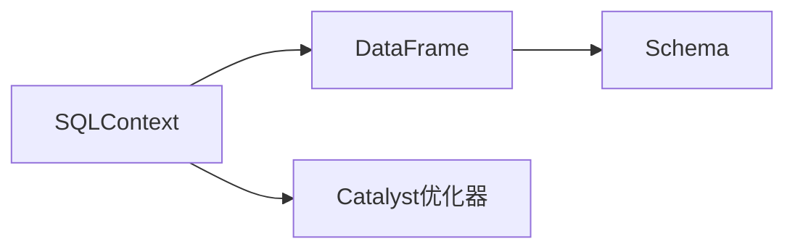

## 1. 背景介绍

### 1.1 大数据时代的挑战

随着互联网、物联网、移动互联网的快速发展，全球数据量呈爆炸式增长，如何高效地存储、处理和分析海量数据成为了各大企业面临的巨大挑战。传统的关系型数据库在面对海量数据时显得力不从心，难以满足高并发、低延迟的处理需求。

### 1.2 Spark SQL的诞生

为了应对大数据时代的挑战，Apache Spark应运而生。Spark是一个基于内存计算的快速、通用、可扩展的集群计算框架，其核心组件之一Spark SQL专门用于处理结构化数据。Spark SQL建立在Spark Core之上，提供了一种简洁、高效的SQL查询语言，可以方便地对海量数据进行查询、分析和处理。

### 1.3 Spark SQL的优势

相比于传统的关系型数据库，Spark SQL具有以下优势：

* **高性能:** 基于内存计算，数据处理速度快，可以处理TB级别的数据。
* **可扩展性:** 支持分布式计算，可以轻松扩展到数百甚至数千个节点。
* **易用性:** 提供了类似SQL的查询语言，易于学习和使用。
* **丰富的功能:** 支持多种数据源，包括Hive、JSON、Parquet等。

## 2. 核心概念与联系

### 2.1 DataFrame

DataFrame是Spark SQL的核心数据结构，它是一个分布式数据集，以表格的形式组织数据。DataFrame类似于关系型数据库中的表，由列和行组成，每列都有一个名称和数据类型。

### 2.2 Schema

Schema定义了DataFrame中每列的名称和数据类型。Schema可以显式指定，也可以从数据源推断出来。

### 2.3 SQLContext

SQLContext是Spark SQL的入口点，它提供了用于创建DataFrame、执行SQL查询和管理表等功能。

### 2.4 Catalyst优化器

Catalyst优化器是Spark SQL的核心组件之一，它负责将SQL查询转换为高效的执行计划。Catalyst优化器采用了一种基于规则的优化策略，可以根据数据特征和查询条件自动选择最佳的执行计划。

### 2.5 关系图



## 3. 核心算法原理具体操作步骤

### 3.1 创建DataFrame

可以使用以下方法创建DataFrame：

* 从已有RDD创建DataFrame
* 从外部数据源读取数据创建DataFrame

### 3.2 执行SQL查询

可以使用SQLContext的sql()方法执行SQL查询，例如：

```python
# 创建SQLContext
sqlContext = SQLContext(sc)

# 执行SQL查询
df = sqlContext.sql("SELECT * FROM table_name")
```

### 3.3 数据操作

DataFrame提供了丰富的API用于数据操作，例如：

* `select()`: 选择指定的列
* `filter()`: 过滤数据
* `groupBy()`: 分组数据
* `agg()`: 聚合数据

### 3.4 数据输出

可以使用以下方法输出DataFrame：

* `show()`: 显示DataFrame的内容
* `write.format().save()`: 将DataFrame保存到外部数据源

## 4. 数学模型和公式详细讲解举例说明

### 4.1 关系代数

Spark SQL的查询操作基于关系代数，关系代数是一种用于操作关系的数学理论。

### 4.2 谓词逻辑

Spark SQL的查询条件使用谓词逻辑表示，谓词逻辑是一种用于描述事物属性的逻辑语言。

### 4.3 举例说明

假设有一个名为"employees"的DataFrame，包含以下数据：

| id | name | age | salary |
|---|---|---|---|
| 1 | John | 30 | 5000 |
| 2 | Jane | 25 | 4000 |
| 3 | Peter | 40 | 6000 |

**查询年龄大于30岁的员工:**

```sql
SELECT * FROM employees WHERE age > 30
```

**查询薪资最高的员工:**

```sql
SELECT * FROM employees ORDER BY salary DESC LIMIT 1
```

## 5. 项目实践：代码实例和详细解释说明

### 5.1 数据准备

```python
# 创建SparkSession
spark = SparkSession.builder.appName("Spark SQL Example").getOrCreate()

# 创建示例数据
data = [
    (1, "John", 30, 5000),
    (2, "Jane", 25, 4000),
    (3, "Peter", 40, 6000)
]

# 创建DataFrame
df = spark.createDataFrame(data, ["id", "name", "age", "salary"])
```

### 5.2 数据分析

```python
# 查询年龄大于30岁的员工
df.filter(df.age > 30).show()

# 查询薪资最高的员工
df.orderBy(df.salary.desc()).limit(1).show()

# 计算平均薪资
df.agg({"salary": "avg"}).show()
```

### 5.3 数据可视化

```python
# 将DataFrame转换为Pandas DataFrame
pandas_df = df.toPandas()

# 使用matplotlib绘制柱状图
pandas_df.plot.bar(x="name", y="salary")
```

## 6. 实际应用场景

### 6.1 数据仓库

Spark SQL可以用于构建数据仓库，用于存储和分析海量数据。

### 6.2 商业智能

Spark SQL可以用于商业智能，例如客户关系管理、市场分析等。

### 6.3 机器学习

Spark SQL可以用于准备机器学习的数据，例如特征提取、数据清洗等。

## 7. 工具和资源推荐

### 7.1 Apache Spark官网

[https://spark.apache.org/](https://spark.apache.org/)

### 7.2 Spark SQL文档

[https://spark.apache.org/docs/latest/sql-programming-guide.html](https://spark.apache.org/docs/latest/sql-programming-guide.html)

### 7.3 Databricks社区版

[https://databricks.com/try-databricks](https://databricks.com/try-databricks)

## 8. 总结：未来发展趋势与挑战

### 8.1 未来发展趋势

* **更快的查询速度:** 随着硬件和软件技术的不断发展，Spark SQL的查询速度将会越来越快。
* **更丰富的功能:** Spark SQL将会支持更多的功能，例如流式数据处理、机器学习等。
* **更易用性:** Spark SQL将会更加易于使用，例如提供更直观的API、更强大的工具等。

### 8.2 面临的挑战

* **数据安全:** 随着数据量的不断增加，数据安全问题变得越来越重要。
* **数据治理:** 如何有效地管理和治理海量数据是一个挑战。
* **人才缺口:** Spark SQL专业人才仍然比较缺乏。

## 9. 附录：常见问题与解答

### 9.1 如何优化Spark SQL查询性能？

* 使用缓存
* 调整数据分区
* 使用广播变量
* 使用代码生成

### 9.2 如何处理Spark SQL中的数据倾斜问题？

* 使用随机前缀
* 使用广播连接
* 使用MapReduce

### 9.3 如何将Spark SQL与其他工具集成？

* 使用JDBC/ODBC连接器
* 使用Spark Streaming
* 使用Spark MLlib
