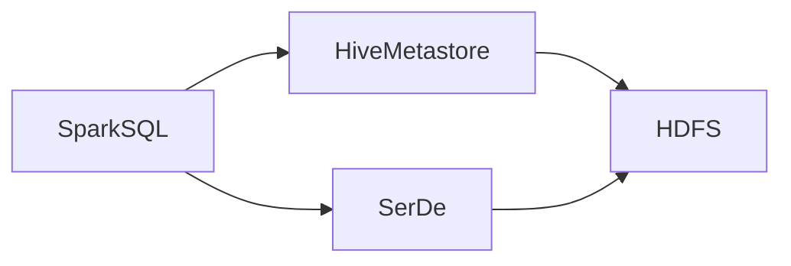

## 1. 背景介绍

### 1.1 大数据时代的数据处理挑战
随着互联网、物联网等技术的飞速发展，全球数据量呈现爆炸式增长，传统的数据处理方式已经无法满足日益增长的数据处理需求。为了应对海量数据的存储、处理和分析等挑战，大数据技术应运而生。

### 1.2 Hadoop生态系统与数据仓库
Hadoop是一个开源的分布式计算框架，它为大规模数据集的分布式存储和处理提供了可靠、高效的解决方案。Hadoop生态系统包含了一系列组件，例如分布式文件系统HDFS、分布式计算框架MapReduce、资源管理框架YARN等，为大数据处理提供了完整的解决方案。

数据仓库是一种用于存储和分析来自多个数据源的数据的系统。它通常用于商业智能、数据分析和决策支持。Hive是Hadoop生态系统中一个基于Hadoop的数据仓库工具，它提供了一种类似于SQL的查询语言，方便用户对存储在Hadoop集群中的数据进行查询和分析。

### 1.3 Spark的兴起与优势
Spark是一个快速、通用的集群计算系统，它在Hadoop MapReduce的基础上进行了改进，提供了更灵活的编程模型和更高的执行效率。Spark支持多种编程语言，例如Scala、Java、Python和R，方便用户进行数据处理和分析。

Spark相比于Hadoop MapReduce具有以下优势：

* **更快的执行速度：** Spark将中间数据存储在内存中，避免了频繁的磁盘IO操作，从而提高了执行效率。
* **更灵活的编程模型：** Spark提供了丰富的API和操作，支持多种数据结构和算法，方便用户进行复杂的数据处理和分析。
* **更高的容错性：** Spark采用了基于RDD（弹性分布式数据集）的数据模型，能够有效地处理节点故障和数据丢失等问题。

### 1.4 Spark-Hive整合的意义
Spark和Hive都是Hadoop生态系统中重要的组件，将Spark和Hive整合在一起可以充分发挥两者的优势，为用户提供更加高效、灵活的数据处理和分析解决方案。

## 2. 核心概念与联系

### 2.1 Spark SQL
Spark SQL是Spark用于结构化数据处理的模块，它提供了一种类似于SQL的查询语言，方便用户对存储在各种数据源中的结构化数据进行查询和分析。Spark SQL支持多种数据源，例如Hive、Parquet、JSON和CSV等。

### 2.2 Hive Metastore
Hive Metastore是Hive用于存储元数据的服务，它包含了Hive表的定义、列信息、数据存储位置等信息。Spark SQL可以通过访问Hive Metastore获取Hive表的元数据，从而实现对Hive数据的访问和操作。

### 2.3 SerDe
SerDe (Serializer/Deserializer) 是Hive用于序列化和反序列化数据的组件，它定义了如何将数据转换为Hive表中的行和列，以及如何将Hive表中的行和列转换为数据。Spark SQL可以通过使用Hive SerDe来读取和写入Hive表中的数据。

### 2.4 Spark-Hive整合架构
下图展示了Spark-Hive整合的架构：



Spark SQL通过访问Hive Metastore获取Hive表的元数据，然后使用Hive SerDe读取和写入Hive表中的数据。数据最终存储在HDFS中。

## 3. 核心算法原理具体操作步骤

### 3.1 Spark SQL读取Hive数据
Spark SQL可以通过以下步骤读取Hive数据：

1. **创建HiveContext:** HiveContext是Spark SQL访问Hive Metastore的入口，可以通过以下代码创建HiveContext：

```scala
val hiveContext = new HiveContext(sc)
```

2. **指定Hive表名:** 使用HiveContext的table方法指定要读取的Hive表名：

```scala
val hiveTable = hiveContext.table("hive_table_name")
```

3. **执行SQL查询:** 使用HiveContext的sql方法执行SQL查询：

```scala
val results = hiveContext.sql("SELECT * FROM hive_table_name")
```

4. **处理查询结果:** 查询结果是一个DataFrame，可以使用Spark SQL的API对DataFrame进行操作和分析。

### 3.2 Spark SQL写入Hive数据
Spark SQL可以通过以下步骤写入Hive数据：

1. **创建DataFrame:** 可以通过读取其他数据源或者使用Spark SQL的API创建DataFrame。

2. **指定Hive表名:** 使用DataFrame的write方法指定要写入的Hive表名：

```scala
dataFrame.write.saveAsTable("hive_table_name")
```

3. **设置写入模式:** 可以设置写入模式为`overwrite`、`append`或`errorIfExists`。

## 4. 数学模型和公式详细讲解举例说明
由于Spark-Hive整合主要涉及数据处理和查询，不涉及复杂的数学模型和公式，因此本节略过。

## 5. 项目实践：代码实例和详细解释说明

### 5.1 Spark SQL读取Hive数据示例
以下代码演示了如何使用Spark SQL读取Hive数据：

```scala
import org.apache.spark.sql.hive.HiveContext

object SparkHiveExample {
  def main(args: Array[String]): Unit = {
    // 创建 SparkConf 对象
    val conf = new SparkConf().setAppName("SparkHiveExample")

    // 创建 SparkContext 对象
    val sc = new SparkContext(conf)

    // 创建 HiveContext 对象
    val hiveContext = new HiveContext(sc)

    // 指定 Hive 表名
    val hiveTable = hiveContext.table("employee")

    // 执行 SQL 查询
    val results = hiveContext.sql("SELECT * FROM employee")

    // 打印查询结果
    results.show()

    // 关闭 SparkContext 对象
    sc.stop()
  }
}
```

### 5.2 Spark SQL写入Hive数据示例
以下代码演示了如何使用Spark SQL写入Hive数据：

```scala
import org.apache.spark.sql.hive.HiveContext

object SparkHiveExample {
  def main(args: Array[String]): Unit = {
    // 创建 SparkConf 对象
    val conf = new SparkConf().setAppName("SparkHiveExample")

    // 创建 SparkContext 对象
    val sc = new SparkContext(conf)

    // 创建 HiveContext 对象
    val hiveContext = new HiveContext(sc)

    // 创建 DataFrame
    val dataFrame = hiveContext.sparkContext.parallelize(Seq(
      ("John", 30),
      ("Jane", 25),
      ("Mike", 40)
    )).toDF("name", "age")

    // 指定 Hive 表名
    dataFrame.write.mode("overwrite").saveAsTable("employee")

    // 关闭 SparkContext 对象
    sc.stop()
  }
}
```

## 6. 实际应用场景

### 6.1 数据仓库与数据分析
Spark-Hive整合可以用于构建数据仓库，将来自多个数据源的数据整合到Hive表中，然后使用Spark SQL进行数据分析和挖掘。

### 6.2 ETL流程优化
Spark-Hive整合可以用于优化ETL (Extract, Transform, Load) 流程，使用Spark SQL进行数据清洗、转换和加载，将数据写入Hive表中。

### 6.3 机器学习与深度学习
Spark-Hive整合可以用于机器学习和深度学习，使用Spark SQL读取Hive表中的数据，然后使用Spark MLlib或其他机器学习库进行模型训练和预测。

## 7. 总结：未来发展趋势与挑战

### 7.1 未来发展趋势
* **更紧密的整合:** Spark和Hive的整合将会更加紧密，例如Spark SQL将支持更多的Hive特性，Hive也将支持Spark的计算引擎。
* **云原生支持:** Spark和Hive将提供更好的云原生支持，方便用户在云环境中部署和使用。
* **性能优化:** Spark和Hive将持续进行性能优化，以应对不断增长的数据量和复杂的数据处理需求。

### 7.2 面临的挑战
* **数据安全:** 大数据平台的数据安全问题日益突出，需要采取有效的措施来保护数据的安全。
* **数据治理:** 如何有效地管理和治理大数据平台中的数据，是一个重要的挑战。
* **人才需求:** 大数据领域的人才需求旺盛，需要培养更多的大数据人才。

## 8. 附录：常见问题与解答

### 8.1 Spark SQL如何访问Hive Metastore?
Spark SQL通过HiveContext访问Hive Metastore。

### 8.2 Spark SQL如何读取和写入Hive表中的数据?
Spark SQL使用Hive SerDe读取和写入Hive表中的数据。

### 8.3 Spark-Hive整合有哪些优势?
Spark-Hive整合可以充分发挥Spark和Hive的优势，为用户提供更加高效、灵活的数据处理和分析解决方案。