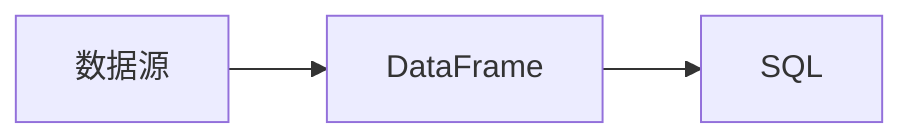

## 1. 背景介绍

### 1.1 大数据时代的数据处理挑战

随着互联网、物联网、移动互联网的飞速发展，全球数据量呈现爆炸式增长趋势。海量数据蕴藏着巨大的价值，但也给数据的存储、处理和分析带来了前所未有的挑战。传统的关系型数据库在面对大规模数据集时显得力不从心，无法满足高并发、低延迟、高吞吐量的需求。

### 1.2 SparkSQL 应运而生

为了应对大数据时代的挑战，Apache Spark 应运而生。Spark 是一个快速、通用、可扩展的集群计算系统，它提供了丰富的 API，支持批处理、流处理、机器学习和图计算等多种应用场景。 SparkSQL 是 Spark 生态系统中的一个重要组件，它提供了一种结构化的数据处理方式，允许用户使用 SQL 语句来查询和分析数据。

### 1.3 数据模型设计的重要性

数据模型是数据组织和存储的逻辑结构，它决定了数据的访问效率、查询性能和数据一致性。在 SparkSQL 中，数据模型设计尤为重要，它直接影响到数据处理的效率和结果的准确性。

## 2. 核心概念与联系

### 2.1 数据源

SparkSQL 支持多种数据源，包括：

* 文件格式：如 CSV、JSON、Parquet、ORC 等
* 数据库：如 MySQL、PostgreSQL、Hive 等
* NoSQL 数据库：如 Cassandra、MongoDB、HBase 等
* RDD：Spark 的核心数据结构，弹性分布式数据集

### 2.2 DataFrame

DataFrame 是 SparkSQL 的核心数据结构，它是一个分布式数据集，以表格的形式组织数据。DataFrame 提供了丰富的 API，支持结构化数据处理，如选择、过滤、聚合、排序等操作。

### 2.3 SQL

SparkSQL 支持标准 SQL 语法，用户可以使用 SQL 语句来查询和分析 DataFrame 中的数据。

### 2.4 关系图



## 3. 核心算法原理具体操作步骤

### 3.1 数据加载

首先，需要将数据加载到 SparkSQL 中，可以使用 `spark.read` 方法读取不同类型的数据源。

```python
# 读取 CSV 文件
df = spark.read.csv("data.csv", header=True, inferSchema=True)

# 读取 JSON 文件
df = spark.read.json("data.json")

# 读取 Parquet 文件
df = spark.read.parquet("data.parquet")

# 读取 MySQL 数据库
df = spark.read.format("jdbc") \
    .option("url", "jdbc:mysql://localhost:3306/mydb") \
    .option("dbtable", "mytable") \
    .option("user", "myuser") \
    .option("password", "mypassword") \
    .load()
```

### 3.2 数据清洗

数据清洗是指对数据进行预处理，例如去除重复数据、填充缺失值、转换数据类型等。SparkSQL 提供了丰富的 API 来进行数据清洗。

```python
# 去除重复数据
df = df.dropDuplicates()

# 填充缺失值
df = df.fillna(0)

# 转换数据类型
df = df.withColumn("age", df["age"].cast("int"))
```

### 3.3 数据转换

数据转换是指对数据进行结构化处理，例如选择、过滤、聚合、排序等操作。SparkSQL 提供了丰富的 API 来进行数据转换。

```python
# 选择列
df = df.select("name", "age")

# 过滤数据
df = df.filter(df["age"] > 18)

# 聚合数据
df = df.groupBy("name").agg(F.sum("age").alias("total_age"))

# 排序数据
df = df.sort(F.desc("total_age"))
```

### 3.4 数据存储

最后，可以将处理后的数据存储到不同的数据源中，例如文件、数据库、NoSQL 数据库等。

```python
# 保存为 CSV 文件
df.write.csv("output.csv", header=True)

# 保存为 JSON 文件
df.write.json("output.json")

# 保存为 Parquet 文件
df.write.parquet("output.parquet")

# 保存到 MySQL 数据库
df.write.format("jdbc") \
    .option("url", "jdbc:mysql://localhost:3306/mydb") \
    .option("dbtable", "mytable") \
    .option("user", "myuser") \
    .option("password", "mypassword") \
    .mode("overwrite") \
    .save()
```

## 4. 数学模型和公式详细讲解举例说明

### 4.1 聚合函数

SparkSQL 提供了丰富的聚合函数，例如 `sum`、`avg`、`max`、`min`、`count` 等。

```python
# 计算年龄总和
df.agg(F.sum("age"))

# 计算平均年龄
df.agg(F.avg("age"))

# 计算最大年龄
df.agg(F.max("age"))

# 计算最小年龄
df.agg(F.min("age"))

# 计算人数
df.agg(F.count("name"))
```

### 4.2 窗口函数

窗口函数可以对 DataFrame 中的每一行数据进行计算，并将结果添加到该行数据中。

```python
# 计算每个学生的排名
window = Window.partitionBy("class").orderBy(F.desc("score"))
df = df.withColumn("rank", F.rank().over(window))

# 计算每个学生的移动平均分
window = Window.partitionBy("class").orderBy("date").rowsBetween(-2, 2)
df = df.withColumn("moving_average", F.avg("score").over(window))
```

## 5. 项目实践：代码实例和详细解释说明

### 5.1 电商网站用户行为分析

**需求：** 分析电商网站的用户行为数据，例如用户访问量、购买量、平均订单金额等。

**数据源：**

* 用户访问日志：记录用户访问网站的日期、时间、IP 地址、访问页面等信息。
* 订单数据：记录用户的订单信息，例如订单编号、商品名称、价格、数量、下单时间等信息。

**数据模型：**

```
用户访问日志
| 日期 | 时间 | IP 地址 | 访问页面 |
|---|---|---|---|
| 2023-05-19 | 10:00:00 | 192.168.1.1 | 首页 |
| 2023-05-19 | 10:05:00 | 192.168.1.1 | 商品详情页 |
| 2023-05-19 | 10:10:00 | 192.168.1.2 | 首页 |

订单数据
| 订单编号 | 商品名称 | 价格 | 数量 | 下单时间 |
|---|---|---|---|---|
| 1001 | 手机 | 5000 | 1 | 2023-05-19 10:05:00 |
| 1002 | 电脑 | 10000 | 1 | 2023-05-19 10:10:00 |
```

**代码实现：**

```python
from pyspark.sql import SparkSession
from pyspark.sql.functions import *

# 创建 SparkSession
spark = SparkSession.builder.appName("UserBehaviorAnalysis").getOrCreate()

# 读取用户访问日志
user_log = spark.read.csv("user_log.csv", header=True, inferSchema=True)

# 读取订单数据
order_data = spark.read.csv("order_data.csv", header=True, inferSchema=True)

# 统计用户访问量
user_count = user_log.groupBy("IP 地址").count()

# 统计购买量
order_count = order_data.groupBy("订单编号").count()

# 计算平均订单金额
average_order_amount = order_data.agg(F.avg("价格"))

# 打印结果
print("用户访问量：", user_count.show())
print("购买量：", order_count.show())
print("平均订单金额：", average_order_amount.show())

# 停止 SparkSession
spark.stop()
```

## 6. 实际应用场景

### 6.1 数据仓库

SparkSQL 可以用于构建数据仓库，将来自不同数据源的数据整合到一起，并提供统一的数据访问接口。

### 6.2 商业智能

SparkSQL 可以用于商业智能分析，例如用户行为分析、销售预测、风险控制等。

### 6.3 机器学习

SparkSQL 可以用于机器学习数据预处理，例如数据清洗、特征提取、数据转换等。

## 7. 工具和资源推荐

### 7.1 Apache Spark 官方文档

[https://spark.apache.org/docs/latest/](https://spark.apache.org/docs/latest/)

### 7.2 Spark SQL Programming Guide

[https://spark.apache.org/docs/latest/sql-programming-guide.html](https://spark.apache.org/docs/latest/sql-programming-guide.html)

### 7.3 Databricks

[https://databricks.com/](https://databricks.com/)

## 8. 总结：未来发展趋势与挑战

### 8.1 未来发展趋势

* 更高效的数据处理引擎
* 更丰富的 API 和功能
* 更智能化的数据分析工具

### 8.2 挑战

* 数据安全和隐私保护
* 数据治理和合规性
* 数据人才的培养

## 9. 附录：常见问题与解答

### 9.1 如何选择合适的数据模型？

选择合适的数据模型需要考虑以下因素：

* 数据量和数据类型
* 查询需求
* 数据一致性和完整性
* 性能要求

### 9.2 SparkSQL 与 Hive 的区别？

SparkSQL 和 Hive 都是基于 Hadoop 的数据仓库解决方案，但它们有一些区别：

* SparkSQL 是 Spark 生态系统的一部分，而 Hive 是 Hadoop 生态系统的一部分。
* SparkSQL 使用内存计算，而 Hive 使用磁盘计算。
* SparkSQL 支持更丰富的 API 和功能。

### 9.3 如何优化 SparkSQL 查询性能？

优化 SparkSQL 查询性能可以采取以下措施：

* 使用 Parquet 或 ORC 等列式存储格式
* 使用缓存
* 调整数据分区
* 优化 SQL 语句
