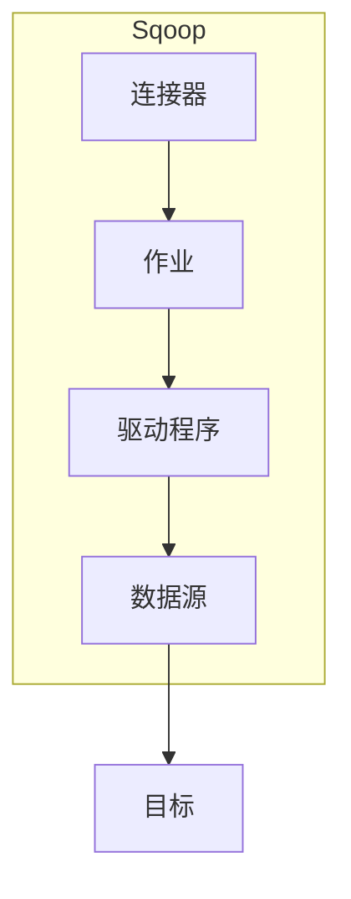

## 1. 背景介绍

### 1.1 大数据时代的数据迁移挑战

随着互联网和物联网技术的飞速发展，数据规模呈指数级增长，传统的数据库系统难以满足海量数据的存储和分析需求。大数据技术应运而生，Hadoop作为其核心框架之一，提供了强大的分布式存储和计算能力。然而，如何将数据从传统的关系型数据库（RDBMS）高效地迁移到Hadoop平台成为了一个巨大的挑战。

### 1.2 Sqoop的诞生与发展

为了解决这一问题，Apache Sqoop应运而生。Sqoop是一个专门用于在Hadoop与结构化数据存储（如关系型数据库）之间进行数据传输的工具。它能够高效地将数据从RDBMS导入到Hadoop的HDFS、Hive、HBase等组件中，也可以将Hadoop的数据导出到RDBMS。

### 1.3 Sqoop的优势与特点

Sqoop具有以下优势和特点：

- **高效性:** Sqoop利用MapReduce的并行处理能力，能够快速地进行数据迁移。
- **可靠性:** Sqoop提供了容错机制，保证数据传输的可靠性。
- **易用性:** Sqoop提供了简洁易用的命令行接口和API，方便用户进行操作。
- **可扩展性:** Sqoop支持多种数据格式和数据库类型，具有良好的可扩展性。

## 2. 核心概念与联系

### 2.1 Sqoop工作原理

Sqoop通过JDBC连接到RDBMS，将数据读取到Hadoop集群中。其工作原理可以概括为以下几个步骤:

1. **连接RDBMS:** Sqoop使用JDBC驱动程序连接到源数据库。
2. **数据抽取:** Sqoop根据用户指定的查询条件，从源数据库中抽取数据。
3. **数据转换:** Sqoop将抽取的数据转换为Hadoop支持的格式，例如文本文件、Avro文件等。
4. **数据加载:** Sqoop将转换后的数据加载到目标Hadoop组件中。

### 2.2 核心概念

- **连接器(Connector):** Sqoop使用连接器与不同的数据源进行交互，例如MySQL连接器、Oracle连接器等。
- **作业(Job):** Sqoop作业定义了数据迁移的任务，包括数据源、目标、数据格式等信息。
- **驱动程序(Driver):** Sqoop使用驱动程序与不同的数据库进行交互，例如MySQL JDBC驱动程序、Oracle JDBC驱动程序等。

### 2.3 核心概念联系图



## 3. 核心算法原理具体操作步骤

### 3.1 导入数据

Sqoop导入数据到Hadoop的步骤如下:

1. **创建Sqoop作业:** 使用`sqoop import`命令创建Sqoop作业，并指定数据源、目标、数据格式等参数。
2. **运行Sqoop作业:** 运行Sqoop作业，Sqoop将连接到数据源，抽取数据并将其加载到目标Hadoop组件中。

### 3.2 导出数据

Sqoop导出数据到RDBMS的步骤如下:

1. **创建Sqoop作业:** 使用`sqoop export`命令创建Sqoop作业，并指定数据源、目标、数据格式等参数。
2. **运行Sqoop作业:** 运行Sqoop作业，Sqoop将从Hadoop组件中读取数据，并将其导出到目标RDBMS中。

## 4. 数学模型和公式详细讲解举例说明

### 4.1 数据分片

Sqoop使用数据分片技术来提高数据迁移的效率。数据分片是指将数据划分为多个子集，并行处理每个子集。Sqoop根据用户指定的参数，例如数据表的列数、数据量等，自动计算最佳的分片数量。

### 4.2 数据压缩

Sqoop支持多种数据压缩格式，例如gzip、bzip2等。数据压缩可以减少数据传输量，提高数据迁移效率。

## 5. 项目实践：代码实例和详细解释说明

### 5.1 导入MySQL数据到Hive

```sql
sqoop import \
  --connect jdbc:mysql://localhost:3306/mydb \
  --username root \
  --password password \
  --table mytable \
  --hive-import \
  --hive-table myhivetable \
  --hive-overwrite
```

**参数说明:**

- `--connect`: 指定MySQL数据库连接URL。
- `--username`: 指定MySQL数据库用户名。
- `--password`: 指定MySQL数据库密码。
- `--table`: 指定要导入的MySQL数据表名。
- `--hive-import`: 指定将数据导入到Hive。
- `--hive-table`: 指定Hive表名。
- `--hive-overwrite`: 如果Hive表已存在，则覆盖它。

### 5.2 导出HDFS数据到MySQL

```sql
sqoop export \
  --connect jdbc:mysql://localhost:3306/mydb \
  --username root \
  --password password \
  --table mytable \
  --export-dir /path/to/hdfs/data
```

**参数说明:**

- `--connect`: 指定MySQL数据库连接URL。
- `--username`: 指定MySQL数据库用户名。
- `--password`: 指定MySQL数据库密码。
- `--table`: 指定要导出的MySQL数据表名。
- `--export-dir`: 指定HDFS数据路径。

## 6. 实际应用场景

### 6.1 数据仓库建设

Sqoop可以将企业内部的各种数据源，例如CRM系统、ERP系统等，导入到数据仓库中，为数据分析和决策提供支持。

### 6.2 数据迁移与备份

Sqoop可以将数据从一个数据库迁移到另一个数据库，或者将数据备份到Hadoop平台，保证数据的安全性和可靠性。

### 6.3 ETL流程

Sqoop可以作为ETL流程的一部分，将数据从源系统抽取、转换并加载到目标系统中。

## 7. 总结：未来发展趋势与挑战

### 7.1 未来发展趋势

- **云原生支持:** Sqoop将更好地支持云原生环境，例如Kubernetes、Docker等。
- **数据湖集成:** Sqoop将与数据湖技术更加紧密地集成，支持从数据湖中导入和导出数据。
- **实时数据迁移:** Sqoop将支持实时数据迁移，满足对数据实时性要求更高的应用场景。

### 7.2 面临的挑战

- **数据安全:** Sqoop需要确保数据在迁移过程中的安全性，防止数据泄露和篡改。
- **性能优化:** Sqoop需要不断优化性能，提高数据迁移效率。
- **兼容性:** Sqoop需要支持更多的数据库类型和数据格式，提高其通用性和适用性。

## 8. 附录：常见问题与解答

### 8.1 如何解决Sqoop导入数据时出现的错误？

- 检查Sqoop作业参数是否正确，例如数据库连接URL、用户名、密码等。
- 检查数据源和目标是否存在，以及权限是否正确。
- 检查数据格式是否兼容。

### 8.2 如何提高Sqoop数据迁移效率？

- 使用数据分片技术。
- 使用数据压缩技术。
- 优化Sqoop作业参数。
