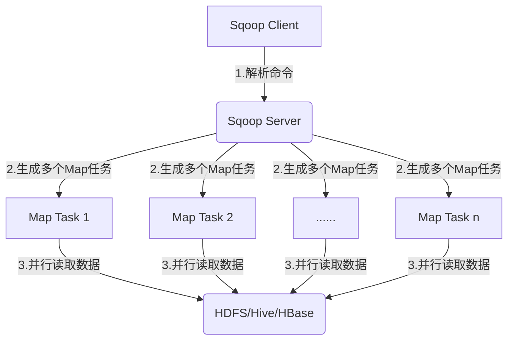

下面是关于《Sqoop导入导出性能调优秘籍》的技术博客正文:

## 1.背景介绍

### 1.1 什么是Sqoop

Apache Sqoop 是一种用于高效传输大数据应用程序与传统数据库之间数据的工具。它使用并行操作将数据从 MySQL、Oracle 等关系数据库导入到 Hadoop 生态系统中(如Hive、HBase、HDFS等)。反之亦然,可以从Hadoop生态系统导出数据到关系型数据库。

### 1.2 为什么需要Sqoop

- 数据集成:将关系型数据库中的数据导入到Hadoop生态系统,方便进行大数据分析。
- 数据传输:在Hadoop和关系型数据库之间高效传输数据。
- 数据导入导出:可导入和导出多种数据格式,如文本文件、Avro、Sequence文件等。

### 1.3 Sqoop的优势

- 简单高效:使用简单的命令行界面,无需编写复杂代码。
- 并行操作:充分利用集群资源,提高导入导出性能。
- 容错机制:支持失败任务重启,保证数据完整性。
- 多连接器:支持多种关系型数据库和大数据平台。

## 2.核心概念与联系

### 2.1 Sqoop导入导出流程

Sqoop导入导出的核心概念如下图所示:


1. Sqoop导入:将关系型数据库中的数据并行导入到Hadoop生态系统(HDFS/Hive/HBase等)
2. Sqoop导出:将Hadoop生态系统中的数据导出到关系型数据库

### 2.2 Sqoop导入导出模式

Sqoop支持多种导入导出模式:

- 全量导入/导出
- 增量导入/导出
- 增量更新导入/导出
- 累加导入/导出

### 2.3 Sqoop内部工作原理

Sqoop内部采用了多进程并行处理的架构,充分利用集群资源:



1. Sqoop Client解析命令并提交给Sqoop Server
2. Sqoop Server生成多个并行Map任务
3. 多个Map Task并行读取数据,传输到目标平台

## 3.核心算法原理具体操作步骤 

### 3.1 Sqoop导入流程

1. 连接关系型数据库,获取表结构信息和数据记录条数
2. 根据记录条数,划分数据块(split),生成对应的Map任务数
3. 多个Map Task并行读取数据块,写入HDFS临时文件
4. 合并临时文件,写入最终目标数据文件

### 3.2 Sqoop导出流程  

1. 连接HDFS/Hive/HBase,获取数据文件信息
2. 根据数据文件大小,划分数据块(split),生成Map任务
3. 多个Map Task并行读取数据块
4. 并行写入关系型数据库目标表

## 4.数学模型和公式详细讲解举例说明

### 4.1 Sqoop并行度计算

Sqoop通过以下公式计算并行度(Map Task数量):

$$
M = \min\left(\frac{S}{s_b}, \; \max\_mapper\_tasks\right)
$$

其中:
- $M$为Map Task数量
- $S$为输入数据集大小(bytes)  
- $s_b$为数据块大小(bytes)
- $\max\_mapper\_tasks$为最大Map Task数,默认为4

例如,导入一个100GB的数据集,Sqoop默认的数据块大小为64MB,则并行度为:

$$
M = \min\left(\frac{100 \times 10^9}{64 \times 10^6}, \; 4\right) = 1536
$$

即最多生成1536个并行Map Task。

### 4.2 Sqoop吞吐量计算

Sqoop的吞吐量可以用以下公式计算:

$$
\text{Throughput} = \frac{S}{T}
$$

其中:
- $S$为输入数据集大小(bytes)
- $T$为导入导出耗时(秒)

例如,导入100GB数据耗时30分钟,则吞吐量为:

$$
\text{Throughput} = \frac{100 \times 10^9}{30 \times 60} \approx 55.6 \text{MB/s}
$$

## 4.项目实践:代码实例和详细解释说明

### 4.1 Sqoop导入示例

导入MySQL的employee表到HDFS:

```bash
sqoop import \
--connect jdbc:mysql://localhost/employees \
--username root \
--table employees \
--m 8
```

- `--connect`指定JDBC连接URL
- `--username`指定数据库用户名 
- `--table`指定要导入的表
- `--m 8`指定使用8个Map Task并行导入

### 4.2 Sqoop导出示例  

将HDFS上的数据文件导出到MySQL:

```bash
sqoop export \
--connect jdbc:mysql://localhost/employees \
--username root \
--table new_employees \
--export-dir /data/employees \
--input-fields-terminated-by ','
```

- `--export-dir`指定HDFS输入数据路径
- `--input-fields-terminated-by`指定数据字段分隔符

## 5.实际应用场景

Sqoop在企业大数据应用中扮演着重要角色:

- 数据迁移:将企业内部的关系型数据库数据迁移到Hadoop平台
- 业务数据采集:定期从业务数据库中抽取最新数据,用于数据分析
- 日志数据分析:收集业务系统日志到Hadoop,用于分析挖掘
- ETL数据处理:作为ETL工具的一部分,完成数据抽取和加载

## 6.工具和资源推荐

- **Sqoop官网**: http://sqoop.apache.org/
- **Sqoop用户指南**: https://sqoop.apache.org/docs/1.4.7/SqoopUserGuide.html
- **Sqoop性能优化指南**: https://blog.cloudera.com/blog/2009/08/improving-sqoop-performance/
- **Sqoop调优示例**: https://www.cloudera.com/documentation/enterprise/5-5-x/topics/cdh_ig_sqoop_tuning.html

## 7.总结:未来发展趋势与挑战

### 7.1 未来发展趋势

- **云集成**:支持直接从云端关系型数据库导入导出数据到云存储
- **流式传输**:支持实时流式从关系型数据库获取数据变更并传输
- **统一连接器**:提供统一的连接器框架,方便扩展支持更多数据源

### 7.2 面临的挑战

- **安全合规**:如何保证敏感数据在传输过程中的安全性
- **元数据管理**:如何高效管理大规模数据集的元数据信息  
- **性能提升**:如何进一步提高Sqoop的导入导出性能和吞吐量

## 8.附录:常见问题与解答

### 8.1 Sqoop导入导出慢的原因?

- 并行度设置不当,Map Task数量过少
- 数据块大小设置过大,单个Map任务处理数据过多
- 网络带宽或磁盘IO瓶颈
- Sqoop版本较旧,缺乏优化

### 8.2 Sqoop与其他数据集成工具区别?

- Sqoop侧重于结构化数据的批量传输
- 相比DataX,Sqoop有更加完备的并行处理机制
- 与Flume、Kafka等流式工具不同,Sqoop专注批量离线传输

### 8.3 如何监控Sqoop作业进度?

可以通过以下几种方式:

- 查看Map Task的运行日志
- 使用Hadoop任务查询工具如JobTracker
- 第三方监控工具如Hadoop监控可视化界面

总之,本文详细介绍了Sqoop的核心概念、原理、实践案例和性能调优技巧,希望对读者们有所裨益。Sqoop作为大数据生态的重要工具,在数据集成领域扮演着重要角色,相信未来会有更加广泛的应用。