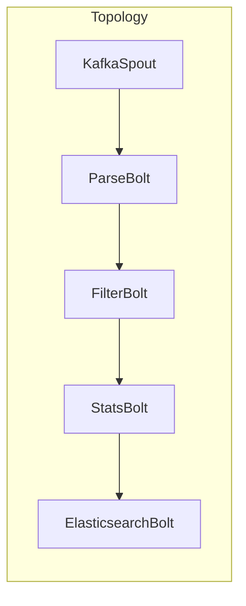

# 《StormBolt与Elasticsearch的集成》

## 1.背景介绍

### 1.1 什么是Storm

Apache Storm是一个免费开源的分布式实时计算系统，用于快速可靠地处理大量的数据流。它是一个大规模、高容错、高可伸缩的分布式计算系统，适用于实时分析、在线机器学习、持续计算、分布式RPC、ETL等领域。

Storm的核心设计理念是将实时计算作为一个流数据的有向无环图(DAG)来处理,这种DAG结构包括Spout(数据源)和Bolt(数据处理组件),它们之间通过grouping方式进行数据分组并行计算。Storm充分利用了Zookeeper的协调能力,提供了完善的容错和部署机制。

### 1.2 什么是Elasticsearch

Elasticsearch是一个分布式、RESTful风格的搜索和数据分析引擎,能够用于全文搜索、结构化搜索、分析以及将这三者混合使用。它是用Java开发的开源项目,基于Apache Lucene库,处理所有类型的数据。

Elasticsearch可以近乎实时的存储、检索数据,并且通过简单的RESTful API与之交互,可以扩展到上百台服务器,处理PB级别的结构化或非结构化数据。

### 1.3 集成的必要性

在大数据实时处理领域,Storm和Elasticsearch是两个优秀的开源项目,各有所长。Storm擅长实时流式计算,而Elasticsearch擅长数据存储和搜索。将两者集成在一起,可以充分发挥各自的优势,实现端到端的实时数据处理和分析。

- Storm负责实时流式计算,对数据进行过滤、转换、聚合等处理
- Elasticsearch负责将计算结果持久化存储,并提供强大的搜索、分析功能

通过集成,我们可以构建出高效、可扩展的实时大数据处理管道。

## 2.核心概念与联系

### 2.1 Storm核心概念

- Topology: 一个完整的数据处理作业,包含Spout、Bolt及其配置
- Spout: 数据源,产生数据流
- Bolt: 数据处理组件,对Spout或其他Bolt输出的数据流进行处理
- Stream: Spout或Bolt输出的数据流
- Task: 逻辑上无状态的数据处理单元
- Worker: 一个执行线程,包含一个或多个Task
- Supervisor: 管理Worker的进程

### 2.2 Elasticsearch核心概念

- Node: 一个运行的Elasticsearch实例
- Cluster: 一组Node组成的集群
- Index: 类似于关系型数据库的"数据库"概念
- Type: Index中的逻辑数据分类,类似"表"
- Document: Elasticsearch存储数据的基本单元,类似关系型数据库的"行"
- Shard: 将一个Index分散存储到不同Node上的数据分片
- Replica: Shard的副本,提高数据冗余和查询吞吐量

### 2.3 集成联系

Storm和Elasticsearch的集成,实质上是将Storm实时计算的输出结果,以Document的形式写入到Elasticsearch的某个Index中。这样就可以利用Elasticsearch强大的搜索、分析能力对计算结果进行下游处理。

Storm提供了一个官方的Bolt实现ElasticsearchBolt,用于将数据写入Elasticsearch集群。我们只需在Topology中使用该Bolt,配置好相关参数即可完成集成。

## 3.核心算法原理具体操作步骤

### 3.1 ElasticsearchBolt工作原理

ElasticsearchBolt的工作原理如下:

1. 将上游Spout或Bolt发送过来的Tuple转换为Elasticsearch中的Document
2. 批量将Document写入内存缓冲区
3. 周期性地将内存缓冲区中的Document批量写入Elasticsearch集群
4. 根据写入结果,确认或重新发送Tuple

其核心算法是一个周期性的批量写入操作,流程如下:

```python
for each batch:
    attempt = 0
    while(attempt < max_attempts):
        try:
            builder = BatchBuilder(config)
            for tuple in batch:
                builder.add(tuple)
            batch_request = builder.build_batch_request()
            batch_response = client.bulk_request(batch_request)
            if batch_response.is_success():
                ack_ids(batch_ids)
                break
            else:
                log_failed_responses(batch_response)
                delay_retry(attempt)
        except Exception:
            delay_retry(attempt)
        attempt += 1
    if attempt == max_attempts:
        fail_batch(batch_ids)
```

### 3.2 主要步骤解析

1. **构建BatchBuilder**

   BatchBuilder用于将Tuple转换为Elasticsearch可识别的Document格式,配置索引名称、文档类型等元数据。

2. **添加Tuple到Batch**

   遍历输入的Tuple列表,调用BatchBuilder的add方法将每个Tuple转换为Document,添加到内存批次中。

3. **构建批量请求**

   调用BatchBuilder的build_batch_request方法,构建一个批量写入请求。

4. **发送批量请求**

   通过Elasticsearch Client发送批量写入请求,获取响应结果。

5. **处理写入结果**

   - 如果写入成功,确认Tuple,退出循环
   - 如果写入失败,根据重试策略进行延迟重试
   - 如果超过最大重试次数,记录失败的Tuple ID

6. **重试策略**

   ElasticsearchBolt采用了指数补偿重试策略,即第一次重试延迟时间很短,后续每次重试时延迟时间逐渐加长。

### 3.3 关键配置参数

- `es.batch.size.entries`: 批量写入时内存缓冲区的Document数量,默认300
- `es.batch.size.bytes`: 批量写入时内存缓冲区的字节数,默认1mb  
- `es.batch.write.retry.count`: 批量写入失败最大重试次数,默认5
- `es.batch.write.retry.delay.ms`: 批量写入失败重试的初始延迟时间,默认2000ms
- `es.index.auto.create`: 是否自动创建索引,默认true
- `es.data.map`: 映射Tuple字段到Elasticsearch Document字段
- `es.cluster.name`: Elasticsearch集群名称
- `es.hosts`: Elasticsearch节点列表

## 4.数学模型和公式详细讲解举例说明

在Storm实时计算场景中,通常需要使用一些数学模型和公式进行数据处理和分析。以下是一些常见的模型和公式:

### 4.1 指数平滑模型

指数平滑模型常用于时间序列数据的平滑和预测,公式如下:

$$
S_t = \alpha Y_t + (1-\alpha)S_{t-1}
$$

其中:
- $S_t$是时间t的平滑值
- $Y_t$是时间t的实际观测值 
- $\alpha$是平滑参数,取值范围0~1,控制新旧数据权重

当$\alpha$较大时,新数据的权重较高;当$\alpha$较小时,旧数据的权重较高。

该模型可应用于流量预测、异常检测等场景。

### 4.2 贝叶斯公式

贝叶斯公式用于计算已知条件下事件发生的条件概率,公式如下:

$$
P(A|B) = \frac{P(B|A)P(A)}{P(B)}
$$

其中:
- $P(A|B)$是已知事件B发生的情况下,事件A发生的概率
- $P(B|A)$是已知事件A发生的情况下,事件B发生的概率
- $P(A)$和$P(B)$分别是事件A和B的先验概率

该公式可应用于垃圾邮件过滤、文本分类等场景中。

### 4.3 欧几里得距离

欧几里得距离是计算两个向量之间距离的常用方法,公式如下:

$$
d(p,q) = \sqrt{\sum_{i=1}^{n}(q_i - p_i)^2}
$$

其中:
- $p$和$q$是n维空间中的两个向量
- $q_i$和$p_i$分别是两个向量在第i个维度上的坐标值

该距离可用于聚类分析、异常检测、推荐系统等场景。

### 4.4 皮尔逊相关系数

皮尔逊相关系数用于衡量两个变量之间的相关程度,公式如下:

$$
r = \frac{\sum_{i=1}^{n}(x_i - \bar{x})(y_i - \bar{y})}{\sqrt{\sum_{i=1}^{n}(x_i - \bar{x})^2\sum_{i=1}^{n}(y_i - \bar{y})^2}}
$$

其中:
- $x_i$和$y_i$分别是两个变量的第i个观测值
- $\bar{x}$和$\bar{y}$分别是两个变量的均值

相关系数的取值范围是-1到1,绝对值越大表示相关性越强。可用于特征选择、关联规则挖掘等场景。

上述公式和模型在Storm实时计算中有广泛的应用,如果结合代码示例会更加直观。

## 4.项目实践:代码实例和详细解释说明

在本节中,我们将通过一个实例项目,演示如何在Storm Topology中集成ElasticsearchBolt,将实时计算结果写入Elasticsearch。

### 4.1 项目概述

我们将构建一个实时日志分析系统,从Kafka消费日志数据,进行解析、过滤、统计等处理,并将结果写入Elasticsearch,以便进行搜索和可视化分析。

整个项目的Topology结构如下:



- KafkaSpout: 从Kafka消费日志数据
- ParseBolt: 解析原始日志数据为结构化格式
- FilterBolt: 过滤无效和低优先级日志
- StatsBolt: 统计不同级别日志的数量
- ElasticsearchBolt: 将统计结果写入Elasticsearch

### 4.2 ElasticsearchBolt配置

首先,我们需要配置ElasticsearchBolt的相关参数:

```java
Map<String, Object> elasticsearchBoltConfig = new HashMap<>();
elasticsearchBoltConfig.put("es.batch.size.entries", 500);
elasticsearchBoltConfig.put("es.batch.size.bytes", 1_000_000);
elasticsearchBoltConfig.put("es.cluster.name", "es-cluster");
elasticsearchBoltConfig.put("es.hosts", Arrays.asList("node1:9200", "node2:9200"));
elasticsearchBoltConfig.put("es.index.auto.create", true);
elasticsearchBoltConfig.put("es.data.map", "logger:logger,level:level,count:count");
```

这里我们配置了:
- 批量写入的Document数量和字节数
- Elasticsearch集群名称和节点列表
- 是否自动创建索引
- Tuple字段到Document字段的映射关系

### 4.3 定义Tuple到Document的映射

我们定义一个Tuple到Document的映射函数,将StatsBolt输出的统计结果Tuple转换为Elasticsearch可识别的Document格式:

```java
public class LogStatsDocumentMapper implements DocumentMapper {
    @Override
    public Document getDocumentId(Tuple tuple) {
        String logger = tuple.getStringByField("logger");
        String level = tuple.getStringByField("level");
        return new Document(logger + "_" + level);
    }

    @Override
    public Base getDocument(Tuple tuple) {
        String logger = tuple.getStringByField("logger");
        String level = tuple.getStringByField("level");
        Long count = tuple.getLongByField("count");

        Base base = new Base();
        base.setSource(new HashMap<>());
        base.getSource().put("logger", logger);
        base.getSource().put("level", level);
        base.getSource().put("count", count);
        return base;
    }
}
```

这里我们定义了:
- `getDocumentId`方法,为每个Document生成一个唯一ID
- `getDocument`方法,将Tuple字段映射到Document的Source字段

### 4.4 启动Topology

最后,在主函数中启动Topology:

```java
TopologyBuilder builder = new TopologyBuilder();

builder.setSpout("kafkaSpout", new KafkaSpout<>());
builder.setBolt("parseBolt", new ParseBolt()).shuffleGrouping("kafkaSpout");
builder.setBolt("filterBolt", new FilterBolt()).shuffleGrouping("parseBolt");
builder.setBolt("statsBolt", new StatsBolt()).fieldsGrouping("filterBolt", new Fields("logger", "level"));
builder.setBolt("elasticsearchBolt", new ElasticsearchBolt(elasticsearchBoltConfig, new LogStatsDocumentMapper()))
        .shuffleGrouping("statsBolt");

Config config = new Config();
config.setNumWorkers(4);

LocalCluster cluster = new LocalCluster();
cluster.submitTopology("log-stats", config, builder.createTopology());
```

这里我们:
- 定义了Topology中的Spout和Bolt组件
- 配置了数据流Group