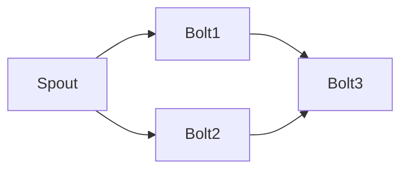

# Storm代码调试：远程调试

作者：禅与计算机程序设计艺术

## 1. 背景介绍
### 1.1 Storm简介
#### 1.1.1 Storm的定义与特点
Storm是一个分布式实时计算系统,用于处理大规模的流式数据。它具有低延迟、高吞吐、可扩展、容错等特点,适用于对时效性要求高的场景,如实时分析、在线机器学习等。
#### 1.1.2 Storm的应用场景
Storm广泛应用于金融、电信、互联网等行业,典型应用包括:
- 实时金融风控与欺诈检测
- 电信基站流量监控
- 互联网广告点击流分析
- 社交网络热点话题发现
- 物联网设备数据实时处理

### 1.2 Storm代码调试的痛点
#### 1.2.1 分布式环境下的调试困难 
Storm作为分布式系统,代码调试面临环境复杂、定位问题难等挑战。开发者难以在本地完全模拟生产环境,导致测试不充分。
#### 1.2.2 实时计算的不确定性
实时计算的数据流是无界的,容易受到网络延迟、数据倾斜等影响,使得调试结果不稳定,问题重现困难。
#### 1.2.3 缺乏有效的调试工具
传统的调试工具和方法无法直接应用于Storm,亟需一种高效的调试手段。

### 1.3 远程调试的优势
#### 1.3.1 本地调试生产环境代码
通过远程调试,可以在本地IDE中连接远程的Storm集群,调试生产环境的真实代码和数据,缩小开发与生产的差异。
#### 1.3.2 提高问题定位效率
远程调试可以在出错的时间点暂停代码执行,检查内存、线程状态等运行时信息,快速定位问题根源。
#### 1.3.3 增强开发体验
远程调试使得开发者能够使用熟悉的IDE调试功能,如断点、单步执行等,提升开发效率和体验。

## 2. 核心概念与联系
### 2.1 Storm核心概念
#### 2.1.1 Topology（拓扑）
Storm的一个实时计算程序,由Spout和Bolt构成的DAG。
#### 2.1.2 Spout
Topology的数据源,负责从外部数据源读取数据并发送到Bolt。
#### 2.1.3 Bolt
Topology的处理单元,接收Tuple并进行处理,可以执行过滤、转换、聚合、存储等操作。
#### 2.1.4 Tuple
Spout和Bolt之间传递的数据单元,以key-value形式存在。
#### 2.1.5 Stream
Tuple的集合,同一个Stream的Tuple具有相同的字段。

### 2.2 远程调试相关概念
#### 2.2.1 JPDA
Java Platform Debugger Architecture的缩写,定义了Java调试器和被调试程序之间的通信协议。
#### 2.2.2 JVM TI
JVM Tool Interface,提供了一套本地接口,允许工具和应用程序检查和控制JVM的状态。
#### 2.2.3 JDWP
Java Debug Wire Protocol,基于JPDA的一种标准协议,定义了调试器前端和被调试JVM之间的通信格式。
#### 2.2.4 JDI
Java Debug Interface,是JPDA的一部分,提供了一套高层Java API,供调试器前端使用。

### 2.3 Storm远程调试原理
Storm的Worker进程通过JVM的调试参数启动,监听调试端口。本地IDE作为调试客户端,通过JDWP协议连接到Worker的调试端口,建立调试会话。之后,本地IDE可以向远程JVM发送调试命令,如设置断点、单步执行等,远程JVM将执行结果返回给本地IDE,从而实现远程调试。

## 3. 核心算法原理具体操作步骤
### 3.1 环境准备
#### 3.1.1 本地环境
- JDK 1.8+
- Maven 3.x
- IntelliJ IDEA等支持远程调试的IDE

#### 3.1.2 服务器环境
- Storm 1.2.3+
- 配置Storm的worker.childopts,添加JVM调试参数,如:
  ```
  worker.childopts: "-agentlib:jdwp=transport=dt_socket,server=y,suspend=n,address=5005"
  ```

### 3.2 本地代码准备
#### 3.2.1 创建Maven项目
使用IDE或Maven命令行创建一个Maven项目,添加Storm依赖:
```xml
<dependency>
  <groupId>org.apache.storm</groupId>
  <artifactId>storm-core</artifactId>
  <version>1.2.3</version>
  <scope>provided</scope>
</dependency>
```

#### 3.2.2 编写Topology代码
编写Spout和Bolt代码,组装成Topology,如:
```java
TopologyBuilder builder = new TopologyBuilder();
builder.setSpout("spout", new RandomSentenceSpout(), 1);
builder.setBolt("split", new SplitSentence(), 1).shuffleGrouping("spout");
builder.setBolt("count", new WordCount(), 1).fieldsGrouping("split", new Fields("word"));
```

#### 3.2.3 本地运行Topology
在本地IDE中运行Topology,确保代码无误:
```java
LocalCluster cluster = new LocalCluster();
cluster.submitTopology("word-count", conf, builder.createTopology());
Thread.sleep(10000);
cluster.shutdown();
```

### 3.3 提交Topology到远程集群
#### 3.3.1 打包Topology
使用Maven的package命令打包Topology为jar文件:
```bash
mvn clean package
```

#### 3.3.2 提交Topology
使用Storm CLI提交Topology到远程集群:
```bash
storm jar target/word-count-1.0-SNAPSHOT.jar com.example.WordCountTopology remote
```

### 3.4 远程调试
#### 3.4.1 设置远程调试配置
在IDE中创建一个Remote Debug配置,设置调试端口为5005。

#### 3.4.2 启动调试会话
在Topology代码中设置断点,启动调试会话,IDE将连接到远程Worker进程。

#### 3.4.3 调试Topology
使用IDE的调试功能,如单步执行、查看变量值等,调试Topology代码。

## 4. 数学模型和公式详细讲解举例说明
Storm的数学模型可以用DAG（有向无环图）来表示,Topology中的Spout和Bolt是DAG的节点,Stream是DAG的边。

设Topology的DAG为$G=(V,E)$,其中:
- $V$表示节点集合,即Spout和Bolt的集合。
- $E$表示有向边集合,即Stream的集合。

对于$e=(u,v) \in E$,表示存在一条从节点$u$到节点$v$的Stream。

例如,一个简单的Topology DAG如下:



其中,Spout和Bolt1、Bolt2之间存在Shuffle Grouping,Bolt1、Bolt2和Bolt3之间存在Fields Grouping。

设Spout发送的Tuple为$(k,v)$,其中$k$为字段名,$v$为字段值。Bolt接收到Tuple后,执行计算函数$f$,得到新的Tuple $(k',v')$:

$$(k',v') = f(k,v)$$

例如,在单词计数Topology中,Spout发送的Tuple为$(sentence, "Hello World")$,经过SplitSentence Bolt处理后,得到两个新的Tuple:
$$(word, "Hello"), (word, "World")$$

再经过WordCount Bolt处理,得到单词计数结果:
$$(Hello, 1), (World, 1)$$

## 5. 项目实践：代码实例和详细解释说明
下面以一个简单的单词计数Topology为例,演示如何进行远程调试。

### 5.1 Topology代码
#### 5.1.1 RandomSentenceSpout
```java
public class RandomSentenceSpout extends BaseRichSpout {
    private SpoutOutputCollector collector;
    private String[] sentences = {
        "the cow jumped over the moon",
        "an apple a day keeps the doctor away",
        "four score and seven years ago",
        "snow white and the seven dwarfs",
        "i am at two with nature"
    };

    @Override
    public void open(Map conf, TopologyContext context, SpoutOutputCollector collector) {
        this.collector = collector;
    }

    @Override
    public void nextTuple() {
        String sentence = sentences[ThreadLocalRandom.current().nextInt(sentences.length)];
        collector.emit(new Values(sentence));
    }

    @Override
    public void declareOutputFields(OutputFieldsDeclarer declarer) {
        declarer.declare(new Fields("sentence"));
    }
}
```

#### 5.1.2 SplitSentence Bolt
```java
public class SplitSentence extends BaseBasicBolt {
    @Override
    public void execute(Tuple tuple, BasicOutputCollector collector) {
        String sentence = tuple.getStringByField("sentence");
        for (String word : sentence.split("\\s+")) {
            collector.emit(new Values(word));
        }
    }

    @Override
    public void declareOutputFields(OutputFieldsDeclarer declarer) {
        declarer.declare(new Fields("word"));
    }
}
```

#### 5.1.3 WordCount Bolt
```java
public class WordCount extends BaseBasicBolt {
    private Map<String, Integer> counts = new HashMap<>();

    @Override
    public void execute(Tuple tuple, BasicOutputCollector collector) {
        String word = tuple.getStringByField("word");
        Integer count = counts.get(word);
        if (count == null) {
            count = 0;
        }
        count++;
        counts.put(word, count);
        collector.emit(new Values(word, count));
    }

    @Override
    public void declareOutputFields(OutputFieldsDeclarer declarer) {
        declarer.declare(new Fields("word", "count"));
    }
}
```

#### 5.1.4 组装Topology
```java
public class WordCountTopology {
    public static void main(String[] args) throws Exception {
        TopologyBuilder builder = new TopologyBuilder();
        builder.setSpout("spout", new RandomSentenceSpout(), 1);
        builder.setBolt("split", new SplitSentence(), 1).shuffleGrouping("spout");
        builder.setBolt("count", new WordCount(), 1).fieldsGrouping("split", new Fields("word"));

        Config conf = new Config();
        if (args != null && args.length > 0) {
            conf.setNumWorkers(3);
            StormSubmitter.submitTopology(args[0], conf, builder.createTopology());
        } else {
            LocalCluster cluster = new LocalCluster();
            cluster.submitTopology("word-count", conf, builder.createTopology());
            Thread.sleep(10000);
            cluster.shutdown();
        }
    }
}
```

### 5.2 本地运行与调试
在IDE中直接运行WordCountTopology的main方法,可以在本地模式下运行Topology。

设置断点,如在SplitSentence的execute方法处:

```java
@Override
public void execute(Tuple tuple, BasicOutputCollector collector) {
    String sentence = tuple.getStringByField("sentence");
    for (String word : sentence.split("\\s+")) {
        collector.emit(new Values(word)); // 设置断点
    }
}
```

启动调试,可以看到程序在断点处暂停,可以查看tuple的内容、collector的状态等。单步执行,可以跟踪Tuple的处理流程。

### 5.3 提交Topology到远程集群
使用Maven打包Topology:
```bash
mvn clean package
```

使用Storm CLI提交Topology:
```bash
storm jar target/word-count-1.0-SNAPSHOT.jar com.example.WordCountTopology remote
```

### 5.4 远程调试
在IDE中创建Remote Debug配置,设置远程主机IP和调试端口号。

在Topology代码中设置断点,如在WordCount的execute方法处:

```java
@Override
public void execute(Tuple tuple, BasicOutputCollector collector) {
    String word = tuple.getStringByField("word");
    Integer count = counts.get(word);
    if (count == null) {
        count = 0;
    }
    count++; // 设置断点
    counts.put(word, count);
    collector.emit(new Values(word, count));
}
```

启动调试会话,IDE连接到远程Worker进程,程序在断点处暂停。此时,可以查看tuple的内容、counts的状态等。单步执行,可以跟踪Tuple的处理流程。

## 6. 实际应用场景
Storm适用于多种实时流处理场景,远程调试可以帮助开发者快速定位问题,提高开发效率。下面列举几个实际应用案例。

### 6.1 实时日志分析
需求:实时分析应用程序日志,统计各类错误日志的数量,发现异常请求。

实现:使用Kafka作为数据源,将日志数据发送到Kafka。Storm从Kafka读取数据,使用正则表达式解析日志,提取错误类型和请求参数,统计错误数量,将结果存储到HBase。

远程调试:在解析日志的Bolt设置断点,查看不同类型日志的解析结果,验证正则表达式的正确性。在统计Bolt设置断点,查看错误计数是否正确。

### 6.2 实时推荐系统
需求: